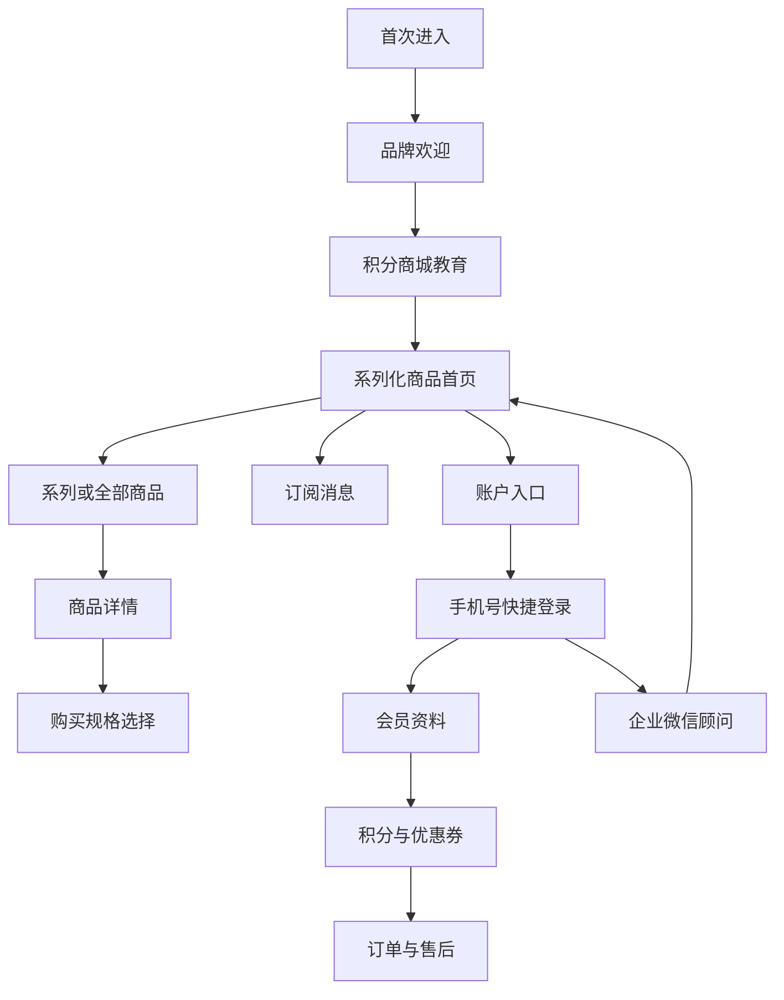
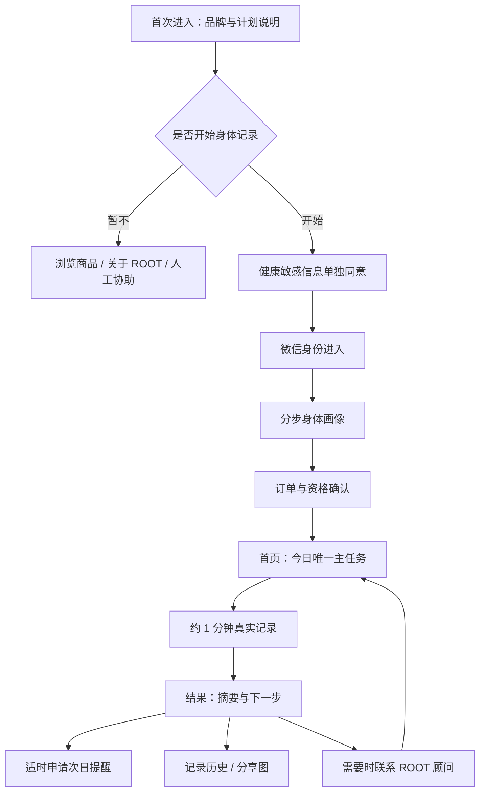

# PANE 小程序对 Root 的设计与流程参考

日期：2026-07-13 
评审性质：基于 15 张用户截图与 Root 当前文档/页面代码的只读对照 
证据限制：未覆盖 PANE 购物袋、结算、支付、积分商城列表、订单详情、活动页、售后与门店服务；相关判断均标为待验证。

## 1. 结论先行

PANE 最有价值的参考不是复古大片、英文排版或黑白视觉，而是它把一段用户关系设计成了连续链路：

`品牌欢迎 → 商品探索 → 购买理由 → 注册会员 → 积分/优惠券 → 微信订阅 → 企业微信顾问 → 账户与售后`

Root 应借鉴这种“关系连续性”，但要换成符合健康产品的主线：

`品牌理解 → 明确授权 → 身体画像 → 今日记录 → 结果解释 → 适时提醒 → 顾问协助 → 长期记录/权益`

Root 不应照搬三件事：

1. 不把全屏品牌大片放到高频任务页，避免遮住“今天该做什么”。
2. 不用积分、优惠券诱导健康敏感信息授权或画像填写。
3. 不以五个纯图标入口承载复杂信息架构；健康任务需要明确文字标签和稳定路径。

## 2. 实际证据

### 2.1 PANE 截图

| 截图 | 已验证内容 |
| --- | --- |
| 首页引导1 | PANE Member Club、品牌主张、全屏人物影像、跳过 |
| 首页引导2 | 积分商城指南、积分兑换限定周边或福利活动、跳过 |
| 商品首页1/2/3 | 全屏系列视觉、系列分页、订阅入口、全部商品、五图标底栏 |
| 商品内页1/2/3/4 | 主图、系列与价格、品牌/物流承诺、商品介绍、设计工艺、品牌故事、尺码/发货/售后/评价折叠项、固定购买按钮、客服悬浮入口 |
| 新用户注册1/2 | 手机号快捷登录；加入会员得 100 积分；头像、昵称、手机号、生日、性别、地址字段 |
| 首页点击订阅后 | 新活动、优惠券到期、积分到期三类一次性订阅消息 |
| 企业微信-用户小程序推荐 | 顾问添加用户、会员欢迎、新人优惠券与积分、小程序卡片、外部内容渠道 |
| 我的页面/我的页面2 | 会员等级、积分、优惠券、订单状态、条款、门店/奖品/客服/反馈、扫码、公众号/小红书、退出登录 |

截图中的手机号属于个人信息，本报告不复录。

### 2.2 Root 当前材料

- `docs/design.md`：v0.6.0 品牌与产品单一事实源；强调稳定、基础、平衡、真实记录、温和陪伴与非诊断表达。
- `docs/v0.3.0_ui_ux_design.md`：首页、今日记录、结果、分享图、记录历史与身体反馈画像的设计目标。
- `miniprogram/pages/home/index.wxml`：登录、健康信息单独同意、画像、活动、人工确认、问卷、打卡等状态入口。
- `miniprogram/subpkg/checkin/pages/result/index.wxml`：结果摘要、统计、分享图、历史和返回首页。
- `miniprogram/pages/products|tasks|rewards|profile/index.wxml`：商品、任务、奖励、我的当前页面结构。
- `miniprogram/app.json`：当前底栏为“首页 / 商品 / 任务 / 奖励”四项。

## 3. PANE 的完整流程拆解

### 3.1 品牌进入

PANE 用两屏引导完成两件不同的事：第一屏建立身份与气质，第二屏解释会员积分的实际用途。两屏都允许跳过，所以品牌表达没有锁死用户任务。

优势：品牌被置于功能之前，用户先理解“我进入了什么世界”。 
代价：对回访用户或目标明确的购买用户而言，全屏引导增加一步；若重复出现会造成明显打扰。

### 3.2 商品探索

商品首页不是传统货架，而是系列 Lookbook。每一屏只突出一个系列，使用全屏影像、系列中英文名、`SHOP ITEM` 和 `全部商品` 入口。首页同时承担品牌杂志与商品导航。

优势：高记忆度、适合少量重点系列、品牌气质一致。 
代价：商品密度低、检索成本高、图标底栏没有文字标签，首次用户要猜入口含义。

### 3.3 商品决策

详情页采用“先商品，再证明，再故事，再规则”的顺序：

1. 商品主图、名称、系列、价格。
2. 品质保证、顺丰速运、国内发货。
3. 模特图与设计工艺。
4. 品牌故事。
5. 尺码、发货、售后、评价折叠信息。
6. 全程固定购买按钮与客服入口。

这是一个高转化结构：情绪说服和理性证明并存，且主行动始终可达。问题是中英长文过多、正文偏小，品牌故事在移动端的阅读效率一般。

### 3.4 注册与会员

PANE 先用一个极简页面说明会员价值，再进入资料页。资料页把“注册获得 100 积分”作为明确交换，同时收集头像、昵称、手机号、生日、性别与地址。

优势：价值交换清楚，会员身份立即可见。 
风险：字段一次性过多；生日、性别、地址是否在注册当下必要并不清楚。若没有清楚用途说明，容易造成过度收集感。

### 3.5 提醒与私域承接

订阅消息把提醒拆成新活动、优惠券到期、积分到期，用户逐项选择；企业微信顾问随后用欢迎语、小程序卡片、新人券、积分和外部内容渠道承接。

这是 PANE 最值得 Root 研究的一段：小程序并不试图独自完成所有关系维护，而是把“系统提醒”和“人际顾问”分工。系统处理标准化提醒，顾问处理解释、推荐和后续沟通。

### 3.6 账户与履约

“我的账户”将会员身份、积分、优惠券、订单、条款、门店、奖品、客服、反馈、扫码和外部关注渠道集中在一起。它更像会员运营总台，而不只是设置页。

问题是页面较长，交易、法律、会员、品牌关注与工具入口混排；高频任务与低频设置没有充分分层。

## 4. 对 Root 的逐项参考

| PANE 做法 | Root 是否采用 | Root 化方式 |
| --- | --- | --- |
| 首次进入的品牌欢迎 | 有条件采用 | 仅首次或重大版本使用；最多两屏；允许跳过；第一屏讲“身体，自有其序”，第二屏讲“记录如何帮助你”，不讲功效 |
| 全屏系列 Lookbook | 局部采用 | 只用于品牌页、产品故事或阶段完成页；首页任务态不使用全屏大片 |
| 首页一屏一个焦点 | 采用 | 首页只突出“当前状态 + 下一步”，商品、奖励、顾问降级为次入口 |
| 固定购买按钮 | 转译采用 | 今日记录页固定“保存今日记录”；结果页固定一个主行动，但避开安全区且不遮内容 |
| 商品详情的渐进披露 | 采用 | 在产品说明、记录解释、隐私授权中使用折叠项；先给结论，再提供依据和帮助 |
| 会员等级/积分 | 谨慎采用 | 可做参与权益，不把健康结果、连续打卡天数或“更健康”做成等级；不奖励敏感信息授权 |
| 一次性订阅消息 | 采用 | 只在用户主动开启提醒时申请；清楚说明一次授权、用途和触发时间 |
| 企业微信顾问 | 采用 | 定位为“解释与协助”，而非强销售；带上用户当前流程状态，不默认传递健康详情 |
| 我的页会员总台 | 采用 | 显示当前阶段、记录历史、权益、订单、顾问、隐私管理；法律条款与低频设置收进二级页 |
| 五个纯图标底栏 | 不采用 | 使用 3–4 个有文字标签的稳定入口 |
| 注册即收集生日/性别/地址 | 不采用 | 逐步、按用途收集；健康敏感信息单独同意，拒绝不影响浏览和人工协助 |

## 5. 建议的 Root 信息架构

> 2026-07-13 产品决策更新：myRoot 已确认采用 `首页 / 健康 / 活动 / 任务 / 我的` 五个带文字标签的 Tab。该决策覆盖本节原先的四入口建议；完整职责、流程与采用边界见 `myRoot会员小程序产品定位与信息架构_v1_2026-07-13.md`。本报告对 PANE 五个“纯图标”入口可发现性不足的判断仍然成立，myRoot 不采用纯图标表达。

Root 当前材料存在冲突：`docs/design.md` 写底部只保留“首页 / 我的”两个 Tab，但 `app.json` 已配置“首页 / 商品 / 任务 / 奖励”四个 Tab，“我的”反而没有进入底栏。设计继续扩展前必须先确定唯一方案。

建议收口为四个入口：

| 入口 | 核心职责 | 不应承载 |
| --- | --- | --- |
| 首页 | 当前阶段、今日唯一主任务、异常/协助提示 | 完整商品货架、全部奖励规则 |
| 计划 | 7 天进度、今日记录、问卷、历史记录 | 购买转化 |
| 权益 | 免单、优惠券、活动资格、规则与审核状态 | 健康评分或健康排名 |
| 我的 | 身份资料、画像、订单物流、顾问、隐私管理、关于 ROOT | 今日主任务 |

商品作为首页和“我的”中的次级入口，或在业务验证后再决定是否单独成为 Tab。若商品确实是高频主任务，可将“权益”并入“我的”，再把商品放入底栏；不能同时保留五个同权入口。

## 6. 建议的 Root 用户流程

关键设计：

- 品牌欢迎只负责建立动机，不在同屏索取授权。
- 授权发生在用户选择开始记录之后，并说明拒绝后的可用路径。
- 画像保持一页一题，解释每一类信息的用途。
- 结果页不是结束页，而是“理解今天 + 选择下一步”的关系节点。
- 提醒申请应在用户完成一次记录、已经理解价值后出现，而不是一进入首页就索取。
- 顾问入口携带流程状态即可；健康详情由用户主动选择是否补充。

## 7. 页面级设计参考

### 7.1 首次欢迎

- 第一屏：ROOT 标识、`身体，自有其序`、一句计划说明、`开始了解`、`跳过`。
- 第二屏：用三个短句解释“记录什么、为什么记录、需要时谁会协助”。
- 不使用实验室权威图、疾病暗示或改善承诺。

### 7.2 首页

- 顶部小面积品牌识别，不让图片与主任务竞争。
- 主卡只显示阶段、今天的任务、预计耗时、唯一主按钮。
- 订单、权益、顾问用三个次级入口承接。
- 已完成后主按钮改为“查看今日记录”，避免重复提交。

### 7.3 记录页

- 借鉴 PANE 固定购买条，但转译为底部固定“保存今日记录”。
- 页面每一段只问一个主题；选中态不能只靠颜色。
- “未服用”“没有排便”“暂无明显变化”都被视为有效记录，不使用失败语气。

### 7.4 结果页

- 借鉴商品详情“主图—证明—故事—规则”的层次，改成“完成反馈—今日摘要—温和解释—下一步”。
- 主行动按阶段变化：生成分享图、填写问卷、查看进度或联系顾问；一屏只保留一个最高权重行动。
- 不根据单日记录生成诊断或确定性体质结论。

### 7.5 我的

- 顶部身份卡：昵称、当前阶段、累计记录，不做健康等级。
- 第一组：记录历史、身体反馈画像、订单物流。
- 第二组：权益与审核。
- 第三组：人工协助、隐私与身体记录授权、关于 ROOT。
- 法律条款放入“设置与协议”二级页，避免与高频任务混排。

## 8. 测量指标

PANE 的结构如果移植到 Root，不能只看视觉满意度，应分段验证：

| 阶段 | 主指标 | 护栏指标 |
| --- | --- | --- |
| 欢迎 → 开始 | 开始了解率、跳过率 | 首屏退出率、平均停留时间 |
| 授权 → 画像 | 单独同意完成率、画像完成率 | 拒绝后仍可访问路径成功率 |
| 首页 → 记录 | 今日主按钮点击率 | 误触率、找不到下一步反馈 |
| 记录 → 结果 | 提交完成率、平均完成时长 | 校验错误率、中途退出率 |
| 结果 → 提醒 | 提醒接受率 | 关闭提醒率、投诉率 |
| 顾问承接 | 有效问题解决率 | 非必要健康信息传递率、销售打扰反馈 |
| 长期关系 | 7 日完成率、记录回访率 | 因奖励导致的虚假记录迹象 |

## 9. 实施优先级

### P0：先统一

1. 决定底栏究竟是 2、4 还是其他结构，并让 `design.md`、`app.json` 与高保真稿一致。
2. 固化健康信息授权、普通登录、商品浏览与人工协助之间的路径。
3. 明确首页每个用户状态的唯一主任务。

### P1：吸收 PANE 的高价值做法

1. 设计两屏以内、可跳过的首次品牌欢迎。
2. 在结果后申请一次性提醒，而不是提前索取。
3. 重构“我的”为用户关系总台，并把低频条款收进二级页。
4. 为顾问承接定义最小状态信息与清楚的人工协助说明。

### P2：品牌深化

1. 为“关于 ROOT”、产品故事、完成分享图建立一致的影像系统。
2. 用渐进披露呈现产品依据、数据用途、发货与售后。
3. 在真实可用权益稳定后，再设计 myRoot 会员身份与权益表达。

## 10. 对抗式审查

### 最可能翻车的 5 个点

1. **把 PANE 的大片误当成答案。** Root 高频页面会变漂亮，但用户更难找到今天的任务。修正：品牌场景与任务场景分开，任务页保持单列、清楚、低干扰。
2. **把打卡做成积分游戏。** 用户可能为了奖励提交不真实记录，伤害数据价值。修正：奖励参与和完成流程，不奖励“更好”的健康结果，也不奖励敏感授权。
3. **企业微信承接变成默认泄露。** 若自动把画像或身体记录带给顾问，会越过用户预期。修正：默认只传流程状态，健康详情由用户主动选择。
4. **提醒申请过早。** 用户尚未体验记录价值就被索权，接受率和信任都会下降。修正：在首次成功记录后的结果页按需申请。
5. **信息架构继续漂移。** 文档两 Tab、实现四 Tab、参考对象五图标，团队可能把三套思路叠加。修正：先做一次 P0 导航决策，再进入视觉设计。

## 11. 最终判断

PANE 是一套“品牌驱动的会员零售关系系统”。Root 应把它转译成“信任驱动的身体记录与陪伴系统”。

最值得拿走的是：首次身份建立、一屏一个焦点、渐进披露、固定主行动、订阅消息与人工顾问的分工、以及“我的”作为长期关系总台。最不该拿走的是：商品大片覆盖任务、积分诱导敏感信息、过量注册字段、纯图标导航和销售导向的私域承接。

Root 的差异化不应是“更像一个时尚品牌”，而应是：品牌气质足够清楚，同时每一步都让用户知道自己为什么记录、记录了什么、数据如何使用、下一步是什么，以及需要时由谁来协助。
