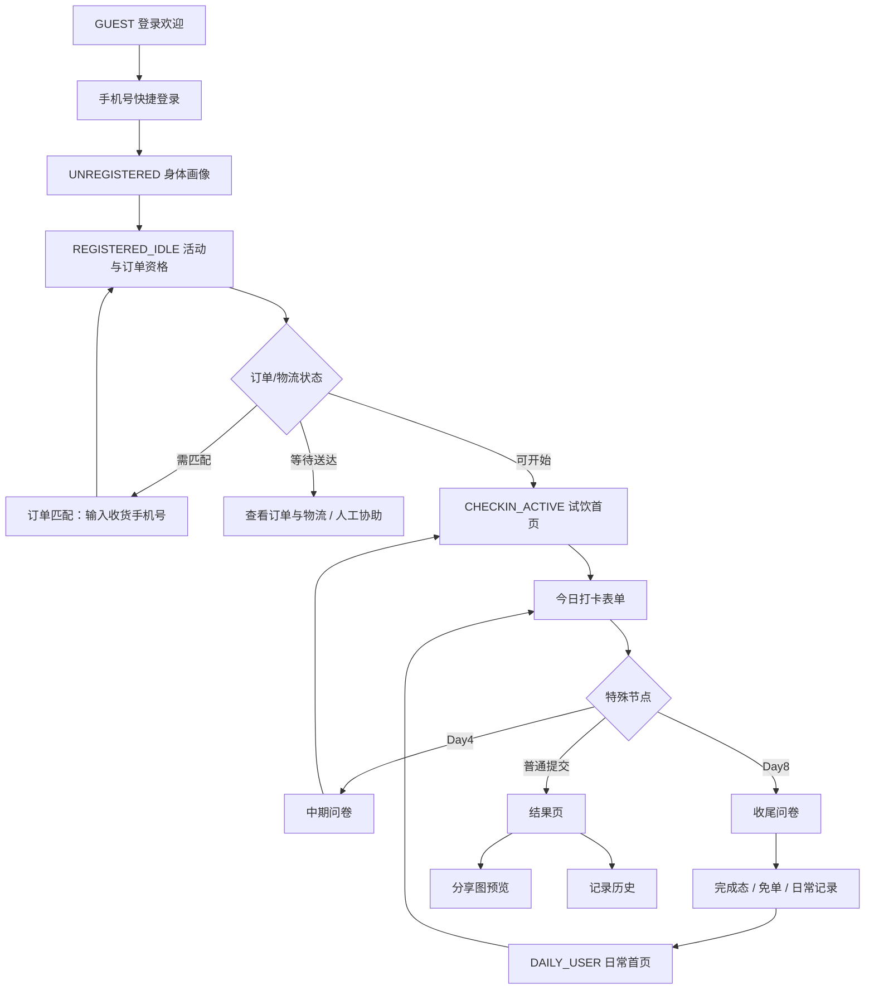

# ROOT 打卡小程序 Design.md

版本：v0.5.7 设计交接稿
生成日期：2026-05-29
当前代码参考：`25be202`
适用范围：微信小程序端，不包含运营后台
原型图：[miniprogram_prototype.svg](./miniprogram_prototype.svg)；PNG 预览：[miniprogram_prototype.svg.png](./miniprogram_prototype.svg.png)

## 0. 给其他 AI 设计工具的使用方式

把本文件和 `miniprogram_prototype.svg` 一起上传到设计工具；如果工具不支持 SVG，就使用 `miniprogram_prototype.svg.png`。目标不是重新发明产品，而是在保持现有业务状态、微信规范和 ROOT 品牌语气的前提下，优化移动端高保真界面。

建议提示词：

```text
请基于这份 design.md 和原型 SVG，优化一个微信小程序高保真设计稿。
设计尺寸以 375 x 812 为主，保留 ROOT 暖白、墨黑、苔绿、新芽绿、陶土色体系。
不要改动页面状态、主流程、字段含义和隐私/合规约束。
输出首页、今日打卡、结果页、分享图预览、我的页、订单物流、人工协助的高保真稿，并说明每页的主要改动。
```

## 1. 产品定位

ROOT 是一个益生元试饮与身体记录小程序。小程序要帮助用户完成三件事：

1. 完成手机号登录、身体画像、订单/物流资格确认。
2. 在 7 天试饮期记录服用、排便、便型和身体感受。
3. 试饮后进入日常身体记录，并保留历史、分享图、订单物流、人工协助和免单路径。

设计关键词：

- 身体，自有其序
- 真实记录，不追求完美答案
- 温和陪伴，避免医疗诊断口吻
- 一个页面只承载一个主任务
- 订单、物流、打卡资格要讲清楚，不让用户猜状态

## 2. 用户状态

| 状态 | 当前页面表现 | 主任务 |
| --- | --- | --- |
| `GUEST` | 登录欢迎态 | 同意协议后手机号快捷登录 |
| `UNREGISTERED` | 身体画像问卷 | 完成 4 步画像 |
| `REGISTERED_IDLE` | 活动/订单资格页 | 绑定收货手机号或等待物流送达 |
| `MANUAL_REVIEW_REQUIRED` | 人工确认中 | 说明等待运营确认 |
| `CHECKIN_ACTIVE` | 7 天试饮打卡首页 | 开始或查看今日打卡 |
| `DAY4_PENDING` | 中期问卷提示 | 填写中期问卷，也可继续今日打卡 |
| `DAY8_PENDING` | 收尾问卷提示 | 填写收尾问卷 |
| `CHECKIN_COMPLETED` | 完成态首页 | 申请免单、查看记录，不再继续打卡 |
| `CHECKIN_FAILED` | 人工协助态 | 联系 ROOT 顾问 |
| `DAILY_USER` | 兼容旧状态的只读记录页 | 查看历史记录，不开放继续打卡 |

## 3. 信息架构

小程序底部只保留两个 Tab：`首页`、`我的`。首页是智能容器，根据用户状态渲染不同视图。

| 路径 | 页面名称 | 用途 |
| --- | --- | --- |
| `/pages/home/index` | 智能首页 | 登录、画像、活动资格、试饮打卡、完成态、只读历史记录 |
| `/pages/order/match` | 订单匹配 | 输入收货手机号匹配有赞订单 |
| `/subpkg/checkin/pages/today/index` | 今日打卡 | 记录服用、排便、便型、感受和图片 |
| `/subpkg/checkin/pages/result/index` | 打卡结果 | 展示今日摘要、统计和分享图入口 |
| `/subpkg/checkin/pages/share-poster/index` | 分享图预览 | 生成、保存、分享今日记录图 |
| `/subpkg/checkin/pages/history/index` | 记录历史 | 试饮记录与日常记录详情 |
| `/subpkg/checkin/pages/questionnaire/index` | 中期/收尾问卷 | Day4、Day8 反馈 |
| `/subpkg/refund/pages/apply/index` | 免单申请 | 满足资格后提交免单 |
| `/subpkg/refund/pages/status/index` | 免单状态 | 查看审核进度 |
| `/pages/profile/index` | 我的 | 用户资料、状态、菜单 |
| `/subpkg/profile/pages/tags/index` | 身体反馈画像 | 展示入组画像三字段 |
| `/subpkg/profile/pages/orders/index` | 订单与物流 | 展示订单、配送、匹配信息 |
| `/subpkg/profile/pages/support/index` | 人工协助 | 客服入口与问题类型 |
| `/subpkg/profile/pages/about/index` | 关于 ROOT | 品牌介绍 |

## 4. 核心流程



## 5. 视觉系统

设计语言：暖白底、墨黑主字、苔绿选中态、新芽绿轻提示、陶土色运营提醒。整体气质要克制、干净、接近“身体记录工具”，不要做成广告页。

| Token | 值 | 用途 |
| --- | --- | --- |
| `--color-root-ink` | `#080806` | 主按钮、深色品牌卡、重点标题 |
| `--color-root-bg` | `#F7F4EC` | 页面背景 |
| `--color-root-nav` | `#FDFBF6` | 导航和浅底 |
| `--color-root-surface` | `#FFFFFF` | 卡片、表单、列表 |
| `--color-root-moss` | `#586B3F` | 选中态、统计强调、Tab active |
| `--color-root-sprout` | `#A6B77A` | 轻强调、进度 |
| `--color-root-clay` | `#B67855` | 复购礼、运营提醒 |
| `--color-root-line` | `#E8E0D0` | 分隔线、描边 |
| `--color-root-muted` | `#8A8172` | 次级文案 |
| `--color-root-copy` | `#433E34` | 正文 |
| `--color-primary-tint` | `#F1F5E6` | 选中浅底 |
| `--color-root-poster-paper` | `#F8F3E8` | 分享图纸张底 |
| `--color-root-success-soft` | `#EEF3DE` | 成功摘要轻底 |

字体与尺寸：

- 字体：`-apple-system`, `PingFang SC`, `Helvetica Neue`, sans-serif。
- 正文：`28rpx` 左右；辅助文字：`22-26rpx`。
- 页面级标题可到 `40-56rpx`；卡片内标题控制在 `32rpx` 左右。
- 不用负字距，不按视口宽度缩放字体。

空间与控件：

- 主按钮高度不低于 `88rpx`，当前 `root-button` 为 `96rpx`。
- 常规卡片圆角 `32rpx`，按钮圆角 `24rpx`。
- 表单行高度不低于 `96rpx`。
- 页面底部必须避开 `env(safe-area-inset-bottom)` 和 TabBar。
- 选中态不能只靠颜色，必须有勾选、`已选择` 文案、边框或状态文字。

## 6. 页面设计说明

### 6.1 登录欢迎

目标：让用户一眼知道这是 ROOT，不是普通授权页。

主内容：

- ROOT 横版 logo。
- 标题：`身体，自有其序`。
- 说明：`Root 希望你不只是服用补剂，而是在 7 天里重新建立与身体的关系。`
- 承诺卡：记录服用、排便和真实感受；不追求完美答案；异常状态可进入人工协助。
- 主按钮：`手机号快捷登录`。
- 协议与隐私必须可见，未勾选时提示 `请先阅读并同意协议`。

优化方向：

- 保持授权前说明清晰。
- 主 CTA 只保留一个。
- 不添加功效承诺、疗效暗示或夸张情绪图。

### 6.2 身体画像

目标：用低压力问卷收集后续记录与顾问沟通所需画像。

当前 4 步：

1. 参与本次试饮的原因，多选。
2. 肠道健康状况，单选。
3. 目前肠道健康改善方式，多选。
4. 便便日常类型，便型选择。

交互：

- 顶部展示 `身体画像 X/4` 进度条。
- 每步只问一个问题。
- `上一题` 与 `下一题/完成` 保持底部并列。
- 多选中若有互斥项，要清楚表达。

### 6.3 活动与订单资格

目标：把“为什么还不能开始 Day1”讲清楚。

页面状态：

- `ORDER_PENDING`：主按钮 `确认收货手机号`，次按钮 `人工协助`。
- `WAITING_DELIVERY`：主按钮 `查看订单与物流`，次按钮 `人工协助`。
- `READY_TO_START`：主按钮 `开始打卡`。
- `MANUAL_REVIEW_REQUIRED`：说明订单、物流或启动资格需要运营确认。

内容 Module：

- 活动说明卡。
- 身体画像摘要卡。
- 活动 banner。
- 订单与物流卡：订单号、收货人、物流状态。
- 底部行动区。

优化方向：

- 订单状态、物流状态、可打卡资格三者分开表达。
- 不要把“物流送达后开始打卡”做成可误点的强主按钮。
- 人工协助可见，但不要抢主任务。

### 6.4 订单匹配

目标：当登录手机号和收货手机号不同，帮助用户用收货手机号找到订单。

当前页面仍偏旧样式，后续可优先统一到 ROOT 品牌 UI。

主内容：

- 标题：`找到你的试饮订单`。
- 输入：`收货手机号`，11 位数字。
- 主按钮：`确认订单`。
- 辅助说明：订单送达后才能启动 Day1；以收货手机号为准。

状态：

- 空手机号：toast `请输入下单手机号`。
- 匹配成功：toast `订单已送达` 或 `订单已匹配`，回首页。
- 匹配失败：弹窗 `未匹配到订单`，引导返回活动或人工确认。

### 6.5 试饮首页

目标：在 7 天试饮期，让用户明确知道今天要做什么。

主内容：

- 深色 ROOT 状态卡。
- `第 N 天 / 7`、`N/7` 进度。
- 标题：`身体秩序恢复中`。
- 说明：`今天记录服用、排便与身体反馈，约 1 分钟。`
- 主 CTA：`开始今日打卡` 或 `查看今日记录`。
- 今日观察：服用、排便、人工协助。
- 日历进度：7 天列表。
- 第 6 天复购礼作为次级卡，不抢主 CTA。

设计约束：

- 试饮期可以出现 `N/7`。
- 页面主任务是打卡，不是免单、复购或客服。

### 6.6 日常记录首页

目标：试饮完成后，弱化 7 天任务感，变成长期身体记录。

主内容：

- 浅色日常 hero 卡。
- eyebrow：`今日身体记录`。
- 标题：`今天，也记录身体反馈`。
- 说明：`继续记录服用、排便与真实感受。身体的变化，值得被慢慢看见。`
- 主按钮：`记录今天` 或 `查看今日记录`。
- 三个统计：累计记录、当前连续、最长连续。
- 记录历史入口。
- 店铺入口作为次级补充。

设计约束：

- 日常态不出现 `Day N/7`、`7 天数据总结` 等试饮期表达。
- 统计不要制造压力；空态可写 `从今天开始记录`。

### 6.7 今日打卡表单

目标：让用户 1 分钟内完成真实记录。

字段：

- 今日是否服用 ROOT：`已完成` / `未服用`。
- 昨日是否排便：`有` / `没有`。
- 昨日便型：仅当选择 `有` 后展开。
- 身体感受：最多 500 字。
- 图片：最多 3 张，可选。

快捷短句：

- `暂无明显变化`
- `腹部感觉有变化`
- `排便节律有变化`
- `整体状态有变化`

校验：

- 未选服用：`请选择今日是否服用`。
- 未选排便：`请选择昨日是否排便`。
- 有排便但未选便型：`请选择昨日便型`。
- 可以未服用但继续记录身体感受。

跳转：

- 普通提交进入结果页。
- Day4 进入中期问卷。
- Day8 进入收尾问卷。
- 服务端拒绝时展示原因并回首页。

### 6.8 打卡结果

目标：给明确完成反馈，并把分享图和历史作为自然下一步。

普通结果：

- 深色 hero。
- ROOT 反白 logo。
- kicker：`试饮记录` 或 `今日记录`。
- 标题：`秩序已记录` 或 `今天已记录`。
- 今日摘要：服用、昨日排便、便型、感受。
- 统计条：试饮期显示 `已完成 N/7 天`；日常显示累计和连续天数。
- 主按钮：`生成今日分享图`。
- 次按钮：`查看试饮进度` 或 `查看记录历史`。
- 文本入口：`返回首页`。

人工协助结果：

- 不展示分享图主入口。
- 标题：`需要人工协助`。
- 说明当前记录需要 ROOT 顾问协助确认。

### 6.9 分享图预览

目标：生成个人记录素材，不做广告海报。

图片规格：

- 生成尺寸：`1080 x 1440`。
- 小程序预览 canvas：`360 x 480`。
- 背景：`#F8F3E8`。

图内结构：

- ROOT 品牌区和日期。
- 标题：试饮期 `第 N 天，身体记录已完成`；日常期 `今天，身体记录已完成`。
- 副文案：`一次真实记录，也是在照看身体的节律。`
- 摘要：服用 ROOT、昨日排便、便型。
- 今日感受：最多 40 字，空时展示 `今天也完成了一次真实记录。`
- 坚持区：试饮期 `已完成 N 天试饮记录`；日常期 `累计记录 N 天 · 当前连续 N 天`。
- 尾句：`身体自有其序，记录会让它被看见。`

行动：

- 主按钮：`保存到相册`。
- 次按钮：`微信发送/分享`。
- 文本入口：`返回首页`。
- 相册无权限时，用弹窗解释用途并引导 `去设置`。

### 6.10 记录历史

目标：保留真实反馈，而不是做成成绩单。

试饮期：

- `第 N 天 · 日期`。
- 状态：已记录 / 待记录。
- 摘要：反馈或便型。
- 详情：服用、是否排便、便型、身体反馈。

日常期：

- `今日记录 · 日期`。
- 状态：连续 N 天。
- 展示试饮记录与日常记录分开的预期。

优化方向：

- 后续可增加 `生成这天的分享图`，但不要让历史页变成分享页。

### 6.11 我的

目标：用户中心要像 ROOT 的会员与记录中心，而不是后台状态页。

主内容：

- 深色 ROOT 用户卡。
- 横版反白 logo。
- 头像、昵称、手机号、状态徽章。
- 句子：`身体自有其序，记录会让它被看见。`
- 微信合规头像昵称卡：使用 `chooseAvatar` 与 `type="nickname"`。
- 当前记录状态：7 天圆点或日常统计。
- 菜单：记录历史、身体反馈画像、订单与物流、人工协助、关于 ROOT。
- 退出登录独立放置。

重要约束：

- 人工协助保留 `open-type="contact"` 的透明点击层。
- 头像昵称卡可跳过，不阻断主流程。
- 版本号由 `config/version.js` 统一管理，当前展示 `v0.5.7`。

### 6.12 身体反馈画像

目标：帮助用户和顾问快速看到三类入组信息。

只展示：

- 参与原因。
- 肠道状态。
- 改善方式。

不展示：

- 日常便型。
- 诊断结论。
- 无关枚举值。

### 6.13 订单与物流

目标：让用户知道订单是否已匹配、物流是否送达，以及为什么影响打卡资格。

展示：

- 有赞订单号或 `订单待同步`。
- 配送状态。
- 金额。
- 匹配方式。
- 物流公司、运单号、最新节点。
- 空态：`暂未匹配到订单`，引导人工协助。

隐私：

- 不展示完整地址。
- 手机号如需展示，应脱敏。
- 不展示 raw payload。

### 6.14 人工协助与关于 ROOT

人工协助：

- 标题：`联系 ROOT 顾问`。
- 适用问题：订单/物流不一致、打卡中断、补卡、问卷问题、身体不适希望跟进。
- 主按钮：`联系客服`，使用微信客服能力。

关于 ROOT：

- 保留品牌文案，但移动端短段落。
- 不使用医疗承诺。
- 主句：`让科学成为陪伴，让健康变成习惯`。

## 7. 关键交互与状态规则

- 所有请求都要有 loading 或可见反馈。
- 网络失败、登录过期、业务拒绝要分别提示。
- `SESSION_EXPIRED` 需要清理本地 token 并引导重新登录。
- 订单未送达不能启动 Day1。
- 交易关闭订单不能自动绑定用户。
- 物流 `已签收` 才能触发可开始打卡。
- 断卡失败或人工确认中时，不引导生成分享图。
- 图片反馈是次级动作，不能比提交按钮更强。
- 保存分享图是主路径；不能承诺自动发布朋友圈或小红书。

## 8. 设计改进优先级

P0：统一仍偏旧的订单匹配页视觉，让它从 `.page/.panel` 迁移到 ROOT 品牌样式；检查退款页是否也需要统一。

P1：优化日常首页、结果页、分享图的视觉层次，让长期记录和试饮任务有更清楚的阶段感。

P1：加强订单与物流状态的解释，明确“订单状态 / 物流状态 / 打卡资格”三件事。

P2：历史页增加按阶段分组和更清晰的详情视觉。

P2：分享图模板可增加一版更适合朋友圈的留白版，但仍保持个人记录素材定位。

## 9. 设计禁区

- 不要加入医疗诊断、疗效承诺、疾病治疗暗示。
- 不要让复购礼、免单、客服抢走每日打卡主任务。
- 不要把日常记录说成 7 天任务。
- 不要暴露手机号、完整地址、订单 raw payload。
- 不要设计依赖长按保存，必须有明确按钮。
- 不要引入需要复杂学习的新导航。
- 不要把微信授权页做成营销落地页。

## 10. 资产清单

| 资产 | 路径 | 用途 |
| --- | --- | --- |
| ROOT 方形 logo | `miniprogram/static/brand/logo.png` | 默认头像、加载 |
| ROOT 横版 logo | `miniprogram/static/brand/root-logo-horizontal.png` | 登录、关于、浅底品牌露出 |
| ROOT 反白横版 logo | `miniprogram/static/brand/root-logo-horizontal-light.png` | 深色卡片、结果页、我的页 |
| 活动 banner | `miniprogram/static/banner/activity.png` | 活动资格页 |
| 完成徽章 | `miniprogram/static/badge/complete.png` | 试饮完成态 |
| 便型图 | `miniprogram/static/stool/type1.png` 到 `type7.png` | 画像和便型辅助 |
| Tab 图标 | `miniprogram/static/tabbar/*.png` | 首页 / 我的 |
| 功能图标 | `miniprogram/static/icon/*.png` | 店铺、退款、打卡 |

## 11. 给设计工具的页面输出清单

请至少输出这些 8 个高保真页面：

1. 登录欢迎。
2. 身体画像问卷。
3. 活动与订单资格。
4. 试饮首页。
5. 日常记录首页。
6. 今日打卡表单。
7. 打卡结果。
8. 分享图预览。

建议追加：

1. 我的。
2. 订单与物流。
3. 人工协助。
4. 记录历史。

## 12. 验收清单

- 375 x 812 宽度下无横向滚动。
- 所有按钮文字不溢出，主按钮触控不小于 `88rpx`。
- 顶部内容不贴近微信胶囊区域。
- 底部按钮不被安全区或 TabBar 遮挡。
- 每页只有一个主任务。
- 选中态有文字或图形辅助，不只依赖颜色。
- 登录、画像、订单、打卡、结果、分享图、我的菜单路径完整。
- 日常态和试饮态文案区分清楚。
- 订单物流和人工协助状态不会让用户误以为自己已经可以打卡。
- 分享图不出现手机号、订单号、地址和医疗功效表达。
