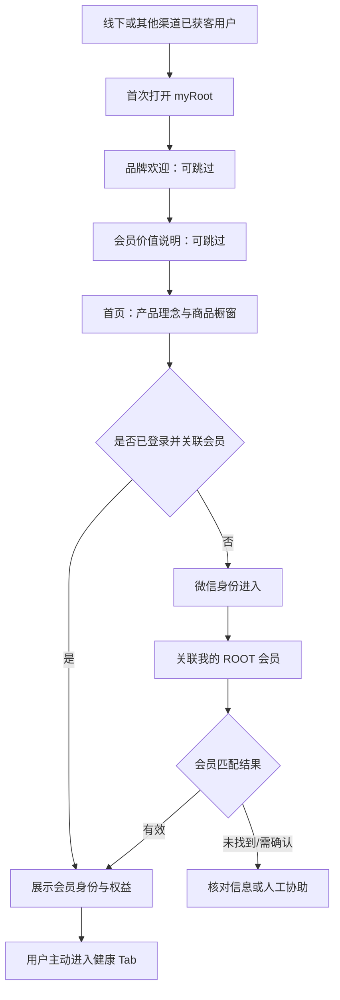
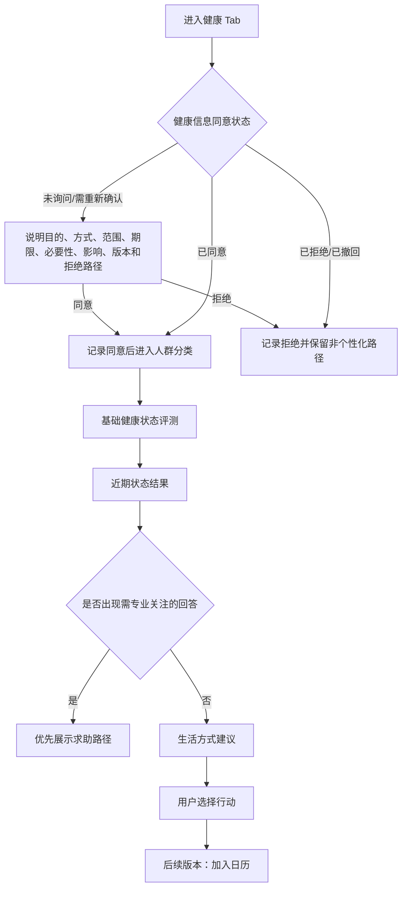
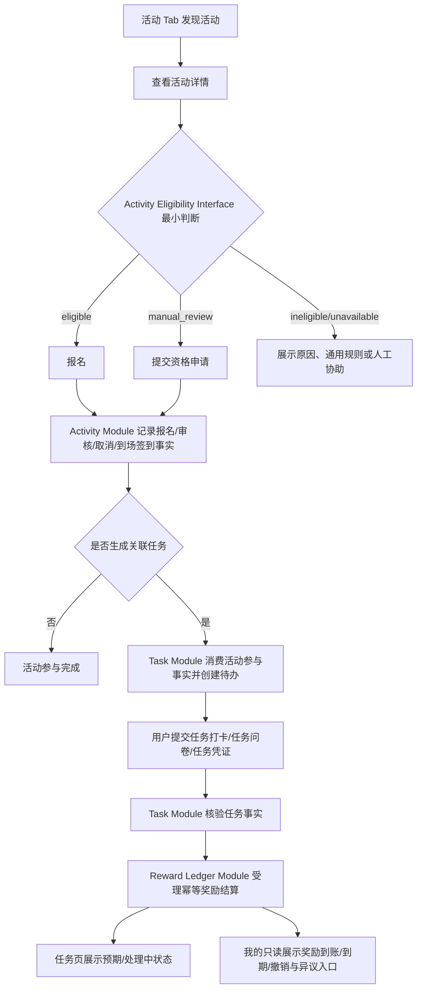
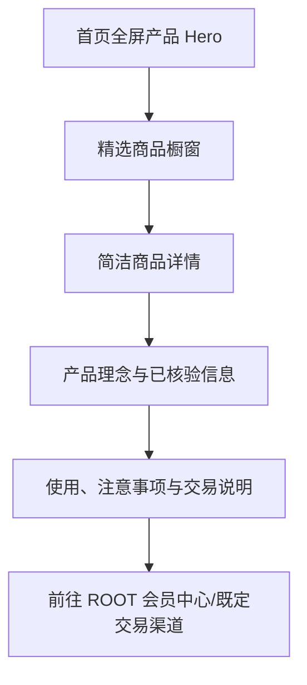

# myRoot 会员小程序品牌与产品 Design.md

文档版本：v0.7.1 会员定位重构与事实归属校正版

首次生成：2026-05-29

最近更新：2026-07-13

目标产品：myRoot 微信小程序

当前代码参考：`f2465fc`；`miniprogram/config/version.js` 当前值为 `0.5.10`，工作区另有未提交改动

适用范围：微信小程序用户端，不包含运营后台、交易后台或线下执行手册

配套产品决策：[myRoot会员小程序产品定位与信息架构_v1_2026-07-13.md](./myRoot会员小程序产品定位与信息架构_v1_2026-07-13.md)

PANE 参考报告：[PANE小程序对Root的设计与流程参考_2026-07-13.md](./PANE小程序对Root的设计与流程参考_2026-07-13.md)

视觉方向预览：[myRoot会员小程序视觉方向预览_2026-07-13.html](./myRoot会员小程序视觉方向预览_2026-07-13.html)

品牌输入：《我们是ROOT》品牌手册（18 页；PDF 文件元数据显示 2026-07-01 修改，不等同于正式版本号）。本文件吸收其中的品牌定位、核心信念、视觉气质、产品与科研叙事，但不会把品牌手册中的科研、认证或功效表述自动视为可上线文案。

本文件是 myRoot 小程序产品与设计的单一事实源。发生冲突时，优先级依次为：

1. 法律法规、平台规则与已核验产品证据；
2. 用户隐私、健康信息授权与安全约束；
3. 本文件的产品定位、信息架构和体验规则；
4. 已确认的业务状态与运营规则；
5. 品牌手册的传播表达；
6. 单页视觉偏好。

## 0. 使用方式与实现状态

### 0.1 给产品、设计与实现人员

- 本文件描述目标产品，不代表所有页面已经实现。
- 现有 7 天试饮、打卡、订单、奖励与分享图能力作为可复用的存量能力保留，但不再定义整个产品。
- 新页面设计必须先判断归属 Tab，再判断页面主任务，最后决定视觉形式。
- 同一业务事实只能由一个 Module 拥有；首页和“我的”只消费摘要，不复制主记录。
- 当前 `app.json` 仍是 `首页 / 商品 / 任务 / 奖励` 四 Tab；目标结构是 `首页 / 健康 / 活动 / 任务 / 我的` 五 Tab。此差异属于待实现项，不得在验收时误报为已完成。
- 当前窗口标题仍含 `ROOT 7日身体重启`，后续应随会员定位统一调整；本文件不直接修改代码。

### 0.2 给其他 AI 设计工具

建议同时提供本文件、产品定位稿和已授权的 ROOT 品牌资产。不要仅上传 PANE 截图后要求照抄。

建议提示词：

```text
请基于这份 design.md，为 myRoot 微信会员小程序设计移动端高保真页面。
设计尺寸以 375 x 812 为主，移动端优先。
myRoot 默认服务已经由线下或其他渠道获客的 ROOT 订阅会员，不是公域陌生用户商城。
底部固定五个带文字标签的 Tab：首页、健康、活动、任务、我的。
首页参考 PANE 的编辑式信息结构：首次引导最多两屏，可跳过；首页使用全屏产品影像、产品理念和简洁商品橱窗，但不能复制活动列表或任务进度。
健康页承载人群分类、健康状态评测、可选问卷、结果解释和生活方式建议；后续日历只保留结构方向。
活动页承载线下活动发现、详情、报名和参与状态；任务页承载打卡、进度和奖励状态；我的页承载会员身份、权益、资料、历史、隐私和人工协助。
视觉生产稿使用当前运行时已有的 ROOT 暖白、墨色和苔绿 Token；深橄榄只作为待品牌方确认的方向。品牌场景可以编辑式和大留白，高频表单保持单列、清楚、低干扰。
不要改变健康信息单独同意、拒绝后的可用路径、非诊断表达、科研与功效证据边界。
每屏只设置一个最高权重行动。说明每页的信息层级、状态和异常路径。
```

### 0.3 Structured Design Brief

```text
[PLAN:@DESIGN|type=wechat_member_mini_program]
  |palette=light_clean|accent=muted_sage
  |typography=system_ui|display=same_as_body
  |layout=single_column
  |mood=editorial|density=spacious|section_gap=96px
  |hero=fullscreen_product_image+brand_statement+single_cta
  |sections=onboarding,home,health,activity,task,profile
  |exclude=gradients,stock_photos
  |responsive=mobile_first
```

说明：上述封闭词汇用于描述方向；生产实现以本文件第 6 章中已经进入当前运行时的 ROOT Token 为准，不以技能示例色值或待确认候选色覆盖现有品牌系统。

## 1. 产品定位

### 1.1 一句话定位

**myRoot 是面向已获客 ROOT 订阅会员的品牌体验与日常健康生活入口，连接产品理解、健康状态认知、生活方式行动、线下活动和会员任务。**

myRoot 不是面向陌生用户的公域商城，也不是单一的 7 天打卡工具。它承担会员进入 ROOT 之后的持续关系。

### 1.2 默认服务对象

- 用户已在线下、企业微信或其他渠道与 ROOT 建立关系；
- 用户已经是 ROOT 订阅会员，或具备可核验的会员关联条件；
- 用户可能了解单一产品，但未必理解完整产品理念；
- 用户愿意了解自身近期健康状态，并接受非诊断性的生活方式建议；
- 用户可能参与线下活动、阶段任务、打卡或会员奖励计划。

### 1.3 产品帮助会员完成的五件事

1. 理解 ROOT 的品牌理念和产品。
2. 完成人群分类并了解近期健康状态。
3. 获得低风险、可执行的生活方式建议。
4. 发现可参加的线下活动，并完成参与后的任务。
5. 管理会员身份、权益、资料、历史、授权和人工协助。

### 1.4 当前版本重点

- 展示 ROOT 产品理念与商品橱窗；
- 提供 PANE 式两屏以内、可跳过的新用户引导；
- 完成账号登录和既有 ROOT 会员关联；
- 注册后在健康旅程中依次完成人群分类、基础健康状态评测和生活方式建议；
- 展示可参与的线下活动；
- 承载打卡任务、进度与奖励状态；
- 建立五 Tab 稳定导航。

### 1.5 非目标

当前阶段明确不做：

1. 不把 myRoot 做成公域投放和陌生用户转化商城。
2. 不在 myRoot 内重建完整下单、支付、订单履约和售后系统。
3. 不用健康评测结果进行疾病诊断、治疗建议或确定性体质判断。
4. 不把积分、奖励、会员资格或普通活动资格与特定健康答案、健康结果或敏感信息授权绑定。仅当某项线下活动存在明确且充分的安全必要性时，才可在目的专属说明与单独同意后进行最小资格判断；拒绝不影响其他公开活动和会员权益，并提供人工安全确认或不处理健康信息的替代路径。
5. 不在当前版本实现完整健康日历、自动干预计划或长期趋势预测。
6. 不在五个 Tab 中维护重复的活动、任务、奖励或健康记录。
7. 不让是否完成健康评测决定会员身份、公开内容或人工协助的可用性。

## 2. 品牌系统

### 2.1 品牌信念

- 核心主张：`身体，自有其序`。
- Sustained / 稳定：用可持续的日常节律替代短期刺激。
- Foundation / 基础：从肠道、真实生活和持续记录建立健康基础。
- Balance / 平衡：平衡不是控制，而是理解身体、与身体重新合作。
- 品牌使命：帮助用户把身体还给身体自己，建立稳定的健康运行系统。
- 品牌态度：不宣称“神奇功效”，不制造“立竿见影”的幻觉；以科学、记录和长期陪伴支持用户理解身体。
- 用户感受：安稳、轻盈、清晰，而不是焦虑、被管控或被评分。
- 品牌隐喻：`人如草木，根定而生`。肠道是健康的基础，益生元是滋养已有菌群的“营养土”。隐喻不能替代事实、证据或必要的产品说明。

### 2.2 从品牌信念到产品行为

| 品牌信念 | 产品行为 | 界面表达 |
| --- | --- | --- |
| 稳定 | 建立可持续的会员关系和日常行动 | 低压力提醒，不用红色催促、倒计时和健康排名 |
| 基础 | 先确认会员身份，再进行分类和基础评测 | 状态解释清楚，一次只完成一个必要动作 |
| 平衡 | 同时允许行动、暂停、跳过和求助 | 使用“记录、反馈、建议、协助”，避免“异常、失败、治愈” |
| 与身体合作 | 接受暂无变化、未完成或不同节奏 | 不把未完成做成道德失败；人工协助始终可达 |
| 科学陪伴 | 评测、建议与产品依据可追溯 | 来源、适用范围、更新时间和限制分层展示 |
| 会员关系 | 识别既有会员并延续其权益 | 使用“关联我的 ROOT 会员”，不让已付费用户重新“入会” |

### 2.3 品牌名称与文案口径

- 品牌名在正文统一写作 `ROOT`；不混用 `Root`、`root` 或文本仿 logo。
- `myRoot` 是会员小程序与会员体验名称，不替代品牌名 ROOT。
- logo 必须使用正式图片资产，不能用文本重绘、拉伸、描边、变色或拆分字标。
- 主标语优先使用 `身体，自有其序`；同一画面保持一种标点写法。
- `让科学成为陪伴，让健康变成习惯` 可作为辅助品牌句，不与主标语争夺首屏层级。
- ROOT 的声音是温和但坚定、科学但不卖弄、清晰但不命令。

## 3. 用户状态模型

不要用一个不断膨胀的枚举同时表示账号、会员、健康、活动和任务状态。页面通过以下相互独立的状态轴组合展示。

### 3.1 账号状态

| 状态 | 含义 | 主行动 |
| --- | --- | --- |
| `GUEST` | 未登录，可浏览公开内容 | 登录并关联 ROOT 会员 |
| `SIGNED_IN` | 已完成微信身份进入 | 查看会员匹配状态 |
| `SESSION_EXPIRED` | 登录状态过期 | 重新登录 |

### 3.2 会员状态

| 状态 | 含义 | 主行动 |
| --- | --- | --- |
| `UNLINKED` | 尚未关联既有 ROOT 会员 | 开始关联 |
| `MATCHING` | 正在匹配会员身份 | 等待或查看说明 |
| `ACTIVE` | 会员有效 | 查看健康旅程或权益 |
| `EXPIRED` | 会员已到期 | 查看续订渠道或联系顾问 |
| `NOT_FOUND` | 未找到匹配会员 | 核对信息或人工协助 |
| `MANUAL_REVIEW` | 需要人工确认 | 查看处理状态 |

会员有效性不能取决于是否完成健康评测、活动或任务。

### 3.3 健康信息同意状态

同意状态与健康旅程状态分开保存，不能用一个“未同意”值混合尚未询问、明确拒绝和已经撤回。

| 状态 | 含义 | 健康 Tab 主行动 |
| --- | --- | --- |
| `CONSENT_NOT_REQUESTED` | 尚未展示当前目的和版本的健康信息说明 | 查看说明并自行决定 |
| `CONSENT_GRANTED` | 已对明确目的、处理方式、信息范围、保存期限和说明版本作出同意 | 进入健康旅程 |
| `CONSENT_REFUSED` | 用户已明确拒绝 | 继续使用非个性化能力，不反复索取 |
| `CONSENT_WITHDRAWN` | 用户撤回此前同意 | 停止新增个性化处理并查看数据处理说明 |
| `CONSENT_RECONSENT_REQUIRED` | 目的、处理方式、信息范围、保存期限或说明版本发生实质变化，需重新确认 | 查看变更后重新决定 |

每条同意记录至少保存目的、处理方式、信息范围、保存期限、必要性与影响说明、说明版本、状态、`noticePresentedAt`、`grantedAt`、`refusedAt`、`withdrawnAt` 和 `statusChangedAt`；不适用的时间字段为空。拒绝或撤回后，用户仍可浏览首页、商品、公开活动、会员资料和人工协助；仅暂停依赖健康信息的个性化结果与建议。

### 3.4 健康旅程状态

| 状态 | 含义 | 健康 Tab 主行动 |
| --- | --- | --- |
| `UNCLASSIFIED` | 尚未完成人群分类 | 开始分类 |
| `CLASSIFIED` | 已分类，未完成基础评测 | 开始基础评测 |
| `ASSESSING` | 评测进行中 | 继续评测 |
| `RESULT_READY` | 结果已生成 | 查看近期状态 |
| `RECOMMENDATION_READY` | 生活方式建议可用 | 查看建议 |
| `REASSESSMENT_DUE` | 到达建议复评时间 | 再次评测 |

### 3.5 活动状态

`可报名`、`审核中`、`已报名`、`已满员`、`已取消`、`已签到`、`已结束`。

### 3.6 任务状态

`未开始`、`进行中`、`待提交`、`待核验`、`已完成`、`已过期`、`需人工复核`。

## 4. 信息架构

### 4.1 五个主 Tab

底部固定五个带文字标签的 Tab。图标只辅助识别，不能替代文字。

| Tab | 用户问题 | 唯一主职责 | 不拥有 |
| --- | --- | --- | --- |
| 首页 | ROOT 是什么，有哪些产品？ | 品牌理念、全屏商品 Hero、精选商品橱窗、一条轻量会员下一步 | 完整评测、活动列表、任务进度、资料编辑 |
| 健康 | 我当前处于什么状态，可以做什么？ | 人群分类、评测、可选问卷、结果、建议、历史、未来日历入口 | 活动报名、任务奖励、商品交易 |
| 活动 | 近期有哪些线下活动可参加？ | 活动发现、详情、报名、到场签到和活动运营反馈 | 任务结算、任务问卷答案、健康结果、会员资料 |
| 任务 | 我已经参与了什么，现在要做什么？ | 任务打卡、任务问卷待办、进度、凭证与奖励处理状态 | 活动主数据、最终权益明细、健康评分 |
| 我的 | 我的身份、权益和历史在哪里？ | 会员身份、有效期、权益、资料、各类历史入口、授权和人工协助 | 健康/活动/任务的主要操作 |

### 4.2 首页不是状态总台

首页专职承载品牌理念与商品橱窗，不再沿用旧版“活动、商品、任务、奖励混合控制台”。

首页可以通过 Home Next-step Module 显示一条轻量状态提示和一个行动，例如：

- `关联我的 ROOT 会员`；
- `继续人群分类`；
- `完成基础健康评测`；
- `查看生活方式建议`。

首页不展示活动列表、任务列表、奖励进度或健康结果详情。

### 4.3 目标页面地图

| 页面 | 目标路由/现状 | 归属 | 用途 |
| --- | --- | --- | --- |
| 首页 | `/pages/home/index`，需重构 | 首页 Tab | 品牌理念、全屏 Hero、商品橱窗、轻量会员下一步 |
| 商品列表 | `/pages/products/index`，改为首页次级页 | 首页 | 查看全部展示商品 |
| 商品详情 | `/pages/product-detail/index`，需重构 | 首页 | 商品、理念、依据、使用与交易渠道 |
| 登录 | `/pages/login/index` | 次级页 | 微信身份进入 |
| 会员关联 | 目标路由待定；可由注册页演进 | 次级页 | 匹配既有 ROOT 会员 |
| 健康信息同意 | `/pages/health-consent/index` | 健康 | 单独同意、撤回和拒绝路径 |
| 健康首页 | 目标 `/pages/health/index`，待新增 | 健康 Tab | 状态摘要、下一步、问卷与建议入口 |
| 人群分类 | 目标路由待定；不与普通注册混表 | 健康 | 形成后续评测路径 |
| 基础评测 | 可复用/重构现有 questionnaire 页面 | 健康 | 完成基础健康状态评测 |
| 主题问卷 | 可复用/重构现有 questionnaire 页面 | 健康 | 按需求参与可选问卷 |
| 健康结果 | 目标路由待定 | 健康 | 展示近期状态、来源、限制和下一步 |
| 生活方式建议 | 目标路由待定 | 健康 | 查看建议、原因、频率、注意事项和求助路径 |
| 活动列表 | `/pages/activity/index`，需重构 | 活动 Tab | 发现和筛选线下活动 |
| 活动详情 | 目标路由待定 | 活动 | 详情、资格、报名、取消、到场签到和活动运营反馈；任务问卷只跳转 |
| 任务中心 | `/pages/tasks/index`，需重构 | 任务 Tab | 当前待办、进度、打卡和奖励处理状态 |
| 任务详情/进度 | `/subpkg/task/pages/progress/index` 等 | 任务 | 规则、事实、凭证和完成状态 |
| 7 天试饮记录 | 现有 checkin 页面 | 任务 | 作为一种阶段任务保留，不再定义全局产品 |
| 我的 | `/pages/profile/index`，需进入 Tab | 我的 Tab | 会员身份、有效期、权益、资料和历史入口 |
| 订单与物流 | `/subpkg/profile/pages/orders/index` | 我的 | 查看交易渠道同步结果或跳转 |
| 人工协助 | `/subpkg/profile/pages/support/index` | 我的 | 顾问与客服入口 |
| 关于 ROOT | `/subpkg/profile/pages/about/index` | 我的 | 品牌介绍与证据入口 |

## 5. 核心流程

### 5.1 首次进入与会员关联



关键规则：

- PANE 的“注册即加入会员”不能照搬；myRoot 优先识别和关联既有会员。
- 首次品牌引导最多两屏，均允许跳过，不在引导屏索取手机号或健康授权。
- 匹配失败不阻断首页、商品、公开活动和人工协助。
- 会员匹配的权威来源尚未确认，在确认前不编造会员号、订单号或手机号的优先级。

### 5.2 健康旅程



关键规则：

- “注册后先评测”表示个性化健康体验从分类与基础评测开始，不表示评测是进入小程序或确认会员权益的门槛。
- 已拒绝的用户不在每次进入时重复看到同意弹窗；只有目的、处理方式、信息范围、保存期限或说明版本发生实质变化时才进入重新确认状态。
- 人群分类、量表结果和生活方式建议分别展示来源、日期和适用范围，不合成确定性健康等级。
- 红旗或需要专业关注的回答优先展示求助路径，不继续推送普通建议。
- 当前版本不把空日历作为主入口，也不自动把建议排成类似处方的计划。

### 5.3 活动、任务与奖励



关键规则：

- Activity Module 拥有活动、报名、审核、取消、到场签到和结束事实；活动页不得替 Task Module 保存任务答案。
- Task Module 拥有任务打卡、任务问卷、任务凭证和完成事实，通过 Activity Module Interface 所在的 Module 间 Seam 消费活动参与事实，不回写或复制活动主数据。
- 活动后的运营反馈如果被定义为任务，活动页只跳转到 Task Module；若只是活动满意度反馈，则由 Activity Module 明确标识并独立保存。
- Reward Ledger Module 拥有任务奖励的发放、到账、到期、撤销、人工复核和异议事实；“我的”只读取汇总，不拥有奖励事实。
- 当前版本所有活动奖励必须先生成关联任务，由 Task Module 核验后请求结算；不支持绕过任务直接发放活动奖励。
- 报名活动不等于完成任务；重复操作不能重复结算。
- 奖励只对应真实参与和流程完成，不对应健康结果高低，也不奖励敏感信息授权。
- 任务页展示奖励预期和处理状态；最终到账、到期、撤销和异议记录由 Reward Ledger Module 提供给“我的—权益明细”。

### 5.4 商品展示与交易



myRoot 当前负责展示与解释，不重建支付和售后。交易渠道返回、失败或商品下架时必须有清楚状态和返回路径。

### 5.5 现有 7 天试饮能力

7 天试饮、每日打卡、中期/收尾问卷、分享图、免单和复购礼作为任务体系中的一种计划保留：

- 入口归属任务 Tab；
- 不再控制全局导航、窗口标题或首页叙事；
- 试饮期可以显示 `N/7`，完成后不继续用 7 天叙事覆盖长期会员体验；
- 未服用、暂无变化或未排便仍是有效记录；
- 个人记录不自动构成功效证明。

## 6. 视觉设计系统

### 6.1 Visual Theme & Atmosphere

- Mood：`editorial`，但只用于品牌与商品场景。
- Feel：克制、安静、有呼吸感；像可信赖的会员健康入口，不像医疗后台或保健品广告页。
- Layout：`single_column`，移动端优先。
- Density：品牌场景 `spacious`；健康、活动、任务与“我的”采用平衡密度。
- Reference：借鉴 PANE 的全屏商品影像、一屏一个焦点、系列化叙事和简洁商品详情；不复制服饰品牌的纯图标导航、过量英文或长篇宣言。

### 6.2 Color Palette & Roles

设计语言：当前生产 Token 以暖白承载长内容、墨色保证信息清晰、苔绿表达交互状态、新芽绿表达轻提示，陶土色只用于少量运营提醒。深橄榄是待确认的品牌方向，不是当前生产 Token。

色彩分工遵循“品牌色与功能色分离”。品牌方确认前，Hero 和封面的深底回退到当前运行时 `--color-root-ink`；确认后，深橄榄才可用于品牌 Hero、封面和沉浸式品牌段落。墨色承担主要按钮和高对比文字；状态色只表达状态。

| Token | 值 | 状态 | 用途 |
| --- | --- | --- | --- |
| `--color-root-foundation-candidate` | `#242A0E` | 待确认候选；当前运行时不存在 | 仅供品牌方确认；来自 PDF 屏幕取样，不得在确认前进入生产 |
| `--color-root-ink` | `#080806` | 当前运行时 | 主按钮、深色品牌卡、重点标题 |
| `--color-root-bg` | `#F7F4EC` | 当前运行时 | 页面背景 |
| `--color-root-nav` | `#FDFBF6` | 当前运行时 | 导航和浅底 |
| `--color-root-surface` | `#FFFFFF` | 当前运行时 | 卡片、表单、列表 |
| `--color-root-moss` | `#586B3F` | 当前运行时 | 选中态、统计强调、Tab active |
| `--color-root-sprout` | `#A6B77A` | 当前运行时 | 轻强调、进度 |
| `--color-root-clay` | `#B67855` | 当前运行时 | 少量运营提醒 |
| `--color-root-line` | `#E8E0D0` | 当前运行时 | 分隔线、描边 |
| `--color-root-muted` | `#8A8172` | 当前运行时 | 次级文案 |
| `--color-root-copy` | `#433E34` | 当前运行时 | 正文 |
| `--color-root-soft` | `#DDE8C4` | 当前运行时 | 低权重状态底 |
| `--color-primary-tint` | `#F1F5E6` | 当前运行时 | 选中浅底 |
| `--color-root-poster-paper` | `#F8F3E8` | 目标 Token；当前仅在分享图 JS 中硬编码 | 分享图纸张底 |
| `--color-root-success-soft` | `#EEF3DE` | 目标 Token；当前仅在分享图 JS 中硬编码 | 成功摘要轻底 |

色彩约束：

- 同一屏主要背景不超过两个品牌色域。
- 深色品牌底使用白色或近白文字；普通正文优先暖白底配墨色字。
- 不从摄影中临时吸取绿色作为交互状态色。
- 不使用高饱和荧光绿、医疗蓝或大面积渐变制造“科技感”。
- 状态不能只靠颜色表达。

### 6.3 Typography Rules

- 正文：`-apple-system`, `PingFang SC`, `Helvetica Neue`, sans-serif，约 `28rpx`。
- 辅助文字：`22-26rpx`。
- 页面标题：`40-56rpx`；卡片标题约 `32rpx`。
- Display：与正文字体同族，使用 600 字重；不引入不可控的网页字体。
- 英文用于小型系列名、产品注释或品牌层级，不与中文主任务争夺层级。
- 不用负字距，不按视口宽度缩放字体。
- 不把品牌手册的印刷展示字体直接当成表单正文字体。

### 6.4 控件样式

#### 按钮

- 主按钮高度不低于 `88rpx`，推荐 `96rpx`。
- 每屏仅一个最高权重按钮。
- 禁用态同时改变颜色、文字或图标，不仅降低透明度。
- 固定底部按钮必须避开安全区和 Tab Bar。

#### 卡片

- 常规圆角 `32rpx`，用于状态、表单分组和摘要。
- 卡片不是默认答案；品牌叙事和商品页面可使用整块色面、全宽影像和留白。
- 首页不以卡片墙取代全屏商品叙事。

#### 表单

- 表单行高度不低于 `96rpx`。
- 标签、当前值、帮助和错误信息层级明确。
- 选中态必须同时有边框、勾选或状态文字。
- 人群分类和评测保持一页一题或一屏一组，不与普通注册混表。

#### Tab Bar

- 固定五个入口：`首页 / 健康 / 活动 / 任务 / 我的`。
- 每项同时使用图标和文字。
- 不增加第六个“商品”或“奖励”Tab。
- 选中态使用苔绿和清晰图形变化；未选中仍保持可读。

### 6.5 Layout Principles

- 主设计宽度：375px；重点验证 320px、375px、390px、430px。
- 品牌首页和新用户引导允许全视口 Hero。
- 健康、活动、任务和“我的”使用稳定单列内容区。
- 品牌场景段落间距可以更大；任务表单不为追求“大片感”拉长流程。
- 一屏只设置一个视觉焦点。图片、标题和主按钮不能同时以最大权重竞争。
- 长文每段控制在 2 至 4 行，重要句独立成段。

### 6.6 Depth & Elevation

- 默认不用装饰性阴影；通过影像、色面、留白和细线建立层次。
- 浮层、底部操作栏和微信系统弹窗使用必要的层级差。
- 不用玻璃拟态、发光粒子或多层投影制造“高级感”。

### 6.7 影像系统

优先：

- 已授权的真实产品静物；
- ROOT 品牌场景和生活方式影像；
- 身体局部的非诊断性抽象近景；
- 植物、果实剖面、土壤、根系、液滴和材质；
- 准确且有来源的科学图解。

禁止：

- PANE 原图或未授权的竞品资产；
- 通用库存微笑家庭；
- 夸张前后对比、痛苦腹部特写和身体羞耻；
- 白大褂摆拍、药片、十字、心电图、医疗蓝数据大屏；
- 无来源的菌群粒子特效；
- 通过影像推断用户年龄、疾病或身体状态。

### 6.8 Do's and Don'ts

DO：

- 使用正式 ROOT logo 和已确认品牌 Token。
- 首页建立品牌和产品认知，健康/活动/任务页优先任务清晰度。
- 让用户知道当前位置、当前状态和下一步。
- 对科研、评测、建议和产品信息标注来源与适用范围。
- 确保所有正文和操作达到可读对比度。

DON'T：

- 不添加未定义的颜色、渐变、库存照片或装饰动画。
- 不用 PANE 的纯图标五导航。
- 不把活动、任务和奖励重新塞回首页。
- 不把健康页设计成诊断报告或健康排名。
- 不把微信授权页做成营销落地页。
- 不混用 ROOT / Root / root。

### 6.9 Responsive Behavior

- Mobile：单列；全屏 Hero 保持主体可见；文字避开微信胶囊和系统状态栏。
- Tablet/Desktop preview：内容居中，健康表单不无限拉宽；商品橱窗最多两列。
- Images：保持比例；重要主体不得被文字、胶囊或底部操作遮挡。
- 底部内容必须避开 `env(safe-area-inset-bottom)` 和 Tab Bar。
- 横屏不是首要使用方式，但不应出现内容丢失或不可返回。

## 7. 页面设计说明

### 7.1 新用户引导

目标：在不阻塞浏览的前提下建立品牌身份和会员价值。

第 1 屏：

- 全屏 ROOT 产品或品牌影像；
- ROOT 正式 logo；
- 标题：`身体，自有其序`；
- 一句产品理念；
- `继续` 与 `跳过`。

第 2 屏：

- 说明 myRoot 可以帮助会员理解产品、认识近期健康状态、参加活动和完成任务；
- 使用产品静物或真实生活方式影像；
- 主按钮：`进入 myRoot`；
- 保留 `跳过`。

规则：

- 仅首次进入或重大品牌版本更新后出现；
- 不在引导屏索取手机号、会员凭证或健康授权；
- 回访用户直接进入首页；
- 两屏内完成，不增加自动播放长视频。

### 7.2 首页

目标：让会员理解 ROOT 和产品，同时在不破坏品牌体验的情况下看到一条必要下一步。

首版顺序：

1. 全屏商品大片/产品理念 Hero；
2. 轻量会员下一步；
3. 产品理念短图文；
4. 精选商品橱窗；
5. 关于 ROOT / 顾问入口。

Hero 规则：

- 一屏一个产品或一个理念；
- 图片上文字必须通过对比度检查；
- 每屏仅一个主行动；
- 不自动快速轮播；
- 商品名称、用途和行动清楚，不只呈现情绪影像；
- 已注册会员的轻量下一步在首屏内或一键可达。

首页不展示：

- 健康结果；
- 完整活动列表；
- 完整任务列表；
- 奖励进度；
- 个人资料编辑。

### 7.3 商品详情

目标：用尽量小的 Interface 帮助会员理解商品，而不是复制长篇电商详情。

内容顺序：

1. 商品主图、名称和一句核心描述；
2. 产品理念与适用场景；
3. 已核验的成分、使用信息和必要提示；
4. 生活方式中的使用方式；
5. 发货、售后或交易渠道说明；
6. `前往 ROOT 会员中心` 或既定交易渠道。

折叠项可承载成分、使用、发货和售后；核心安全提示不能默认折叠。

### 7.4 登录与会员关联

目标：延续既有会员关系，不让用户重复“入会”。

步骤：

1. 微信身份进入；
2. 说明 myRoot 默认服务 ROOT 会员；
3. 关联既有 ROOT 会员；
4. 展示匹配中、有效、到期、未找到或人工确认状态；
5. 匹配成功后展示会员身份与权益。

约束：

- 普通注册只收集建立账号和匹配会员所必需的信息；
- 头像、昵称等展示资料可后补；
- 健康信息不与注册混在同一表单；
- 未匹配到会员时提供核对和人工协助，不要求反复注册；
- 会员权威身份来源和匹配凭证尚待确认。

### 7.5 健康首页

目标：清楚展示用户处于分类、评测、结果、建议或复评的哪一步。

层级：

1. 当前健康旅程状态；
2. 唯一主行动；
3. 当前可参与的主题问卷；
4. 近期生活方式建议；
5. 历史评测与建议；
6. 后续日历方向说明。

健康首页不展示商品强转化、奖励倒计时或健康排名。

### 7.6 人群分类

目标：只收集会改变后续评测路径或建议内容的信息。

规则：

- 一页一题；
- 明确单选、多选和互斥项；
- 每题说明用途；
- 分类不等于诊断或体质结论；
- 分类维度、可多选性、来源、有效期和变更规则尚待产品与专家确认。

### 7.7 健康状态评测与主题问卷

目标：用低压力方式完成非诊断性的近期健康状态记录。

两层结构：

- 基础评测：注册后的主要健康入口；
- 主题问卷：用户按自身需求选择参与。

页面要求：

- 顶部显示评测名称、预计时间和进度；
- 一屏一题或一组紧密相关问题；
- 保存中间进度；
- 说明题目来源、适用人群和结果用途；
- 退出时说明是否保存；
- 默认只在普通本地存储保存非敏感的题号和进度游标，不保存完整健康答案；如需恢复答案草稿，必须使用经安全与隐私审查的健康草稿实现，临时 TTL 上限为 24 小时；提交成功、主动放弃、撤回同意或 TTL 到期时清除，真实保存期限确认后再替换该临时上限；
- 退出登录、会话过期、切换账号、会员身份不匹配或进入 `CONSENT_RECONSENT_REQUIRED` 时，清除完整答案草稿和本地进度游标；新身份或新说明版本不得继承旧草稿；
- 量表名称、题目、授权、中文版本、计分、阈值和红旗规则未确认前，不进入正式上线稿。

### 7.8 健康结果与生活方式建议

结果页层级：

1. `近期健康状态记录`；
2. 填写日期和数据来源；
3. 当前关注方向；
4. 结果限制与“不是诊断结果”；
5. 生活方式建议；
6. 复评或求助路径。

每条建议至少包含：

- 建议内容；
- 为什么看到；
- 适用场景；
- 频率或持续时间；
- 注意事项和停止条件；
- 来源或审核状态；
- 需要专业帮助时的提示。

红旗回答优先展示专业求助路径，不继续推送普通建议或产品购买。

历史与复评至少展示评测名称、评测版本、完成时间、结果生成时间、建议版本、复评到期状态和失效说明；历史列表使用分页，详情只能通过 Health Journey Module 的 Interface 读取，不绕过该 Interface 读取内部实现。

### 7.9 活动列表

目标：帮助会员快速判断近期有哪些线下活动适合参加。

列表信息：

- 活动名称、类型、城市、时间；
- `可报名 / 审核中 / 已报名 / 已满员 / 已取消 / 已签到 / 已结束`；
- 公开展示通用资格规则；个性化资格只展示最小判断结果，不展示人群分类答案或健康画像；
- 清楚的详情入口。

首版筛选优先城市、时间和状态，不加入复杂标签体系。

### 7.10 活动详情与报名

内容顺序：

1. 活动主题与真实影像；
2. 时间、地点、名额与适合人群；
3. 活动内容、参与方式和注意事项；
4. 资格与报名状态；
5. 报名、取消或到场签到行动；任务问卷和任务反馈以跳转方式进入任务页。

普通活动只使用公开通用资格规则，不调用健康信息。仅当特定线下活动存在明确且充分的安全必要性时，个性化资格才通过 Activity Eligibility Interface 获取最小结果，只返回 `eligible / ineligible / manual_review / unavailable`、规则版本、生成时间和失效时间，不返回原始答案、人群分类或完整健康画像。此时应按具体目的另行说明并取得单独同意；未授权、资料过期或规则不可用时返回 `unavailable`，同时提供人工安全确认或不处理健康信息的替代路径，不得静默视为符合资格，也不得把资格设计成诱导授权的筹码。

活动数据源、报名、取消、审核、签到和核销规则尚待确认。

### 7.11 任务中心

目标：只回答“我已经参与了什么，现在要做什么”。

内容：

- 当前唯一下一任务；
- 日常、阶段和活动关联任务；
- 进度、截止时间、完成规则和凭证；
- 奖励预期、处理中或需复核状态；
- 已完成和已过期分组。

任务卡必须标明来源，例如活动、会员计划、7 天试饮或主题问卷。

### 7.12 打卡任务

目标：在约一分钟内提交真实记录。

通用规则：

- 一次只问必要内容；
- 允许暂无变化、未完成或跳过可选项；
- 提交成功进入明确结果页；
- 不以结果好坏决定奖励；
- 重复提交不能重复完成或结算。

现有 7 天试饮表单继续允许记录服用、排便、便型、身体感受和可选图片，但它只是一类任务。

### 7.13 我的

目标：成为 ROOT 会员身份、权益和历史的管理中心。

顶部会员卡：

- ROOT 正式 logo；
- 头像、昵称、脱敏手机号；
- 会员状态、有效期和可用权益；
- 匹配中、已到期或人工处理中状态。

菜单分组：

1. 会员与权益：会员详情、权益明细、续订/交易渠道；
2. 我的记录：健康评测、建议、活动报名、任务和奖励历史；
3. 交易与协助：订单物流、人工协助、状态复核；
4. 隐私与设置：健康信息授权、协议、关于 ROOT、版本和退出登录。

“我的”只提供汇总和管理入口，不复制健康、活动或任务的主要操作页。

### 7.14 人工协助、隐私与关于 ROOT

人工协助：

- 适用范围：会员匹配、活动、任务、订单、奖励、评测理解和身体不适希望跟进；
- 使用微信客服或已确认的企业微信顾问 Adapter；
- 默认只传递当前流程状态，健康详情由用户主动选择补充；
- 不承诺紧急医疗处置。

隐私管理：

- 分开普通账号信息、会员信息和健康相关敏感个人信息；
- 用户可查看同意目的、处理方式、信息范围、保存期限、必要性与影响说明、说明版本、状态、说明展示时间、同意/拒绝决定时间、状态更新时间和撤回方式；
- 明确区分尚未询问、已同意、已拒绝、已撤回和需重新确认，拒绝后不反复索取；
- 撤回后停止新增个性化处理并清理本地健康草稿；已提交数据按当次告知的保存期限和适用法定义务处理，同时明确哪些个性化能力暂停、哪些公开能力仍可使用。

关于 ROOT：

- 顺序：`我们是谁` → `我们相信什么` → `如何陪伴会员` → `证据与帮助入口`；
- 主句：`身体，自有其序`；
- 辅助句：`让科学成为陪伴，让健康变成习惯`；
- 不复制品牌手册中的长篇科研、工厂和产品矩阵；
- 证据页未准备好时，不用“临床实证”“精准调理”等词填补可信度。

## 8. Module、Interface 与 Seam

### 8.1 Member Identity Module

Interface：

- 判断账号是否登录；
- 判断是否关联 ROOT 会员；
- 提供会员状态、有效期、订阅权益摘要和资料完整度；
- 返回匹配中、已到期、未找到和人工确认等错误模式；
- 不依赖健康评测或任务完成结果确认会员有效性。

会员订阅权益归该 Module，任务完成产生的奖励归 Reward Ledger Module；活动奖励必须先生成关联任务。会员权威来源尚未确定；在至少存在两个真实 Adapter 前，不引入假设性的外部 Seam。

### 8.2 Product Showcase Module

Interface：

- 返回首页 Hero、精选商品和商品详情内容；
- 标识内容来源、同步时间、上下架和可跳转状态；
- 提供既定交易渠道跳转；
- 商品不可用时返回清楚原因和替代路径。

### 8.3 Health Journey Module

Interface：

- 提供健康信息同意记录：状态、目的、处理方式、信息范围、保存期限、必要性与影响说明、说明版本、`noticePresentedAt`、`grantedAt`、`refusedAt`、`withdrawnAt`、`statusChangedAt` 和需重新确认原因；
- 接收同意、拒绝和撤回操作；目的、处理方式、信息范围、保存期限或说明版本实质变化时返回 `CONSENT_RECONSENT_REQUIRED`；
- 提供人群分类状态；
- 分页列出可参与的评测、主题问卷和历史评测；
- 保存和清理有 TTL 的健康草稿，接收最终答案并返回可解释结果；
- 历史详情提供评测版本、完成时间、结果生成时间、建议版本、复评到期状态和失效说明；
- 提供生活方式建议及其依据、适用范围、审核状态、版本和更新时间；
- 对红旗回答返回求助路径；
- 对未同意、已拒绝、已撤回、版本失效、内容不可用和网络失败返回可区分的错误模式；
- 拒绝或撤回时不阻塞公开内容，并停止新增个性化处理。

### 8.4 Activity Eligibility Interface（Module 间 Seam）

这是 Health Journey Module 唯一 Interface 中供 Activity Module 调用的最小视图，不是第二套健康事实源：

- 普通活动不调用此 Interface；只有存在明确且充分安全必要性的特定活动可以调用；
- 输入只包含用户引用、活动引用、资格规则版本和已说明的具体目的；
- 输出只包含 `eligible / ineligible / manual_review / unavailable`、可公开原因码、规则版本、生成时间和失效时间；
- 不输出人群分类、问卷答案、评分、完整健康画像或可反推健康状态的自由文本；
- 未取得该目的所需单独同意、健康资料过期、规则不可用或处理失败时返回 `unavailable`，并提供人工安全确认或不处理健康信息的替代路径；
- Activity Module 只能据此展示资格结果与下一步，不得绕过该 Interface 读取 Health Journey Module 的实现。

该 Module 间 Seam 的价值是把资格判断限制在一个可审计位置，给 Activity Module 提供最小 Leverage，并把隐私规则集中形成 Locality；它不代表已经存在可替换的外部 Adapter。

### 8.5 Activity Module

Interface：

- 分页列出可见活动及 `可报名 / 审核中 / 已报名 / 已满员 / 已取消 / 已签到 / 已结束` 状态；
- 提供活动详情、通用资格规则、时间地点和名额；
- 仅对具有明确安全必要性的特定活动，通过 Activity Eligibility Interface 获取个性化资格最小结果；
- 处理报名、审核、取消、到场签到和纯活动运营反馈；
- 若活动后反馈被定义为任务问卷，只返回 Task Module 的跳转，不保存问卷答案；
- 对外部承接动作说明跳转与返回结果；
- 拥有活动和参与主事实。

### 8.6 Task Module

Interface：

- 列出已加入的任务；
- 提供唯一进度、截止时间、完成规则和下一步；
- 接收任务打卡、任务问卷、任务凭证和任务反馈，拥有任务完成事实；
- 通过 Activity Module Interface 所在的 Module 间 Seam 只读消费报名、审核和到场签到事实，不回写或复制活动主数据；
- 使用任务引用、规则版本和幂等键向 Reward Ledger Module 请求结算，不直接发放奖励；
- 保证重复提交不会重复完成或重复请求结算；
- 展示奖励预期以及 Reward Ledger Module 返回的处理状态。

### 8.7 Reward Ledger Module

Interface：

- 接收来自 Task Module 的奖励结算请求，至少包含任务引用、参与事实引用、规则版本和幂等键；
- 拥有奖励预期、处理中、已到账、已到期、已撤销、需人工复核、已拒绝和异议中的账本事实；
- 同一幂等键只产生一次结算结果，后续重试返回原结果；
- 分页提供用户奖励明细、规则版本、生成时间、有效期、状态变化原因和异议入口；
- 保留原始规则版本，规则后续更新不得追溯改写已经生成的奖励事实；
- 向 Task Module 返回预期与处理状态，向“我的”提供最终只读账本。

“我的”不是该 Module 的实现，只是读取账本的页面。若 ROOT 会员中心将成为奖励权威来源，应作为该 Module 后面的 Adapter 明确接入；来源未确认前不得假定本地记录就是最终到账事实。

### 8.8 Home Next-step Module

Interface：

- 根据会员和健康旅程状态选择一个轻量下一步；
- 只返回一条状态提示和一个行动；
- 不返回活动列表、任务列表、奖励进度或健康结果详情；
- 同一时刻只提供一个主行动。

删除该 Module 后，下一步判断会重新散落到首页和健康页，因此它应保持足够 Depth，为调用者提供 Leverage，并把变更集中到一处形成 Locality。

### 8.9 Adapter 原则

- ROOT 会员中心或既定交易渠道是 Product Showcase Module 的交易 Adapter。
- 确认奖励权威来源后，ROOT 会员中心或奖励账本实现是 Reward Ledger Module 的 Adapter；在确认前只保留待接入状态。
- 企业微信顾问或微信客服是人工协助 Adapter。
- 现有 7 天试饮与打卡流程是 Task Module 的存量 Adapter，不再决定外部 Interface。
- 一个 Adapter 只说明当前实现；只有出现真实可替换的第二个 Adapter 时，才把相应 Seam 提升为外部 Interface。

## 9. 内容、健康与隐私护栏

### 9.1 健康表达

推荐：

- `近期健康状态记录`；
- `当前关注方向`；
- `生活方式建议`；
- `这些信息来自你本次填写`；
- `本结果不构成诊断`；
- `如有明显或持续不适，请及时寻求专业帮助`。

避免：

- `确诊`、`治愈`、`病情`、`高危患者`；
- 确定性 `气虚质 / 阴虚质 / 痰湿质` 等标签；
- 用一次问卷证明产品有效；
- 将自述分类、量表结果、图片信息和综合建议混成一个健康等级。

### 9.2 评测与问卷

每份评测上线前必须确认：

- 名称与用途；
- 原始来源和中文版本；
- 商业线上使用授权；
- 适用人群与排除条件；
- 计分和阈值；
- 红旗回答与人工/专业求助路径；
- 结果保存期限和复评规则。

### 9.3 生活方式建议

- 建议先来自经过专家与合规审核的固定内容库；
- 每条建议具备版本、来源、适用范围和停止条件；
- 用户主动接受后，后续版本才可加入日历；
- 日历必须允许暂停、调整、跳过和退出；
- 不自动生成类似处方的强制计划。

### 9.4 科研、认证与功效表达

品牌手册中的原料、低 FODMAP 认证、消费者试服、工厂认证和功效实验，只能作为待核验输入：

- 区分原料证据、成品证据、动物实验、人体研究、消费者调研和品牌自述；
- `90.7%`、`临床实证`、`中国首款`、`医药级`、`双向调节`、`改善 IBD/腹泻/菌群失衡`、`抑制糖分吸收`、`增强免疫` 等不得直接上线，除非完成证据与法规审查；
- 认证 logo、专利号、奖项和机构名称只使用已获授权的正式资产，并标明对象和有效范围；
- 产品营养和使用信息以当前包装及已批准资料为准，不从图片或 OCR 反推；
- 用户记录和个案不构成普遍功效证明。

### 9.5 隐私最小化

- 普通注册、会员关联和健康信息分阶段收集；
- 不默认收集生日、性别、地址等与当前目的无关的信息；
- 手机号、地址和订单信息展示时脱敏；
- 不在日志、分享图或前台页面暴露 raw payload；
- 不用积分、优惠券、活动资格或任务奖励诱导健康信息同意；
- 人工协助默认只接收流程状态，不自动传递完整健康画像；
- 健康答案草稿不得进入普通埋点、通用缓存、普通本地存储或明文日志；普通本地存储只允许非敏感进度游标，完整答案草稿必须经已审查的健康草稿实现保存并设置 TTL；
- 健康草稿在提交成功、主动放弃、健康信息同意拒绝/撤回、需重新确认、退出登录、会话过期、切换账号、会员身份不匹配或 TTL 到期时清除；新身份和新说明版本不得继承旧草稿；卸载、换机和清缓存导致草稿丢失属于明确的 Interface 约束；
- 已提交健康数据的保存期限、删除或匿名化规则必须与当次告知和适用法定义务一致，不能沿用本地草稿 TTL 替代正式数据治理规则。

官方规则核对（产品设计依据，不构成法律意见）：《中华人民共和国个人信息保护法》第 14–17 条要求同意建立在充分知情、自愿和明确基础上，允许便捷撤回，并要求告知目的、方式、种类、保存期限和权利行使方式；第 28–30 条将医疗健康信息列为敏感个人信息，要求特定目的、充分必要性、严格保护措施、单独同意，并告知必要性及对个人权益的影响。上线前仍需法务按真实数据路径复核。[官方全文](https://www.miit.gov.cn/jgsj/zfs/fl/art/2022/art_515a4b20c12f430eab54bb4f56d89f56.html)

## 10. 关键交互与异常状态

- 所有网络和提交动作必须有 loading、成功或失败反馈。
- 网络失败、登录过期、会员未匹配、健康授权拒绝和业务拒绝分别提示。
- `SESSION_EXPIRED` 清理本地 token、健康答案草稿和进度游标，并引导重新登录；退出登录、切换账号和会员身份不匹配执行相同的身份隔离清理。
- 普通表单失败时保留已完成输入；健康草稿只按第 7.7 节和第 9.5 节的受保护存储、TTL 与清理触发规则保留。
- 商品下架保留解释和返回路径，不展示可误点购买按钮。
- 活动满员、取消或审核中必须明确；重复报名不得产生第二条参与记录。
- 任务重复提交不能重复完成、发券或结算。
- 红旗健康回答不进入普通建议或产品推荐流程。
- 图片上传是次级动作，不能比提交按钮更强。
- 订阅消息只在真实活动或任务提醒场景按需申请，并解释一次性授权含义。
- 保存分享图是明确按钮；不承诺自动发布朋友圈或小红书。

## 11. 资产与内容管理

### 11.1 现有资产

| 资产 | 路径 | 目标用途 |
| --- | --- | --- |
| ROOT 方形 logo | `miniprogram/static/brand/logo.png` | 默认头像、加载 |
| ROOT 横版 logo | `miniprogram/static/brand/root-logo-horizontal.png` | 浅底品牌露出 |
| ROOT 反白横版 logo | `miniprogram/static/brand/root-logo-horizontal-light.png` | 深色 Hero、会员卡、结果页 |
| 活动 banner | `miniprogram/static/banner/activity.png` | 临时活动视觉，后续需按活动内容替换 |
| 完成徽章 | `miniprogram/static/badge/complete.png` | 任务完成态 |
| 便型图 | `miniprogram/static/stool/type1.png` 到 `type7.png` | 存量试饮任务辅助，不用于通用健康等级 |
| 现有 Tab/功能图标 | `miniprogram/static/tabbar/*.png`、`miniprogram/static/icon/*.png` | 迁移参考，不代表五 Tab 图标已齐备 |

### 11.2 待补资产

- 五个 Tab 的统一图标：主页、健康、活动、任务、我的；
- 6–10 张已授权的 ROOT 产品和生活方式基础影像；
- 首页 Hero 的桌面管理字段和移动裁切规范；
- 活动类型和状态所需的克制图形资产；
- 健康结果和建议的非医疗化图形语言；
- 所有摄影、认证、研究图和产品渲染的来源与授权台账。

品牌手册源文件 `/Users/rijay/Desktop/整理归档_2026-05-30/10_项目文件夹/Root项目/我们是ROOT.pdf` 只作为设计输入，不是可直接发布的线上资产。

PANE 截图只用于结构研究，不得作为视觉资产进入 myRoot。

## 12. 指标与验收

### 12.1 核心指标

| 目标 | 主指标 | 护栏指标 |
| --- | --- | --- |
| 品牌与商品理解 | Hero → 商品详情率、商品详情有效阅读率 | 首屏退出率、误触率 |
| 会员关联 | 登录完成率、会员关联成功率 | 重复账号率、人工复核率 |
| 健康旅程 | 分类完成率、基础评测完成率、建议查看率 | 授权拒绝后其他路径可用率、中途退出率 |
| 活动参与 | 活动详情查看率、报名率、到场率 | 取消率、重复报名率 |
| 任务参与 | 任务开始率、完成率、奖励查看率 | 重复完成、虚假打卡、奖励争议率 |
| 长期关系 | 30 日回访率、健康页复访率 | 提醒关闭率、顾问打扰反馈 |

### 12.2 全局验收

- 320–430px 宽度无横向滚动。
- 顶部内容不与微信胶囊重叠。
- 底部按钮不被安全区或 Tab Bar 遮挡。
- 底部固定五个带文字标签的 Tab，且没有第六个商品/奖励 Tab。
- 首页只展示品牌、商品和一条轻量会员下一步。
- 健康、活动、任务和“我的”各有唯一主职责，没有重复主记录。
- 每页只有一个最高权重行动。
- 按钮触控高度不低于 `88rpx`。
- 选中态和状态信息不只依赖颜色。
- 拒绝健康信息同意后仍可浏览首页、商品、公开活动、会员资料和人工协助。
- 健康信息同意能区分未询问、已同意、已拒绝、已撤回和需重新确认，并记录目的、处理方式、信息范围、保存期限、必要性与影响说明、版本与时间。
- 已有 ROOT 会员不被要求重新“入会”；匹配失败有人工协助路径。
- 任何评测结果都不出现诊断、健康排名或确定性功效表达。
- 同一活动动作和任务只能完成一次，奖励不能重复结算。
- 活动、任务和奖励事实分别由 Activity Module、Task Module 和 Reward Ledger Module 拥有，“我的”只读展示。
- 个性化活动资格只返回最小判断结果和规则元数据，不暴露分类、答案或健康画像。
- 商品详情只使用已核验产品信息，并清楚说明交易渠道。
- logo 使用正式资产且不变形；品牌正文统一写作 ROOT。
- 品牌图片均有来源和授权记录。
- 科研、认证和功效表述可追溯到已核验来源。
- 手机号、地址、订单和健康信息在分享、日志和前台展示中得到保护。

## 13. 页面输出清单

设计工具至少输出以下页面及关键状态：

1. 新用户引导第 1 屏：品牌身份。
2. 新用户引导第 2 屏：会员价值。
3. 首页：访客态。
4. 首页：已关联会员态。
5. 商品详情。
6. 登录与会员关联：成功、未找到、人工确认。
7. 健康首页：未询问、已拒绝、已撤回、需重新确认、待分类、待评测、结果可用、复评到期。
8. 人群分类。
9. 基础健康状态评测。
10. 主题问卷列表与问卷详情。
11. 健康结果、生活方式建议、历史详情与复评到期。
12. 活动列表与“我的参与”：可报名、审核中、已报名、已满员、已取消、已签到、已结束。
13. 活动详情：可报名、审核中、已报名、已满员、已取消、已签到、已结束，以及资格不可用/需人工确认。
14. 任务中心。
15. 打卡任务与完成结果。
16. 我的：会员有效、匹配中、已到期。
17. 权益明细：处理中、已到账、已到期、已撤销、需人工复核、已拒绝和异议中。
18. 隐私与健康信息授权管理。
19. 人工协助。
20. 关于 ROOT。

每页需要同时说明：主任务、入口、返回路径、加载态、空态、失败态、权限/授权态和埋点位置。

## 14. 实施优先级

### P0

1. 将 `app.json`、窗口标题、Tab 图标和页面入口统一到五 Tab 目标结构。
2. 重构首页为品牌理念、全屏商品 Hero、商品橱窗和轻量会员下一步。
3. 建立登录后关联既有 ROOT 会员的流程与状态。
4. 新增健康 Tab，并分开健康信息同意、人群分类、基础评测、结果和建议。
5. 重构 Activity、Task 与 Reward Ledger Module 的事实归属、幂等结算和只读汇总，避免重复记录和结算。
6. 将“我的”加入 Tab，并展示会员状态、有效期、权益、历史与隐私管理。
7. 建立评测、建议、科研、认证和功效内容审查表。

### P1

1. 建立主题健康问卷库。
2. 完成活动报名、到场签到和活动后反馈闭环，并区分活动运营反馈与任务问卷。
3. 场景化申请活动与任务订阅提醒。
4. 建立评测和建议历史。
5. 建立首页 Hero 与商品内容运营能力。
6. 建立 ROOT 影像与授权资产库。

### P2

1. 生活方式日历。
2. 长期趋势与阶段复评。
3. 更细的会员权益编排。
4. 线下活动与任务的自动关联。

## 15. 待确认问题

1. ROOT 订阅会员的权威身份来源、匹配字段和人工复核流程。
2. 非会员是否可以注册，还是只能浏览后联系顾问。
3. 商品橱窗数据来源、交易跳转、上下架和售后说明。
4. 人群分类维度、来源、有效期和变更规则。
5. 基础评测及主题问卷的医学、版权和合规清单。
6. 生活方式建议的内容负责人、审核机制和版本管理。
7. 红旗回答的人工或专业求助路径。
8. 线下活动的数据来源、报名、取消、审核、签到和核销规则。
9. 任务和奖励的首批类型、有效期、凭证、规则版本、幂等键和人工复核规则。
10. “我的”中订单、订阅续费和权益明细的权威来源，以及 Reward Ledger Module 的实际 Adapter。
11. 首页首批产品、影像资产、Hero 数量和更新频率。
12. 深橄榄候选值 `#242A0E` 是否成为正式品牌色；确认前生产继续回退到 `--color-root-ink`。
13. 健康信息说明的目的、范围、版本更新、正式数据保存期限与撤回后处理规则。
14. 个性化活动资格规则、规则版本、有效期、人工确认路径和目的专属同意文案。

## 16. 对抗式审查

### 风险 1：五个 Tab 都想成为首页

如果健康、活动、任务和奖励继续在首页展示完整内容，首页会重新变成旧版控制台。

修正：首页只展示品牌、商品和 Home Next-step Module 返回的一条轻量行动。

### 风险 2：把既有会员误当成待转化新客

照搬 PANE 的“注册加入会员”会造成重复账号、权益匹配失败和已付费用户挫败。

修正：首个账户动作是“登录并关联我的 ROOT 会员”；匹配失败进入核对或人工协助。

### 风险 3：评测成为全部功能的强制门槛

在用户尚未获得价值前强制索取健康信息，会损害信任并阻断公开内容。

修正：分类和评测是健康旅程的第一步，不是首页、商品、公开活动、会员身份或人工协助的门票。

### 风险 4：分类、结果和建议被理解为诊断

自述分类、量表结果和推荐如果合并成一个健康等级，用户会把它当成诊断或产品功效证明。

修正：三层分别展示来源、日期、适用范围和限制；红旗回答优先求助。

### 风险 5：同一活动、任务或奖励事实被多处维护

活动页、任务页和“我的”如果都保存同一参与或奖励事实，会产生状态冲突和重复结算。

修正：Activity Module 拥有报名与到场事实；Task Module 只读消费活动事实并拥有任务完成事实；Reward Ledger Module 用幂等键拥有奖励账本；“我的”只读展示。

## 17. Design Dimensions Resolution

- palette：方向词使用 `light_clean`；生产实现映射到当前运行时已有的 ROOT 暖白、墨色和苔绿 Token；深橄榄候选值确认前不得进入生产。
- accent：方向词使用 `muted_sage`；生产实现使用 `--color-root-moss` 与 `--color-root-sprout`。
- typography：`system_ui`；由微信移动端可读性和现有品牌约束确定。
- display：`same_as_body`；避免 PANE 式英文展示排版损害中文任务可读性。
- layout：`single_column`；由微信小程序和健康表单结构确定。
- mood：`editorial`；仅用于新用户引导、首页和商品详情。
- density：品牌场景 `spacious`，任务场景保持平衡密度。
- exclude：`gradients, stock_photos`；同时禁止无来源科研图、医疗化符号和竞品资产。
- responsive：`mobile_first`；375 x 812 为主，覆盖 320–430px。

## 18. Agent Prompt Guide

- Do not reintroduce the old two-Tab or four-Tab information architecture.
- Do not add a sixth Product or Rewards Tab.
- Keep Home focused on brand and products; show only one lightweight member next step.
- Keep Health, Activity, Task and Profile records owned by their respective Module.
- Do not mix ordinary registration with health-sensitive information collection.
- Do not block public content or human assistance when health consent is refused.
- Do not infer diagnosis, disease, treatment or guaranteed efficacy from questionnaires or user records.
- Do not invent product evidence, assessment licences, activity rules, rewards or membership matching rules.
- Use formal ROOT assets and current production Token; never copy PANE imagery.
- Preserve one primary action per screen and explicit loading, empty, failure and return states.
