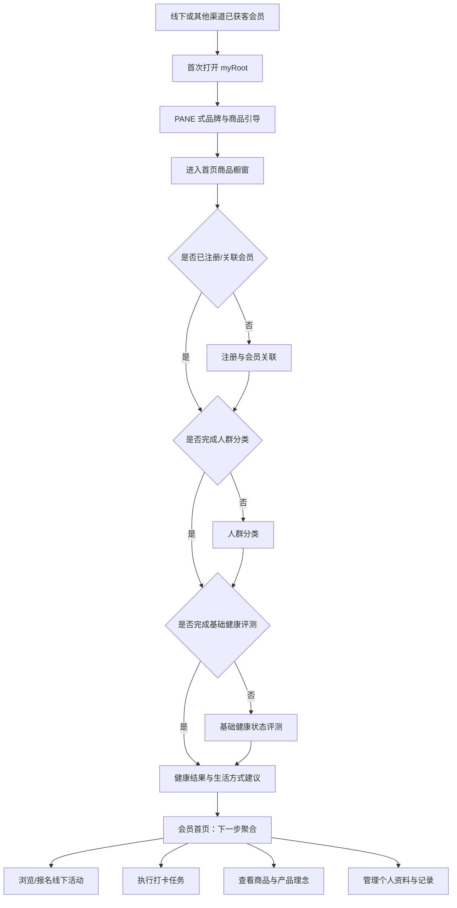

# myRoot 会员小程序产品定位与信息架构 v1

日期：2026-07-13

状态：产品方向决策稿

适用阶段：当前产品重构与下一轮页面设计

参考材料：`PANE小程序对Root的设计与流程参考_2026-07-13.md`、`design.md`、`myroot_miniprogram_page_design_v1.md`、`v0.3.0_product_requirements.md`

## 0. 本轮已确认的产品决策

1. myRoot 服务 Root 会员，不以公域获客为默认场景。
2. 默认用户来自线下或其他渠道，已经与 Root 建立订阅会员关系。
3. 当前版本优先展示 Root 产品理念与商品橱窗。
4. 用户完成注册后，先进行人群分类和健康状态评测，再获得相关生活方式推荐。
5. 日历属于后续能力，不进入当前版本的核心闭环。
6. 用户可以查看并参与线下活动。
7. 底部固定五个带文字标签的 Tab：`首页`、`健康`、`活动`、`任务`、`我的`。

这组决策覆盖此前材料中的两 Tab、四 Tab 建议；后续页面图、`design.md` 与 `app.json` 应以本决策为目标重新统一，但本文件本身不直接修改现有代码或发布版本。

## 1. 一句话定位

**myRoot 是面向已获客 Root 订阅会员的品牌体验与日常健康生活入口，连接产品理解、健康状态认知、生活方式行动、线下活动和会员任务。**

它不是一个面向陌生用户的公域商城，也不是单一的 7 天打卡工具；它承担的是会员进入 Root 之后的持续关系。

## 2. 产品角色

### 2.1 对会员

myRoot 帮助会员持续回答五个问题：

1. Root 相信什么、提供什么产品？
2. 我当前处于怎样的健康状态？
3. 我现在可以采取哪些生活方式行动？
4. 我可以参加哪些线上任务和线下活动？
5. 我的会员资料、记录、参与和奖励在哪里？

### 2.2 对 Root

myRoot 是会员关系的数字承载，不是一次性营销落地页。它负责：

- 统一呈现品牌理念和商品橱窗；
- 建立会员身份与人群分类；
- 承载健康状态评测、主题问卷和结果解释；
- 提供低风险、可执行的生活方式建议；
- 聚合线下活动、任务进度和奖励信息；
- 为后续日历、长期记录和会员运营保留连续数据。

### 2.3 与其他渠道的分工

| 渠道 | 主要职责 | myRoot 不重复承担的内容 |
| --- | --- | --- |
| 线下门店/活动 | 获客、体验、顾问沟通、服务交付 | 不要求 myRoot 再证明用户从哪里来 |
| 其他获客渠道 | 触达与引流 | 不把 myRoot 首页做成复杂渠道落地页集合 |
| Root 会员中心/交易渠道 | 下单、支付、订单与售后履约 | 当前 myRoot 以商品展示和跳转为主，不重建完整交易链路 |
| 企业微信顾问 | 解释、提醒、人工协助 | 不默认获取完整健康详情；需要用户明确选择 |
| myRoot | 品牌、健康、活动、任务、会员资料的统一入口 | 不承担医疗诊断和紧急医疗处置 |

## 3. 目标用户

### 3.1 默认用户

- 已在线下或其他渠道完成获客；
- 已是或准备关联为 Root 订阅会员；
- 对 Root 产品已有初步认知，但未必理解完整产品理念；
- 愿意了解自身健康状态，并接受非诊断性的生活方式建议；
- 可能参加线下活动、阶段任务或会员奖励计划。

### 3.2 次要用户

- 已收到小程序卡片但尚未完成会员关联的用户；
- 只想先了解品牌、商品或活动的用户；
- 暂不愿提交健康信息，但希望继续浏览公开内容或联系顾问的用户。

### 3.3 重要状态

| 状态 | 可见内容 | 当前唯一主行动 |
| --- | --- | --- |
| 未注册访客 | 品牌理念、商品橱窗、公开活动 | 注册成为/关联 Root 会员 |
| 已注册未分类 | 全部公开内容 | 完成人群分类 |
| 已分类未评测 | 已知人群信息 | 完成基础健康状态评测 |
| 已评测未查看建议 | 评测结果摘要 | 查看生活方式建议 |
| 活跃会员 | 个性化健康入口、活动和任务摘要 | 根据当天状态显示一个下一步 |
| 暂不授权健康信息 | 品牌、商品、活动、我的 | 继续浏览或查看授权说明 |

## 4. 非目标

当前阶段明确不做：

1. 不把 myRoot 做成公域投放和陌生用户转化商城。
2. 不在 myRoot 内重建完整支付、售后和供应链系统。
3. 不用健康评测结果进行疾病诊断、治疗建议或确定性体质判断。
4. 不把积分或奖励与“健康变好”、特定答案或敏感信息授权绑定。
5. 不在当前版本实现完整健康日历、自动干预计划或长期趋势预测。
6. 不在五个 Tab 中重复展示同一任务、活动或奖励记录。
7. 不让是否完成健康评测决定会员身份或公开内容的可用性。

## 5. 产品主链路

## 6. 首次进入与首页

### 6.1 新用户引导

参考 PANE 的信息结构，但不直接复制其服饰表达：

#### 第 1 屏：建立品牌身份

- 全屏 Root 品牌/产品影像；
- ROOT 标识；
- 主标题：`身体，自有其序`；
- 一句产品理念，不出现确定性功效；
- `继续` 与 `跳过`。

#### 第 2 屏：解释会员价值

- 说明 myRoot 能帮助会员了解产品、认识健康状态、参加活动和完成任务；
- 使用一张产品静物或真实生活方式影像；
- 主行动：`进入 myRoot`；
- 不在引导屏索取手机号或健康授权。

规则：

- 仅首次进入或重大品牌版本更新后出现；
- 回访用户直接进入首页；
- 引导屏允许跳过，跳过不影响浏览公开内容；
- 使用 Root 自有、已授权影像，不使用泛化库存照片。

### 6.2 首页定位

首页是“品牌理念与商品橱窗”的专属主页，不再沿用旧版的活动、任务和奖励状态总台。首页只允许出现一条轻量会员下一步，不拥有健康、活动或任务列表。

首页首版内容顺序：

1. **全屏商品大片/产品理念 Hero**：一屏一个主题，展示主推产品或产品理念。
2. **轻量会员下一步**：未注册、待分类、待评测或待查看建议时，只显示一条状态提示和一个行动，不展示任务列表。
3. **产品理念**：用简短图文解释 Root 的稳定、基础与平衡。
4. **商品橱窗**：少量精选商品卡片，进入简洁商品内页。
5. **品牌/顾问入口**：关于 ROOT、需要帮助。

全屏 Hero 可以参考 PANE 的杂志感，但必须满足：

- 图片上文字有足够对比度；
- 每屏最多一个主行动；
- 不自动快速轮播；
- 商品名称、用途与行动可读，不只呈现情绪影像；
- 已注册会员的轻量“下一步”在首屏内或一键可达，但不把首页重新变成健康/活动/任务控制台。

### 6.3 商品内页

参考 PANE 的“先商品、再理念、再依据、再规则”，保持简洁：

1. 商品主图、名称和一句核心描述；
2. 产品理念与适用场景；
3. 已核验的成分/使用信息和必要提示；
4. 生活方式中的使用方式；
5. 发货、售后或购买渠道说明；
6. `前往 Root 会员中心` 或既定交易渠道。

不把未核验的科研、认证、功效或用户个案写成产品结论。

## 7. 五个 Tab 的职责

### 7.1 首页

**用户问题：Root 是什么，我现在最应该做什么？**

拥有：

- 品牌与产品理念；
- 全屏商品大片；
- 精选商品橱窗；
- 会员状态与一条轻量下一步。

不拥有：

- 完整评测题库；
- 完整活动列表；
- 完整任务与奖励规则；
- 活动与任务进度摘要；
- 个人资料编辑。

### 7.2 健康

**用户问题：我当前处于什么状态，可以做什么？**

拥有：

- 人群分类；
- 基础健康状态评测；
- 当前可参与的主题健康问卷；
- 历史评测与结果；
- 生活方式建议；
- 后续日历入口。

健康页信息层级：

1. 当前健康状态摘要；
2. 继续/重新评测的主行动；
3. 当前可参与问卷；
4. 生活方式建议；
5. 历史记录；
6. 后续日历占位或版本说明。

表达护栏：

- 输出是健康状态记录、体验反馈、风险提示和生活方式建议，不是诊断；
- 评测名称、来源、适用人群、授权和计分规则必须可追溯；
- 问卷结果、图像信息和综合建议分层呈现，不混成确定性标签；
- 出现需要专业关注的回答时，优先展示明确求助路径，不继续推送普通生活方式建议；
- 具体量表和问卷题库待医学、版权与合规确认。

### 7.3 活动

**用户问题：近期有哪些线下活动适合我参加？**

拥有：

- 活动列表；
- 城市、时间、活动类型和报名状态；
- 活动详情；
- 报名/资格申请；
- 到场凭证或签到入口；
- 活动后的反馈入口。

首版列表至少区分：`可报名`、`已报名`、`已结束`。尚未确认活动数据源、报名方式或核销方式时，只设计状态和 Interface，不编造业务规则。

### 7.4 任务

**用户问题：我已经参与了什么，现在需要完成什么，能获得什么？**

拥有：

- 日常、阶段和活动关联任务；
- 打卡入口；
- 进度、截止时间和完成状态；
- 奖励条件、奖励记录和人工复核状态。

活动与任务的区别：

- 活动是用户可以选择参与的线下机会；
- 任务是用户已经加入某个计划或活动后需要完成的行动；
- 报名活动不等于完成任务；
- 活动参加事实可以通过内部 Seam 触发任务进度，但两个页面不能各自维护一份互相冲突的记录。
- 任务页展示本任务的奖励预期与处理状态；最终到账、到期和异议记录统一进入“我的—权益明细”。

### 7.5 我的

**用户问题：我的会员身份、资料和历史在哪里？**

拥有：

- Root 会员身份与订阅状态；
- 会员有效期与可用权益；
- 头像、昵称、联系方式等必要资料；
- 人群分类与健康评测记录入口；
- 活动报名记录；
- 任务和奖励记录入口；
- 商品/订单跳转；
- 顾问与人工协助；
- 隐私与健康信息授权管理；
- 协议、关于 ROOT、版本和退出登录。

“我的”只提供汇总和管理入口，不复制健康、活动、任务的主要操作页。

## 8. Module 与 Interface

### 8.1 Member Identity Module

Interface：

- 判断是否已注册；
- 判断是否已关联 Root 订阅会员；
- 提供最小会员身份、订阅状态和资料完整度；
- 明确会员关联失败、过期或待人工确认的错误模式。

### 8.2 Health Profile Module

Interface：

- 提供人群分类状态；
- 提供可参与的评测/问卷清单；
- 接收答案并返回可解释结果；
- 提供生活方式建议及其依据、适用范围和更新时间；
- 拒绝授权时不阻塞公开内容浏览。

### 8.3 Activity Module

Interface：

- 列出可见活动及报名状态；
- 提供活动详情、资格、时间地点和剩余名额；
- 执行报名、取消或签到时返回明确状态；
- 对有外部系统承接的动作说明跳转结果。

### 8.4 Task Module

Interface：

- 列出已加入的任务；
- 提供唯一进度、截止时间和下一步；
- 接收打卡、问卷、签到等事实；
- 计算或展示奖励状态；
- 与 Activity Module 通过内部 Seam 消费参与事实，不重复保存活动主数据。

### 8.5 Product Showcase Module

Interface：

- 返回首页 Hero、精选商品和商品详情所需内容；
- 标识内容来源、同步时间和上下架状态；
- 提供交易渠道跳转；
- 商品不可购买时仍能展示清楚原因和返回路径。

### 8.6 Home Next-step Module

Interface：

- 根据会员和健康旅程状态选择一个轻量下一步；
- 返回一条状态提示和一个行动，不返回活动列表、任务列表或奖励进度；
- 同一时刻只提供一个主行动；
- 删除该 Module 后，会员下一步判断会重新散落到首页和健康页，因此它应保持足够 Depth，为调用者提供 Leverage，并把变更集中到一处形成 Locality。

## 9. 注册、分类、评测与推荐

### 9.1 注册

注册只收集建立账号和关联会员所必需的信息。头像、昵称等展示资料可后补；健康信息不与普通注册混在同一表单。

建议顺序：

1. 微信身份进入；
2. 展示服务对象与会员说明；
3. 关联 Root 订阅会员，具体凭证机制待确认；
4. 注册成功；
5. 用户主动进入人群分类与健康评测；暂不进入不影响首页、商品、活动公开内容、会员资料或人工协助。

### 9.2 人群分类

人群分类用于决定后续评测和建议路径，不用于给用户贴诊断标签。首版只收集真正会改变后续问卷或建议的信息。

待确认：

- 分类维度；
- 是否允许一人属于多个类别；
- 分类来源是用户自述、会员资料还是人工确认；
- 分类变更规则和有效期。

### 9.3 健康状态评测

分为两层：

- 基础评测：完成注册后的主要健康入口；
- 主题问卷：用户按自身需求选择参与。

“注册后先评测”表示健康体验从分类和基础评测开始，不表示评测是进入小程序、确认会员权益或浏览公开内容的强制门槛。

当前不指定量表名称和题目。每份评测上线前必须明确来源、授权状态、适用人群、计分规则、解释范围和异常处置。

### 9.4 生活方式推荐

建议以“可以尝试的下一步”呈现，至少包含：

- 建议内容；
- 适用原因；
- 建议频率或持续时间；
- 不适用/停止条件；
- 来源或审核状态；
- 需要专业帮助时的明确提示。

禁止根据一次问卷直接输出疾病判断、保证性改善承诺或确定性健康标签。

### 9.5 后续日历

日历不是简单把建议放进日期格。后续进入日历前，需要先形成标准行动数据：

- 行动名称；
- 开始/结束时间；
- 频率；
- 是否可跳过；
- 完成方式；
- 提醒设置；
- 来源与适用范围；
- 用户暂停、调整和退出机制。

当前版本只保留结构兼容，不把空日历作为主入口。

## 10. PANE 参考的采用边界

| PANE 做法 | myRoot 决策 |
| --- | --- |
| 两屏品牌欢迎 | 采用，改为 Root 品牌身份 + 会员价值 |
| 全屏商品大片 | 采用到首页 Hero 与产品故事，不进入健康评测和任务表单 |
| 简洁商品详情 | 采用，增加健康产品必要的依据、适用范围和安全提示 |
| 五个底部图标 | 只借数量，不借纯图标表达；myRoot 使用五个带文字标签的 Tab |
| 注册送积分 | 不作为健康授权或评测的诱因 |
| 会员总台 | 采用到“我的”，但按会员、记录、协助、设置分组 |
| 订阅消息 | 在真实任务或活动提醒场景按需申请 |
| 企业微信顾问 | 作为人工协助 Adapter，不默认传递健康详情 |

## 11. 首版范围

### P0

1. 五 Tab 信息架构与稳定导航。
2. PANE 式两屏新用户引导。
3. 首页全屏品牌/商品 Hero 与精选商品橱窗。
4. 简洁商品详情与既定交易渠道跳转。
5. 注册与会员关联。
6. 人群分类。
7. 基础健康状态评测与结果解释。
8. 初版生活方式推荐。
9. 线下活动列表与详情。
10. 任务、打卡、进度和奖励信息。
11. 我的会员资料、记录入口、顾问与隐私管理。

### P1

1. 主题健康问卷库。
2. 活动报名、签到和活动后反馈闭环。
3. 订阅提醒的场景化申请。
4. 评测与建议历史对比。
5. 首页内容运营与 Hero 配置。

### P2

1. 生活方式日历。
2. 长期趋势与阶段复评。
3. 更细的会员权益编排。
4. 线下活动与任务的自动关联。

## 12. 核心指标

| 目标 | 主指标 | 护栏指标 |
| --- | --- | --- |
| 品牌与商品理解 | Hero 进入商品详情率、商品详情有效阅读率 | 首屏退出率、误触率 |
| 会员关联 | 注册完成率、会员关联成功率 | 重复账号率、人工复核率 |
| 健康旅程 | 分类完成率、基础评测完成率、建议查看率 | 中途退出、敏感授权拒绝后的可用率 |
| 活动参与 | 活动详情查看率、报名率、到场率 | 取消率、报名信息错误率 |
| 任务参与 | 任务开始率、完成率、奖励查看率 | 虚假/重复打卡、奖励争议率 |
| 长期会员关系 | 30 日回访率、健康页复访率 | 提醒关闭率、顾问打扰反馈 |

## 13. 待确认清单

1. Root 订阅会员的权威身份来源及关联方式。
2. 当前版本是否允许非会员注册，还是只允许浏览后联系顾问。
3. 商品橱窗的数据来源、交易跳转与上下架同步方式。
4. 人群分类维度和分类变更规则。
5. 基础评测及主题问卷的医学、版权和合规清单。
6. 生活方式建议的内容负责人、审核机制和版本管理。
7. 线下活动的数据来源、报名、取消、签到和名额规则。
8. 任务与奖励的首批类型、有效期和人工复核规则。
9. “我的”是否展示订单与订阅续费状态。
10. 首页全屏 Hero 的首批产品、图像资产和运营更新频率。

## 14. 对抗式审查

### 风险 1：五个 Tab 都想成为首页

健康、活动和任务都在首页展示完整内容，会让首页再次变成杂乱控制台。

修正：首页专职承载品牌与商品，只通过 Home Next-step Module 显示一条轻量会员下一步，不调用活动列表、任务列表或奖励进度。

### 风险 2：产品大片压住会员下一步

如果每次进入都先看长篇品牌影像，已注册会员会认为产品只想卖货。

修正：首次引导沉浸，回访首页可保留全屏 Hero，但会员下一步必须在首屏可见或一键可达；用数据验证 Hero 是否造成任务流失。

### 风险 3：分类、评测和推荐看似一体，实际证据不同

用户自述分类、量表结果和生活方式建议可能被合并成一个确定性“健康结论”。

修正：三层分别标识来源、时间和置信范围；结果页明确非诊断属性。

### 风险 4：活动与任务重复记账

同一场线下活动可能同时出现在活动报名、任务签到和奖励结算中，形成三份状态。

修正：Activity Module 拥有活动与报名事实，Task Module 通过内部 Seam 消费事实并计算任务进度，奖励只引用任务结算结果。

### 风险 5：面向已获客会员却要求重新证明身份

如果用户在线下已经注册，到小程序后仍要重复输入大量资料，会员体验会断裂。

修正：先匹配既有会员身份，只补缺失且确有用途的信息；无法匹配时进入人工协助，而不是让用户反复注册。

## 15. 最终产品判断

PANE 的核心是“品牌驱动的会员零售关系”；myRoot 的目标应是“品牌驱动、健康理解承接、活动与行动持续发生的 Root 会员关系”。

首页负责建立品牌与产品认知，健康负责认识自己，活动负责发现线下机会，任务负责把参与变成行动和奖励，我的负责沉淀身份与历史。五个 Tab 只有在这五种职责不互相复制时才有价值。
