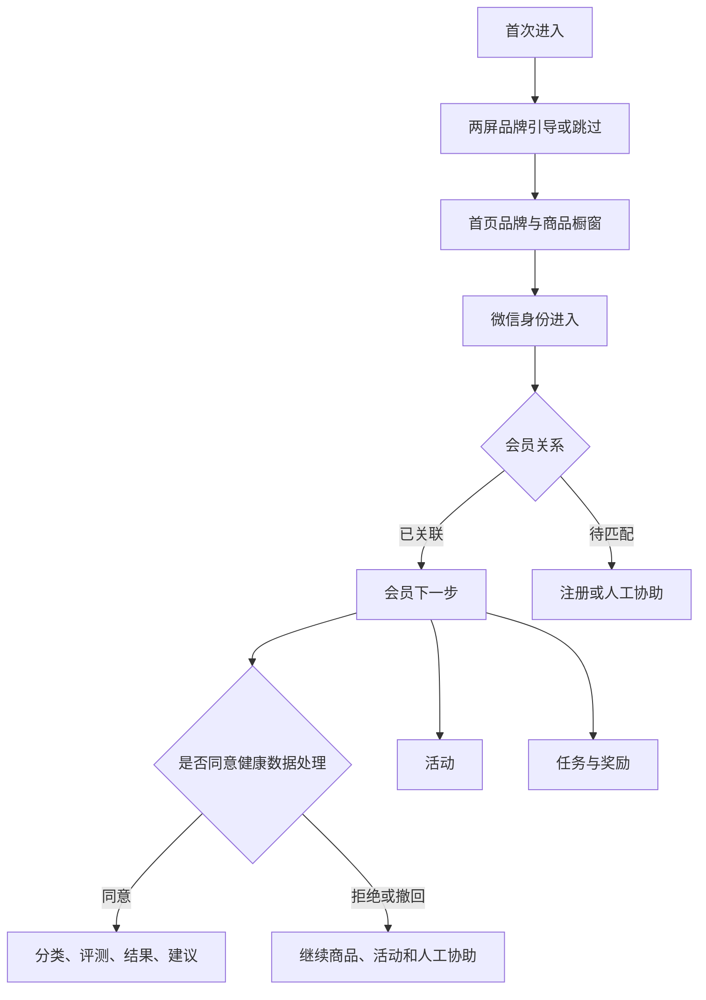

# 产品与 UED 基线

## 1. 产品定位

myRoot 是 Root 会员的持续关系入口，不是泛流量电商，也不是医疗诊断工具。

- 默认用户：线下、企微、有赞或其他渠道已经获客的 Root 会员。
- 当前核心：表达 Root 产品理念、展示商品、完成微信身份与会员关系建立。
- 关系深化：在独立同意后完成人群分类与健康状态评测，再提供非诊断性生活方式建议。
- 参与场景：线下活动、打卡任务、问卷、奖励与人工协助。
- 长期方向：健康历史、复评和日历，但日历不是本次重构第一阶段目标。

## 2. 五 Tab 的唯一职责

| Tab | 唯一职责 | 首屏不可承担的职责 |
| --- | --- | --- |
| 首页 | 品牌、商品橱窗、会员当前唯一下一步 | 完整任务列表、完整健康报告、后台状态总台 |
| 健康 | 健康起点、同意、分类、评测、结果与建议 | 诊断、疗效承诺、强制会员门槛 |
| 活动 | 线下活动列表、详情、报名状态 | 在设计稿内写死真实活动内容 |
| 任务 | 打卡、问卷、提醒和奖励进度 | 复制活动与奖励权威事实 |
| 我的 | 会员信息、权益、隐私、支持和历史入口 | 再做一个功能首页 |

## 3. 核心旅程

关键原则：会员关联、健康同意、健康资格、活动资格、任务完成和奖励结算是正交事实，不得恢复为一个不断扩张的 `user.state`。

## 4. 视觉与内容方向

- 气质：克制、冷静、科学、自然生长；`温和但坚定的身体秩序品牌`。
- 核心语言：`身体，自有其序`、`让科学成为陪伴，让健康变成习惯`、`真实记录，不追求完美答案`。
- 首页参考 PANE 的结构方法：全屏品牌影像、少量文字、明确跳过/进入路径、简洁商品详情。
- 不复制 PANE 的图片、字体资产和品牌表达；只借鉴“品牌先行、单屏单意图、商品大片、低噪声信息结构”。
- 实际活动内容由运营后台上传；UED 只展示字段完整的占位内容和各种状态。

## 5. CURRENT UED 覆盖

仓库证据：`docs/evidence/v1.0.0/ardot_current_screen_index_readonly_2026-07-18.json`。

已观察到的 CURRENT 页面族：

1. Foundation & Core：引导、Guest 首页、会员首页、健康壳、活动列表、任务中心、我的。
2. Flows & Assets：摄影选择、品牌故事、商品详情、会员关联、活动详情、健康同意、全局恢复。
3. P0 Core：商品列表、登录注册、关联成功、任务详情、打卡、问卷、奖励、隐私与数据权利。
4. Conditional P0：健康分类/评测/问卷/结果/建议/历史/安全阻断，活动报名/取消/结果/状态矩阵，提醒和恢复状态。
5. Interaction Registry：成功、失败、结果未知、返回路径和平台隐私交互登记。

证据只证明 2026-07-18 时页面名称与顶层结构可读，不证明：

- 像素级视觉通过；
- 每屏交互和路由完整；
- 动态数据字段已接后端；
- 320–430px 真机适配；
- 无障碍、性能或内容审核通过；
- 工程 Implementation 与设计一致；
- 具名签署完成。

## 6. 设计效力裁决

| 材料 | 使用方式 |
| --- | --- |
| `docs/design.md` | 当前设计单一来源 |
| `docs/v1.0.0_product_requirements.md` | 需求、状态、验收和 Gate 单一来源 |
| Ardot CURRENT 页面与索引 | 逐屏结构参考，需重新导出或重新连接 Ardot 才能研发交付 |
| `myroot_miniprogram_page_design_v1.md` | 四 Tab 历史方案，仅供追溯 |
| `root_brand_ui_design_breakdown.md` | 旧 7 日打卡品牌化拆单，仅供迁移参考 |
| PANE 截图 | 信息结构研究，禁止进入发布资产 |
| 《我们是 ROOT》PDF | 品牌输入，图片发布仍需 clean master 和授权 |

## 7. 重构前必须关闭的设计问题

1. 从 Ardot CURRENT 重新导出全量屏幕、状态和 Interaction Registry，生成可开发的只读包。
2. 为五 Tab 补齐统一图标、选中态和微信胶囊/安全区适配。
3. 确认首页 Guest、已关联会员、待人工匹配、加载失败四个 Variant。
4. 明确商品内容字段、图片裁切、下架和跳转失败状态。
5. 健康全链路在内容、隐私和安全审查完成前保持功能开关关闭。
6. 活动稿只使用占位内容；真实内容、场次、名额和报名规则来自运营后台。
7. 建立设计 Token 到 WXSS 变量/类名的映射，避免每页复制样式。

