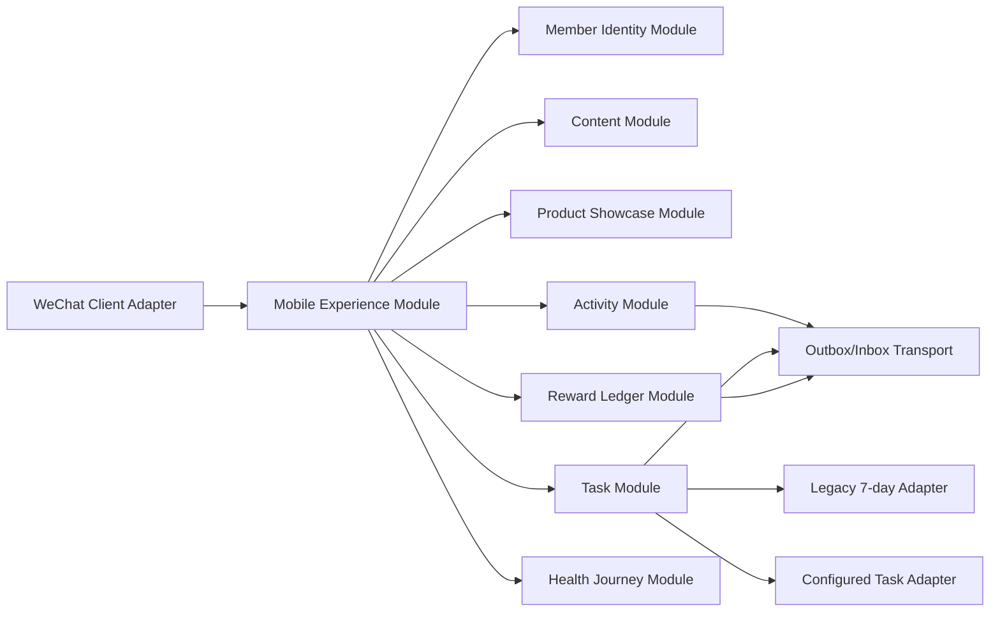

# 目标架构与性能方案

## 1. 第一性原理

重构要解决的不是“换框架”，而是三件事：

1. 用户点击后立即知道系统正在做什么。
2. 首页只学习一个稳定 Interface，即可获得品牌内容和唯一下一步。
3. 身份、健康、活动、任务、奖励与旧 7 日计划继续各自拥有权威事实，不因改 UI 而重写业务正确性。

第一阶段建议继续使用微信原生小程序。先建立深 Module、请求聚合、缓存和设计系统，再根据真实性能数据判断是否需要跨端框架。

## 2. 前端目标 Module

| Module | Interface | Implementation 责任 |
| --- | --- | --- |
| App Shell Module | Tab、导航、安全区、全局加载与错误 | 微信胶囊适配、五 Tab、页面容器 |
| Design System Module | Token、排版、按钮、卡片、状态、影像容器 | 全局 WXSS、可复用 WXML Module、主题资产 |
| Session Module | `restore / login / logout / status` | token、微信登录、超时、重试、身份恢复 |
| Home Experience Module | `loadHome / refreshSection / executePrimaryAction` | 品牌内容、商品摘要、唯一下一步和局部降级 |
| Product Showcase Module | `list / detail / jumpToPurchase` | 商品快照、下架、跳转结果 |
| Health Journey Module | `eligibility / consent / classify / assess / result / history` | 健康纵向流程；内容 Gate 关闭时只暴露可用壳 |
| Activity Module | `list / detail / enroll / cancel / recover` | 运营内容、场次和报名状态 |
| Task Module | `list / detail / submit / recover` | 新任务与旧 7 日计划 Adapter |
| Reward Ledger Module | `list / detail` | 奖励只读事实与状态解释 |
| Profile Module | `summary / rights / support` | 会员卡、隐私权利和支持入口 |
| Telemetry Module | `mark / measure / correlate` | 不含健康答案的性能与产品事件 |

外部 Seam 只在确实存在两个 Adapter 时建立。例如 Task Module 同时有“v1 配置任务 Adapter”和“legacy 7 日计划 Adapter”，这是现实 Seam；不要为单一实现创建假抽象。

## 3. 首页 Interface

前端首页不应直接编排 profile、campaign、task、product、reward 多个请求。建议增加面向移动端的深查询 Module：

```text
GET /api/v1/home

response:
  viewer
  membership
  hero
  primaryAction
  productHighlights[]
  activityHighlights[]
  taskSummary
  rewardSummary
  sectionErrors[]
  cache
```

规则：

- `primaryAction` 由后端 Home Next-step Module 投影，客户端不复制状态优先级。
- 非关键区块失败进入 `sectionErrors`，不能阻断品牌 Hero 和主 CTA。
- 响应支持 ETag/版本号；客户端可先展示最近一次非敏感快照，再后台刷新。
- 健康答案、手机号、openid、unionid、token 不进入首页缓存或普通埋点。

## 4. 请求与渲染策略

### 4.1 启动阶段

1. 立即渲染静态品牌骨架和本地 logo，不等待网络。
2. 100ms 内显示可见反馈；登录按钮立即进入阶段状态。
3. Session Module 恢复身份与 Home Module 请求可在安全前提下并行或使用后端聚合。
4. 商品/活动图片延迟加载，首屏仅加载 Hero 必需尺寸。
5. 页面离开时取消非必要请求；相同 key 的并发请求合并。

### 4.2 缓存

- 可缓存：品牌内容、商品摘要、活动列表壳、非敏感任务摘要、Design Token 版本。
- 不缓存或加密短存：token、会员映射、健康同意、健康结果、报名/任务写结果。
- stale-while-revalidate 只用于读模型；写动作必须查询权威结果恢复。

### 4.3 图片

- 原始摄影保存在内容/CDN，不进入小程序主包。
- 每张图提供 Hero、卡片、缩略图三档裁切和宽度；默认压缩质量由真机视觉验收确定。
- 首屏 Hero 必须有尺寸占位、主色背景和失败替代，不允许白屏等待。
- 设计与运营后台共同维护 focal point，避免移动裁切切掉主体。

## 5. 后端目标 Module 与 Seam



重构建议：

- 将 `app.js` 缩为路由注册与跨 Module 装配，不保留领域 Implementation。
- 每个 Module 只有一个外部 Interface；输入校验、鉴权要求、错误模式和幂等约束都属于 Interface。
- Presenter 在所属 Module 内输出前端读模型，避免客户端拼装数据库字段。
- MySQL Adapter、内存测试 Adapter、外部平台 Adapter 继续位于明确 Seam。
- 写动作保持命令身份、请求身份、Outbox/Inbox 和结果查询，不以“前端重试”替代可靠性。

## 6. 性能预算

以下是重构验收目标，不是当前实测结果：

| 指标 | 目标 |
| --- | --- |
| 点击到视觉反馈 | P95 ≤ 100ms |
| 冷启动到品牌骨架 | P95 ≤ 800ms |
| 冷启动到首页可操作 | P95 ≤ 2.5s（常规 4G/Wi-Fi） |
| 热启动到首页可操作 | P95 ≤ 1.2s |
| 登录请求到明确结果 | P95 ≤ 5s；超过 1s 展示阶段状态 |
| 首页关键请求数 | 首屏 ≤ 2 个业务请求 |
| 首页非关键区块失败 | 不阻断 Hero 与主 CTA |
| Cloud Container 超时 | 关键读 8–10s；非关键读更短并可降级；写按幂等合同配置 |
| 主包 | 设 700 KB 预警线；每次 CI 输出差异 |
| 图片 | 首屏按设备宽度加载，不下载 PDF/原始 PNG |

## 7. 可观测性 Interface

每个关键旅程记录同一 correlation id：

```text
app_launch
shell_visible
session_restore_start/result
home_request_start/result
primary_action_visible
login_click
login_stage_change
login_result
home_interactive
```

事件只包含时间、环境、版本、匿名会话、阶段、错误类别和请求关联，不包含健康答案、手机号、微信身份原值或凭据。

## 8. 迁移顺序

1. 建性能基线和截图回归，不改行为。
2. 建 Design System Module 与五 Tab App Shell。
3. 建 Session Module，保留现有登录正确性。
4. 建 Home Experience Interface 和后端聚合读模型。
5. 逐页迁移商品、活动、任务、我的。
6. 健康内容与隐私 Gate 关闭后再迁移健康纵向流程。
7. 通过 Legacy Adapter 保留 7 日计划；观察稳定后再退役旧页面分支。
8. 完成灰度、性能和业务回归后才移除旧 Implementation。

