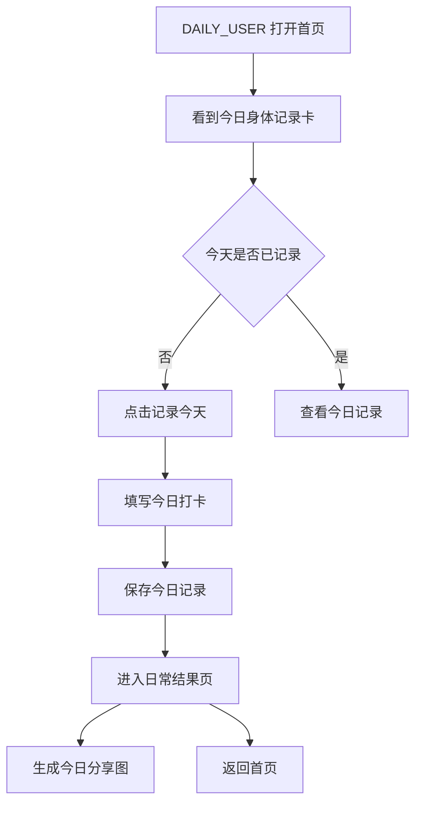
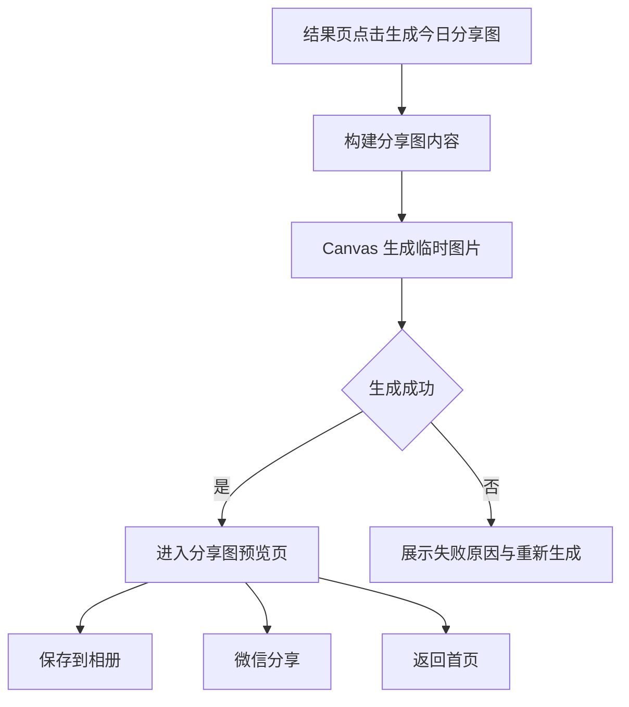

# ROOT 打卡小程序 V0.3.0 UI/UX 设计方案

版本：V0.1
日期：2026-05-24
对应 PRD：[v0.3.0_product_requirements.md](./v0.3.0_product_requirements.md)
设计依据：ROOT V0.2.0 品牌界面、微信小程序设计规范、`ui-ux-pro-max` 可用性规则
范围：设计方案与交互规则，不进入开发拆单

## 1. 设计目标

V0.3.0 的设计目标不是再做一轮“更好看”，而是把用户阶段从“7 天试饮任务”清楚切换到“长期日常身体记录”。

设计判断：

- 7 天仍是试饮权益与退款规则，不是完成后的全局身份。
- 日常记录的主体验要更轻、更稳定、更像个人习惯。
- 分享图是用户的个人记录素材，不是广告海报。
- 日期表达要符合中文阅读习惯，但不影响内部日期存储。
- 身体反馈画像要服务顾问沟通和用户自我理解，不展示无关字段。

## 2. 设计原则

### 2.1 微信规范护栏

- 页面只保留一个主任务，主按钮不与复购、免单、客服入口抢层级。
- 触控目标不小于 `88rpx`，按钮和可点击卡片之间保持足够间距。
- 底部固定行动区必须避开安全区，不遮挡主内容。
- 所有异步动作提供加载、成功、失败反馈。
- 页面返回路径明确，结果页和分享图预览页都能回首页。

参考：

- 微信小程序设计指南：https://developers.weixin.qq.com/miniprogram/design/index.html
- WeUI 小程序样式库：https://wechat-miniprogram.github.io/weui/docs/

### 2.2 ROOT 品牌原则

- 继续使用暖白底、墨黑主文字、苔绿强调、新芽绿轻提示、陶土色提醒。
- 文案保持“身体秩序、真实记录、温和陪伴”的语气。
- 不用医疗诊断式结论，不暗示确定功效。
- 分享图留白更多，避免变成促销广告。

### 2.3 阶段感知原则

同一个页面需要根据用户阶段切换表达：

| 阶段 | 页面气质 | 主表达 | 允许出现 7 天 |
| --- | --- | --- | --- |
| 试饮中 | 任务明确、进度可见 | 第 N 天身体记录 | 是 |
| 试饮完成 | 收尾确认、权益处理 | 试饮记录已完成 | 局部 |
| 日常记录 | 轻量习惯、长期陪伴 | 今日身体记录 | 否 |

## 3. 全局设计 Token

沿用 V0.2.0 已建立的 ROOT token，不新增大面积新色。

| Token | 用途 | 设计要求 |
| --- | --- | --- |
| `--color-root-ink` | 主按钮、标题、分享图主字 | 保持最高对比 |
| `--color-root-bg` | 页面背景、分享图背景 | 日常记录页继续使用 |
| `--color-root-surface` | 表单、列表、预览卡 | 所有输入区域默认白底 |
| `--color-root-moss` | 选中态、统计强调 | 不用于大段正文 |
| `--color-root-sprout` | 深色卡片辅助点缀 | 只作轻强调 |
| `--color-root-clay` | 权益、提醒、失败辅助 | 不替代错误文字 |
| `--color-root-line` | 分隔线、卡片边框 | 保持低存在感 |
| `--color-root-muted` | 次级文案 | 不能承载主信息 |

新增建议 token：

| Token | 建议值 | 用途 |
| --- | --- | --- |
| `--color-root-daily-bg` | `#FAF7EF` | 日常记录页背景，可与主背景一致 |
| `--color-root-poster-paper` | `#F8F3E8` | 分享图纸张底色 |
| `--color-root-success-soft` | `#EEF3DE` | 成功摘要轻底 |

## 4. 信息架构调整

### 4.1 首页

试饮中首页：

- 顶部深色状态卡。
- 展示“第 N 天 / 7”“N/7 进度”。
- 主按钮：`开始今日打卡` / `查看今日记录`。
- 今日观察卡保留服用、排便、人工协助三项。

日常首页：

- 顶部改为浅色日常状态卡。
- 主标题：`今日身体记录`。
- 副文案：`继续记录服用、排便与真实感受。身体的变化，值得被慢慢看见。`
- 三个统计：`累计记录`、`当前连续`、`最长连续`。
- 主按钮：`记录今天` / `查看今日记录`。
- 次级入口：记录历史、复购、免单状态。
- 不出现 `N/7`、`Day N / 7`、`7 天数据总结`。

完成态首页：

- 若 Day8 未完成，主卡标题：`还差一步收尾反馈`。
- 主按钮：`填写收尾问卷`。
- 若 Day8 已完成，主卡标题：`试饮记录已完成`。
- 主按钮：`继续日常记录`。
- 免单状态作为次级卡片展示，不作为页面唯一主任务。

### 4.2 今日打卡页

页面结构：

1. 顶部阶段卡。
2. 必填问题区。
3. 便型选择区，按条件展开。
4. 身体感受区。
5. 图片上传次级入口。
6. 底部固定保存按钮。

试饮中顶部：

- 小字：`第 N 天`
- 标题：`今天，和身体对一次话`
- 文案：`按真实情况记录即可，不需要写得完美。`

日常顶部：

- 小字：`今日记录`
- 标题：`今天，和身体对一次话`
- 文案：`继续记录身体反馈，让变化慢慢被看见。`

必填问题设计：

- 问题 1：`今日是否服用 ROOT`
  - 选项：`已服用` / `未服用`
  - 辅助文案：`若今天未服用，也可以继续记录身体感受。`
- 问题 2：`昨日是否排便`
  - 选项：`有` / `没有`
  - 选择“有”后展开便型。
- 问题 3：`昨日便型`
  - 展示为纵向列表或紧凑卡片列表。
  - 每项包含便型名称和短说明。
  - 被选中项同时有文字和视觉标识，不只依赖颜色。

身体感受区：

- 标题：`今天身体有什么变化？`
- 输入提示：`例如：腹胀减少、睡得更稳、暂时没有明显变化`
- 快捷短句建议作为可选 chips：
  - `暂无明显变化`
  - `腹部感觉有变化`
  - `排便节律有变化`
  - `整体状态有变化`
- 点击快捷短句后填入输入框，用户仍可编辑。

底部行动：

- 主按钮：`保存今日记录`
- 禁用态下显示缺失提示：
  - 未选服用：`请选择今日是否服用`
  - 未选排便：`请选择昨日是否排便`
  - 有排便但未选便型：`请选择昨日便型`

### 4.3 打卡结果页

试饮期结果页：

- 标题：`秩序已记录`
- 说明：`你已经完成 N/7 天记录。真实反馈会成为下一步建议的依据。`
- 主按钮：`生成今日分享图`
- 次按钮：`查看试饮进度`
- 若满足 Day4/Day8 问卷条件，问卷入口优先于分享图。
- 若 Day6 复购礼触发，使用轻提示，不抢主按钮。

日常结果页：

- 标题：`今天已记录`
- 说明：`真实反馈已保存。你可以生成一张今日分享图，也可以回到首页。`
- 摘要卡：
  - `服用：已服用 / 未服用`
  - `排便：有 / 没有`
  - `便型：第四型...`，仅在用户选择“有排便”时展示。
  - `感受：用户填写内容`
- 统计条：
  - `累计记录 N 天`
  - `当前连续 N 天`
- 主按钮：`生成今日分享图`
- 次按钮：`返回首页`

失败或人工协助结果页：

- 不展示分享图主入口。
- 主任务改为：`联系 ROOT 顾问` 或 `返回首页`。
- 说明当前需要人工确认，不制造“失败感”。

### 4.4 分享图生成与预览

分享图定位：

- “我今天完成了身体记录”的个人分享素材。
- 不做功效证明，不做促销海报。

分享图比例：

- 默认：`1080 x 1440`，3:4 竖版。
- 小程序页面预览按等比例缩放显示，不裁切。

分享图布局：

1. 顶部品牌区：
   - ROOT 横版 logo。
   - 日期：`5月26日`，非对应年份展示完整年份。
2. 主标题区：
   - 试饮期：`第 N 天，身体记录已完成`
   - 日常期：`今天，身体记录已完成`
3. 摘要区：
   - `服用 ROOT：已服用 / 未服用`
   - `昨日排便：有 / 没有`
   - `便型：第四型，光滑柔软的腊肠状`，仅在用户选择“有排便”时展示。
4. 感受摘录：
   - 最多 40 字。
   - 空内容时展示：`今天也完成了一次真实记录。`
5. 坚持区：
   - 试饮期：`已完成 N 天试饮记录`
   - 日常期：`累计记录 N 天 · 当前连续 N 天`
6. 尾句：
   - `身体自有其序，记录会让它被看见。`

分享图预览页：

- 顶部标题：`今日分享图`
- 中间展示生成图片预览。
- 底部固定行动：
  - 主按钮：`保存到相册`
  - 次按钮：`微信发送/分享`
  - 文本入口：`返回首页`
- 朋友圈与小红书提示：`保存图片后，可自行发布到朋友圈或小红书。`

权限与失败态：

- 未授权相册：展示解释弹窗，引导开启权限。
- 图片生成失败：展示 `重新生成`。
- 微信图片分享能力不可用：保留保存相册，不阻断主路径。
- 不承诺自动发布朋友圈或小红书，分享图的可靠主路径始终是保存到相册。

### 4.5 记录历史

菜单命名：

- 我的页入口从 `7 天记录` 改为 `记录历史`。

历史列表结构：

- 顶部按阶段分组：
  - `试饮记录`
  - `日常记录`
- 日期统一显示中文格式。
- 列表项标题：
  - 试饮期：`第 N 天 · 5月26日`
  - 日常期：`今日记录 · 5月26日`
- 详情页可展示 `生成这天的分享图`，作为 P2 能力。

### 4.6 身体反馈画像

页面目标：

- 让用户和顾问快速看到用户提交的三类核心信息。
- 去掉日常便型，避免画像页变成排便报告。

信息结构：

1. 顶部卡：
   - 标题：`身体反馈画像`
   - 说明：`这些信息来自你的入组选择，用于后续记录和顾问沟通。`
2. 三个内容区：
   - `参与原因`
   - `肠道状态`
   - `改善方式`

展示规则：

- 展示中文选项文案，不展示枚举值。
- 多选项用顿号分隔。
- 空值展示 `暂未填写`。
- 不展示 `日常便型`。

## 5. 关键流程

### 5.1 日常打卡流程

### 5.2 分享图流程

## 6. 可访问性与体验规则

- 所有主按钮高度不低于 `88rpx`。
- 选项卡、chips、便型项都必须有文字标签。
- 选中态不只依赖颜色，需要增加 `已选择`、勾选或边框变化。
- 表单错误提示靠近按钮或对应问题区。
- 分享图预览不能只依赖长按手势，必须有明确按钮。
- 图片保存、微信分享、提交打卡都必须有 loading 状态。
- 页面底部保留 `env(safe-area-inset-bottom)` 或等效安全区。

## 7. 空态与异常态

| 场景 | 设计处理 |
| --- | --- |
| 今日已记录 | 主按钮改为 `查看今日记录` |
| 分享图生成失败 | 展示失败卡 + `重新生成` |
| 相册权限未开 | 弹窗说明用途 + 打开设置 |
| 没有画像数据 | 展示 `暂未完成画像问卷` + 返回首页 |
| 日常统计为空 | 显示 `从今天开始记录`，不显示 0 值压迫感 |
| 未服用 ROOT | 允许记录，结果页如实展示 `未服用` |

## 8. 页面级验收

### 首页

- `CHECKIN_ACTIVE` 仍显示试饮进度。
- `DAILY_USER` 不显示 `N/7` 和 `7 天数据总结`。
- 主按钮文案随今日记录状态变化。

### 今日打卡页

- 日常态标题不出现“第 N 天”。
- 未满足必填时，保存按钮禁用且有缺失提示。
- 选择“有排便”后才要求便型。

### 结果页

- 提交成功后进入结果页，而不是 toast 后直接返回。
- 分享图入口是主按钮。
- 人工协助态不展示分享图主入口。

### 分享图

- 日期为中文格式。
- 默认不展示手机号、订单号、地址。
- 反馈内容最多展示 40 字。
- 保存失败可恢复。

### 身体反馈画像

- 只展示参与原因、肠道状态、改善方式。
- 不出现日常便型。
- 展示中文选项文案。

## 9. 设计输出清单

需要进入开发拆单的界面：

1. 日常首页状态卡。
2. 今日打卡页阶段化表单。
3. 日常打卡结果页。
4. 分享图预览页。
5. 分享图图片模板。
6. 记录历史分组与日期格式。
7. 身体反馈画像三字段页面。

暂不进入本轮：

1. 分享图模板多风格切换。
2. 小红书自动发布。
3. 分享后传播链路归因。
4. 顾问端画像增强。
