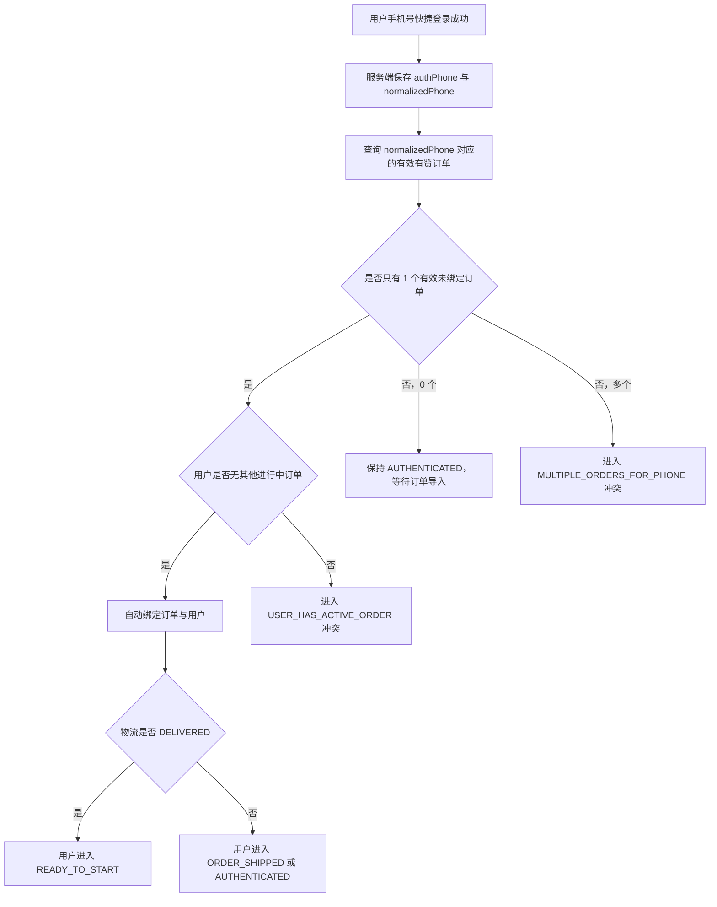
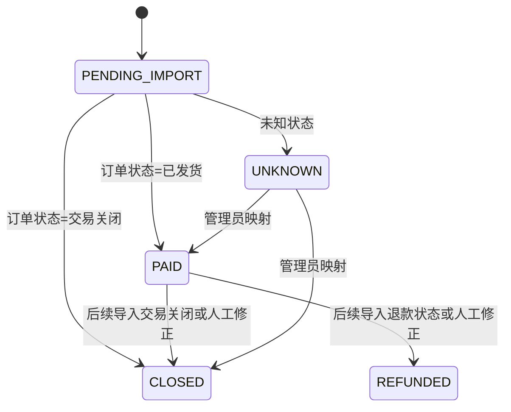
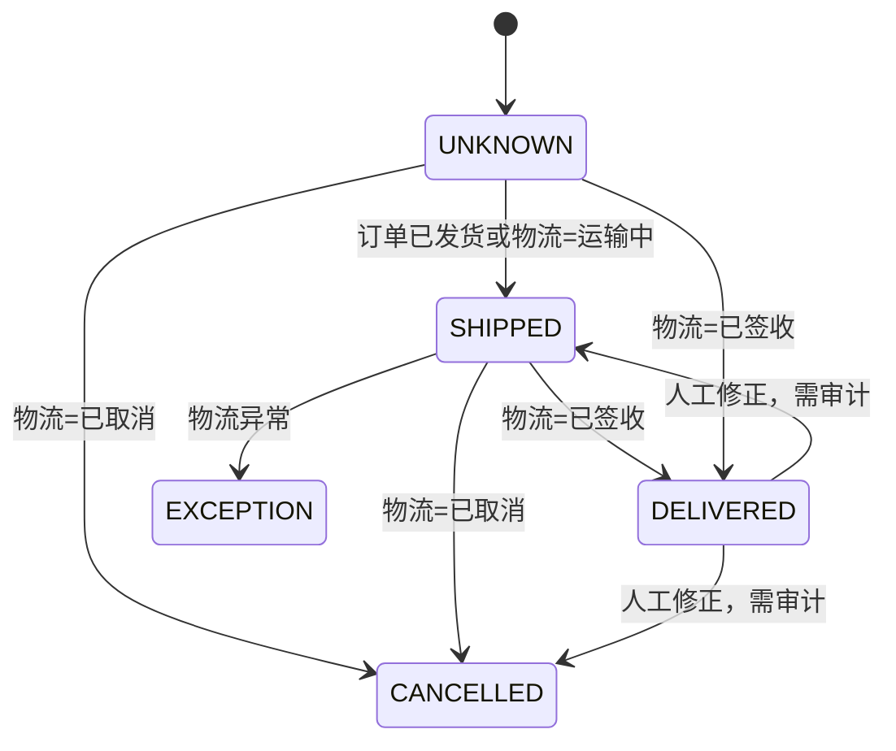
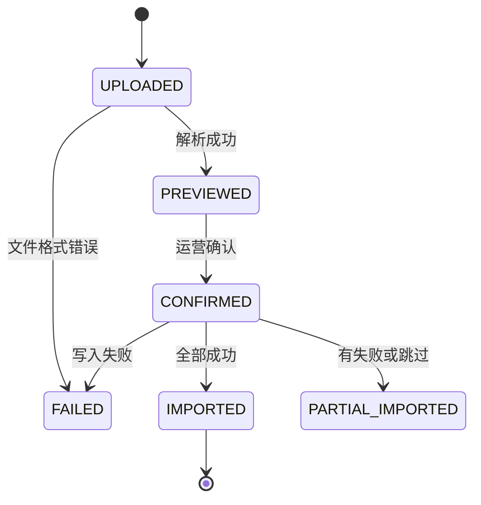

# ROOT V0.4.0 运营数据稳定化 PRD 与状态流转规则

版本：V0.2
日期：2026-05-28
状态：V0.4.0 开发完成，已通过回归
范围：后台运营工作台、订单与物流 CSV 导入、用户匹配、手动修正、MySQL 持久化、登录 session 稳定性

## 0. P0 修订记录

本版吸收 [v0.4.0_operational_data_design_review.md](./v0.4.0_operational_data_design_review.md) 的 P0 评审结论，完成以下修订：

1. 后台最低访问保护从 P2 前置到 P0。
2. MySQL 补充迁移、校验、回滚策略。
3. session 补充标准错误响应和小程序处理契约。
4. 补充微信授权手机号与有赞订单手机号的自动匹配设计。
5. 自动匹配规则收紧：同手机号多有效订单一律进入冲突队列。
6. 最小手动修正闭环前置到 P0。
7. CSV 导入补充批次锁定、内容 hash 和确认幂等。
8. 订单状态和物流状态补充来源优先级。
9. raw payload、手机号、地址等敏感信息补充展示约束。

## 1. Harness

目标：把 ROOT 小程序从“可发布、可试用”的状态推进到“普通用户可持续使用、运营每天可处理订单和物流、后台数据不会丢”的状态。

本轮产物：

- V0.4.0 产品需求设计。
- 订单、物流、用户、打卡资格的状态流转规则。
- P0、P1、P2 需求优先级。
- 后续 UI/UX 设计、设计评审和开发拆单输入。

验收标准：

- 小程序登录态可稳定保持，云托管重启后用户仍能继续使用。
- 后台数据使用持久化存储，不再因为容器重启或扩缩容清零。
- 运营人员可以每天上传有赞订单 CSV 和物流状态 CSV。
- 系统可以按订单号和手机号把订单、物流状态、用户打卡资格关联起来。
- 冲突、异常、手动修正都有清楚的待办和审计记录。
- 后台线上访问有最低保护，未授权访问不能查看用户、订单和 raw payload。

误判风险：

- 只做 CSV 导入按钮，但不解决 MySQL 和 session，导致数据继续丢失。
- 只按手机号自动绑定，不处理同手机号多订单、订单关闭、物流取消等冲突。
- 把物流状态直接等同于打卡资格，忽略订单状态和人工修正。
- 手动修正不留审计，后续免单、售后和用户争议无法追溯。
- 把后台多角色权限放到 P2 后误以为 V0.4.0 可以没有任何后台访问保护。

## 2. 背景

V0.3.x 已完成小程序品牌化、登录审核修复、昵称头像授权、分享与前端样式多轮修复。当前阻塞普通用户规模化使用的问题集中在运营数据链路：

1. 云托管运行时存在数据清零风险，当前线上日志显示使用 SQLite 文件，且部署文档曾配置 `/tmp/root-checkin.sqlite`，该路径不适合作为生产持久化存储。
2. 用户登录 token 与 session 映射依赖后端存储，一旦后端数据丢失，小程序本地 token 仍在，但服务端无法识别，表现为登录态无法保持。
3. 订单与物流目前主要来自有赞导出的 CSV，运营需要每天手动上传。
4. 真实订单 CSV 和物流 CSV 已提供，当前字段足够支撑订单导入、物流状态更新和手机号匹配。
5. 后台已有订单匹配、真实样本导入和部分物流更新能力，但还没有形成面向运营人员的每日工作流。

## 3. 当前真实 CSV 事实

### 3.1 有赞订单 CSV

文件来源：有赞订单导出。

当前样本规模：48 条。

关键字段：

| CSV 字段 | 用途 |
| --- | --- |
| `订单号` | 订单唯一识别 |
| `订单状态` | 判断订单是否有效 |
| `收货人/提货人` | 收货人姓名 |
| `收货人手机号/提货人手机号` | 用户匹配主键候选 |
| `买家手机号` | 辅助校验 |
| `全部商品名称` | 判断是否 ROOT 相关商品 |
| `订单实付金额` | 订单金额 |
| `买家付款时间` | 支付时间 |
| `详细收货地址/提货地址` | 售后与人工核对 |

当前枚举：

| `订单状态` | 样本数量 | 建议内部状态 |
| --- | ---: | --- |
| `已发货` | 36 | `PAID`，并给出 `SHIPPED` 物流初始判断 |
| `交易关闭` | 12 | `CLOSED` |

特别注意：

- `收货人手机号/提货人手机号` 样本中存在前置制表符，需要导入时做手机号归一化。
- `交易关闭` 订单不得自动绑定用户，也不得开启打卡资格。

### 3.2 物流状态 CSV

文件来源：物流状态导出。

当前样本规模：127 条。

关键字段：

| CSV 字段 | 用途 |
| --- | --- |
| `订单号` | 与有赞订单关联 |
| `电子面单号` | 运单号 |
| `运输状态` | 物流状态枚举 |
| `快递公司` | 承运商 |
| `获取时间` | 最新物流状态获取时间 |
| `收件人姓名` | 辅助校验 |
| `收件人联系方式` | 手机号辅助校验 |
| `订单类型` | 当前均为有赞订单 |

当前枚举：

| `运输状态` | 样本数量 | 建议内部状态 |
| --- | ---: | --- |
| `已签收` | 125 | `DELIVERED` |
| `运输中` | 1 | `SHIPPED` |
| `已取消` | 1 | `CANCELLED` |

特别注意：

- 物流表中 `已签收` 才能触发“送达后可开始打卡”。
- `已取消` 不应触发打卡资格，需要生成异常或人工核对任务。
- 物流 CSV 可能包含订单 CSV 中尚未导入的订单，需要进入待补订单或待人工处理。

## 4. 用户与业务目标

### 4.1 用户目标

- 用户登录后不需要频繁重新登录。
- 用户完成手机号快捷登录后，系统可以识别其订单和物流状态。
- 用户订单物流送达后，能顺畅进入打卡。
- 用户遇到订单或物流异常时，可以被运营及时识别和处理。

### 4.2 运营目标

- 每天可通过上传 CSV 完成订单和物流数据更新。
- 后台能清楚显示哪些订单已导入、哪些已匹配用户、哪些需要人工处理。
- 支持运营手动修正订单、物流和用户绑定状态。
- 所有关键修正可追溯。

### 4.3 技术目标

- 后端存储使用生产可持久化方案。
- 登录 token/session 不因容器重启丢失。
- CSV 导入具备预览、确认、幂等、错误反馈能力。
- 订单匹配与物流更新集中在深 Module 内，前端页面只消费整理后的展示结果。

## 5. 版本范围

### 5.1 本版本做

1. MySQL 持久化存储。
2. 登录 token/session 稳定性优化。
3. 有赞订单 CSV 每日上传、预览、确认导入。
4. 物流状态 CSV 每日上传、预览、确认导入。
5. 订单、物流、用户按手机号和订单号自动匹配。
6. 冲突和异常进入运营待办。
7. 手动修正订单状态、物流状态、用户绑定关系。
8. 手动修正审计记录。
9. 后台运营页补充导入批次、异常列表和手动修正入口。
10. 后台最低访问保护。
11. CSV 批次锁定、内容 hash 和确认幂等。
12. 订单、物流和手动修正的状态来源优先级。
13. 后台敏感信息脱敏和 raw payload 展示约束。

### 5.2 本版本不做

1. 不接入有赞开放平台实时接口。
2. 不接入物流平台实时接口。
3. 不做多运营账号和细粒度权限，但必须做最低后台访问保护。
4. 不做复杂 BI 报表。
5. 不改变现有打卡、免单和分享图的核心体验。
6. 不自动向用户发送企业微信消息，只生成运营待办和跟进依据。

## 6. 角色与使用场景

| 角色 | 场景 | 核心任务 |
| --- | --- | --- |
| 小程序用户 | 手机号快捷登录 | 保持登录态，查看自己的订单与打卡资格 |
| 运营人员 | 每天上传订单 CSV | 把有赞订单同步到后台 |
| 运营人员 | 每天上传物流 CSV | 更新物流状态，触发可开始打卡 |
| 运营人员 | 处理异常 | 修正订单、物流、用户匹配关系 |
| 开发/管理员 | 发布与排障 | 查看存储、导入批次、错误日志和状态映射 |

## 7. P0 需求

### PRD-0400 MySQL 持久化存储

优先级：P0

目标：

- 后台数据不再因云托管容器重启、实例替换或扩缩容而丢失。
- 用户、订单、物流、token、打卡、任务、审计记录都写入持久化存储。

产品规则：

1. 生产环境必须使用 MySQL Store Adapter。
2. 启动时如果检测到生产环境仍使用 memory 或 `/tmp` SQLite，应在后台开发与发布页显示阻塞警告。
3. 后台首页显示当前存储 Adapter：`MySQL`、`SQLite`、`Memory`。
4. SQLite 仅允许本地开发或临时 smoke test。
5. Memory 仅允许单次本地调试，不允许云托管生产使用。
6. 如果 MySQL 初始化失败，生产环境不得静默回退到 memory。
7. MySQL schema 需要有版本号，便于后续迁移和发布记录追溯。

迁移策略：

1. 迁移前：
   - 识别当前线上 Store Adapter。
   - 导出现有用户、token、订单、物流、打卡、任务、配置。
   - 建立 MySQL schema 版本。
   - 冻结 CSV 导入和手动修正，或明确进入维护窗口。
2. 迁移中：
   - 写入 MySQL 后做记录数校验。
   - 对关键用户抽样校验登录态、打卡记录、订单绑定和物流状态。
   - 如果迁移期间必须承接线上请求，需要明确双写或暂停写入策略。
3. 迁移后：
   - 云托管重启验证数据仍在。
   - 保留迁移前快照作为回滚备份。
   - 发布记录中写明 Store Adapter 已切换为 MySQL。

验收标准：

- 云托管服务重启后，用户、订单、物流、token 和打卡记录仍存在。
- 后台可看到当前 Store Adapter。
- 生产环境非 MySQL 时，发布闸口不通过。
- 迁移前后用户数、打卡记录数、订单数、任务数可对比。
- 抽样用户迁移后登录态、订单绑定和打卡历史一致。
- MySQL 初始化失败时，生产环境启动失败或发布闸口阻塞，不静默降级。

### PRD-0401 登录 token 与 session 稳定性

优先级：P0

目标：

- 用户本地已登录时，不因后端重启而丢失登录态。
- token 无效时能平滑重新登录，而不是反复报 `cloud.callContainer:fail` 或 `fetch failed`。

产品规则：

1. 用户手机号快捷登录成功后，服务端生成 session token。
2. token 与用户关系写入持久化存储。
3. token 应有明确过期时间，建议 30 天。
4. 小程序每次请求携带 token。
5. token 有效时直接识别用户。
6. token 过期或不存在时，返回标准错误码 `SESSION_EXPIRED`。
7. 小程序收到 `SESSION_EXPIRED` 后清理本地 token，引导用户重新登录。
8. 网络失败、容器失败和 session 过期需要区分提示。

标准错误结构：

```json
{
  "ok": false,
  "code": "SESSION_EXPIRED",
  "message": "登录状态已过期，请重新登录",
  "requestId": "..."
}
```

错误码契约：

| code | 场景 | 小程序动作 |
| --- | --- | --- |
| `SESSION_EXPIRED` | token 过期或不存在 | 清理本地 token，进入登录 |
| `SESSION_INVALID` | token 格式错误或已撤销 | 清理本地 token，进入登录 |
| `AUTH_REQUIRED` | 未携带 token | 进入登录 |
| `CONTAINER_UNAVAILABLE` | 云托管临时不可用 | 展示稍后重试，不清理 token |
| `NETWORK_FAILED` | 网络失败 | 展示网络提示，不清理 token |

提示原则：

- 只有明确 session 问题才清理本地 token。
- 网络失败和云托管临时不可用不应让用户误以为需要重新授权。
- 所有后端错误响应应包含 `requestId`，便于从用户反馈追查服务端日志。

验收标准：

- 云托管重启后，已登录用户再次打开小程序仍保持登录。
- 手动删除服务端 token 后，小程序能进入重新登录路径。
- 登录失败不再只展示模糊错误。
- session 失效、网络失败、云托管不可用在小程序端提示不同。
- 后端错误响应包含 `requestId`。

### PRD-0402 后台最低访问保护

优先级：P0

目标：

- 线上后台不能被未授权用户查看用户、订单、手机号、地址、raw payload。
- 不做复杂多角色权限的情况下，也要具备最小安全保护。

产品规则：

1. 后台 `/admin` 需要管理员访问凭证。
2. 所有 admin 写操作需要校验管理员访问凭证。
3. 管理员凭证不能写死在前端静态文件中。
4. 未授权访问后台时，不返回用户、订单、手机号、地址、raw payload。
5. 上传 CSV、确认导入、手动修正、导出失败行等操作都属于敏感操作。
6. 发布闸口需要检查生产环境是否启用后台访问保护。

允许的轻量方案：

- 环境变量配置的 admin token。
- 单管理员口令。
- 云托管访问控制或网关层保护。

验收标准：

- 未携带管理员凭证时，线上 `/admin` 不能查看订单和用户数据。
- 上传 CSV、手动修正、导出失败行等写操作都必须通过后台访问校验。
- 生产环境未配置后台访问保护时，发布闸口不通过。

### PRD-0403 微信授权手机号与有赞订单手机号自动匹配

优先级：P0

目标：

- 用户使用手机号快捷登录后，系统自动用该手机号匹配已导入的有赞订单。
- 订单 CSV 晚于用户登录导入时，也能反向匹配已登录用户。
- 自动匹配必须可解释、可追溯、可回退，不能因为同手机号多订单误绑定。

手机号来源：

| 来源 | 内部字段 | 可信级别 | 用途 |
| --- | --- | --- | --- |
| 微信手机号快捷登录 | `authPhone` | 高 | 用户身份主手机号 |
| 有赞订单收货手机号 | `receiverPhone` | 高 | 订单与用户自动匹配主键 |
| 有赞买家手机号 | `buyerPhone` | 中 | 辅助校验，不单独触发自动绑定 |
| 物流收件人联系方式 | `fulfillmentReceiverPhone` | 中 | 物流辅助校验，不单独触发自动绑定 |

手机号归一化：

1. 去除空格、制表符、不可见字符。
2. 去除常见国家码写法：`+86`、`86-`、`0086`。
3. 仅保留数字。
4. 中国大陆手机号按 11 位校验。
5. 归一化失败时不进入自动匹配，生成或展示手机号异常提示。

登录后的自动匹配流程：



订单导入后的反向匹配流程：

1. 运营确认导入有赞订单 CSV。
2. 系统对每条有效订单生成 `normalizedReceiverPhone`。
3. 查询已登录用户中 `normalizedPhone` 相同的用户。
4. 若唯一用户、唯一有效订单、双方均未冲突，则自动绑定。
5. 若用户尚未登录，则订单保持未绑定，等待用户后续登录触发匹配。
6. 若有多个用户、多个订单、订单已绑定、用户已有进行中订单，则进入冲突队列。

物流导入后的资格刷新：

1. 物流 CSV 不直接建立用户绑定。
2. 物流 CSV 更新已绑定订单的物流状态。
3. 若已绑定订单从非送达变为 `DELIVERED`，用户进入 `READY_TO_START`。
4. 若未绑定订单物流为 `DELIVERED`，仍需等待用户登录手机号匹配或运营手动绑定。

自动匹配通过条件：

1. 用户手机号来自微信手机号快捷登录。
2. 用户 `normalizedPhone` 与订单 `normalizedReceiverPhone` 完全一致。
3. 订单状态为 `PAID`。
4. 订单未绑定其他用户。
5. 该手机号仅有一个当前有效订单。
6. 该手机号仅有一个已登录用户。
7. 用户没有其他进行中的有效订单。
8. 订单不是 `CLOSED`、`REFUNDED`、`CANCELLED`。

不得自动匹配的情况：

| 情况 | 处理 |
| --- | --- |
| 仅 `buyerPhone` 匹配，`receiverPhone` 不匹配 | 进入 `PHONE_MISMATCH` |
| 同手机号多个有效订单 | 进入 `MULTIPLE_ORDERS_FOR_PHONE` |
| 同手机号多个用户 | 进入 `MULTIPLE_USERS_FOR_PHONE` |
| 订单已绑定其他用户 | 进入 `ORDER_BOUND_TO_OTHER_USER` |
| 用户已有进行中订单 | 进入 `USER_HAS_ACTIVE_ORDER` |
| 订单为 `CLOSED`、`REFUNDED`、`CANCELLED` | 不绑定，进入异常或忽略 |
| 物流手机号与订单收货手机号不一致 | 不影响已有绑定，但创建 `PHONE_MISMATCH` 待办 |
| 手机号归一化失败 | 进入手机号异常 |

用户侧展示：

- 登录成功但未匹配订单：`已完成登录，我们会为你匹配订单状态。`
- 匹配到订单但未送达：`订单已确认，物流送达后即可开始记录。`
- 匹配到已送达订单：`物流已送达，可以开始今天的记录。`
- 匹配冲突或异常：`订单状态需要人工核对，我们会尽快处理。`

后台展示：

- 用户详情展示 `authPhone` 的脱敏值和授权时间。
- 订单详情展示 `receiverPhone` 的脱敏值和来源批次。
- 匹配记录展示匹配来源：`LOGIN_PHONE_MATCH`、`ORDER_IMPORT_MATCH`、`MANUAL_BOUND`。
- 自动匹配成功写入一条轻量审计或匹配记录，记录手机号脱敏值、订单号、触发来源、时间。

验收标准：

- 用户先登录、订单后导入时，订单导入后可以自动匹配该用户。
- 订单先导入、用户后登录时，登录成功后可以自动匹配该订单。
- 同手机号多个有效订单不会自动绑定。
- 仅买家手机号匹配但收货手机号不匹配时不会自动绑定。
- 已匹配且物流 `DELIVERED` 的用户进入 `READY_TO_START`。
- 匹配记录能说明是登录触发、订单导入触发，还是人工绑定。

### PRD-0410 有赞订单 CSV 导入

优先级：P0

目标：

- 运营人员每天上传有赞订单 CSV，把订单导入后台。
- 导入前必须预览，确认后写入。

用户路径：

1. 运营进入后台 `订单匹配`。
2. 点击 `上传有赞订单 CSV`。
3. 选择 CSV 文件。
4. 后台展示预览结果。
5. 运营确认导入。
6. 后台写入订单并生成导入批次记录。

预览结果必须展示：

- 总行数。
- 可导入订单数。
- 已存在订单数。
- 关闭订单数。
- 手机号缺失或异常数。
- 未知订单状态数。
- 预计自动匹配用户数。
- 需要人工处理数。
- 本次预览批次 ID。
- 文件摘要，包括文件名、行数和内容 hash。

导入规则：

1. 使用 `订单号` 作为订单唯一键。
2. 重复上传同一订单时执行幂等更新。
3. 手机号归一化：去掉空格、制表符、不可见字符、国家码前缀的常见写法。
4. `已发货` 映射为订单有效，内部 `orderStatus = PAID`。
5. `交易关闭` 映射为 `orderStatus = CLOSED`。
6. `CLOSED` 订单不得自动匹配用户，不得触发打卡资格。
7. 未知订单状态进入待人工处理。
8. 原始 CSV 行需要保留在导入批次或订单 raw payload 中，用于追溯。
9. 预览成功后生成 `batchId`，确认导入时只能提交该 `batchId`。
10. 同一 `batchId` 只能成功确认一次。
11. 预览内容与确认写入内容必须通过内容 hash 校验一致。

验收标准：

- 当前有赞 CSV 可被识别并完成预览。
- 48 条样本能正确识别 `已发货` 与 `交易关闭`。
- 重复导入不会产生重复订单。
- `交易关闭` 订单不会出现在可开始打卡列表。
- 重复点击确认不会重复生成订单或待办。
- 可在导入批次里回看本次导入对应的文件摘要。

### PRD-0411 物流状态 CSV 导入

优先级：P0

目标：

- 运营人员每天上传物流状态 CSV，更新订单物流状态。
- `已签收` 订单可以触发用户打卡资格。

用户路径：

1. 运营进入后台 `订单匹配` 或 `物流状态` 区。
2. 点击 `上传物流状态 CSV`。
3. 选择 CSV 文件。
4. 后台展示预览结果。
5. 运营确认导入。
6. 后台更新物流状态并生成待办。

字段映射：

| CSV 字段 | 内部字段 |
| --- | --- |
| `订单号` | `youzanOrderNo` |
| `电子面单号` | `trackingNo` |
| `运输状态` | `deliveryStatus` |
| `快递公司` | `carrier` |
| `获取时间` | `lastFulfillmentCheckedAt` |
| `收件人姓名` | `receiverName` |
| `收件人联系方式` | `receiverPhone` |
| `订单类型` | `externalOrderType` |

状态映射：

| `运输状态` | 内部状态 | 后续动作 |
| --- | --- | --- |
| `已签收` | `DELIVERED` | 若订单有效且用户唯一匹配，允许开始打卡 |
| `运输中` | `SHIPPED` | 更新物流状态，不允许开始打卡 |
| `已取消` | `CANCELLED` | 创建物流异常或人工核对任务 |
| 未知值 | `UNKNOWN` | 阻止自动写入，进入人工映射 |

预览结果必须展示：

- 总行数。
- 可更新物流数。
- 未找到订单数。
- 状态从非送达变为送达数。
- 可自动开启打卡资格数。
- 已取消或异常数。
- 未知物流状态数。
- 本次预览批次 ID。
- 文件摘要，包括文件名、行数和内容 hash。

导入规则：

1. 使用 `订单号` 关联订单。
2. 物流 CSV 的 `运输状态` 是物流状态的主要来源。
3. `电子面单号` 与 `订单号` 共同作为物流更新幂等键候选。
4. 预览成功后生成 `batchId`，确认导入时只能提交该 `batchId`。
5. 同一 `batchId` 只能成功确认一次。
6. 预览内容与确认写入内容必须通过内容 hash 校验一致。

验收标准：

- 当前物流 CSV 可被识别并完成预览。
- 127 条样本能正确识别 `已签收`、`运输中`、`已取消`。
- `已签收` 只在订单有效时触发打卡资格。
- `已取消` 不触发打卡资格。
- 重复点击确认不会重复生成物流记录或待办。
- 物流 CSV `已取消` 可以覆盖订单 CSV 推断出的弱物流状态。

### PRD-0412 用户与订单自动匹配

优先级：P0

目标：

- 系统根据手机号把订单和用户关联起来。
- 自动匹配必须保守，任何冲突进入人工处理。
- 登录授权手机号与有赞订单手机号的具体匹配流程见 PRD-0403。

自动匹配条件：

1. 订单状态为有效状态：`PAID`。
2. 订单未绑定其他用户。
3. 订单手机号归一化后与用户手机号一致。
4. 该手机号只匹配到一个当前有效订单。
5. 用户没有另一个正在进行中的有效订单。

自动匹配结果：

- 订单绑定用户。
- 用户订单状态更新。
- 若物流为 `DELIVERED`，用户进入 `READY_TO_START`。
- 若物流为 `SHIPPED`，用户进入 `ORDER_SHIPPED`。

进入人工处理的情况：

- 同一手机号存在多个有效订单。
- 同一订单尝试绑定多个用户。
- 用户已有进行中的订单。
- 订单为 `CLOSED`、`REFUNDED`、`CANCELLED`。
- 订单手机号与物流手机号不一致。
- 订单姓名与物流姓名明显不一致。
- 订单或物流缺少手机号。

验收标准：

- 唯一手机号、唯一有效订单可以自动匹配。
- 同手机号多有效订单、多用户和关闭订单不会自动匹配。
- 所有冲突都进入后台待办。
- 冲突队列必须展示候选订单的付款时间、商品、金额、物流状态和当前绑定用户。

### PRD-0413 送达后打卡资格触发

优先级：P0

目标：

- 物流送达后，用户可以开始打卡。
- 未送达或物流取消时，用户不能误开启打卡。

产品规则：

1. 用户未匹配有效订单时，不展示“开始打卡”主行动。
2. 用户订单有效但未送达时，展示“物流送达后开始打卡”。
3. 订单物流状态为 `DELIVERED` 且订单有效时，用户进入 `READY_TO_START`。
4. 用户点击开始后，进入 `CHECKIN_ACTIVE`。
5. 运营手动把物流修正为 `DELIVERED` 时，也可触发 `READY_TO_START`，但必须留审计。
6. 运营手动把物流从 `DELIVERED` 改回非送达时，若用户未开始打卡，应撤回 `READY_TO_START`；若用户已开始打卡，进入人工核对，不自动清除打卡记录。

验收标准：

- `已签收` 物流导入后，对应用户可以看到开始打卡入口。
- `运输中` 和 `已取消` 不展示开始打卡入口。
- 手动修正有审计记录。

### PRD-0414 CSV 导入批次锁定与幂等确认

优先级：P0

目标：

- 确保运营看到的预览内容，就是最终确认写入的内容。
- 避免重复点击、重复上传、网络重试导致重复订单、重复物流、重复待办。

产品规则：

1. CSV 预览成功后生成 `batchId`。
2. `batchId` 绑定文件名、行数、内容 hash、source type 和解析结果。
3. 确认导入时只允许提交 `batchId`，不允许绕过预览直接写入。
4. 同一 `batchId` 只能成功确认一次。
5. 如果确认导入失败，批次保留失败原因和失败行。
6. 同一订单号重复导入时执行更新，不新建重复订单。
7. 同一订单号、同一电子面单号重复导入时执行更新，不新建重复物流记录。
8. 导入成功后生成明确的批次状态：`IMPORTED` 或 `PARTIAL_IMPORTED`。

验收标准：

- 预览内容和写入内容一致。
- 重复点击确认不会重复生成订单、物流或待办。
- 批次详情能显示文件摘要、导入结果和失败原因。

### PRD-0415 P0 最小手动修正与审计

优先级：P0

目标：

- CSV 导入第一天遇到异常时，运营可以完成必要处理。
- 所有高风险修正有二次确认和审计记录。

P0 最小能力：

1. 修正物流状态。
2. 手动绑定订单与用户。
3. 解绑订单与用户。
4. 标记某条冲突已忽略。
5. 查看某个订单或用户的最近修正记录。

手动修正要求：

1. 修正前展示当前值和修改后值。
2. 必须填写修正原因。
3. 高风险修正必须二次确认。
4. 写入审计记录。

高风险修正：

- 物流状态改为 `DELIVERED`。
- 物流状态从 `DELIVERED` 改为非送达。
- 订单状态从 `CLOSED` 改为有效。
- 手动绑定或解绑订单与用户。
- 用户打卡资格开启或撤回。

验收标准：

- 遇到 `已取消`、手机号不一致、订单缺失时，运营能在后台完成处理。
- 高风险修正没有原因不能提交。
- 审计记录包含修改前值、修改后值、原因、操作人和时间。

### PRD-0416 状态来源优先级与敏感信息展示

优先级：P0

目标：

- 明确订单状态、物流状态和手动修正的来源优先级。
- 降低 raw payload、手机号、地址在后台误展示的风险。

状态来源优先级：

1. 订单有效性以有赞订单 CSV 的 `订单状态` 为主。
2. 物流状态以物流 CSV 的 `运输状态` 为主。
3. 订单 CSV 的 `已发货` 只作为弱物流提示：`deliveryStatus = SHIPPED`，状态来源为 `ORDER_CSV_INFERRED`。
4. 物流 CSV 写入后覆盖弱物流提示，状态来源为 `FULFILLMENT_CSV`。
5. 手动修正优先级最高，状态来源为 `MANUAL_CORRECTION`，并保留审计。

敏感信息展示规则：

1. 后台列表默认手机号脱敏。
2. 地址默认不在列表展示，只在详情中展示。
3. raw payload 只在开发与发布或详情调试区展示。
4. raw payload 展示需要管理员凭证。
5. 导入批次不应一次性在前端渲染全部原始行。
6. 导出失败行属于敏感操作，需要后台访问校验。

验收标准：

- 仅有有赞订单 `已发货` 时，用户只能看到等待送达。
- 物流 CSV `已签收` 写入后才进入 `READY_TO_START`。
- 物流 CSV `已取消` 可以覆盖此前弱物流提示。
- 运营列表不会大面积展示完整手机号和地址。
- 未授权访问无法拿到 raw payload。

## 8. P1 需求

### PRD-0420 导入批次与结果台账

优先级：P1

目标：

- 运营和开发可以回看每天导入了什么文件、导入结果如何、失败原因是什么。
- 在 P0 批次锁定基础上，提供更完整的批次查询、筛选和跳转能力。

批次字段：

| 字段 | 说明 |
| --- | --- |
| `batchId` | 导入批次 ID |
| `sourceType` | `YOUZAN_ORDER` 或 `FULFILLMENT` |
| `fileName` | 文件名 |
| `contentHash` | 文件内容摘要 |
| `uploadedAt` | 上传时间 |
| `operatorName` | 操作人，首版可为空或固定管理员 |
| `totalRows` | 总行数 |
| `successRows` | 成功行数 |
| `skippedRows` | 跳过行数 |
| `failedRows` | 失败行数 |
| `createdCount` | 新增数 |
| `updatedCount` | 更新数 |
| `taskCreatedCount` | 生成待办数 |
| `status` | 批次状态 |

批次状态：

- `UPLOADED`
- `PREVIEWED`
- `CONFIRMED`
- `IMPORTED`
- `PARTIAL_IMPORTED`
- `FAILED`

验收标准：

- 每次预览和导入都能看到批次结果。
- 失败行能看到失败原因。
- 重复导入同一文件时能提示可能重复，但允许幂等更新。
- 点击失败数、冲突数、已送达待开始数可以跳转到对应列表或筛选结果。

### PRD-0421 冲突处理队列

优先级：P1

目标：

- 自动匹配无法解决的问题进入统一队列，运营可以逐条处理。

冲突类型：

| 类型 | 说明 | 建议动作 |
| --- | --- | --- |
| `MULTIPLE_ORDERS_FOR_PHONE` | 同手机号多个有效订单 | 选择正确订单或暂不处理 |
| `MULTIPLE_USERS_FOR_PHONE` | 同手机号多个用户 | 核对用户身份后保留正确用户 |
| `ORDER_BOUND_TO_OTHER_USER` | 订单已绑定其他用户 | 核对后改绑或驳回 |
| `USER_HAS_ACTIVE_ORDER` | 用户已有进行中订单 | 合并、保留旧订单或人工关闭 |
| `ORDER_CLOSED` | 订单已关闭 | 标记不处理 |
| `FULFILLMENT_ORDER_MISSING` | 物流找不到订单 | 等待订单导入或人工补订单 |
| `PHONE_MISMATCH` | 订单手机号与物流手机号不一致 | 选择可信来源或人工联系 |
| `UNKNOWN_STATUS` | 未知订单或物流状态 | 映射状态或跳过 |

冲突任务状态：

- `OPEN`
- `IN_REVIEW`
- `RESOLVED`
- `IGNORED`

验收标准：

- CSV 导入后冲突数量可见。
- 运营可从冲突队列进入详情。
- 每个冲突都有建议动作和处理结果。

### PRD-0422 手动修正订单、物流和用户绑定

优先级：P1

目标：

- 在 P0 最小手动修正闭环基础上，补充更完整的修正范围、查询能力和历史展示。

可修正内容：

- 订单状态。
- 物流状态。
- 快递公司。
- 运单号。
- 订单绑定用户。
- 用户打卡资格。
- 是否忽略某条异常。
- 批量标记低风险冲突。
- 查询和筛选审计记录。

手动修正要求：

1. 任何修正前必须展示当前值和修改后值。
2. 修改高风险字段时必须二次确认。
3. 必须填写修正原因。
4. 写入审计记录。

高风险字段：

- 订单绑定用户。
- 物流状态改为 `DELIVERED`。
- 物流状态从 `DELIVERED` 改为非送达。
- 订单状态改为 `CLOSED` 或从 `CLOSED` 改为有效。
- 用户打卡资格。

审计记录字段：

| 字段 | 说明 |
| --- | --- |
| `auditId` | 审计 ID |
| `targetType` | `ORDER`、`FULFILLMENT`、`USER_ORDER_BINDING`、`USER_ELIGIBILITY` |
| `targetId` | 被修改对象 |
| `fieldName` | 修改字段 |
| `beforeValue` | 修改前 |
| `afterValue` | 修改后 |
| `reason` | 修改原因 |
| `operatorName` | 操作人 |
| `createdAt` | 修改时间 |

验收标准：

- 运营可以修正错误物流状态。
- 运营可以手动绑定或解绑订单与用户。
- 高风险修改没有原因不能提交。
- 用户详情和订单详情能看到最近修正记录。
- 审计记录可以按用户、订单、物流单号和操作日期筛选。

### PRD-0423 运营导入工作台优化

优先级：P1

目标：

- 把 CSV 导入从“开发与发布”的真实样本导入中抽离出来，成为运营人员每天能理解的流程。

后台信息架构：

| 区域 | 功能 |
| --- | --- |
| 今日运营 | 显示待导入、待处理、送达待开始 |
| 订单匹配 | 上传有赞订单 CSV、上传物流 CSV、查看导入结果 |
| 用户管理 | 查看用户订单状态与物流状态 |
| 开发与发布 | 保留真实 Adapter 样本、发布闸口、状态映射 |

文案原则：

- 运营入口使用“上传订单 CSV”“上传物流 CSV”。
- 开发入口保留“真实样本导入”“Adapter 校准”。
- 不让运营人员面对 `sourceType`、`Adapter`、raw payload 等开发术语。

验收标准：

- 运营人员不进入开发 tab 也能完成每日导入。
- 导入结果可以跳转到冲突队列。

### PRD-0424 状态枚举映射维护

优先级：P1

目标：

- 当 CSV 出现未知状态时，可以由管理员映射到内部状态，减少后续重复异常。

规则：

1. 未知状态首次出现时，导入预览展示为阻塞或警告。
2. 管理员可选择映射到内部状态。
3. 映射保存后，后续预览自动使用该映射。
4. 高风险映射，例如未知状态映射为 `DELIVERED`，需要二次确认。

验收标准：

- 未知枚举不会被静默导入。
- 新映射可复用。

## 9. P2 需求

### PRD-0430 导入失败行导出

优先级：P2

目标：

- 运营可以导出失败行和失败原因，回到表格里修正。

验收标准：

- 导入结果页提供 `导出失败明细`。
- 导出文件包含原始字段和失败原因。

### PRD-0431 每日运营摘要

优先级：P2

目标：

- 后台自动生成每日运营摘要，帮助运营复盘。

摘要内容：

- 今日导入订单数。
- 今日导入物流数。
- 今日送达数。
- 今日自动匹配用户数。
- 今日人工处理数。
- 当前未处理冲突数。
- 当前已送达未开始用户数。

验收标准：

- 今日运营 tab 可查看摘要。
- 摘要支持按日期切换。

### PRD-0432 用户侧订单状态解释优化

优先级：P2

目标：

- 用户在小程序中能理解为什么自己还不能开始打卡。

用户侧状态文案：

| 用户状态 | 文案 |
| --- | --- |
| 未匹配订单 | `完成登录后，我们会为你匹配订单状态。` |
| 已匹配未发货 | `订单已确认，等待发货。` |
| 运输中 | `物流运输中，送达后即可开始记录。` |
| 已送达待开始 | `物流已送达，可以开始今天的记录。` |
| 物流取消或异常 | `订单或物流状态需要人工核对。` |

验收标准：

- 用户不会看到后台枚举。
- 每个状态都有明确下一步。

### PRD-0433 运营安全与权限

优先级：P2

目标：

- 在 P0 最低后台访问保护基础上，为后续多人运营准备细粒度权限模型。

首版规划：

- 管理员。
- 运营人员。
- 只读查看者。

本版本只设计，不强制实现。

注意：

- P2 的多角色权限不影响 P0 的后台最低访问保护。
- V0.4.0 上线前必须先满足 PRD-0402。

## 10. 状态流转规则

### 10.1 用户状态

| 状态 | 说明 | 进入条件 | 可离开到 |
| --- | --- | --- | --- |
| `GUEST` | 未登录 | 首次打开或退出登录 | `AUTHENTICATED` |
| `AUTHENTICATED` | 已登录，未完成订单匹配 | 手机号快捷登录成功 | `ORDER_MATCHED`、`ORDER_CONFLICT` |
| `ORDER_MATCHED` | 已匹配有效订单 | 自动或手动匹配成功 | `ORDER_SHIPPED`、`READY_TO_START`、`ORDER_EXCEPTION` |
| `ORDER_SHIPPED` | 订单有效，物流未送达 | 订单有效且物流为 `SHIPPED` | `READY_TO_START`、`ORDER_EXCEPTION` |
| `READY_TO_START` | 已送达，可开始打卡 | 有效订单物流为 `DELIVERED` | `CHECKIN_ACTIVE`、`ORDER_EXCEPTION` |
| `CHECKIN_ACTIVE` | 正在打卡 | 用户点击开始打卡 | `CHECKIN_COMPLETED`、`CHECKIN_FAILED` |
| `CHECKIN_COMPLETED` | 试饮打卡完成 | 完成 7 天或规则定义的完成动作 | `DAILY_USER` |
| `DAILY_USER` | 日常记录中 | 试饮完成后继续记录 | `DAILY_USER` |
| `ORDER_CONFLICT` | 订单匹配冲突 | 自动匹配遇到冲突 | `ORDER_MATCHED`、`AUTHENTICATED` |
| `ORDER_EXCEPTION` | 订单或物流异常 | 订单关闭、物流取消、人工标记异常 | `ORDER_MATCHED`、`READY_TO_START` |

关键规则：

1. `GUEST -> AUTHENTICATED` 只由登录成功触发。
2. `AUTHENTICATED -> READY_TO_START` 必须经过有效订单和已送达物流判断，可以由系统一步完成，但审计上仍需能看到订单与物流依据。
3. `READY_TO_START -> CHECKIN_ACTIVE` 必须由用户主动点击开始触发。
4. 已进入 `CHECKIN_ACTIVE` 后，后续物流修正不得自动删除打卡记录，只能创建人工核对任务。
5. `ORDER_EXCEPTION -> READY_TO_START` 只能由手动修正或后续物流更新触发，不能由用户端自行触发。

### 10.2 订单状态

| 内部状态 | 说明 | 来源 |
| --- | --- | --- |
| `PENDING_IMPORT` | 预览中，尚未写入 | CSV 预览 |
| `PAID` | 当前系统中的有效订单 | 有赞 `已发货` 或后续有效支付状态 |
| `CLOSED` | 交易关闭 | 有赞 `交易关闭` |
| `REFUNDED` | 已退款 | 后续有赞状态扩展 |
| `UNKNOWN` | 未知状态 | 未映射状态 |

流转：



规则：

1. `PAID` 是订单可参与用户匹配的最低条件。
2. `CLOSED`、`REFUNDED` 不得触发打卡资格。
3. 从 `CLOSED` 或 `REFUNDED` 改回 `PAID` 属于高风险手动修正。
4. `PAID` 在当前系统中代表“有效订单”，不是单纯支付完成；若后续需要更准确表达，可新增 `ACTIVE` 或 `FULFILLED_ORDER` 再做枚举迁移。

### 10.3 物流状态

| 内部状态 | 说明 | 当前 CSV 映射 |
| --- | --- | --- |
| `UNKNOWN` | 未知或未导入 | 无物流行或未知值 |
| `NOT_SHIPPED` | 未发货 | 后续扩展 |
| `SHIPPED` | 已发货或运输中 | `运输中`，订单 CSV `已发货` 可作为弱判断 |
| `DELIVERED` | 已签收或已送达 | `已签收` |
| `CANCELLED` | 物流取消 | `已取消` |
| `EXCEPTION` | 物流异常 | 后续扩展 |

流转：



规则：

1. 只有 `DELIVERED` 可以触发 `READY_TO_START`。
2. `SHIPPED` 只能展示等待送达。
3. `CANCELLED` 和 `EXCEPTION` 必须生成运营待办。
4. `DELIVERED` 回退到其他状态需要二次确认和审计。
5. 物流状态必须记录来源：`ORDER_CSV_INFERRED`、`FULFILLMENT_CSV`、`MANUAL_CORRECTION`。
6. `MANUAL_CORRECTION` 优先级最高，除非再次人工修正，否则不得被后续 CSV 静默覆盖。

### 10.4 用户订单绑定状态

| 状态 | 说明 |
| --- | --- |
| `UNBOUND` | 用户未绑定订单 |
| `AUTO_BOUND` | 系统自动绑定 |
| `MANUAL_BOUND` | 运营手动绑定 |
| `CONFLICT` | 绑定冲突 |
| `UNBOUND_BY_OPERATOR` | 运营手动解绑 |

流转规则：

1. `UNBOUND -> AUTO_BOUND`：满足自动匹配条件。
2. `UNBOUND -> CONFLICT`：手机号匹配存在冲突。
3. `CONFLICT -> MANUAL_BOUND`：运营选择订单并确认。
4. `AUTO_BOUND -> MANUAL_BOUND`：运营改绑或确认绑定。
5. `AUTO_BOUND/MANUAL_BOUND -> UNBOUND_BY_OPERATOR`：运营解绑，必须填写原因。

### 10.5 导入批次状态

| 状态 | 说明 |
| --- | --- |
| `UPLOADED` | 文件已上传或内容已读取 |
| `PREVIEWED` | 已完成预览校验 |
| `CONFIRMED` | 运营确认导入 |
| `IMPORTED` | 全部成功 |
| `PARTIAL_IMPORTED` | 部分成功，部分失败或跳过 |
| `FAILED` | 导入失败 |

流转：



规则：

1. 未经过 `PREVIEWED` 的文件不得直接写入。
2. 写入必须幂等。
3. 每个批次保留原始文件名和导入摘要。
4. `CONFIRMED` 是写入动作发起状态，`IMPORTED` 才是全部成功终态。

## 11. 后台页面信息架构调整

### 11.1 今日运营

新增或强化：

- 今日待上传订单 CSV 提醒。
- 今日待上传物流 CSV 提醒。
- 已送达待开始。
- 订单/物流冲突。
- 导入失败摘要。

### 11.2 订单匹配

调整为三个区域：

1. `每日导入`
   - 上传有赞订单 CSV。
   - 上传物流状态 CSV。
   - 查看最近导入批次。
2. `匹配与冲突`
   - 待匹配订单。
   - 冲突队列。
   - 自动匹配结果。
3. `手动修正`
   - 搜索订单号、手机号、用户。
   - 修正订单状态。
   - 修正物流状态。
   - 修正用户绑定。

### 11.3 用户管理

用户详情补充：

- 当前绑定订单。
- 当前物流状态。
- 是否可开始打卡。
- 最近导入批次来源。
- 最近手动修正记录。

### 11.4 开发与发布

保留：

- Store Adapter 状态。
- 发布闸口。
- 真实 Adapter 样本。
- 状态枚举映射。
- 最近错误与启动信息。

## 12. Module 与 Interface 建议

### 12.1 Store Module

目标：提供统一持久化 Interface。

新增 Adapter：

- MySQL Store Adapter。

Interface 要求：

- 调用方不需要知道数据来自 memory、SQLite 还是 MySQL。
- 生产环境启动时能暴露当前 Adapter 类型。
- token、用户、订单、物流、任务、审计都走同一持久化 Interface。

补充 Interface：

- `exportSnapshot()`
- `importSnapshot(snapshot)`
- `validateSnapshot(snapshot)`
- `getStoreHealth()`

用途：

- 支持 MySQL 迁移、校验和回滚。
- 让迁移复杂性集中在 Store Module，而不是散落在页面、脚本和业务逻辑里。

### 12.2 Session Module

目标：封装 token 生成、校验、过期和刷新规则。

建议 Interface：

- `createSession(userId, context)`
- `verifySession(token, now)`
- `expireSession(token, reason)`
- `refreshSession(token, now)`
- `buildAuthError(code, requestId)`

要求：

- Session Module 需要返回明确失败原因。
- 小程序端只根据标准错误码决定是否清理本地 token。

### 12.3 Csv Import Module

目标：统一 CSV 解析、字段映射、预览、批次记录。

建议 Interface：

- `previewImport(sourceType, fileMeta, text, now)`
- `confirmImport(batchId, operatorContext, now)`
- `buildImportSummary(batch)`

职责：

- 隐藏编码识别、CSV 解析、字段别名、状态映射、手机号归一化、预览摘要、批次锁定、幂等写入和失败行原因。
- 调用方只需要理解 `previewImport` 和 `confirmImport` 两个主 Interface。

### 12.4 Order Matching Module

目标：集中处理订单、物流、用户的匹配规则。

建议 Interface：

- `autoMatchAfterLogin(data, userId, normalizedPhone, now)`
- `autoMatchAfterImport(data, batchId, now)`
- `buildConflictQueue(data, filters)`
- `buildMatchPreview(data, orderId)`
- `resolveMatchConflict(data, conflictId, decision, now)`

### 12.5 Manual Correction Module

目标：集中处理手动修正和审计。

建议 Interface：

- `previewCorrection(data, input)`
- `applyCorrection(data, input, operatorContext, now)`
- `listAuditLogs(targetType, targetId)`

P0 范围：

- `previewCorrection(data, input)`
- `applyCorrection(data, input, operatorContext, now)`

P1 增强：

- `listAuditLogs(targetType, targetId)`
- 审计筛选与批量低风险处理。

## 13. 数据字段建议

### 13.1 用户补充字段

必要字段：

- `userId`
- `authPhone`
- `normalizedPhone`
- `phoneAuthSource`
- `phoneVerifiedAt`
- `phoneMatchStatus`
- `currentOrderId`
- `createdAt`
- `updatedAt`

说明：

- `authPhone` 来自微信手机号快捷登录，只在详情或必要操作中脱敏展示。
- `normalizedPhone` 用于匹配，不直接展示。
- `phoneAuthSource` 首版为 `WECHAT_PHONE_AUTH`。
- `phoneMatchStatus` 用于区分 `UNMATCHED`、`AUTO_MATCHED`、`CONFLICT`、`MANUAL_BOUND`。

### 13.2 订单

必要字段：

- `orderId`
- `youzanOrderNo`
- `receiverName`
- `receiverPhone`
- `normalizedReceiverPhone`
- `buyerPhone`
- `normalizedBuyerPhone`
- `productName`
- `amount`
- `paidAt`
- `orderStatus`
- `deliveryStatus`
- `deliveryStatusSource`
- `boundUserId`
- `matchSource`
- `rawAddressText`
- `sourceBatchId`
- `rawPayload`
- `createdAt`
- `updatedAt`

### 13.3 物流

必要字段：

- `fulfillmentId`
- `youzanOrderNo`
- `carrier`
- `trackingNo`
- `deliveryStatus`
- `deliveryStatusSource`
- `lastFulfillmentCheckedAt`
- `receiverName`
- `receiverPhone`
- `normalizedReceiverPhone`
- `sourceBatchId`
- `rawPayload`
- `createdAt`
- `updatedAt`

### 13.4 导入批次

必要字段见 PRD-0420。

补充字段：

- `contentHash`
- `confirmedAt`
- `confirmedBy`
- `importedAt`
- `sourceType`
- `status`

### 13.5 匹配记录

必要字段：

- `matchId`
- `userId`
- `orderId`
- `matchSource`
- `maskedPhone`
- `triggeredBy`
- `createdAt`
- `result`
- `conflictType`

`matchSource` 枚举：

- `LOGIN_PHONE_MATCH`
- `ORDER_IMPORT_MATCH`
- `MANUAL_BOUND`

### 13.6 审计记录

必要字段见 PRD-0422。

## 14. 验收计划

### 14.1 P0 验收

1. 部署 MySQL 后，重启云托管，数据不丢。
2. 已登录用户重启后仍能打开小程序并保持登录。
3. 未授权访问线上 `/admin` 不能查看用户、订单、手机号、地址和 raw payload。
4. 上传当前有赞订单 CSV，预览识别 48 条样本。
5. 上传当前物流 CSV，预览识别 127 条样本。
6. CSV 预览生成 `batchId` 和内容 hash，确认导入只能使用该 `batchId`。
7. `已签收` 订单触发已送达待开始。
8. `交易关闭` 和 `已取消` 不触发打卡资格。
9. 重复上传相同 CSV 不产生重复订单、重复物流或重复待办。
10. 同手机号多有效订单进入冲突队列，不自动选择最新订单。
11. P0 手动修正可完成物流状态修正、订单绑定、解绑和忽略冲突。
12. 后台列表默认脱敏手机号，raw payload 受管理员凭证保护。
13. 用户先登录后导入订单、订单先导入后用户登录，两种顺序都能完成自动匹配。
14. 仅 `buyerPhone` 匹配但 `receiverPhone` 不匹配时，不自动绑定。
15. 自动匹配成功后能看到匹配来源：登录触发、订单导入触发或人工绑定。

### 14.2 P1 验收

1. 导入批次可追溯。
2. 冲突队列可查看和处理。
3. 手动修正要求填写原因。
4. 用户详情可看到订单、物流和修正记录。
5. 未知枚举可维护映射。

### 14.3 P2 验收

1. 失败行可导出。
2. 每日运营摘要可查看。
3. 用户侧订单状态说明更清楚。

## 15. 推荐开发顺序

### Batch 0：P0 存储和 session

- MySQL Store Adapter。
- MySQL 迁移、校验、回滚。
- 生产 Store Adapter 检测。
- Session Module。
- 小程序 `SESSION_EXPIRED` 处理。
- 后台最低访问保护。

### Batch 1：P0 订单 CSV 导入

- 有赞订单 CSV 字段映射。
- 预览与确认导入。
- 批次锁定与内容 hash。
- 幂等写入。
- 订单状态映射。
- 敏感信息脱敏展示。

### Batch 2：P0 物流 CSV 导入

- 物流 CSV 字段映射。
- 预览与确认导入。
- 批次锁定与内容 hash。
- 物流状态映射。
- 物流状态来源优先级。
- 送达后打卡资格触发。

### Batch 3：P0/P1 自动匹配与冲突队列

- 手机号归一化。
- 微信授权手机号与有赞收货手机号自动匹配。
- 自动匹配。
- 同手机号多有效订单冲突处理。
- 同手机号多用户冲突处理。
- 冲突任务。
- 用户详情状态展示。
- P0 最小手动修正闭环。

### Batch 4：P1 手动修正增强与审计查询

- 审计记录筛选。
- 更多修正字段。
- 批量低风险冲突处理。
- 修正历史展示。

### Batch 5：P2 运营增强

- 失败行导出。
- 每日运营摘要。
- 用户侧订单状态文案优化。

## 16. 开放问题

1. 生产 MySQL 是否使用微信云托管内置 MySQL，还是迁移到独立云数据库实例。
2. 后台最低访问保护采用环境变量 admin token、单管理员口令，还是云托管访问控制。
3. 订单关闭后，如果用户已开始打卡，是否暂停免单资格，还是进入人工复核。
4. 物流 `已签收` 的 `获取时间` 是否可作为送达时间，还是只作为状态拉取时间。
5. 是否需要在小程序端展示物流公司和运单号。

## 17. 开发验收记录

完成日期：2026-05-28

验收结果：

- MySQL Store Adapter、session 持久化、后台访问保护、CSV 导入批次、手机号自动匹配、手动修正审计均已接入。
- 后台已补充导入台账、失败行导出、冲突筛选、每日运营摘要和审计查询。
- 小程序订单页已展示物流公司、运单号和最新物流节点。
- 发布闸口支持 `ROOT_ADMIN_TOKEN` 与 `ROOT_ADMIN_TOKENS` 两种后台访问保护配置。

验证命令：

```bash
npm test --prefix backend
npm run verify
```
