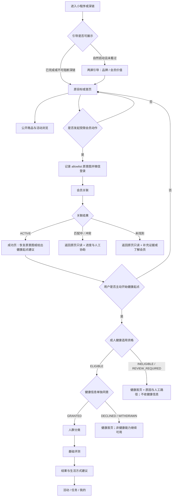

# myRoot 小程序 v1.0.0 产品需求设计

> 文档版本：PRD v1.0-draft.8
>
> 编制日期：2026-07-14
>
> 最近更新：2026-07-18
>
> 目标版本：myRoot 小程序 `v1.0.0`
>
> 代码基线：仓库 `v0.5.13`，`HEAD=d761ae2`；`c3d14f2` 为截至 2026-07-14 的最后一个运行代码变更提交，不代表生产运行版本
>
> 当前状态：结构评审更正稿，仍为 `BASELINE_SIGNOFF_PENDING`；当前 dirty worktree 中已存在的 v1 Shell、Foundation 与 Activity Module 仅为 `PRE_BASELINE_SPECULATIVE_LOCAL_IMPLEMENTATION / NOT_CANDIDATE`，不追认进入 M1 或垂直 Build 的授权。本 PRD 纳入版本控制并完成具名签字前，不得提交或推送这些 v1 改动，不得创建 PR、Candidate、体验版或部署，也不得据此关闭任何 Gate；H-01～H-03 与 H-04P 未关闭前不进入健康垂直 Build，H-04R 未在 D0 后关闭前不得开启真实用户健康写入或执行 D1 健康 UAT；任何情况下均不提前承诺发布日期
>
> 目标读者：产品、设计、研发、测试、健康内容审核、活动运营、会员运营

关联材料：

- [品牌与产品 Design.md](./design.md)
- [v1.0.0 Gate 与文档规范效力决策](./v1.0.0_gate_and_document_authority_decision_2026-07-15.md)
- [v1.0.0 产品结构与 UED 完整交互稿评审](./v1.0.0_structure_review_2026-07-15.md)
- [v1.0.0 完整技术评审与 Foundation 启动记录](./v1.0.0_technical_review_2026-07-15.md)
- [myRoot 会员小程序产品定位与信息架构](./myRoot会员小程序产品定位与信息架构_v1_2026-07-13.md)
- [PANE 小程序对 Root 的设计与流程参考](./PANE小程序对Root的设计与流程参考_2026-07-13.md)
- [v0.5.13 发布说明](./release_notes_v0.5.13.md)
- [v0.5.13 正式发布 Gate](./formal_launch_gate_v0.5.13_2026-07-14.md)
- [旧 7 日流程 PRD](./v0.3.0_product_requirements.md)
- [既有重构路径与迁移策略](./myroot_rebuild_route_and_migration.md)

本版变更：draft.8 在 draft.7 的结构闭合基础上，进一步冻结 Route Registry 的机器连接规则、逐路由 `LEGACY_0_5` 安全 fallback 与 Legacy Redirect 覆盖记录；删除结算前 Reward Ledger 状态，明确任务奖励预览不是账本承诺；保持 Activity Eligibility 为 P1 默认关闭；并把 Ardot R1.1 的交付限制回写为独立 UED handoff Gate。draft.7 已闭合的健康资格顺序、服务端政策/证据版本校验、Settlement Canonical 状态与调整事件、提醒持久化业务唯一约束、微信平台隐私独立条款以及 PRD baseline / UED handoff 两级追踪继续有效；本稿不因 UED 迭代自动成为 baseline。

### 当前 pre-baseline 本地 Implementation 快照（2026-07-18）

- 冻结的需求起点仍是 `v0.5.13 / HEAD=d761ae2` 四 Tab baseline；其字节和 Legacy 路由事实不因当前工作树变化而改变。
- dirty worktree 已出现五 Tab 局部 Shell、健康/活动条件页、Activity Module、迁移与若干 v1 Foundation Implementation；它们是在 PRD baseline 尚未具名签署时形成的推测性本地实现，只证明可在本机检查的代码形态，不证明获批范围、目标环境可运行、真实内容、外部 Adapter、容量或上线就绪。
- 上述工作不得反向关闭 `BASELINE_SIGNOFF_PENDING`，也不得作为 commit、push、PR、Candidate、体验版、部署、生产 DDL、真实微信发送或健康数据写入的授权。继续进入受控 Build 前，必须先完成具名签署、冻结 source commit，并按 Gate D0 重新生成与该冻结提交同源的 artifact provenance 和 Candidate 证据。
- 因此本文后续出现的“已实现/部分实现”若涉及该 dirty worktree，均应读取为 `PRE_BASELINE_SPECULATIVE_LOCAL_IMPLEMENTATION`；除非另有目标环境证据，不得读取为 Candidate 或生产事实。

---

## 0. 结论先行

myRoot v1.0.0 不是给 `v0.5.13` 换一套首页皮肤，也不是继续扩张“7 日身体重启”。它是一次产品主叙事迁移：

> 从“围绕一次 7 日计划组织功能”，迁移为“服务已获客 ROOT 会员的长期会员入口”。

v1.0.0 的确定性结果为：

1. 主导航改为五个 Tab：`首页 / 健康 / 活动 / 任务 / 我的`。
2. 首页承担品牌理念、全屏商品影像、商品橱窗和一个轻量下一步，不再是全业务状态总台。
3. 微信账号、ROOT 会员、健康适用资格、健康同意、健康旅程、活动、任务、次日提醒、结算与奖励使用相互独立的状态轴。
4. 用户注册并成功关联会员后，仅在其主动进入健康起点时依次完成“成人健康适用资格确认 → 健康信息单独同意 → 人群分类 → 基础健康状态评测 → 查看结果与生活方式建议”。这条路径是推荐路径，不是浏览商品、查看公开活动或管理隐私的强制门槛。
5. “健康”提供基础评测和已审核的主题问卷；“活动”提供线下活动列表、详情、报名与取消；“任务”承接既有 7 日计划及后续会员任务；“我的”汇总身份与只读事实。
6. v0.5.13 已有的身份、商品镜像、动态问卷、任务事实、结算、奖励记录、客服与隐私能力优先复用；不推倒重做。
7. 现有 7 日计划、日常记录、分享图、退款和奖励历史必须保留可访问、可追溯、可回退，不能因为五 Tab 切换而丢失。
8. 健康日历、自动干预、长期趋势预测、AI 动态建议和小程序内自建交易不属于 v1.0.0。

本稿只有在成为 PRD baseline 且 V1-T01 的输入已经冻结后，才允许进入 M1 Foundation Build，以受控方式关闭 V1-T01～V1-T06。M1 可实施 Interface/Seam、Route Registry、持久化映射、事件运输、迁移工具、风险探针和区间估算；V1-T01～V1-T06 全部关闭前，不能并行铺开健康/活动/奖励等垂直功能 Build P0，更不能承诺发布日期。ROOT 会员权威来源、健康评测与建议的来源/授权/审核、活动与奖励的真实运营规则、v1 事实持久化、路由版本协商、端到端事件投递、迁移 lineage 和同源发布证据都是硬阻断。

---

## 1. Task Pre-Flight

### 1.1 本次实际读取与检查的输入

本 PRD 只把下列实际读取或检查过的材料作为事实依据：

1. 本线程提供的 15 张 PANE 小程序截图、PANE 参考报告及用户确认的 myRoot 定位和五 Tab 方向。
2. `docs/design.md`、产品定位与信息架构、PANE 参考报告、v0.3.0 PRD、既有重构分期和迁移文档。
3. `miniprogram/app.json`、路由策略、首页、登录、注册、商品、活动、任务、奖励、“我的”、健康同意及相关分包页面。
4. 后端身份、商品镜像、活动、任务进度、动态问卷、健康同意、结算、奖励、隐私及数据结构的当前 Implementation；并全文审查 `backend/src/domain.js` 与 `backend/db/schema.sql` 的状态、持久化、迁移及事件形状。
5. `v0.5.13` 版本文件、Git 状态、远端主分支、发布说明、正式发布 Gate、有赞权限回读和外部 Adapter 激活记录。
6. 本轮执行的小程序静态及专向校验；当前检查通过，但这不等于真机或生产可用证明。
7. 三条相互独立的并行审查：产品定位/信息架构/PANE 采用边界，健康/隐私/安全，v0.5.13 Implementation/迁移/Adapter/发布 Gate；结论由主审统一裁决后写入本稿。

### 1.2 未取得或不能确认的材料

| 缺口 | 影响 | 本 PRD 的工作假设 |
| --- | --- | --- |
| ROOT 会员权威来源、唯一会员号、有效期和权益字段 | 阻断会员关联与权限判断 | 访客可浏览公开内容；个性化健康、会员活动、任务与奖励要求 `ACTIVE` 会员 |
| 非会员是否允许建立普通账号 | 影响注册文案和数据留存 | 允许创建微信账号以申请关联，但不自动获得会员权益 |
| 基础评测及主题问卷的来源、授权、计分、阈值、适用人群 | 阻断健康内容发布 | v1.0.0 至少上线一套基础评测和一套已批准主题问卷；未获批则对应入口必须关闭 |
| 红旗项和人工协助规则 | 阻断健康结果正式上线 | 命中红旗只展示安全提示与人工/线下专业渠道，不继续输出普通建议 |
| D-009 baseline 具名签字、成年资格校验 Implementation 与旧法律页口径处置 | 产品规则已冻结，但仍阻断健康垂直 Build | v1 只向资格确认的成年会员开放；未成年人另行设计，不从“未收生日”推断成年；`miniprogram/pages/legal/index.js` 的旧通用口径需在 baseline 前形成保留/改写/分流决定 |
| 生活方式建议的内容负责人和审核机制 | 阻断建议发布 | 只用版本化、固定、人工审核内容，不使用生成式动态建议 |
| 首发活动来源、名额、报名、取消和审核规则 | 阻断活动报名闭环 | P0 做列表、详情、报名、取消和报名记录；签到与反馈列入 P1 |
| Reward Ledger 的外部权威来源及真实回执 | 阻断“已到账”状态 | 外部回执未验证时只显示“处理中/待人工确认”，不得显示“已到账” |
| 健康数据保存期限和撤回后的处置规则 | 阻断隐私定稿 | 延续现有已记录的 180 天仅作为待复核候选，不直接继承为 v1.0.0 最终口径 |
| 五 Tab 图标、全屏商品影像、活动和健康内容资产 | 影响视觉验收 | 进入视觉开发前完成资产清单、授权范围、裁切规格和降级图 |
| v0.5.13 真机及生产运行态 | 影响线上现状判断 | 本文仅以 v0.5.13 本地/远端代码为实现基线，不称其为线上版本 |
| v1 新事实到现有 MySQL snapshot/关系投影的映射、迁移变换与 dry-run | 阻断 v1 DDL/投影、双写、cutover 和回滚实施 | 仓库已有 MySQL Store；旧候选有 connected/迁移 005 证明，但不能证明 v1 会员、健康、活动等新事实已映射或迁移 |
| 完整旧路由调用点、旧客户端/新后端版本协商 | 阻断 Shell 回滚与深链兼容证明 | 建立唯一 Route Registry，并至少兼容当前与上一稳定客户端版本 |
| outbox/inbox、重放水位和死信处理 | 阻断跨 Module 事实完整性 | M1 必须先给出持久化事件运输合同，不能以进程内顺序调用代替 |

### 1.3 本次工具、写入与修改范围

draft.6～draft.8 读取 Git、结构评审、对抗式复核、Gate 决议、设计稿、提醒设计、v0.5.13 代码和既有证据，并修改/新增：

- `docs/v1.0.0_product_requirements.md`；
- `docs/design.md`；
- `docs/v1.0.0_gate_and_document_authority_decision_2026-07-15.md`；
- `docs/v1.0.0_structure_review_2026-07-15.md`；
- `docs/checkin_reminder_subscription_design.md`；
- Ardot `fileId=684679021092544` 的 Conditional P0 页面、交互流转登记与改前 Archive。

本次不修改小程序代码、后端、数据库、CloudBase、Admin、配置、版本号、发布记录或长期规则；不上传体验版、不创建生产候选、不执行数据迁移、不调用微信业务写入或真实发送。

### 1.4 事实优先级、目标态效力与状态标签

“当前实现是什么”和“v1.0.0 应做什么”是两类问题，不能用一条优先级混在一起：

| 判断对象 | 规范来源 | 使用规则 |
| --- | --- | --- |
| 当前 Implementation 与生产状态 | 当前代码、可重复校验、目标环境只读回执 | 本地代码只能证明本地 Implementation；生产状态必须由目标环境读回证明 |
| 法定、平台、隐私与健康安全要求 | 适用平台规则、正式审批、授权与审核记录 | 优先于任何产品稿；缺少正式材料时只能形成 Gate，不能猜测为已通过 |
| v1.0.0 定位、范围、优先级、状态码、Canonical 路由、迁移合同与发布 Gate | **本 PRD** | 对 v1.0.0 为规范；冲突必须回写本 PRD，不得由调用方自行选择 |
| 品牌 Token、页面表达与交互细节 | `design.md` | 只在不冲突于本 PRD 的产品范围、状态、隐私和验收时生效 |
| PANE 截图与参考报告 | 研究参考 | 只按第 3.6 节采用矩阵转译，不构成 ROOT 的业务事实或功能范围 |
| 历史 PRD、迁移稿、开发台账与截图 | 历史证据 | 用于理解 v0.5.13 和兼容约束，不自动成为 v1 目标 |

[`v1.0.0_gate_and_document_authority_decision_2026-07-15.md`](./v1.0.0_gate_and_document_authority_decision_2026-07-15.md) 是本 PRD 的关联决策记录：它只消除明确标记为 `PRODUCT_DECISION_FROZEN / BASELINE_SIGNOFF_PENDING` 的产品歧义，不以决策记录替代具名签字、内容授权、隐私履约、运营 SOP 或候选运行证据。

Canonical 活动 Tab 固定为 `/pages/activities/index`；`/pages/activity/index` 仅为兼容页。第 6 章是 v1 唯一目标状态码；`design.md` 或历史材料中的不同名称均视为展示稿旧名。若当前代码、`design.md` 或迁移稿与此冲突，实施前先形成变更记录并更新本 PRD。

文中统一使用四类状态：

- `已实现`：当前 v0.5.13 代码存在且本轮可静态验证。
- `部分实现`：有可复用基础，但不满足 v1.0.0 Interface。
- `待新增/重构`：当前没有对应用户闭环，或旧状态模型不适用。
- `外部未验证`：本地 Implementation 存在，但真实账号、数据、回执或生产证据缺失。

---

## 2. 版本事实与 v0.5.13 基线

### 2.1 三套版本事实必须分开

| 口径 | 2026-07-14 已核事实 | 对 v1.0.0 的意义 |
| --- | --- | --- |
| 仓库需求基线 | `v0.5.13`，`HEAD=d761ae2`；远端 `origin/main` 同提交；无包含 HEAD 的 tag | 所有差异和回归从该代码出发 |
| 最新生产候选记录 | `myroot-api-027 / v0.5.12 / 0%` | 不能称 v0.5.13 已上线 |
| 默认生产流量记录 | 仍由 `012` 承接 | 生产用户行为不能从本地代码推断 |
| Cloud Function 记录 | 线上包仍为 `v0.5.10` | 1.0.0 发布时须与小程序、后端统一版本 |
| 目标版本 | `v1.0.0` | 所有发布证据必须重新绑定 1.0.0 releaseId |

`v0.5.13` 只收敛微信 stable token Module，发布说明明确未改变用户流程和数据库结构。其“NOT_PUSHED”记录已与远端现状发生漂移，但 tag、最终工件、生产候选和上线证据仍未形成。因此本 PRD 使用“v0.5.13 代码基线”，不使用“v0.5.13 线上版本”的表述。

`design.md` 已在 2026-07-15 对齐 `d761ae2 / 0.5.13` 代码基线，并将 v1.0.0 范围、状态、路由与 Gate 的规范效力交还本 PRD；两份文档均不得把本地代码基线写成线上版本。

### 2.2 当前真实导航

v0.5.13 当前仍为四 Tab：

1. 首页：`/pages/home/index`
2. 商品：`/pages/products/index`
3. 任务：`/pages/tasks/index`
4. 奖励：`/pages/rewards/index`

全局标题仍为“ROOT 7日身体重启”；`/pages/profile/index` 和 `/pages/activity/index` 已存在但不是 Tab；目标 `/pages/health/index` 与通用活动列表不存在。

### 2.3 v0.5.13 能力迁移矩阵

| 领域 | v0.5.13 事实 | v1.0.0 处置 | 类型 |
| --- | --- | --- | --- |
| 微信账号与 `root_user_id` | 微信登录、token、openid/unionid 联系、可选手机号已存在 | 保留账号基础，在其上新增独立会员事实 | 复用并扩展 |
| ROOT 会员身份 | unionid 和账号生命周期不能证明订阅会员 | 新增 Member Identity Module、会员来源 Adapter 与人工复核 | 待新增 |
| 新用户引导 | 登录、授权、四题画像分散在多个页面 | 改为可跳过两屏引导；登录与会员关联按需触发 | 重构 |
| 首页 | 按单一用户状态切换登录、画像、活动、打卡、日常记录 | 改为品牌/商品/一个下一步；旧状态卡移出 | 重构 |
| 商品 | 列表、详情、SKU、镜像同步时间、跳会员中心和跳转记录已存在；当前读取仍要求 token | 新增公开只读 Interface，补 Hero、编辑内容、失败降级 | 复用并扩展 |
| 健康同意 | 支持 `GRANTED/WITHDRAWN`、版本校验和写入 Gate | 扩为五态；区分首次拒绝、撤回和重新确认 | 重构 |
| 健康旅程 | 有四题画像、动态问卷、条件分支、打卡历史 | 新增分类、基础评测、结果、建议、版本历史和红旗路径 | 大部分新增 |
| 活动 | 单个有效 Campaign、加入与参与者事实；当前读取要求 token，只有 join，无 cancel/waitlist/capacity Interface | 扩为公开目录、详情、场次、名额、报名、取消和历史 | 大部分新增 |
| 任务 | 多任务定义、幂等事件、进度、提醒、7 日及日常记录较成熟 | 保留；把 7 日计划作为一种 Task Adapter | 重点复用 |
| 奖励 | 规则版本、结算、奖励承诺、人工复核和幂等基础已存在 | 补全 Reward Ledger 状态和外部到账回执 | 复用并扩展 |
| 我的 | 已有头像、记录、订单、画像、复核、客服、隐私与退出 | 升级为 Tab，补会员、活动、健康历史和权益账本入口 | 重构 |
| Admin | 已有活动/任务/商品/规则/结算/奖励/复核及审计基础 | 延伸会员、健康内容和线下活动配置，不另起一套后台 | 重点复用 |
| 外部 Adapter | 有赞、企微、物流等有较多本地 Implementation | 权限或本地成功不等于生产就绪；逐一补真实回执 | 外部未验证 |

### 2.4 旧单轴状态不能继续扩张

当前状态为：

`GUEST → UNREGISTERED → REGISTERED_IDLE → CHECKIN_ACTIVE / CHECKIN_COMPLETED / CHECKIN_FAILED → DAILY_USER`

它同时混合账号、画像完成度和 7 日任务周期。v1.0.0 禁止在此枚举上继续增加 `MEMBER_ACTIVE`、`ASSESSED` 或 `ACTIVITY_JOINED`。旧枚举仅保留为 Legacy 任务投影，新的权限和页面必须读取第 6 章定义的独立状态轴。

### 2.5 外部 Adapter 当前证据等级

以下只描述本轮实际可证实的最高等级，不代表正式发布目标：

| Adapter | 截至 2026-07-14 的最高证据 | v1 处置 |
| --- | --- | --- |
| 微信 stable token | `LOCAL_VERIFIED_ONLY`；未取得新候选运行证明 | 纳入 D0/C1 同源回读 |
| 有赞商品/订单/客户读取 | `CONTROL_PLANE_AUTHORIZED`；无 token、隐私字段探针和真实 READY 样本 | C0 冻结字段合同，C1 做真实只读证明 |
| 有赞优惠券发送/查询 | `CONTROL_PLANE_AUTHORIZED`；无真实发券/查询回执 | 默认 disabled，C1 前不得自动发放 |
| ROOT 会员权威来源 | `UNDEFINED / BLOCKED_D001` | 未定义前不得产生 `ACTIVE` |
| ROOT 会员中心跳转 | appId/path 已记录；无 1.0.0 同源真机证明 | D1 真机验收 |
| 企微、物流、外部告警 | 缺完整生产配置、真实回执或联合回滚材料 | 逐项列入 C0 权威清单；非 required 则 disabled |

`adapterImplementations` 或 `fetchImpl` 可注入只能证明候选 Seam；两个 Adapter 通过同一 Interface 契约测试说明该 Seam 已成为真实变化点，是否生产就绪仍须 C1 的目标环境证据。

---

## 3. 产品定义

### 3.1 一句话定位

myRoot 是 ROOT 已获客会员的长期服务入口：用克制的品牌与商品内容建立理解，用健康状态评测形成个人起点，再把活动、任务和权益组织成可持续的会员生活方式。

### 3.2 默认用户

1. 已在线下门店、活动、顾问、企业微信或其他渠道完成获客的 ROOT 订阅会员。
2. 已有微信身份但尚未自动匹配会员，需要手机号、会员号或人工协助的用户。
3. 通过分享或搜索进入、尚未成为会员的访客；其主要目标是了解品牌、商品和公开活动，而不是被强制注册。

### 3.3 v1.0.0 用户价值

用户应能完成五件事：

1. 看懂 ROOT 的产品理念和主要商品。
2. 确认自己的会员身份与可用权益。
3. 经单独同意后完成健康状态起点评测，并获得可解释、非诊断的生活方式建议。
4. 找到并报名适合自己的线下活动。
5. 完成任务、查看进度及奖励事实，并管理自己的资料、历史和隐私选择。

### 3.4 业务目标

1. 把已获客会员从“被联系对象”转为“可自主使用的会员”。
2. 建立会员关联、健康旅程、活动、任务和奖励的可度量漏斗。
3. 用真实使用行为改善会员运营，而不是依赖泛化营销曝光。
4. 保留已有 7 日计划和运营结算的价值，避免重做成熟基础。
5. 形成可版本化、可审核、可回退的健康内容和会员运营机制。

### 3.5 非目标

v1.0.0 不做：

- 公域电商商城或小程序内自建支付、订单履约、售后中心；购买继续跳 Root 会员中心。
- 医疗诊断、疾病风险判断、处方、治疗建议或替代专业医疗服务。
- 健康评测作为所有页面、会员身份或活动浏览的统一门槛。
- 完整健康日历、长期趋势预测、自动干预、可穿戴设备接入。
- 生成式 AI 自动生成个人健康建议。
- 复杂积分商城、等级成长体系和游戏化排行榜。
- 只为 PANE 视觉相似而复制其电商结构；PANE 只提供信息层级和影像表达参考。

### 3.6 PANE 参考采用矩阵

| 处理 | PANE 做法 | myRoot v1.0.0 转译 |
| --- | --- | --- |
| 直接采用 | 两屏可跳过引导、单屏单焦点、长内容渐进展开 | 用于引导、首页 Hero、商品详情和健康说明；始终保留明确退出/跳过 |
| 转译采用 | 全屏编辑影像、固定主行动、简洁商品内页 | 只用于引导/首页/商品，不把全屏影像扩散到健康表单、活动报名和“我的” |
| 明确不采用 | 图标语义不清的导航、积分诱导、集中一次收集资料、首页作为全业务总台 | 五 Tab 使用文字标签；资料按目的分步收集；健康和会员状态不堆满首页 |
| P1 再验证 | 首次价值后提醒、顾问人工承接 | 必须先证明用户价值、模板送达和人工 SLA，不能在首次进入强推授权 |
| 不可从 PANE 推断 | ROOT 会员、健康、活动、任务、奖励、隐私和迁移规则 | 全部以本 PRD 和真实 ROOT 运营/安全证据为准 |

PANE 旧报告中与五 Tab、非强制健康旅程、按需收集或本 PRD P0/P1 冲突的建议不采用；视觉相似度不是验收指标。

---

## 4. 成功标准与版本范围

### 4.1 北极星与核心漏斗

北极星指标：

> **30 日有效服务会员率** = 首次进入 myRoot 后 30 天内，至少完成一项有效会员行为的 `ACTIVE` 会员数 / 首次进入的 `ACTIVE` 会员数。

有效会员行为仅包括：完成基础健康评测并查看建议、成功报名活动、完成一项会员任务。商品曝光、登录和页面浏览不单独计为有效服务。

首要前导指标：

> **7 日健康起点完成率** = 首次关联成功后 7 天内完成分类、基础评测并查看建议的会员数 / 同期首次关联成功且具备评测资格的会员数。

正式数值目标在内测基线形成后由产品、运营和健康内容负责人签字，不在缺少基线时拍定。

### 4.2 Build P0：Core 与条件性闭环

**P0 Core** 是不依赖未决健康量表、首发活动和外部奖励动作，也应先完成的共同地基：

1. 五 Tab Shell、全局标题、唯一 Route Registry、旧路由兼容和按能力隔离的发布控制。
2. 两屏可跳过引导、品牌首页、商品橱窗、简洁商品详情及公开浏览。
3. 微信账号与 ROOT 会员分离，支持自动匹配、未找到、匹配中、冲突、人工协助及原意图恢复。
4. 任务中心、任务详情、现有打卡/问卷能力；7 日计划作为 Legacy Task Adapter 继续运行。
5. “我的”Tab：会员信息、本人历史、订单入口、客服、隐私与账号管理。
6. Reward Ledger 先对现有结算、奖励、退款和优惠券事实做诚实只读展示；外部未确认时不得伪装到账。
7. Module 事实归属、命令幂等、事件运输、迁移 lineage、版本协商和同源发布证据地基；这是允许先行的 M1 技术地基 Implementation。

**P0 条件性闭环** 仍属于 v1.0.0 正式范围。表中的进入条件与候选/发布证明必须分阶段判断，不能要求用尚不存在的候选运行证据作为结构评审或 M1 Foundation Build 的前提：

| 条件性闭环 | v1.0.0 最小范围 | 垂直 Build 进入条件 | 候选/发布证明 | 未满足时的处理 |
| --- | --- | --- | --- | --- |
| 健康 | 健康首页、五态同意、人群分类、一套基础评测、一套已批准主题问卷、结果、固定建议、基础历史 | D-003、D-004、D-007、D-009 与 H-01～H-03、H-04P | D0 后由 H-04R、B1/D1 与同源 UAT 关闭 | 健康写入保持关闭；不能用“建设中”Tab 冒充正式完成，也不能从其他会员权益扣除健康同意 |
| 活动 | 真实活动列表、详情、名额、报名、取消和“我的报名” | D-005、首发活动内容包、容量/取消规则和运营 SOP | D0 后完成真实报名/取消、并发名额、场次取消与人工路径 UAT | 未形成至少一个真实可报名闭环时，五 Tab 正式发布 NO-GO；真实查询返回“近期暂无活动”才是合法业务空状态 |
| 奖励动作 | 新规则的奖励承诺、外部发放、回执、失败恢复和异议 | D-006 与 C0 合同 | D0 后由 C1 真实回执及 D1 UAT 关闭 | 只读展示既有事实；新自动发放保持关闭，不能用本地成功声称到账 |

这不是删减用户明确提出的健康问卷或活动参与，而是把“范围存在”和“证据已就绪”分开。多套问卷、复杂候补/签到/反馈、健康对比提醒和增强型 Reward Ledger 工作台仍为 P1。

Build P0 仅定义目标能力，不表示已经可以整体开工或发布。D-001～D-010 是 M0 产品决策；本 PRD 成为 baseline 且 V1-T01 输入冻结后，才允许通过受控 M1 Implementation 关闭 V1-T01～V1-T06。健康闭环按 H-01～H-03、H-04P（垂直 Build 前）与 D0 后 H-04R（真实健康写入/D1 UAT 前）分阶段控制。M1 可以实现非生产 Store 映射、Route Registry、outbox/inbox、迁移工具和故障探针，但在 V1-T 全关前不得铺开垂直功能或执行生产 cutover。内容、迁移、Adapter 和发布按第 15.4 节的分阶段 Gate 验收。

### 4.3 发布 P0：不计为单页面功能的 Gate

1. 内容与运营：正式内容包、健康审核、活动/任务/奖励 SOP 和客服口径。
2. 数据与迁移：生产 dry-run、对账、双读/双写、冲突处置和回退。
3. 外部依赖：真实样本、动作回执、幂等、失败回退和人工路径。
4. 发布证明：真机 UAT、1.0.0 独立工件、唯一 releaseId、0% 候选、灰度和回滚演练。

这些 Gate 的工作量需单列，不得被隐藏在某一页面估算中。

| 工作包 | 责任角色 | 进入条件 | 退出证据 |
| --- | --- | --- | --- |
| Build P0 | 产品、设计、研发、测试 | 对应 D/H/T 条件已形成可实现决定 | 所有明确标注为 P0/P0 Core/条件性 P0 的 V1 条款及其全部显式后缀 AC（例如 AC-01A、AC-04A～C、AC-H04A～D、AC-H10A～D）、AC-01～AC-26、AC-E01～E05、AC-H01～H14、AC-S01～S04、AC-R01～R11、AC-X01～X02、AC-P01～P02、AC-PR01～PR04、AC-PLAT-01～03、AC-SHELL-01～02、AC-STATE-01、AC-A11Y-01 与 Tab Ready Gate；不包含 V1-5004 和 V1-4007 的 P1 增强 |
| 内容与运营 Gate | 品牌内容、健康编辑/审核、活动/会员/奖励运营 | 对应页面 Implementation 可预览 | 冻结内容包、审核记录、SOP 和演练回执 |
| 数据迁移 Gate | 数据负责人、研发、测试、隐私负责人 | 逐事实迁移合同映射到实际存储 | dry-run、对账、冲突清单、回退/重放证明 |
| 外部 Adapter Gate | 集成研发、对应业务运营 | C0 合同、账号、权限、样本和人工退路就绪 | D0 releaseId 下的真实读样本、动作回执、幂等和失败恢复 |
| 发布 Gate | 发布负责人、产品、运营、研发、测试、隐私与健康审核 | A、B0、C0、D0、B1、C1 均通过 | D1 同源证据、真机 UAT、联合回滚和灰度签字 |

### 4.4 P1：v1.1 候选

- 主题问卷库扩展、多套问卷、评测对比和到期复评提醒。
- 候补、候补转正、活动签到、活动后反馈与出席记录。
- 在明确安全必要性后接入 Activity Eligibility Interface；默认保持关闭。
- 任务凭证审核、活动后自动任务、多场景订阅提醒编排。
- 更完整的健康内容、活动、Reward Ledger 和首页内容运营工作台；新奖励自动化需先完成 P0 Adapter 证据。
- 经授权和字段校准后的有赞、企微、物流自动化增强。

P0 与 P1 的相似名词按下表切开，不能让团队各自解释：

| 能力 | P0 最小范围 | P1 增量 |
| --- | --- | --- |
| 任务核验 | 对既有需要核验的任务提供单条人工确认与状态回写 | 批量凭证审核、复杂证据规则与运营工作台 |
| 订阅提醒 | 用户完成直接相关动作后申请一个冻结模板；业务页始终可查状态 | 多场景编排、偏好、频控和效果优化 |
| 活动产生任务 | 仅 `CONFIRMED` 且活动发布版本预先绑定一个具体任务定义时创建 | 签到/反馈后的动态任务和跨活动编排 |
| 首页内容 | 冻结 Hero/商品组的最小草稿、预览、发布和回退 | 完整排期、分群、实验和多内容位工作台 |
| Reward Ledger | 既有事实只读；证据通过后开启最小新承诺/回执 | 多权益组合、批量运营和高级异议工作台 |

相对上游定位稿的优先级变更如下；在对应决策签字前均为 `P0 candidate`，不是已批准开工：

| 提级项 | 上游建议 | 本 PRD | 原因 | 关闭条件 |
| --- | --- | --- | --- | --- |
| 首套主题问卷 | P1 候选 | 条件性 P0 | 用户明确要求健康状态问卷，且与基础评测构成 v1 健康价值 | Build 前 D-003/D-009 + H-01～H-03/H-04P；真实写入与 D1 需 D0 后 H-04R |
| 活动报名/取消 | P1 候选 | 条件性 P0 | “用户可参与线下活动”不能由纯列表代替 | D-005、首发活动 SOP、Tab Ready Gate 的价值闭环子 Gate |
| Hero 最小运营 | P1 候选 | P0 最小 | 全屏商品大片若不可冻结/回退，无法作为正式首页 | D-008、内容 Gate A |
| 确认报名后创建具体任务 | P2 候选 | 条件性 P0 | 只支持发布时显式绑定，不做动态编排 | D-005、事件/幂等 V1-T04 |
| 次日打卡提醒的一个冻结模板与真实送达 | P1 候选 | P0 最小 | 用户已开始/参与现有打卡任务后主动申请；发布必须证明提醒不是“只授权未送达”；任务页仍为事实来源 | D-010、D1 同源送达证明 |

### 4.5 P2：后续版本

- 健康日历、长期趋势和多阶段计划。
- 自动化干预和个性化策略编排。
- 高级会员等级、积分商城和复杂权益组合。
- 自动将活动、任务、奖励跨场景组合。
- 经独立安全、合规和科学评审后的动态建议能力。

### 4.6 v1.0.0 明确延期台账

任何从 P0 移出的功能都必须记录：延期原因、触发条件、责任 Module、数据影响和验收标准。不得用“后续优化”替代可追踪的延期决策。

---

## 5. 用户分层与访问规则

### 5.1 用户层级

| 用户层级 | 定义 | 核心体验 |
| --- | --- | --- |
| 访客 | 未建立微信账号 | 引导、首页、公开商品、公开活动、品牌/法律/客服 |
| 已登录未关联 | 已有 `root_user_id`，会员未知或未找到 | 访客能力 + 发起会员关联 + 查看处理进度 |
| 关联处理中/冲突 | 会员匹配需要人工确认 | 公开浏览不受阻；显示明确进度、预计时效和人工协助 |
| `ACTIVE` 会员 | 权威会员来源确认有效 | 健康、会员活动、任务、奖励和全部本人历史 |
| `EXPIRED` 会员 | 会员已到期 | 公开浏览、本人历史、隐私管理和续订入口；不能新开会员专属旅程 |
| `SUSPENDED` 会员 | 权益暂停或需复核 | 保留个人数据权利与人工协助；具体能力按原因最小关闭 |

### 5.2 功能访问矩阵

| 功能 | 访客 | 已登录未关联 | ACTIVE | EXPIRED/SUSPENDED |
| --- | :---: | :---: | :---: | :---: |
| 首页与公开内容 | ✓ | ✓ | ✓ | ✓ |
| 商品浏览与跳会员中心 | ✓ | ✓ | ✓ | ✓ |
| 公开活动列表/详情 | ✓ | ✓ | ✓ | ✓ |
| 会员活动报名 | 登录后提示关联 | 提示关联 | ✓ | 按活动规则禁用并解释 |
| 新建健康分类/评测 | — | 提示关联 | 经 `ELIGIBLE + GRANTED` 后 ✓ | 默认不可新建 |
| 查看本人历史 | — | 本账号已有则 ✓ | ✓ | ✓ |
| 新建会员任务 | — | 提示关联 | ✓ | 默认不可新建 |
| 进行中的存量任务 | — | 依迁移结果 | ✓ | 按“祖父规则”继续或人工处理 |
| Reward Ledger | — | 本账号已有则只读 | ✓ | ✓ |
| 隐私说明、公开客服 | ✓ | ✓ | ✓ | ✓ |
| 本人同意与数据权利管理 | 登录并核验身份后 | ✓ | ✓ | ✓ |

“祖父规则”必须由每个任务或活动发布版本明确：会员到期后，已开始的计划是允许完成、立即冻结还是进入人工复核。不得由页面临时判断。

---

## 6. 独立状态模型

### 6.1 状态轴

| 状态轴 | v1.0.0 状态 | 唯一事实归属 |
| --- | --- | --- |
| 账号 | `GUEST / AUTHENTICATED / DISABLED` | Identity 基础 Module |
| 会员 | `UNKNOWN / MATCHING / NOT_FOUND / ACTIVE / EXPIRED / SUSPENDED / CONFLICT` | Member Identity Module |
| 健康适用资格 | `UNKNOWN / ELIGIBLE / INELIGIBLE / REVIEW_REQUIRED` | Health Eligibility Module |
| 健康同意 | `NOT_ASKED / DECLINED / GRANTED / WITHDRAWN / RECONSENT_REQUIRED` | Health Consent Module |
| 健康旅程 | P0 产生 `NOT_STARTED / CLASSIFIED / ASSESSMENT_DRAFT / ASSESSMENT_PROCESSING / ASSESSMENT_BLOCKED / RESULT_READY / ADVICE_VIEWED`；P1 复评上线后才产生 `REASSESSMENT_DUE` | Health Journey Module；只拥有可重建投影，不接受业务写命令 |
| 评测会话 | `DRAFT / SUBMITTED / RESULT_PENDING / RESULT_READY / SAFETY_BLOCKED / CONTENT_BLOCKED / RESULT_FAILED / SUPERSEDED / ABANDONED / EXPIRED` | Assessment Module；健康旅程仅做可重建投影 |
| 活动定义 | `DRAFT / IN_REVIEW / PUBLISHED / UNPUBLISHED / ARCHIVED` | Activity Module |
| 活动场次 | `SCHEDULED / OPEN / CLOSED / CANCELED / ENDED`；名额可用性另投影为 `AVAILABLE / FULL` | Activity Module |
| 活动参与 | `NOT_ENROLLED` 仅为无记录投影；P0 持久化 `PENDING / CONFIRMED / REJECTED / CANCELED`；P1 候补/签到上线后才产生 `WAITLISTED / CHECKED_IN / COMPLETED / NO_SHOW` | Activity Module |
| 任务 | `LOCKED / AVAILABLE / IN_PROGRESS / PENDING_VERIFICATION / COMPLETED / EXPIRED / CANCELED` | Task Module |
| 结算 | `PENDING / QUALIFIED / UNQUALIFIED / ADJUSTED / REVIEW_REQUIRED` | Settlement Module |
| 次日提醒可申请性 | `INELIGIBLE / AVAILABLE / TEMPLATE_UNAVAILABLE / PLATFORM_DISABLED` | Check-in Reminder Module；根据任务、模板与授权事实重建 |
| 次日提醒授权决定 | `NOT_REQUESTED / ACCEPTED / REJECTED / PLATFORM_DISABLED / OUTCOME_UNKNOWN` | Check-in Reminder Module；`NOT_REQUESTED` 为无记录投影 |
| 次日提醒授权额度 | `AVAILABLE / RESERVED / CONSUMED / INVALID / REVIEW_REQUIRED` | Check-in Reminder Module |
| 次日提醒任务 | `SCHEDULED / SENDING / PROVIDER_ACCEPTED / SKIPPED / FAILED / OUTCOME_UNKNOWN / CANCELED` | Check-in Reminder Module |
| 次日提醒送达证据 | `NOT_VERIFIED / DEVICE_RECEIPT_VERIFIED` | Check-in Reminder Module；只用于候选/发布证据，不能从授权或微信受理自动推导 |
| 奖励 | `PENDING / DELIVERING / DELIVERED / FAILED / REVOKED / DISPUTED` | Reward Ledger Module；只有 `settlement.qualified` 创建奖励承诺后才产生账本事实 |
| 隐私权利请求 | 处理状态 `SUBMITTED / VERIFYING / IN_PROGRESS / PARTIALLY_FULFILLED / COMPLETED / REJECTED / CANCELED`；正交 SLA 状态 `ON_TIME / OVERDUE` | Privacy Rights Module |
| 微信平台隐私交互（单次来源动作） | `NOT_REQUIRED / REQUIRED / REQUESTING / GRANTED / DECLINED / PLATFORM_DISABLED / OUTCOME_UNKNOWN` | Platform Privacy Orchestration Module；短期交互投影，不写入 Health Consent 或次日提醒事实 |

会员状态语义：

- `UNKNOWN`：尚未完成一次成功的权威查询，或会员来源不可用/结果已过期。
- `NOT_FOUND`：权威查询已成功，且基于当前完整匹配证据明确无记录；保存来源和查询时间。
- Adapter 超时、权限失败或字段不完整时保持 `UNKNOWN/MATCHING`，不得降为 `NOT_FOUND`。

### 6.2 状态组合规则

1. `unionid=LINKED` 只代表微信身份联系成功，不能推导 `member=ACTIVE`。
2. 有订单或手机号只是一条匹配证据，不能单独推导会员有效。
3. `health_consent=DECLINED/WITHDRAWN` 不改变账号和会员状态，也不阻断公开内容、活动浏览、任务历史、客服与隐私管理。
4. `member=ACTIVE` 不自动产生健康同意。
5. 活动报名事实只由 Activity Module 写入；Task Module 可消费活动事实生成任务，但不能反向改写报名状态。
6. 任务完成不等于奖励到账；结算达标、奖励承诺、外部发放和用户异议是不同事实。
7. “我的”只读取上述 Module 的事实，不拥有第二份活动、任务或奖励状态。
8. 每个状态变更保存前值、后值、触发原因、规则/内容版本、时间、操作者或幂等键。
9. 健康适用资格只能由 Health Eligibility Module 的显式决定命令产生；不得从未填写生日、手机号、订单、会员状态或旧画像推断。`UNKNOWN/INELIGIBLE/REVIEW_REQUIRED` 均关闭新健康写入，但不关闭非健康能力。
10. `ELIGIBLE` 只表达满足当前 `eligibilityPolicyVersion` 的成人健康旅程进入资格，不保存生日原值，也不代表已产生健康同意。
11. Health Journey 状态由 Health Eligibility、Health Consent、Classification、Assessment、Questionnaire 和 Recommendation 的权威事实重建；投影漂移时以下层事实为准，不允许页面或 Health Journey 写回原始事实。
12. 次日提醒的“可申请、授权决定、一次性额度、排期、发送结果、送达证据”是正交事实；`ACCEPTED` 不等于已排期，`PROVIDER_ACCEPTED` 不等于真机已收到。
13. `OUTCOME_UNKNOWN` 必须进入人工核验；不得自动重试发送，也不得复用 `REVIEW_REQUIRED` 授权额度。
14. Task Module 只产生任务事实；Settlement Module 只产生达标、未达标和追加调整事实；Reward Ledger Module 只根据 Settlement 事实产生奖励承诺、调整候选和交付状态。任何页面和 Module 不得绕过 Settlement，既有结算和账本事实不得被覆盖或自动追回。
15. 微信平台隐私交互只服务一次由用户发起的来源动作；`GRANTED` 只允许恢复该动作一次，其他状态均保留上下文并返回最小替代路径，不推导健康同意或提醒授权。

### 6.3 活动生命周期与展示投影

1. 活动定义按 `DRAFT → IN_REVIEW → PUBLISHED` 发布；审核退回时 `IN_REVIEW → DRAFT(reason=CHANGES_REQUESTED)`。已发布版本不可原地改写，修订产生新版本；`PUBLISHED → UNPUBLISHED → ARCHIVED` 只改变后续展示/新建场次资格，不删除历史报名。
2. 场次按 `SCHEDULED → OPEN → CLOSED → ENDED` 运行；`SCHEDULED/OPEN/CLOSED` 均可由运营以必填原因转为 `CANCELED`，取消后不得重新开启。`FULL` 不是可手工改写的生命周期状态，而是 `OPEN + confirmed reservations >= capacity` 的并发安全投影；取消报名或增加容量后可恢复 `AVAILABLE`。
3. `approvalMode=AUTO` 时，报名在名额与规则同事务校验后由 `NOT_ENROLLED` 直接产生 `CONFIRMED`；`approvalMode=MANUAL` 时先产生 `PENDING`，且 P0 默认不占名额，审核时再次原子校验容量后转 `CONFIRMED` 或 `REJECTED(reason=CAPACITY_FULL_AT_REVIEW/APPROVAL_REJECTED)`。每个审核型场次必须冻结 `reviewDeadline`；到期仍为 `PENDING` 时系统幂等转 `REJECTED(reason=REVIEW_TIMEOUT)`，不得跨场次开始或结束悬挂。
4. P0 报名迁移为 `PENDING → CONFIRMED/REJECTED/CANCELED`、`CONFIRMED → CANCELED`。同一发布规则下 `REJECTED` 为终态；`CANCELED` 仅在规则显式 `allowReapply=true`、截止时间与容量仍满足时，才可在同一 enrollment 记录追加重新报名事件并进入 `PENDING/CONFIRMED`，默认不允许。
5. 场次取消时，所有 `PENDING/CONFIRMED` 报名追加 `CANCELED(reason=SESSION_CANCELED)`；不覆盖原事件。P0 最小原因码冻结为定义审核 `CHANGES_REQUESTED`，场次 `OPERATOR_CANCELED / WEATHER / VENUE / FORCE_MAJEURE / OTHER`，报名/结果 `USER_CANCELED / SESSION_CANCELED / APPROVAL_REJECTED / REVIEW_TIMEOUT / CAPACITY_FULL / CAPACITY_FULL_AT_REVIEW / CUTOFF_PASSED / POLICY_BLOCKED / OPERATOR_CORRECTION`；`OTHER` 必填说明。
6. 列表展示为确定性投影：`OPEN+AVAILABLE=可报名`、`OPEN+FULL=已满`、开始后且未结束/取消=`进行中`、`CLOSED=报名已截止`、`CANCELED=已取消`、`ENDED=已结束`。客户端不得自行依据文案或本地时钟创造另一套状态。

### 6.4 首页下一步规则

首页最多展示一个轻量下一步，按以下优先级计算：

1. 账号安全或会员冲突必须处理；
2. 用户主动开始但未完成的健康评测；
3. 24 小时内需完成的已报名活动动作；
4. 即将过期的进行中任务；
5. 尚未开始健康旅程的 `ACTIVE` 会员；
6. 未关联用户的会员关联提示；
7. 无动作时不展示任务卡，只保留品牌与商品内容。

Home Next-step Module 只返回展示模型和目标路由，不拥有任何业务事实。

统一展示模型至少包含：

`label / whyNow / urgency / targetRoute / dismissible / snoozeUntil / expiresAt / sourceModule`

约束：

1. 账号冲突、用户已承诺且临近截止的活动/任务可以不可忽略；健康起点提示必须允许“稍后”或设置暂不提醒，不能每次启动反复施压。
2. 暂缓健康卡片只隐藏首页提示，不关闭健康 Tab、不改健康状态，也不制造健康同意。
3. 完成、过期、来源版本变化或用户主动暂缓后，由同一 Module 重新计算；页面不得本地拼优先级。
4. `targetRoute` 必须来自 Route Registry；不能返回当前客户端未注册的路径。

---

## 7. 信息架构与路由迁移

### 7.1 五个主 Tab

| Tab | Canonical 路径 | 核心职责 | 明确不做 |
| --- | --- | --- | --- |
| 首页 | `/pages/home/index` | 品牌理念、全屏 Hero、商品橱窗、一个下一步 | 不堆订单、任务、奖励和全部状态 |
| 健康 | `/pages/health/index` | 分类、评测、问卷、结果、建议、历史 | 不承担医疗诊断与活动报名 |
| 活动 | `/pages/activities/index` | 线下活动发现、详情、报名、取消、记录 | 不计算任务和奖励 |
| 任务 | `/pages/tasks/index` | 可执行任务、进度、打卡和任务历史 | 不拥有活动报名或奖励到账事实 |
| 我的 | `/pages/profile/index` | 会员身份、本人历史、订单入口、客服、隐私 | 不维护第二套业务事实 |

全局标题由“ROOT 7日身体重启”改为“myRoot”。五个 Tab 必须使用独立、授权明确的图标，并满足微信安全区与最小点击区域要求。

### 7.2 页面地图

主包保留高频与入口页面：

- `/pages/home/index`
- `/pages/health/index`
- `/pages/activities/index`
- `/pages/tasks/index`
- `/pages/profile/index`
- `/pages/login/index`
- `/pages/register/index`
- `/pages/member-link/index`
- `/pages/products/index`
- `/pages/product-detail/index`
- `/pages/health-consent/index`

兼容主包页在兼容期内必须继续注册到 `app.json`，不能只在文档中保留：

- `/pages/rewards/index`
- `/pages/activity/index`
- `/pages/order/match`

Canonical 分包路径（冻结清单见 7.5）：

- `subpkg/health/pages/classification/index`
- `subpkg/health/pages/assessment/index`
- `subpkg/health/pages/questionnaires/index`
- `subpkg/health/pages/questionnaire/index`
- `subpkg/health/pages/result/index`
- `subpkg/health/pages/advice/index`
- `subpkg/health/pages/history/index`
- `subpkg/activity/pages/detail/index`
- `subpkg/activity/pages/enrollments/index`
- `subpkg/task/pages/checkin/index`（复用）
- `subpkg/task/pages/questionnaire/index`（复用）
- `subpkg/task/pages/progress/index`（复用）
- `subpkg/profile/pages/rewards/index`
- 既有订单、复核、客服、关于、隐私、退款、分享图及 Legacy 7 日页面继续注册并保留。

五个 Tab、Canonical 分包路径和兼容主包页均由 7.5 的 Registry 冻结。任何物理路径调整都必须先形成新的 Registry 版本、旧路径 Adapter、双向一致性证据、验收清单和发布记录；不得由页面或技术拆解单方面改名，业务事实归属也不得改变。

### 7.3 v0.5.13 旧路径处置

| 旧路径/入口 | v1.0.0 处置 | 兼容验收 |
| --- | --- | --- |
| 商品 Tab `/pages/products/index` | 路径不变，从 Tab 移除，作为首页橱窗的二级页 | 老分享卡和收藏路径仍可打开；入口改用 `navigateTo` |
| 奖励 Tab `/pages/rewards/index` | 兼容页重定向 `subpkg/profile/pages/rewards/index` | 仅透传 `rewardId/source`；入口不再使用 `switchTab` |
| 单活动 `/pages/activity/index` | 保留为兼容分流页，按下表确定性映射 | 旧用户能继续当前计划；新用户不误入订单前置 |
| `/pages/profile/index` | 升级为“我的”Tab | 所有旧 `navigateTo` 调用改为 `switchTab` |
| `/pages/order/match` | 重定向 `subpkg/profile/pages/orders/index`，意图为历史订单匹配 | 仅透传 allowlist 内订单引用；不再作为新用户主流程前置 |
| 旧健康画像/问卷 | 迁入 Health Journey 或保留为 Task Adapter | 历史答案不伪装成 v1 基础评测结果 |
| 旧打卡、日常、分享图 | 保留在 Task Module 下 | 深链、历史、Day4/Day6/Day8、日常记录继续回归 |
| 旧退款/优惠券 | 保留本人历史与人工处理入口 | 不因 Reward Ledger 上线而覆盖旧事实 |

`/pages/activity/index` 的确定性分流：

| 输入条件（按优先级） | Canonical 路由 | 参数与兜底 |
| --- | --- | --- |
| 有可解析的 `activityId` | `subpkg/activity/pages/detail/index` | 仅透传 allowlist 内的 `activityId/source`；不存在则回活动 Tab 并提示 |
| 有 `campaignId` 且属于 Legacy 7 日计划 | `subpkg/task/pages/progress/index` | 转为 `planCode=LEGACY_7_DAY_RESET&campaignId=...` |
| 当前用户存在进行中或已完成 Legacy 计划 | `subpkg/task/pages/progress/index` | 使用服务端返回的计划 ID，不信任客户端拼接 |
| 以上均不满足 | `/pages/activities/index` | 进入活动 Tab，不再要求先匹配订单 |

商品、奖励和其他旧路由的“允许参数、Canonical 路由、失败兜底”已纳入 7.5；技术拆解只能实现并验证该合同，未知参数不透传。

兼容期至少持续到 v1.0.0 100% 发布后 30 天，且同时满足：没有依赖旧入口的进行中 Legacy 计划；连续 14 天无相关 P0/P1 客服工单；最近 30 天旧路由独立用户低于同期 MAU 的 0.1%。不满足任一条件即继续保留；删除需产品、研发和客服共同签字。

### 7.4 Route Policy Module

v0.5.13 的前端和后端各维护一份路由权限。v1.0.0 要求建立一个 Route Policy Module：

- Interface 输入：账号、会员、同意、旅程及目标路由。
- Interface 输出：`ALLOW / REQUIRE_LOGIN / REQUIRE_MEMBER_LINK / REQUIRE_CONSENT / READ_ONLY / DENY`、原因码、可恢复动作。
- 小程序与后端从同一份版本化策略生成或校验，不再手工复制状态数组。
- Route Policy 只判断页面级导航，不判断某个活动、任务或奖励的动作资格。
- 资源级动作分别由 Activity、Task、Reward Ledger 等事实归属 Module 的 Interface 判断，输入资源 ID、发布/规则版本和必要状态摘要；“祖父规则”也在这些 Interface 内执行。
- 页面只消费“导航结果 + 资源动作结果”，不自行拼状态组合。

Route Policy 的唯一输入目录是版本化 Route Registry，至少包含：

`routeId / canonicalPath / pageOwnerModule / resourceOwnerModules / isTab / accessRule / parameterAllowlist / fallbackRouteId / legacyFallbackRouteId / legacyAdapter / minAppVersion / introducedVersion / deprecatedAfter / uedScreenId / acceptanceCriteriaIds`

`resourceOwnerModules` 是有序 Module ID 数组；人读表用 ` / ` 分隔数组项，`—` 机器展开为 `[]`。数组表示同一路由可发起多种彼此独立的资源动作，不表示多个 Module 共同拥有同一事实；每个行动仍必须按行动类型确定性选择且只选择一个事实归属 Module。页面状态规则由 `accessRule + resourceOwnerModules` 经过同一版本的 Route Policy 编译得到，不在 Registry 再维护第二个 `pageStateRule/publicAccess` 字段。

兼容合同：

1. v1 小程序请求发送 `X-MyRoot-App-Version` 与 `X-MyRoot-Route-Policy-Version`；响应回传 `X-MyRoot-Selected-Route-Policy` 与 `X-MyRoot-Route-Registry-Digest`。当前 v0.5.13 客户端不发送这些字段，兼容期内缺失字段明确映射为 `LEGACY_0_5`，记录命中指标并在旧路由退役时一起 sunset。
2. 后端不得向旧客户端返回其 `app.json` 未注册的新路径；选择 `V1` 策略时使用 `fallbackRouteId`，选择 `LEGACY_0_5` 策略时只能使用展开后的 `legacyFallbackRouteId`。未知版本、未知参数或策略漂移统一回退 `HOME`，且 `HOME` 必须存在于对应客户端注册路径摘要中。
3. `app.json`、前端跳转工具和后端页面校验由同一不可变 Registry 工件生成，或在 CI 中做双向一致性校验；Candidate Manifest 绑定其 digest，不只绑定可重复使用的版本字符串。
4. 商品、奖励、订单、客服、退款和分享图必须像 Activity 一样补齐“允许参数 / Canonical 路由 / 失败兜底”；未完成清单前 V1-T03 不关闭。
5. 查询页面权限不得顺带创建业务事实；会话活跃时间更新和投影修复须拆成明确命令，避免干扰双读和 dry-run。
6. M1 冻结 `(clientVersion, backendRelease, routePolicyVersion, writeMode)` 兼容矩阵；客户端声明只用于选择兼容策略，不能作为鉴权或会员事实。

Route Policy Module 同一 Interface 还管理短期 `routeIntent`：匿名创建、登录后绑定账号、按最新显式动作覆盖、TTL、单次消费、退出/换号清除、资源失效兜底和受限审计。写动作只恢复到确认页面及其上下文，**不得自动重放报名、提交、购买等写命令**；多设备或多个意图冲突时，以用户最近一次显式确认且尚未消费的意图为准。

### 7.5 v1.0.0 Canonical Route Registry

Route Registry 是唯一可生成、校验和协商的路由 Interface。一个逻辑记录由“一条核心记录 + 恰好一条 class 默认记录 + 一条可展开的 `LEGACY_0_5` fallback 投影 + 可选的专用覆盖记录”按 `routeId` 确定性连接而成。核心记录、class 默认记录和 legacy fallback 投影始终必需；`LEGACY_REDIRECT` 必须且只能有一条专用覆盖记录，`V1_NATIVE/LEGACY_STABLE` 不得声明专用覆盖。重复 `routeId`、未知 class、缺少必需连接、多余覆盖、未声明参数、未声明 v1 fallback 或未声明 legacy fallback 均使 V1-T03 失败。完整逻辑字段为：

`routeId / canonicalPath / pageOwnerModule / resourceOwnerModules / isTab / accessRule / parameterAllowlist / fallbackRouteId / legacyFallbackRouteId / legacyAdapter / minAppVersion / introducedVersion / deprecatedAfter / uedScreenId / acceptanceCriteriaIds`

表内路径不因 UED 使用 Sheet、Modal、Page State 或 Variant 而增加。`—` 表示没有资源动作写入，不表示缺失事实归属。

| routeId | canonicalPath | pageOwnerModule | resourceOwnerModules | isTab | accessRule | parameterAllowlist | fallbackRouteId | UED | AC | class |
| --- | --- | --- | --- | :---: | --- | --- | --- | --- | --- | --- |
| `HOME` | `/pages/home/index` | Home Next-step Module | — | ✓ | `PUBLIC` | `source` | `HOME` | `HOME-01/HOME-02` | AC-01～03、AC-P01～02 | V1_NATIVE |
| `HEALTH_HOME` | `/pages/health/index` | Health Journey Module | Health Eligibility / Health Consent | ✓ | `PUBLIC_SHELL` | `source` | `HOME` | `HLT-01` | AC-E01～05、AC-H01～14 | V1_NATIVE |
| `ACTIVITY_LIST` | `/pages/activities/index` | Activity Module | Activity Module | ✓ | `PUBLIC` | `city/date/type/source` | `HOME` | `ACT-01` | AC-03、AC-13～15C | V1_NATIVE |
| `TASK_CENTER` | `/pages/tasks/index` | Task Module | Task Module | ✓ | `PUBLIC_SHELL` | `source` | `HOME` | `TSK-01` | AC-15～17、AC-X02 | V1_NATIVE |
| `PROFILE` | `/pages/profile/index` | Identity 基础 Module | Member Identity / Privacy Rights | ✓ | `PUBLIC_SHELL` | `source` | `HOME` | `PROF-01` | AC-04～05、AC-21～26 | V1_NATIVE |
| `AUTH_LOGIN` | `/pages/login/index` | Identity 基础 Module | Identity 基础 Module | — | `PUBLIC` | `routeIntentToken/source` | `HOME` | `AUTH-02:LOGIN` | AC-04A～04C | V1_NATIVE |
| `AUTH_REGISTER` | `/pages/register/index` | Identity 基础 Module | Identity 基础 Module | — | `PUBLIC` | `routeIntentToken/source` | `HOME` | `AUTH-02:REGISTER` | AC-04A～04C | V1_NATIVE |
| `MEMBER_LINK` | `/pages/member-link/index` | Member Identity Module | Member Identity Module | — | `AUTHENTICATED` | `routeIntentToken/source` | `PROFILE` | `MEM-01` | AC-04～05 | V1_NATIVE |
| `MEMBER_LINK_RESULT` | `/subpkg/profile/pages/member-link-result/index` | Member Identity Module | Member Identity Module | — | `AUTHENTICATED` | `attemptId/routeIntentToken` | `PROFILE` | `MEM-06` | AC-04A～04C | V1_NATIVE |
| `PRODUCT_LIST` | `/pages/products/index` | Product Showcase Module | Product Showcase Module | — | `PUBLIC` | `series/scene/source` | `HOME` | `PLP-01` | AC-03、AC-P01～02 | LEGACY_STABLE |
| `PRODUCT_DETAIL` | `/pages/product-detail/index` | Product Showcase Module | Product Showcase Module | — | `PUBLIC` | `productId/source` | `PRODUCT_LIST` | `PDP-01` | AC-03、AC-20 | LEGACY_STABLE |
| `HEALTH_ELIGIBILITY` | `/subpkg/health/pages/eligibility/index` | Health Eligibility Module | Health Eligibility Module | — | `ACTIVE_MEMBER` | `source` | `HEALTH_HOME` | `HLT-ELIG-01` | AC-E01～05 | V1_NATIVE |
| `HEALTH_CONSENT` | `/pages/health-consent/index` | Health Consent Module | Health Consent Module | — | `ACTIVE_MEMBER+ELIGIBLE` | `noticeVersion/source` | `HEALTH_HOME` | `HLT-02` | AC-06～09、AC-H01～04D | LEGACY_STABLE |
| `HEALTH_CLASSIFICATION` | `/subpkg/health/pages/classification/index` | Classification Module | Classification Module | — | `ACTIVE_MEMBER+ELIGIBLE+GRANTED` | `definitionVersion/sessionId` | `HEALTH_HOME` | `HLT-C-01` | AC-H11 | V1_NATIVE |
| `HEALTH_ASSESSMENT` | `/subpkg/health/pages/assessment/index` | Assessment Module | Assessment Module | — | `ACTIVE_MEMBER+ELIGIBLE+GRANTED` | `definitionVersion/sessionId` | `HEALTH_HOME` | `HLT-A-01` | AC-10～12、AC-H05～09、AC-H12～13 | V1_NATIVE |
| `HEALTH_QUESTIONNAIRES` | `/subpkg/health/pages/questionnaires/index` | Questionnaire Module | Questionnaire Module | — | `ACTIVE_MEMBER+ELIGIBLE+GRANTED` | `source` | `HEALTH_HOME` | `HLT-Q-01` | AC-H14 | V1_NATIVE |
| `HEALTH_QUESTIONNAIRE` | `/subpkg/health/pages/questionnaire/index` | Questionnaire Module | Questionnaire Module | — | `ACTIVE_MEMBER+ELIGIBLE+GRANTED` | `definitionVersion/sessionId` | `HEALTH_QUESTIONNAIRES` | `HLT-Q-02` | AC-H14 | V1_NATIVE |
| `HEALTH_RESULT` | `/subpkg/health/pages/result/index` | Assessment Module | Assessment Module | — | `AUTHENTICATED` | `resultId/sessionId` | `HEALTH_HOME` | `HLT-R-01` | AC-11～12、AC-H13 | V1_NATIVE |
| `HEALTH_ADVICE` | `/subpkg/health/pages/advice/index` | Recommendation Module | Recommendation Module | — | `AUTHENTICATED` | `resultId/adviceVersion` | `HEALTH_RESULT` | `HLT-REC-01` | AC-12A、AC-H13 | V1_NATIVE |
| `HEALTH_HISTORY` | `/subpkg/health/pages/history/index` | Health Journey Module | Assessment / Questionnaire | — | `AUTHENTICATED` | `source` | `HEALTH_HOME` | `HLT-HIST-01` | AC-12、AC-12B | V1_NATIVE |
| `ACTIVITY_DETAIL` | `/subpkg/activity/pages/detail/index` | Activity Module | Activity Module | — | `PUBLIC` | `activityId/sessionId/source` | `ACTIVITY_LIST` | `ACT-D-02` | AC-13～15C | V1_NATIVE |
| `MY_ENROLLMENTS` | `/subpkg/activity/pages/enrollments/index` | Activity Module | Activity Module | — | `AUTHENTICATED` | `status/source` | `ACTIVITY_LIST` | `ACT-03` | AC-13～15C | V1_NATIVE |
| `TASK_DETAIL` | `/subpkg/task/pages/detail/index` | Task Module | Task / Check-in Reminder | — | `AUTHENTICATED` | `taskId/source` | `TASK_CENTER` | `TSK-02` | AC-15～17、AC-R01～11 | V1_NATIVE |
| `TASK_CHECKIN` | `/subpkg/task/pages/checkin/index` | Task Module | Task Module | — | `AUTHENTICATED` | `taskId/occurrenceDate` | `TASK_DETAIL` | `TSK-03` | AC-16～17 | LEGACY_STABLE |
| `TASK_QUESTIONNAIRE` | `/subpkg/task/pages/questionnaire/index` | Task Module | Task Module | — | `AUTHENTICATED` | `taskId/sessionId` | `TASK_DETAIL` | `TSK-04` | AC-16～17 | LEGACY_STABLE |
| `REWARD_LIST` | `/subpkg/profile/pages/rewards/index` | Reward Ledger Module | Reward Ledger Module | — | `AUTHENTICATED` | `status/source` | `PROFILE` | `RWD-01` | AC-18～19、AC-S01～04 | V1_NATIVE |
| `REWARD_DETAIL` | `/subpkg/profile/pages/reward-detail/index` | Reward Ledger Module | Reward Ledger Module | — | `AUTHENTICATED` | `rewardId/source` | `REWARD_LIST` | `RWD-02` | AC-18～19、AC-S03～04 | V1_NATIVE |
| `PRIVACY_ACCOUNT` | `/subpkg/profile/pages/privacy/index` | Privacy Rights Module | Privacy Rights Module | — | `AUTHENTICATED` | `source` | `PROFILE` | `PRIV-01` | AC-23～26、AC-PR01～04 | V1_NATIVE |
| `PRIVACY_REQUEST` | `/subpkg/profile/pages/privacy-request/index` | Privacy Rights Module | Privacy Rights Module | — | `AUTHENTICATED` | `requestType/source` | `PRIVACY_ACCOUNT` | `PRIV-02` | AC-23～26、AC-PR01～03 | V1_NATIVE |
| `PRIVACY_REQUEST_STATUS` | `/subpkg/profile/pages/privacy-request-status/index` | Privacy Rights Module | Privacy Rights Module | — | `AUTHENTICATED` | `requestId` | `PRIVACY_ACCOUNT` | `PRIV-03` | AC-25、AC-PR03～04 | V1_NATIVE |
| `LEGACY_ACTIVITY_ROUTER` | `/pages/activity/index` | Route Policy Module | Activity / Task | — | `PUBLIC` | `activityId/campaignId/source` | `ACTIVITY_LIST` | `LEGACY_IMPLEMENTATION` | AC-01A、AC-20 | LEGACY_REDIRECT |
| `LEGACY_REWARD_ROUTER` | `/pages/rewards/index` | Route Policy Module | Reward Ledger Module | — | `AUTHENTICATED` | `rewardId/source` | `REWARD_LIST` | `LEGACY_IMPLEMENTATION` | AC-20 | LEGACY_REDIRECT |
| `LEGACY_ORDER_MATCH` | `/pages/order/match` | Route Policy Module | Commerce Mirror Module | — | `AUTHENTICATED` | `orderRef/source` | `ORDER_HISTORY` | `LEGACY_IMPLEMENTATION` | AC-20 | LEGACY_REDIRECT |
| `LEGACY_TASK_PROGRESS` | `/subpkg/task/pages/progress/index` | Task Module | Task Module | — | `AUTHENTICATED` | `planCode/campaignId/source` | `TASK_CENTER` | `LEGACY_IMPLEMENTATION` | AC-16～16A、AC-20 | LEGACY_STABLE |
| `LEGACY_CHECKIN_TODAY` | `/subpkg/checkin/pages/today/index` | Task Module | Task Module | — | `AUTHENTICATED` | `taskId/day/source` | `LEGACY_TASK_PROGRESS` | `LEGACY_IMPLEMENTATION` | AC-16～17、AC-20 | LEGACY_STABLE |
| `LEGACY_CHECKIN_HISTORY` | `/subpkg/checkin/pages/history/index` | Task Module | Task Module | — | `AUTHENTICATED` | `taskId/source` | `LEGACY_TASK_PROGRESS` | `LEGACY_IMPLEMENTATION` | AC-16～16A、AC-20 | LEGACY_STABLE |
| `LEGACY_CHECKIN_RESULT` | `/subpkg/checkin/pages/result/index` | Task Module | Task / Settlement | — | `AUTHENTICATED` | `taskId/day/source` | `LEGACY_TASK_PROGRESS` | `LEGACY_IMPLEMENTATION` | AC-16～18、AC-20 | LEGACY_STABLE |
| `LEGACY_CHECKIN_QUESTIONNAIRE` | `/subpkg/checkin/pages/questionnaire/index` | Task Module | Task Module | — | `AUTHENTICATED` | `taskId/day/sessionId` | `LEGACY_TASK_PROGRESS` | `LEGACY_IMPLEMENTATION` | AC-16～17、AC-20 | LEGACY_STABLE |
| `LEGACY_SHARE_POSTER` | `/subpkg/checkin/pages/share-poster/index` | Task Module | Task Module | — | `AUTHENTICATED` | `taskId/day/templateVersion` | `LEGACY_TASK_PROGRESS` | `LEGACY_IMPLEMENTATION` | AC-20 | LEGACY_STABLE |
| `REFUND_APPLY` | `/subpkg/refund/pages/apply/index` | Commerce After-sales Module | Commerce After-sales Module | — | `AUTHENTICATED` | `orderRef/itemRef/source` | `ORDER_HISTORY` | `LEGACY_IMPLEMENTATION` | AC-20 | LEGACY_STABLE |
| `REFUND_STATUS` | `/subpkg/refund/pages/status/index` | Commerce After-sales Module | Commerce After-sales Module | — | `AUTHENTICATED` | `afterSalesRef/source` | `ORDER_HISTORY` | `LEGACY_IMPLEMENTATION` | AC-20 | LEGACY_STABLE |
| `ORDER_HISTORY` | `/subpkg/profile/pages/orders/index` | Commerce Mirror Module | Commerce Mirror Module | — | `AUTHENTICATED` | `status/orderRef/source` | `PROFILE` | `LEGACY_IMPLEMENTATION` | AC-20 | LEGACY_STABLE |
| `MEMBER_REVIEW` | `/subpkg/profile/pages/review/index` | Member Identity Module | Member Identity Module | — | `AUTHENTICATED` | `attemptId/source` | `PROFILE` | `LEGACY_IMPLEMENTATION` | AC-04～05、AC-20 | LEGACY_STABLE |
| `SUPPORT` | `/subpkg/profile/pages/support/index` | Identity 基础 Module | — | — | `PUBLIC` | `topic/source` | `PROFILE` | `LEGACY_IMPLEMENTATION` | AC-20、AC-22 | LEGACY_STABLE |
| `ABOUT` | `/subpkg/profile/pages/about/index` | Identity 基础 Module | — | — | `PUBLIC` | `source` | `PROFILE` | `LEGACY_IMPLEMENTATION` | AC-20 | LEGACY_STABLE |
| `LEGAL` | `/pages/legal/index` | Privacy Rights Module | — | — | `PUBLIC` | `type/source` | `PROFILE` | `LEGACY_IMPLEMENTATION` | AC-20、AC-PLAT-01～03 | LEGACY_STABLE |
| `LEGACY_PROFILE_TAGS` | `/subpkg/profile/pages/tags/index` | Identity 基础 Module | — | — | `AUTHENTICATED` | `source` | `PROFILE` | `LEGACY_IMPLEMENTATION` | AC-20 | LEGACY_STABLE |

路由类别默认值：

| class | legacyFallbackRule | legacyAdapter | minAppVersion | introducedVersion | deprecatedAfter |
| --- | --- | --- | --- | --- | --- |
| `V1_NATIVE` | `SELF_IF_REGISTERED_ELSE_EXPLICIT_MAPPING_REQUIRED` | `NONE` | `1.0.0` | `1.0.0` | `—` |
| `LEGACY_STABLE` | `SELF` | `PRESERVE_PATH_AND_NORMALIZE_PARAMS` | `0.5.13` | `LEGACY_0_5` | `—` |
| `LEGACY_REDIRECT` | `SELF` | `SERVER_SELECTED_ROUTEID_NO_WRITE_REPLAY` | `0.5.13` | `LEGACY_0_5` | `POST_1.0.0+30D_AND_RETIREMENT_METRICS` |

`LEGACY_0_5` fallback 投影以冻结的 v0.5.13 `app.json` 注册路径摘要为校验基线。`LEGACY_STABLE/LEGACY_REDIRECT` 展开为自身 `routeId`；已在旧摘要注册的 `HOME / TASK_CENTER / PROFILE / AUTH_LOGIN / AUTH_REGISTER` 也展开为自身。其余 `V1_NATIVE` 必须使用下表显式映射，禁止沿用核心记录中的 v1 `fallbackRouteId`：

| v1 routeId | legacyFallbackRouteId | 旧客户端处理原则 |
| --- | --- | --- |
| `HEALTH_HOME` | `HOME` | 返回已注册首页，不创建健康事实 |
| `ACTIVITY_LIST` | `LEGACY_ACTIVITY_ROUTER` | 保留旧活动入口，由旧路由只读承接 |
| `MEMBER_LINK` | `PROFILE` | 返回我的页并给人工/旧会员关联入口 |
| `MEMBER_LINK_RESULT` | `PROFILE` | 不向旧客户端返回新结果页 |
| `HEALTH_ELIGIBILITY` | `HOME` | 不在旧客户端启动资格决定 |
| `HEALTH_CLASSIFICATION` | `HOME` | 不在旧客户端启动分类写入 |
| `HEALTH_ASSESSMENT` | `HOME` | 不在旧客户端启动 v1 评测写入 |
| `HEALTH_QUESTIONNAIRES` | `HOME` | 不返回未注册问卷列表 |
| `HEALTH_QUESTIONNAIRE` | `HOME` | 不返回未注册问卷页 |
| `HEALTH_RESULT` | `HOME` | 不返回未注册结果页 |
| `HEALTH_ADVICE` | `HOME` | 不返回未注册建议页 |
| `HEALTH_HISTORY` | `HOME` | 不返回未注册历史页 |
| `ACTIVITY_DETAIL` | `LEGACY_ACTIVITY_ROUTER` | 回旧活动入口，不自动报名 |
| `MY_ENROLLMENTS` | `LEGACY_ACTIVITY_ROUTER` | 回旧活动入口，不伪造“我的报名” |
| `TASK_DETAIL` | `TASK_CENTER` | 回已注册任务中心 |
| `REWARD_LIST` | `LEGACY_REWARD_ROUTER` | 回旧奖励入口，只读展示可得事实 |
| `REWARD_DETAIL` | `LEGACY_REWARD_ROUTER` | 回旧奖励入口，不返回新详情页 |
| `PRIVACY_ACCOUNT` | `PROFILE` | 回我的页，保留现有法律/客服路径 |
| `PRIVACY_REQUEST` | `PROFILE` | 不在旧客户端创建新请求页动作 |
| `PRIVACY_REQUEST_STATUS` | `PROFILE` | 不返回未注册状态页 |

机器校验必须证明：每个核心 `routeId` 恰好展开一个 `legacyFallbackRouteId`；该目标的 Canonical path 存在于冻结的 `LEGACY_0_5` 注册路径摘要；`SELF` 是合法终止值且不计为环，除此之外不得形成跨 `routeId` 循环；`LEGACY_REDIRECT` 在旧策略下保持自身安全页面，在 v1 策略下才执行下述专用选择；缺项、路径漂移或摘要不一致时 V1-T03 失败。运行时无法确认客户端版本时只返回 `HOME`，不得猜测为 v1。

`LEGACY_REDIRECT` 专用覆盖记录：

| routeId | overrideAdapter | targetSelection | writeReplay | unknownParams |
| --- | --- | --- | --- | --- |
| `LEGACY_ACTIVITY_ROUTER` | `LEGACY_ACTIVITY_ROUTE_SELECTOR` | 按 7.3 的确定性优先级选择 `ACTIVITY_DETAIL / LEGACY_TASK_PROGRESS / ACTIVITY_LIST` | `DENY` | `DROP` |
| `LEGACY_REWARD_ROUTER` | `LEGACY_REWARD_ROUTE_SELECTOR` | 仅允许 `REWARD_DETAIL / REWARD_LIST` | `DENY` | `DROP` |
| `LEGACY_ORDER_MATCH` | `LEGACY_ORDER_ROUTE_SELECTOR` | 仅允许 `ORDER_HISTORY` | `DENY` | `DROP` |

三条覆盖记录只选择安全 `routeId`，不得恢复原写命令、不得透传任意 URL，且所有未知参数丢弃。机器校验必须把核心记录、class 默认记录、`LEGACY_0_5` fallback 投影和上述覆盖记录展开为 15 个完整字段后再生成前端、后端与 Candidate Manifest digest。

`AUTH_LOGIN` 与 `AUTH_REGISTER` 保留两个 Canonical 路径，但允许共享 `AUTH-02` 页面 Implementation 的两个 Variant。旧 `AUTH-01` 必须移入非交付 Archive。

### 7.6 UED 呈现登记

Overlay、Sheet、Modal 和页内状态不进入 Route Registry，单独记录：

`screenId / presentationKind / owningRouteId / variantId / entryAction / successTarget / failureTarget / backBehavior / safetyFallback / acceptanceCriteriaIds`

最小冻结：

- 评测处理中、红旗停止、内容阻断与全局恢复使用 `PAGE_STATE`。
- 活动报名确认使用 `SHEET`；取消确认使用 `SHEET/MODAL`；报名成功或失败使用活动详情 `VARIANT`。
- 次日提醒申请与授权结果使用任务详情 `SHEET + VARIANT`，不是独立 Canonical 路由。
- 任务提交结果、非 `ACTIVE` 会员、奖励交付状态使用所属页面 `VARIANT`。
- 微信平台隐私授权使用 `NATIVE_REFERENCE + PAGE_STATE`，与 Health Consent 和提醒授权分开。
- 每条呈现登记必须映射稳定 `screenId`、入口、成功、失败、结果未知、关闭/返回行为及 AC。

---

## 8. 核心用户旅程

### 8.1 总体主链路

### 8.2 旅程 J1：首次进入与新用户引导

1. 首次安装或 `onboarding_version` 变化时展示两屏引导。
2. 第 1 屏表达“身体，自有其序”与品牌信念；第 2 屏解释会员能获得健康起点、活动与任务服务。
3. 两屏均有进度指示；第二屏提供“进入 myRoot”，全程提供“跳过”。
4. 跳过与完成只影响引导展示，不创建账号、不推定同意、不触发订阅消息授权。
5. 用户进入首页后先看到品牌和商品，不立即弹登录或健康同意。
6. 自然启动且无记录时才按默认顺序展示引导；商品或公开活动深链可展示引导，但必须保存并恢复原目标。
7. Legacy 任务、奖励、退款、客服等存量深链不得被引导阻断；ACTIVE Legacy 计划用户只可看到可关闭的“新版介绍”，随后回到原计划。
8. 已完成当前引导版本的用户不再展示；任何分流都使用 Route Registry 的 allowlist，不保存或透传未知敏感参数。

### 8.3 旅程 J2：登录与会员关联

1. 用户在健康、会员活动、任务或“我的”发起会员动作时触发微信登录。
2. 建立 `root_user_id` 后查询会员权威来源；优先使用已验证的稳定标识，手机号只能在必要时由用户主动授权。
3. 返回 `UNKNOWN / ACTIVE / EXPIRED / SUSPENDED / MATCHING / CONFLICT / NOT_FOUND` 之一及可解释原因；来源不可用时保持 `UNKNOWN`。
4. `MATCHING/CONFLICT` 展示预计处理时效、已提交证据和人工协助；重复提交必须幂等。
5. `NOT_FOUND` 允许补充会员号/手机号或了解如何成为会员；不能阻断公开浏览。
6. 触发登录前保存 `originRouteId / resourceId / pendingAction / expiresAt`；只允许 Route Registry 声明的字段，且过期后不恢复动作。
7. `ACTIVE` 后优先返回原页面并继续尚未完成的动作，例如从活动详情发起关联后回到同一场次继续报名；无原意图时才展示会员关联成功页。
8. 成功页主行动为“开始健康起点”，次行动为“稍后，返回首页”；不得自动打开健康同意。
9. `UNKNOWN/MATCHING/CONFLICT/NOT_FOUND` 返回原页面的公开或只读状态，同时给出明确恢复路径，不能把用户锁在关联页。

### 8.4 旅程 J3：健康起点

1. `ACTIVE` 会员主动进入健康 Tab，看到旅程说明与数据用途；系统不得因关联成功、切 Tab 或冷启动自动索取资格决定。
2. 资格为 `UNKNOWN` 时先进入成人健康适用资格确认；页面不接收生日，服务端返回当前政策和证据版本。
3. 只有 `ELIGIBLE` 才展示健康信息单独同意；`INELIGIBLE/REVIEW_REQUIRED` 返回健康首页并提供原因、非健康能力和人工路径，不进入健康同意。
4. 只有健康同意为 `GRANTED` 才进入人群分类；拒绝、撤回、回执未知或需重新同意时均关闭健康写入。
5. 分类只收集决定题目适用性所必需的信息，不把营销画像混入健康同意。
6. 基础评测支持分步填写、暂存、退出继续、版本锁定和提交前确认。
7. 提交后生成可解释结果：结果层、依据层、建议层、限制与求助层。
8. 用户可选择完成已批准的主题问卷；主题问卷不重复要求无关信息。
9. 历史页展示评测名称、版本、日期和状态；不默认做医疗化趋势解读。

### 8.5 旅程 J4：拒绝、撤回与重新同意

1. `DECLINED` 表示用户在尚未同意时明确暂不同意；`WITHDRAWN` 表示同意后撤回。
2. 两者均立即阻断新的健康信息写入和新的个性化计算。
3. 用户仍可浏览公开内容、管理账号、联系客服，并依据隐私规则查看/导出/删除本人既有数据。
4. 只有当前为 `GRANTED` 或迁移记录代表既有积极同意时，用途、保存期限、处理者或说明版本发生实质变化才转为 `RECONSENT_REQUIRED`，不得静默继承；`NOT_ASKED/DECLINED/WITHDRAWN` 保持原态并记录当前说明版本，不靠版本变化自动反复询问。
5. 重新同意产生新事件，不覆盖历史事件。

### 8.6 旅程 J5：商品探索与购买跳转

1. 访客可从首页 Hero、橱窗或全部商品进入列表/详情。
2. 详情按“是什么 → 为什么 → 适合怎样的使用场景 → 使用说明/限制 → 去购买”组织。
3. 点击购买前记录匿名或伪名化跳转事实；跳 Root 会员中心失败时提供复制说明、重试与客服。
4. 商品镜像陈旧、缺货或外部状态未知时明确展示，不用本地快照伪装实时库存。

### 8.7 旅程 J6：活动、任务与奖励

1. 用户在活动 Tab 浏览城市、时间、名额和会员要求。
2. 报名动作以 Activity Module 为准，成功后可按活动规则创建任务。
3. 用户在任务 Tab 执行打卡、问卷或其他任务；重复提交按幂等键返回同一事实。
4. Task Module 只上报完成事实，Settlement Module 判断规则，Reward Ledger Module 展示奖励状态。
5. 没有外部成功回执时只能显示“预计/处理中/待人工确认”，不得显示“已到账”。

### 8.8 旅程 J7：v0.5.13 存量用户

1. 旧 `CHECKIN_ACTIVE` 用户升级后直接在任务 Tab 看到“7 日身体重启”进行中计划及原进度。
2. 旧 `CHECKIN_COMPLETED/DAILY_USER` 用户在任务历史和“我的”查看原记录、分享图、奖励/退款事实。
3. 存量用户不会因缺少新会员状态而丢失本人历史；新会员权益需按权威来源重新判定。
4. Legacy 任务完成度不能自动映射为健康评测结果或 `ACTIVE` 会员。

---

## 9. 详细产品需求

### 9.1 V1-1000：应用外壳、导航与兼容

#### V1-1001 五 Tab 与品牌外壳（P0）

- Tab 顺序固定为：首页、健康、活动、任务、我的。
- 全局标题为“myRoot”；页面按 `design.md` 的 ROOT 品牌 Token 实现。
- Tab 切换保留各 Tab 的滚动位置与轻量筛选；敏感表单不得因切 Tab 自动提交。
- 原生胶囊、安全区、状态栏、底部 Home Indicator 和大字体模式必须纳入适配。

验收：

- Given 任意账号/会员状态，When 打开主界面，Then 只出现五个目标 Tab，且顺序和文字完全一致。
- Given iPhone 小屏、主流大屏 Android 和系统大字体，When 切换 Tab，Then 无遮挡、误触或关键文字截断。

#### V1-1002 深链与旧路由兼容（P0）

- 所有现有 `wx.switchTab/navigateTo/redirectTo` 调用完成路由清点和迁移。
- 旧商品、奖励、活动、订单、任务、分享图和客服深链均有明确去向。
- 兼容跳转记录 `legacy_route / canonical_route / result_code / app_version`，不记录敏感参数。

验收：旧 v0.5.13 路径清单逐条真机打开，无白屏、循环跳转和“非 Tab 使用 switchTab”错误。

#### V1-1003 分阶段开关（P0）

原生 `tabBar` 来自静态 `app.json`，同一工件运行时不能把五 Tab 切回四 Tab。因此：

- 五 Tab Shell 的回退依赖微信发布版本回滚；数据面只能回到 D0 绑定且声明兼容当前 v1 Store/event schema 的 `rollbackArtifactId`，不设置虚假的运行时 Shell 开关。
- 功能内容至少提供互相独立的发布控制：

- `MYROOT_V1_HEALTH_ENABLED`
- `MYROOT_V1_ACTIVITY_ENABLED`
- `MYROOT_V1_REWARD_LEDGER_ENABLED`

运行事故中关闭某一能力时，对应 Tab 仍必须是合法页面：展示故障说明、可用公开内容或只读历史，并提供重试和客服；不得让首页、隐私、客服和 Legacy 任务同时失效。正式发布时每个 Tab 必须通过 Tab Ready Gate，不能把“维护中 / 建设中 / 暂未开放”当成默认完成态。真实查询返回“近期暂无活动”或“当前没有任务”属于业务空状态。现有 `MYROOT_REBUILD_ENABLED` 不直接承担 v1.0.0 Shell 回退语义。

验收：发布前分别演练“单能力关闭”和“整包回滚”；整包回滚后新写入事实可在恢复 v1 工件后 forward replay，不因 UI 回退删除。

### 9.2 V1-2000：引导、首页与商品

#### V1-2001 两屏引导（P0）

- 以 `onboarding_major_version` 控制展示，只有品牌定位、会员价值或主要导航发生实质变化才提升；普通文案/图片更新不强制重播。同一 major version 自然启动最多展示一次，用户可从“我的”主动重新查看。
- 不在引导中索取手机号、健康同意或订阅消息授权。
- 图片加载失败时用品牌色、Logo 与同等信息量文案降级。
- 深链采用第 8.2 节优先级：公开目标保留后恢复；Legacy 受理/任务深链不被引导阻断；ACTIVE Legacy 计划用户仅显示可关闭的新版本介绍。
- 引导完成/跳过只记录 `onboarding_version`，不覆盖待恢复的 `routeIntent`。

验收：从公开活动详情、商品详情、Legacy 任务、退款和客服深链首次进入时，最终分别到达原目标或规定兼容页，不统一落到首页。

#### V1-2002 品牌首页（P0）

首页自上而下为：

1. Hero，支持静态图优先，视频作为后续增强；有有效下一步时 Hero 最大占首个内容视口约 72%，无下一步时可近全屏。
2. 一个由 Home Next-step Module 返回的行动卡；有动作时须在首个内容视口内可见，无动作时不占位。
3. 品牌短句和产品理念入口。
4. 1～2 组商品橱窗，每组有明确主题和“查看全部”。
5. 活动可作为编辑内容露出，但不复制活动列表和报名事实。

首页首屏不能同时出现健康、活动、任务、奖励、订单五类状态卡；会员提示不能压过品牌与商品主视觉。

#### V1-2003 商品列表与详情（P0）

- 公开浏览，不强制登录。
- 列表支持系列/场景筛选、空状态和同步时间提示。
- 详情包含轮播、名称、系列、价格展示口径、SKU 摘要、品牌/工艺/成分或材质说明、使用说明/限制、购买跳转。
- 所有功效、科研和认证表达必须能追溯来源与审核记录。
- 外部商品状态无法确认时，不显示“现货”“即将售罄”等实时承诺。

验收：

- Given 访客，When 打开商品列表与详情，Then 不要求登录且不返回会员/健康数据。
- Given Root 会员中心跳转失败，When 点击购买，Then 保留当前页面并提供重试、说明和客服，不丢失跳转日志。

### 9.3 V1-3000：账号与会员关联

#### V1-3001 微信账号（P0）

- 复用现有 `root_user_id + openid/unionid` 基础。
- 微信头像昵称为可选资料；手机号只在会员匹配确有必要时申请。
- 注册页不再强制收集生日、性别、地址或健康画像。
- 登录失败区分网络、微信凭证、后端会话和账号禁用，不统一显示“系统错误”。

#### V1-3002 Member Identity Module（P0）

会员关联至少支持：

1. 已有稳定标识自动匹配。
2. 用户主动授权手机号或填写会员号补充匹配。
3. `MATCHING/CONFLICT` 进入人工复核，不重复创建会员。
4. 展示会员状态、有效期、可用权益摘要、来源更新时间。
5. 到期、暂停和解除关联均保留历史与原因。
6. 关联页接受 Route Registry 产生的短期原意图，只恢复 allowlist 内路由、资源和动作，不接受任意 URL。

Interface 不返回外部系统原始载荷；页面只接收归一化会员状态和可解释原因码。

验收：

- Given unionid 已联系且权威会员查询成功但无记录，When 查询会员，Then 返回 `NOT_FOUND`，不得返回 `ACTIVE`。
- Given 会员来源超时、无权限或证据不完整，When 查询会员，Then 保持 `UNKNOWN/MATCHING` 并提供恢复动作，不得返回 `NOT_FOUND`。
- Given 同一匹配请求重复提交，When 网络重试，Then 只保留一个有效匹配工单。
- Given 匹配失败，When 用户返回首页，Then 商品和公开活动仍可使用。
- Given 用户从某活动详情发起关联且结果为 ACTIVE，When 完成关联，Then 返回同一活动详情并恢复“报名”上下文，不自动进入健康 Tab。
- Given 无原意图且关联成功，When 到达成功页，Then 可主动开始健康起点或稍后回首页，不自动弹健康同意。

### 9.4 V1-4000：健康旅程

#### V1-4001 健康首页（P0）

P0 根据健康状态只展示当前最重要动作：开始分类、继续评测、查看结果、可选问卷或历史；P1 复评能力启用后才展示复评到期。首页同时展示“这不是医疗诊断”和人工协助入口，但不以恐吓式文案推动填写。

D-009 关闭前健康写入保持关闭。若采用推荐默认，v1 健康旅程仅向完成成年资格确认的会员开放，不要求保存生日原值；不满足或无法确认时停止收集健康信息并提供人工渠道。若要支持未成年人，必须先另行设计监护人身份、专门说明、同意/撤回事件和数据权利，不能复用成人五态直接上线。

#### V1-4001A Health Eligibility Module（P0）

Health Eligibility Module 只回答“当前用户是否满足 v1 成人健康旅程适用资格”，不保存生日原值，不输出年龄，不将资格结果复用于营销、人群画像或普通活动筛选。

Canonical 状态：

| 前态 | 动作 | 后态 |
| --- | --- | --- |
| `UNKNOWN` | 用户按当前政策明确确认满足成人规则，且取得持久化回执 | `ELIGIBLE` |
| `UNKNOWN` | 用户明确表示不满足成人规则，且取得持久化回执 | `INELIGIBLE` |
| `UNKNOWN` | 用户无法确认、证据冲突或需人工协助 | `REVIEW_REQUIRED` |
| `ELIGIBLE` | 政策版本实质变化、证据失效或审核撤销 | `REVIEW_REQUIRED` |
| `INELIGIBLE / REVIEW_REQUIRED` | 用户主动重新确认，且取得新决定回执 | 依据新决定进入 `ELIGIBLE / INELIGIBLE / REVIEW_REQUIRED` |

Interface：

- `getHealthEligibilitySummary(rootUserId)`：由服务端选择当前有效政策和证据，不接受路由或调用方传入版本；只返回 `status / reasonCode / policyVersion / evidenceVersion / evidenceMethod / checkedAt / expiresAt / nextAction`。
- `recordAdultEligibilityDecision(decision, expectedRevision, presentedPolicyVersion, presentedEvidenceVersion, idempotencyKey)`：`decision` 仅允许 `CONFIRM_ELIGIBLE / CONFIRM_INELIGIBLE / CANNOT_CONFIRM`，不接收生日；服务端在同一持久化事务原子比较当前版本。展示版本过期时不保存用户决定，返回 `REVIEW_REQUIRED / STALE_POLICY`。
- `invalidateHealthEligibility(reasonCode, expectedRevision)`：只由受控政策或审核流程调用，服务端写入当时的当前政策/证据版本。
- `requestEligibilityHelp()`：创建或返回同一人工协助引用，不把“已展示渠道”写成“已受理”。

最小原因码：

`ADULT_ATTESTED / USER_STATED_INELIGIBLE / USER_CANNOT_CONFIRM / POLICY_VERSION_CHANGED / STALE_POLICY / EVIDENCE_REVOKED / EVIDENCE_CONFLICT / COMMAND_OUTCOME_UNKNOWN`

约束：

1. 写入未获回执时保持原状态；健康写入关闭，并用同一幂等键查询或重试。
2. `REVIEW_REQUIRED` 不等于 `ELIGIBLE`；人工渠道没有受理回执时不得承诺已介入。
3. `ELIGIBLE` 过期或政策版本变化后，既有健康历史按 D-007 处理；禁止新建、恢复、提交和计算。
4. 未成年人能力不属于 v1.0.0；不得复用成人同意五态静默开放。
5. 客户端、routeIntent 和 Route Registry 参数均不得指定资格政策或证据版本；它们只能回传服务端刚刚展示的 `presented*Version` 作为并发校验材料。

#### V1-4002 Health Consent Module 五态（P0）

单独同意页必须说明：

- 处理目的；
- 处理方式、处理者及联系人；
- 信息类别；
- 使用场景；
- 逐类别保存期限；
- 是否共享及对象；
- 处理健康等敏感信息的必要性、对个人权益的可能影响及拒绝影响；
- 撤回方式与影响；
- 当前说明版本。

同意快照同时固定：处理目的、处理方式、信息类别、使用场景、共享对象、**逐类别保存期限**、必要性及拒绝影响、撤回影响、处理者与联系人、说明版本/摘要、展示时间、决定时间、前后状态、原因、来源和幂等键。

唯一合法状态迁移为：

| 前态 | 用户/系统动作 | 后态 |
| --- | --- | --- |
| `NOT_ASKED` | 暂不同意 | `DECLINED` |
| `NOT_ASKED` | 同意并获得持久化回执 | `GRANTED` |
| `DECLINED` | 用户主动重新进入、确认当前说明并获得持久化回执 | `GRANTED` |
| `GRANTED` | 主动撤回 | `WITHDRAWN` |
| `GRANTED` | 用途、范围、留存、处理者或说明实质变化 | `RECONSENT_REQUIRED` |
| `WITHDRAWN` | 用户主动重新进入、确认当前说明并获得持久化回执 | `GRANTED` |
| `RECONSENT_REQUIRED` | 暂不同意 | `DECLINED` |
| `RECONSENT_REQUIRED` | 重新同意并获得持久化回执 | `GRANTED` |

`WITHDRAWN` 只能从 `GRANTED` 产生；所有决定追加事件，不能覆盖旧记录。每个命令携带 `expectedConsentRevision + noticeVersion + idempotencyKey`，迟到的旧“同意”重试不能覆盖较新的撤回。当前 v0.5.13 把“暂不同意”写成 `WITHDRAWN` 的 Implementation 不能原样复用。

说明实质变化不是对所有前态的统一迁移命令：`GRANTED` 转 `RECONSENT_REQUIRED`；`NOT_ASKED/DECLINED/WITHDRAWN` 只更新“当前待展示说明”的引用并保持原态。后 3 种状态只有在用户主动进入健康起点时才展示当前说明；若用户随后确认同意，按上表从各自前态产生新的 `GRANTED` 事件。旧语义不明但可能代表积极同意的迁移记录，继续按第 11.4 节投影为 `RECONSENT_REQUIRED`。

用户可“同意并继续”或“暂不同意”。撤回只在已有 `GRANTED` 时产生 `WITHDRAWN`。`LEGACY_WITHDRAWN_UNKNOWN` 只是一项迁移原因，不是第六种用户状态：旧 `WITHDRAWN` 对外统一投影为 `RECONSENT_REQUIRED`，保留原事件和迁移原因，下一次确有处理目的时重新询问，不擅自标成首次拒绝。

决定写入失败时，页面不得声称“已记录”，并用相同幂等键查询或重试：

1. 同意/重新同意未获持久化回执时，健康写入和计算保持关闭。
2. 拒绝未送达时，本端仍退出健康流程并提示“选择尚未同步”；因前态不是 `GRANTED`，不得产生健康写入。
3. 撤回意图到达后端时，后端须先原子关闭新的分类、评测、问卷、结果、建议和健康营销 Gate，再返回回执；若请求未送达，本端立即阻止继续处理并明确显示“全局撤回尚未完成，请重试”，不能假称其他设备已撤回。
4. 所有异步计算和 Job 在执行前重新核验最新 consent revision；访问/更正/导出/删除、安全兜底、依法保留和受限审计使用独立目的，不因健康处理 Gate 关闭而失效。

所有同步 Classification/Assessment/Questionnaire 写命令同样携带 `expectedConsentRevision`，并在写健康事实的同一持久化事务中比较最新状态与 revision；写入记录保存 `consentRevisionUsed`。撤回与提交并发时，以事务提交顺序为准，撤回提交后不得再接受使用旧 revision 的健康写入。

旧同意若只覆盖活动结算/奖励目的，不得继承到 v1 分类、评测、结果与建议。`DECLINED/WITHDRAWN` 后不得靠启动或切 Tab 反复询问；只有用户主动重新进入健康起点或说明发生需重新呈现的实质变化时才可再次展示。

撤回后查看既有历史不得新增 `advice_viewed_event` 或触发新建议计算；如为数据权利或安全留存需要，只记录不含健康结论语义的受限访问审计。

验收：

- Given `DECLINED/WITHDRAWN/RECONSENT_REQUIRED`，When 提交任何新健康答案，Then 后端拒绝写入并返回明确原因码。
- Given 用户撤回，When 再进入公开商品、活动、客服或隐私页，Then 不受阻断。

#### V1-4003 人群分类（P0）

- 分类目的仅为决定评测适用性、题目路径和安全提示。
- 每个问题声明“为何需要”，只收集最小字段。
- 分类规则版本化；输出为服务分组，不使用疾病、患者或诊断标签。
- 结果可修改；修改后若影响评测适用性，旧草稿失效但保留审计。
- 每次保存/提交使用同事务 consent revision Gate，并在分类会话保存 `consentRevisionUsed`。

#### V1-4004 基础健康状态评测（P0）

- 评测定义必须包含来源、授权、版本、适用人群、排除条件、计分、阈值、红旗项和审核人。
- 支持题型、条件分支和必填校验优先复用现有 Questionnaire Module。
- 客户端只允许保存非敏感进度游标；受保护草稿绑定 `root_user_id + assessment_version + assessment_session_id`，跨账号隔离。D-007/H-04P 未关闭时不得进入健康垂直 Build，D0 后 H-04R 未关闭时真实健康写入保持关闭；24 小时只作为非生产脱敏测试上限，生产 TTL 必须来自逐类别留存矩阵。
- 离开页面或切换 Tab 保留有效草稿以支持“退出继续”。只有权威提交事务成功后才清除草稿；网络结果未知时先查询幂等结果，不能先删后猜。主动放弃、拒绝、撤回、重新同意、**退出登录**、会话过期、分类导致不再适用、证据撤销或 TTL 到期进入可审计清理队列；账号/会员错配先隔离并阻止读取，待归属核验后按矩阵清除。
- 草稿记录清理状态、尝试、失败原因和告警；清理失败不得恢复填写或跨账号暴露。
- 提交动作幂等；提交后先进入 `SUBMITTED/RESULT_PENDING`，只有规则、安全与证据 Gate 成功后才进入 `RESULT_READY`。答案不可由用户静默覆盖，只能发起新评测或更正流程；规则不可用、红旗、证据阻断和生成失败必须进入各自状态及原因码，不能都伪装为 `ASSESSED`。
- 评测版本发布后不可原地改题、改分或改阈值。
- 发布必须引用第 12.1 节唯一 Health Content Evidence Package；任一必填项缺失、过期、授权/审核撤销即停止新建、恢复、提交和计算，并按证据生命周期矩阵处理在途会话与历史结果。
- 更正请求由 Privacy Rights Module 拥有，Assessment Module 只在确认后追加更正事件并立即把错误旧结果标记为 `SUPERSEDED`。无有效同意时不重算、也不把旧结果继续标成“当前结果”；有同意时按被冻结的原评测版本重建并重新运行红旗规则。错误旧值的受限保存、角色与期限由 D-007 决定。
- 每次草稿保存、提交和结果写入均在同一事务校验 `expectedConsentRevision` 并保存 `consentRevisionUsed`。

评测会话到 Health Journey 的唯一投影与恢复规则：

| Assessment 状态 | Health Journey 投影 | 用户下一步/恢复 |
| --- | --- | --- |
| `DRAFT` | `ASSESSMENT_DRAFT` | 有效同意与证据下继续 |
| `SUBMITTED / RESULT_PENDING` | `ASSESSMENT_PROCESSING` | 只查状态，不重复提交，不展示结果入口 |
| `RESULT_READY` | `RESULT_READY`；建议查看后 `ADVICE_VIEWED` | 可查看对应版本结果/建议 |
| `SAFETY_BLOCKED` | `ASSESSMENT_BLOCKED` | 展示安全路径；仅规则恢复或人工闭环后按同版本重新判断 |
| `CONTENT_BLOCKED` | `ASSESSMENT_BLOCKED` | 按证据生命周期处理；不得用新定义静默解释旧答案 |
| `RESULT_FAILED` | `ASSESSMENT_BLOCKED` | 同版本幂等重算或人工处理，失败原因可见 |
| `SUPERSEDED` | `ASSESSMENT_BLOCKED`，若有替代结果则投影替代会话 | 不显示旧结果为当前；按更正流程继续 |
| `ABANDONED / EXPIRED` | 有有效分类则 `CLASSIFIED`，否则 `NOT_STARTED` | 新建会话，不恢复旧草稿 |

Health Journey Interface 固定输出 `assessmentSessionStatus / blockingReason / nextAction`；只有底层会话为 `RESULT_READY` 才能投影 `RESULT_READY/ADVICE_VIEWED`。

#### V1-4005 主题问卷目录（P0）

- 展示问卷名称、目的、预计时长、适用人群、最近完成时间和状态。
- v1.0.0 至少发布一套通过授权和内容审核的主题问卷；如果没有，健康首页不得展示空壳“更多问卷”。
- 任务问卷与健康问卷可复用题目渲染 Implementation，但通过不同 Interface 写入不同事实，不能把任务完成自动当健康结果。
- P0 只交付一套已批准主题问卷的入口和闭环；“问卷库”、多主题组合、对比和提醒属于 P1。H-01～H-03/H-04P 未关闭时不得进入垂直 Build，D0 后 H-04R 未关闭时真实入口保持关闭；不能用空目录替代价值闭环。
- 健康主题问卷的保存/提交与评测使用同一 consent revision Gate；任务问卷不得借用健康同意或写入健康事实。

#### V1-4006 结果与生活方式建议（P0）

结果按四层展示：

1. **结果层**：当前状态的中性摘要及更新时间。
2. **依据层**：来自哪些回答、规则或量表版本，允许用户理解“为什么”。
3. **建议层**：饮食、作息、运动、情绪/压力、环境或线下活动等固定建议；明确适用条件和停止条件。
4. **限制与求助层**：非诊断声明、红旗提示、人工协助与专业就医建议。

禁止：疾病概率、治疗效果承诺、替代医疗、无法解释的综合分、基于商品购买强行推荐。商品内容与健康建议必须明确区分，建议不因库存或营销活动变化而改变。

红旗安全合同必须由健康审核人逐项冻结：触发题/组合、即时或提交后触发、严重度、用户文案、停止动作、人工协助 Adapter、服务时间、非服务时间兜底和受限审计字段。命中红旗后只停止**当前健康流程内**的普通建议、商品、营销和奖励引导，不关闭全局非健康入口或既有权益账本。

即时题在弱网下无法验证规则时，停止继续填写/提交并展示确定性安全兜底；旧缓存普通结果立即失效且不可展示。人工协助状态必须区分“渠道已展示 / 工单已创建 / 人工已接单”，无权威回执不得承诺已联系。规则计算或人工协助 Adapter 不可用时不得输出普通结果，进入 `SAFETY_BLOCKED` 和可恢复状态。

普通会员权益、公开活动、非健康任务和已有奖励不得依赖健康同意、答案、分数或结果。若未来为“自愿完成健康记录”配置奖励，必须另过隐私与反诱导评审、提供等价非健康获得路径，只能依据动作完成事实，不得依据答案内容、得分或分类质量；该能力不属于 v1.0.0。

#### V1-4007 健康历史与复评（P0 基础、P1 增强）

- P0：查看分类、基础评测和主题问卷的名称、版本、完成日期、状态及结果入口。
- P1：在同一评测定义可比时提供前后对比和复评到期提醒。
- 不同版本或适用人群变化时默认不可直接比较，必须解释原因。

### 9.5 V1-5000：线下活动

#### V1-5001 活动列表（P0）

- 列表包含进行中/可报名/已满/已结束状态，支持城市、日期和活动类型筛选。
- 卡片至少展示标题、主图、时间、城市、场地摘要、名额状态、会员要求和报名状态。
- 访客可看公开活动；会员专属活动在报名时触发登录与关联。

#### V1-5002 活动详情（P0）

详情包含：活动目标、适合人群、时间地点、流程、主办方、名额、费用口径、携带物品、取消规则、隐私/拍摄说明、联系人、报名状态。

如活动确需健康条件，必须经过单独的 Activity Eligibility Interface 和明确目的说明；v1.0.0 默认不开启基于健康结果的自动筛选。

#### V1-5003 报名与取消（P0）

- P0 支持 `PENDING / CONFIRMED / REJECTED / CANCELED` 报名状态；是否先进入 `PENDING` 只由已发布场次的 `approvalMode` 决定。满员时返回明确 `CAPACITY_FULL` 结果且保持 `NOT_ENROLLED`，不创建半成品候补记录。
- 名额扣减、重复报名和取消必须幂等；并发情况下不可超卖名额。
- `PENDING` 默认不占名额且不得创建活动任务；人工确认时重新原子校验容量，失败转 `REJECTED` 并给出冻结原因码。
- 取消需展示截止时间及影响；运营取消场次时按第 6.3 节迁移报名、通知相关用户并保留记录。
- “我的报名”展示即将开始、已结束和已取消；事实只来自 Activity Module。
- 持久化 Seam 必须表达 `activity_session + root_user_id` 唯一报名、容量 reservation 和追加式状态事件；当前 `campaign_participant` 的“一活动一用户”约束不足以作为 v1 场次模型。候补顺序与转正到 P1 一并实现。

验收：

- Given 最后一个名额被并发请求，When 两名用户同时报名，Then 最多一人 `CONFIRMED`，另一人收到同一可解释“已满”结果，不出现负库存。
- Given 用户重复点击报名，When 请求重试，Then 返回同一报名记录，不生成重复任务或奖励。
- Given 人工审核型场次存在多个 `PENDING`，When 审核确认到达容量上限，Then 只有仍有名额者转 `CONFIRMED`，其余转 `REJECTED(reason=CAPACITY_FULL_AT_REVIEW)`，不产生负容量或任务。

#### V1-5004 签到与反馈（P1）

支持二维码/运营核销、迟到与未到、活动后反馈和人工更正审计。没有真实首发需求时不为 v1.0.0 制造空闭环。

### 9.6 V1-6000：任务与 Legacy 7 日计划

#### V1-6001 任务中心（P0）

- 分为“待完成 / 进行中 / 待核验 / 已完成 / 已取消 / 已过期”。
- 每个任务展示来源、目标、进度、截止时间、奖励摘要和失败/申诉入口。
- 任务可来源于会员计划、活动或人工配置，但来源事实必须可追溯。
- 任务列表不重复展示活动报名状态；只展示因活动产生的具体任务。
- `CANCELED` 进入“已取消”，展示来源活动、取消原因和时间，操作保持禁用；不能伪装成 `EXPIRED`。

#### V1-6002 任务执行（P0）

- 复用现有打卡、动态问卷、分享、咨询和购买等 Task Adapter。
- 所有写入带任务定义版本和幂等键。
- 图片凭证沿用现有上传、失败回收和访问控制；不得把健康图片 URL写入普通分析事件。
- 需要运营核验的任务进入 `PENDING_VERIFICATION`，不能提前计为完成。

#### V1-6003 7 日身体重启兼容（P0）

- 作为 `LEGACY_7_DAY_RESET` 任务计划展示，保留原 Day1～Day8、日常记录、分享图、问卷、退款和奖励事实。
- 旧进度、日期、连续天数和历史记录不重算。
- 新用户是否还能加入该计划由运营发布版本决定，不再由全局账号状态决定。
- 旧身体画像不自动作为 v1 健康分类或基础评测。

### 9.7 V1-7000：Reward Ledger

#### V1-7001 权益账本（P0 Core 只读，P0 条件性动作）

每条账本至少展示：奖励名称、来源任务/活动、规则版本、达标时间、当前状态、预计或实际到账时间、有效期、使用说明、失败原因、撤销原因和异议入口。

结算前的“可获得什么”只允许由已发布任务定义中的 `rewardPreview` 展示元数据投影。它不是 Reward Ledger 记录、不是奖励承诺，也不得显示“已获得/待到账”；文案固定说明“以结算结果为准”。只有 `settlement.qualified` 被 Reward Ledger Module 幂等消费并创建奖励承诺后，才产生下面的账本状态。

状态文案：

| 状态 | 用户文案原则 |
| --- | --- |
| `PENDING` | 已创建奖励承诺，等待发放或人工确认；不等于已到账 |
| `DELIVERING` | 正在向外部权益系统发放 |
| `DELIVERED` | 仅在权威回执确认后显示“已到账” |
| `FAILED` | 说明是否会自动重试及人工处理方式 |
| `REVOKED` | 说明依据、时间和申诉方式 |
| `DISPUTED` | 显示处理中、负责人和预计时效 |

P0 Core 必须先把既有奖励、优惠券、退款和人工复核事实以来源标识做只读聚合；不得静默合并两套事实，也不得通过读取页面补建发放记录。新规则承诺、自动发放、回执和追回只有在 D-006 与 Adapter C1 通过后开启。

#### V1-7002 事实与幂等（P0）

- 复用 Settlement、Reward Grant 和人工复核基础。
- 同一用户、规则版本、奖励定义和达标事实只能产生一条有效奖励承诺。
- 本地成功、队列成功、外部请求成功和外部到账是四个不同阶段。
- 外部 Adapter 不可用时进入人工或延迟发放，不阻断任务完成事实。
- 退款、奖励追回、库存回补和外部交付分别记录状态；例如退款已支付而奖励追回失败时，同时返回 `refundStatus=PAID` 与 `rewardRecoveryStatus=PENDING|FAILED`，进入重试或人工处理，不能把整体伪装为成功。

### 9.8 V1-8000：“我的”

#### V1-8001 会员身份卡（P0）

展示头像昵称、会员号脱敏值、会员状态、有效期、权益摘要、关联更新时间和异常处理入口。二维码、积分或优惠券仅在权威来源确认后展示。

#### V1-8002 信息分组（P0）

“我的”按以下顺序组织：

1. 会员身份与下一步。
2. 我的健康：评测与问卷历史、健康同意管理。
3. 我的活动：报名与参与记录。
4. 我的任务：进行中与历史。
5. 奖励与权益：Reward Ledger。
6. 订单与购买：跳 Root 会员中心或既有镜像页。
7. 人工协助、常见问题、关于 ROOT。
8. 隐私、使用条款、账号与退出。

“我的”不缓存第二份业务状态；每个分组都从事实归属 Module 读取。

#### V1-8003 隐私与账号权利（P0）

- 用户能查看当前健康同意版本和时间、撤回、重新同意、发起数据访问/更正/删除申请。
- 退出登录只清理本地会话，不伪装成删除账号或撤回健康同意。
- 删除或解除关联前展示影响、不可逆范围、保留依据和处理时效。
- Privacy Rights Module 为访问、更正、导出和删除分别创建请求；用户在已登录会话确认后先产生 `SUBMITTED`，需要补充身份核验时进入 `VERIFYING`，核验通过后进入 `IN_PROGRESS`。
- 用户可查看请求范围、提交时间、当前状态、预计完成时间、补充材料、部分完成/拒绝原因和最终回执。
- 无法删除的法定保留或履约记录必须逐类说明依据、保存期限和访问限制；不得以“系统需要”为统一理由。
- 请求超时只把正交 `sla_status` 改为 `OVERDUE` 并进入客服升级，不覆盖当前处理状态；处理失败可恢复，不能要求用户重新提交以清除 SLA。
- 撤回健康同意与删除申请是两个独立动作；页面不得用其中一个替代另一个。

### 9.9 V1-9000：跨页面质量要求

#### V1-9001 加载、空、失败与恢复（P0）

每个主页面必须有：骨架/加载、正常、业务空、网络失败、权限不足、数据过期和恢复状态。不得用一个“加载失败”覆盖所有情形。

关键失败动作必须保留上下文：会员匹配失败、评测提交失败、活动报名失败、任务重复提交、奖励延迟、外部购买跳转失败。

#### V1-9002 通知与订阅消息（P0 最小）

P0 唯一场景为：用户已经开始或参与一个仍有效的打卡任务后，在任务详情/进度页主动点击“开启明日提醒”，申请一次次日打卡提醒。

入口规则：

1. 不在引导、登录、健康同意、活动浏览或任务自动开始时索取授权。
2. 页面在 CTA 可操作前预载冻结的模板配置；用户点击后第一项异步动作必须是微信原生订阅 Interface，不能先等待业务网络请求。
3. 任务不符合条件、模板不可用或功能开关关闭时不调用原生授权。
4. 用户拒绝或平台禁用后不自动反复弹窗；任务主流程保持可用。
5. 任务页面始终是打卡事实来源，订阅消息只是辅助提醒。

Check-in Reminder Module Interface：

- `getNextDayCheckinReminderState(rootUserId, taskId)`：返回 `offerState / decisionState / grantState / jobState / sendOutcome / templateVersion / reminderDate / reasonCode / nextAction`。
- `recordReminderSubscriptionDecision(taskId, grantRequestId, templateVersion, nativeDecision, idempotencyKey)`：记录原生结果；相同 `grantRequestId` 不重复生成额度。
- `scheduleNextDayCheckinReminder(taskId, taskOccurrenceDate, grantId, templateVersion, idempotencyKey)`：只允许有效打卡任务与 `AVAILABLE` 额度排期；重复调用返回同一 Job。
- `runDueCheckinReminders(checkpoint, resumeToken)`：仅供受控 Job Runner 使用，页面不可调用。
- `getReminderDeliveryEvidence(releaseId, jobId)`：仅供发布证据和受限审计读取，不向普通页面暴露标识字段。

发送规则：

1. 到期前已完成打卡时，Job 进入 `SKIPPED(reason=ALREADY_CHECKED_IN)`；对应额度失效，不转给其他任务或日期。
2. 发送前，Job 与额度原子进入 `SENDING + RESERVED`，随后释放持久化锁，再调用微信发送 Adapter。
3. 微信业务 `errcode=0` 只产生 `PROVIDER_ACCEPTED + CONSUMED`，页面文案为“微信已受理提醒”，不得写成“已送达”。
4. HTTP、网络或非 JSON 结果无法确认时，Job 进入 `OUTCOME_UNKNOWN`，额度进入 `REVIEW_REQUIRED`；不自动重试、不复用额度。
5. 明确未发送且平台确认未消耗额度时，才可按冻结原因码释放；微信 `43101` 使额度 `INVALID`。
6. `DEVICE_RECEIPT_VERIFIED` 必须引用同一 D0 `ROOT_RELEASE_ID`、Job、Provider 成功回执与真机收件证据；旧版本证据不得绑定到 v1.0.0。
7. 多场景提醒、活动提醒、偏好、频控、效果优化和长期订阅编排属于 P1。

持久化唯一合同：

- `grantRequestId` 全局唯一；相同请求只能返回同一授权决定和额度。
- `(rootUserId, taskId, taskOccurrenceDate, templateVersion)` 唯一；不同幂等键也不能生成第二个 Job。
- 一个 grant 最多绑定一个有效 Job；一个 Job 最多创建一个不可逆发送 attempt。
- Runner 必须先持久化唯一 `notification_send_attempt` 再离开 Store Module 调用微信 Adapter；重复 Runner、回调或进程恢复只能查询原 attempt。

#### V1-9003 可访问性与性能（P0）

- 正文、表单、状态和按钮不只依赖颜色传达。
- 图片有文字替代或同等信息文案；动效尊重减少动态效果设置。
- 关键点击区域不小于微信设计建议，正文支持系统大字体。
- 在指定中端真机和目标网络下：首页首个有意义内容 P75 不高于 2.5 秒；主操作本地反馈在 100ms 内出现。
- Hero 与商品图分级、懒加载、压缩并提供降级图；单张大图不得阻塞主导航。

#### V1-9004 微信平台隐私授权与来源动作恢复（P0）

微信平台隐私授权只在用户主动发起、且该来源动作确需平台声明的信息类别时出现。它与 Health Consent、次日提醒订阅授权是三个独立流程；拒绝或失败任一流程不得写入另两条事实。

Platform Privacy Orchestration Module Interface：

- `getPlatformPrivacyRequirement(sourceActionId, sourceContextDigest)`：返回 `NOT_REQUIRED / REQUIRED`、声明类别、当前合同摘要、替代路径和一次性恢复 token；不返回任意 URL 或原始敏感参数。
- `presentPlatformPrivacyNotice(resumeToken)`：打开产品说明，并允许跳转平台原生合同；平台合同打开失败时回退 `LEGAL?type=privacy`。
- `recordPlatformPrivacyOutcome(resumeToken, nativeOutcome)`：只接受 `GRANTED / DECLINED / PLATFORM_DISABLED / OUTCOME_UNKNOWN`，保存短期受限审计；不得写入 Health Consent 或提醒决定。
- `resumeSourceActionOnce(resumeToken)`：仅在 `GRANTED` 且 token 未消费时恢复来源动作的确认上下文一次；不得直接重放手机号获取、选图、保存相册、报名、提交或购买等写命令。

行为合同：

1. `DECLINED / PLATFORM_DISABLED / OUTCOME_UNKNOWN` 保留来源上下文并返回最小替代路径；手机号匹配可转会员号/人工协助，打卡图片可按规则无图提交，保存海报失败不写相册。
2. 用户关闭 Presenter、平台合同页或原生 Interface 时回到来源页，说明未完成，不伪造拒绝或同意。
3. `GRANTED` 只恢复一次确认上下文；重复回调、返回栈恢复或多次点击均不得重复执行来源动作。
4. 平台交互的短期投影不能成为账号、会员、健康资格、健康同意或提醒授权的权威来源。

---

## 10. Module、Interface、Seam 与事实归属

### 10.0 Implementation 事实声明

v0.5.13 的领域门面以可变 `data` 对象运行并公开约 169 个导出；`domain.createStore()` 只是测试/默认 seed data。**仓库同时已有 MySQL Store Adapter**：以 `root_store_snapshot + revision + FOR UPDATE` 保存权威快照，并在同一事务同步关系投影；仓库内旧候选证据快照也记录过 MySQL connected 和迁移 005。这证明持久化地基存在，不证明 v1 新事实已经完成权威映射、约束、迁移或生产运行。

v1 缺口是：会员、健康、活动、routeIntent、outbox/inbox、lineage 等每类事实的 `authoritativeSource / writeOwner / targetRecord / projectionParity / migration` 尚未冻结和证明。`schema.sql`、`target=production`、迁移 execution、cutover proof 或 release evidence 记录均不能单独证明这些 v1 事实已迁移或真实动作可回滚。

生产状态必须由目标环境读回、逐事实迁移核对和回退/补偿演练共同证明。存在 MySQL Adapter 不能把尚未实现的 v1 映射写成“生产可用”。

### 10.1 目标 Module 结构

| Module | Interface：调用方必须知道什么 | Implementation：优先复用什么 | 唯一拥有的事实 |
| --- | --- | --- | --- |
| Identity 基础 Module | 建立账号、解析微信身份、管理会话；不承诺会员资格 | 现有 `root_user_id`、openid/unionid、token、联系方式 | 账号、微信身份与会话 |
| Member Identity Module | 匹配会员、读取会员状态、发起复核、解除关联；返回归一化原因码 | Identity 基础、会员来源 Adapter、人工复核 | 会员关联、状态、有效期、权益摘要 |
| Product Showcase Module | 公开列表、详情、镜像时间、购买跳转和失败降级 | Product Mirror、SKU、jump log、Youzan Jump Adapter | 商品展示快照与跳转事实 |
| Health Eligibility Module | 读取成人健康适用资格、记录最小资格决定、使资格失效并提供恢复动作；只返回状态、原因码、政策/证据版本、有效期与下一步 | 新增；不得复用注册生日或旧画像直接推断 | 健康适用资格决定与事件历史 |
| Health Consent Module | 读取当前说明、记录决定、验证健康写入；五态且版本化 | 现有 privacy/health consent Implementation | 健康同意事件 |
| Health Journey Module | 组合 Health Eligibility、Health Consent、Classification、Assessment、Questionnaire 和 Recommendation 的只读 Interface，返回健康首页投影与唯一下一步；不接受业务写命令 | 可重建 Presenter/Projection | 无独立原始事实；只保存可丢弃、可重建的版本化投影 |
| Classification Module | 提供当前分类版本、保存答案、输出服务分组 | 新增；可复用问卷渲染 | 分类答案、分组与版本 |
| Assessment Module | 发布定义、保存草稿、提交评测、计算可解释结果 | Questionnaire Module、临时健康状态需重构 | 评测会话、答案、结果 |
| Recommendation Module | 按结果版本返回已审核建议、限制和人工路径，并记录用户查看 | 新增版本化内容 Implementation | 建议版本、适用规则与 `advice_viewed_event` |
| Questionnaire Module | 渲染版本化题目、条件分支、校验和提交 | 现有动态问卷与分支题 | 问卷定义与答卷；不拥有评测解释 |
| Commerce Mirror Module | 读取订单/客户镜像、同步状态和购买关联，不承诺实时履约 | 现有客户、订单和售后镜像 Adapter | 外部订单与客户的本地镜像及同步历史 |
| Commerce After-sales Module | 查看退款/售后、发起允许的人工处理、接收权威状态 | 现有退款、售后和人工工作项 | 本地售后请求、外部售后镜像与状态历史 |
| Activity Module | 列表、详情、报名、取消、报名状态和名额一致性 | 现有 Campaign 基础需扩展 | 活动定义、场次和参与历史 |
| Task Module | 列表、执行、进度、核验、过期与历史 | Task Progress、打卡、问卷、分享、咨询、Legacy 7 日 Adapter | 任务定义、事件和进度 |
| Settlement Module | 对版本化规则进行预览、执行、追加调整和解释；同一任务事实与规则版本只返回同一结算记录 | 现有 Settlement Implementation | `PENDING / QUALIFIED / UNQUALIFIED / ADJUSTED / REVIEW_REQUIRED` 结算事实及不可变调整链 |
| Check-in Reminder Module | 判断提醒可申请性、记录原生授权决定和一次性额度、排期、执行、未知结果人工核验及候选送达证据 | 升级现有 `checkinReminder`、订阅额度、Job 和微信发送 Adapter | 提醒模板镜像、授权决定、授权额度、提醒 Job/事件和送达证据 |
| Reward Ledger Module | 消费结算事实，创建奖励承诺、调整候选、发放、回执、显式撤销、异议与只读查询；不得因调整事件自动覆盖或追回 | Reward Grant、人工复核、外部奖励 Adapter | 奖励账本、调整候选及状态历史 |
| Platform Privacy Orchestration Module | 在用户发起且确需微信平台隐私授权的来源动作中呈现说明、调用平台 Interface、保留上下文并最多恢复一次；不拥有长期健康或提醒同意 | 新增前端编排；微信原生 Interface 与法律页作为 Adapter | 短期来源动作恢复记录与受限审计，不拥有 Health Consent/提醒事实 |
| Privacy Rights Module | 提交访问/更正/导出/删除请求，核验身份，查看状态和完成回执 | 现有隐私、客服、审计与导出基础 | 隐私权利请求、处理事件、保留例外和交付回执 |
| Home Next-step Module | 输入各 Module 摘要，输出一个行动展示模型 | 新增 Presenter；无写入 | 不拥有业务事实 |
| Route Policy Module | 输入多轴状态与目标路由，输出权限/恢复动作；创建、绑定、消费和清除短期 routeIntent | 替代前后端双份状态数组 | 版本化路由策略、Registry digest 与短期意图 |

M1 退出前，每个目标 Module 必须补齐一行“绞杀迁移矩阵”：

`当前函数/表 → 目标 Interface → 唯一事实 → 兼容 Adapter → 新旧写入权 → Legacy 读取兜底 → 首个调用方 → 删除条件`

当前 `domain.js` 门面只能作为过渡兼容 Adapter，不能成为所有新 Module 的长期公共 Interface。新 Module 若只是转发同名函数、删除后复杂性也不会散回多个调用方，则是浅转发，应删除或并回事实归属 Module；否则只增加 Interface 学习成本，不产生 Depth、Leverage 或 Locality。

### 10.2 Seam 设计规则

1. 微信身份和 ROOT 会员之间是明确 Seam：Identity 基础 Module 只提供账号证据，Member Identity Module 决定会员状态。
2. 商品、会员、订单、活动、奖励的外部数据必须通过 Adapter 满足对应 Interface，页面不识别有赞、企微或物流原始字段。
3. 普通活动的会员、会话、容量、截止时间和公开规则判断留在 Activity Module，并通过 Member Identity Interface 读取最小会员摘要；不经过健康 Seam。Activity Eligibility Interface 是 Activity 与 Health Journey 两个 Module 之间未来唯一允许的健康资格 Seam，属于 P1，v1.0.0 没有启用 Adapter。只有出现真实安全必要性、通过隐私与健康评审、完成目的专属单独同意并提供不处理健康信息的替代路径后，后续版本才可增加满足该 Interface 的 Adapter。
4. Questionnaire Module 可以有内部 Seam 复用题目渲染和校验，但健康评测答卷与任务问卷答卷必须进入不同事实集合。
5. 一个业务事实只由一个 Module 写入；其他 Module 通过 Interface 读取或订阅事件。
6. 外部 Adapter 超时或失败不能阻断首页、公开浏览、本人历史和任务完成事实；应转入快照、延迟或人工路径。
7. Health Eligibility 与健康内容之间的 Seam 只暴露资格摘要；Classification、Assessment 和 Questionnaire 不读取生日或资格原始证据。
8. Check-in Reminder Module 与 Task Module 之间只读取任务 ID、任务类型、当前状态、发生日期和是否已完成；提醒不能修改任务事实。
9. Check-in Reminder Module 与微信发送能力之间只有一个外部发送 Seam，由 `sendWechatSubscribeMessage` Adapter 满足；Adapter 受理不等于送达。
10. Task、Settlement、Reward Ledger 之间的外部 Seam 固定为 `task.completed → settlement.qualified/unqualified/adjusted → reward commitment`；不存在 Task 直接创建奖励的 Interface。

### 10.3 跨 Module 事件与补偿合同

| 事件 | 生产者 | 消费前置与动作 | 幂等键 | 取消/失败补偿 |
| --- | --- | --- | --- | --- |
| `activity.enrollment.confirmed` | Activity Module | 只有 `CONFIRMED` 且活动规则明确配置时，Task Module 创建活动任务；`PENDING` 不创建 | `enrollment_id + task_definition_version` | 重复投递返回同一任务 |
| `activity.enrollment.canceled` / `activity.session.canceled` | Activity Module | Task Module 将仅由该活动产生且未完成的任务置 `CANCELED(reason=SOURCE_CANCELED)` | `activity_event_id + task_id` | 已完成任务事实不删除，追加来源失效事件交 Settlement 重算 |
| `task.completed` | Task Module | Settlement Module 只按已发布规则版本评估 | `task_event_id + rule_version` | 消费失败进入可重放队列；不得让客户端重写完成事实 |
| `task.checkin.completed` | Task Module | Check-in Reminder Module 将同用户、同任务发生日的未发送 Job 幂等转 `SKIPPED(reason=ALREADY_CHECKED_IN)` | `task_event_id + reminder_job_id` | 已进入 `OUTCOME_UNKNOWN/PROVIDER_ACCEPTED` 时不回写为未发送，转人工核验 |
| `task.source_invalidated` | Task Module | Settlement Module 追加重算记录 | `invalidation_event_id + rule_version` | 未结算则停止；已结算则生成调整候选，不覆盖原记录 |
| `settlement.qualified` | Settlement Module | Reward Ledger Module 创建奖励承诺 | `settlement_id + reward_definition_version` | 重复投递返回同一账本项；失败转人工/重试 |
| `settlement.adjusted` | Settlement Module | Reward Ledger Module 只追加调整候选并判断人工复核/显式补偿；不得覆盖旧账本或自动撤销、自动追回已承诺/已发放权益 | `original_settlement_id + adjustment_id + reward_definition_version` | 未交付承诺按冻结规则进入人工裁决；已交付一律 `DISPUTED/REVIEW_REQUIRED` 并保留原事实 |
| `commerce.refund.confirmed` | Commerce After-sales Module | Settlement/Reward Ledger 按原发布规则判断是否追回 | `after_sales_event_id + rule_version` | 无明确追回规则时只进入人工复核，不自动撤销已到账权益 |
| `reward.external_receipt` | 外部奖励 Adapter | Reward Ledger Module 更新对应发放阶段 | `provider + external_receipt_id` | 未知账本项进入隔离队列；重复回执不得重复发放 |

跨 Module 事件采用 **at-least-once** 投递。主事实与 outbox 事件必须在同一持久化事务提交；消费者以 `(consumer, eventId)` inbox 唯一键去重。事件信封至少包含：

`eventId / eventType / schemaVersion / aggregateType / aggregateId / aggregateVersion / occurredAt / producerVersion / correlationId / causationId / idempotencyKey`

消费侧必须在**同一持久化事务**提交 `inbox_receipt + 目标事实 + 后继 outbox`；不得先写 receipt 再写事实，也不得事实提交后再补 receipt。外部 Adapter 只由已持久化动作/outbox 驱动，不能夹在数据库事务中靠进程内调用完成。

每类事件必须定义同一 aggregate 内顺序、跨 aggregate 无序处理、指数退避、最大重试、死信、暂停、人工恢复、重放水位、保留期和 schema 兼容期。checkpoint 只能越过连续且事务已提交成功的 inbox receipt；消费失败可重放。补偿一律追加新事实，不删除已发生的报名、任务、结算、订单、退款或发放记录。进程内顺序调用、先写主事实再调用另一个函数，不能替代 outbox/inbox 证据。

### 10.4 命令、查询与幂等合同

v0.5.13 的公共幂等路径把全局 `X-Request-Id` 直接作为 key，未冻结命令 scope 和输入摘要；因此不能证明“同 key 异输入冲突”，也不能直接作为 v1 合同。

1. `requestId` 只追踪单次网络尝试；`idempotencyKey` 表示跨重试的同一业务意图，禁止继续把全局 `X-Request-Id` 同时用作两者。所有写事实或触发 Adapter 的命令强制携带 `commandScope + idempotencyKey + canonicalRequestHash`；同 scope/key 同输入返回第一次结果，同 scope/key 不同输入返回 `IDEMPOTENCY_CONFLICT`。
2. 幂等唯一约束必须落在持久化 Seam，不能仅依赖“先查后写”；`questionnaire_answer`、结算和活动名额等当前缺失约束必须在技术设计中补齐。
3. 查询 Interface 不得创建 fulfillment、奖励、报名、任务等业务事实；会话 touch、缺失投影修复和懒创建拆成显式命令。
4. 每个状态迁移明确前态、命令、后态、唯一拥有事实的 Module、同事务事件、重试结果、失败结果和人工结果。
5. 同一次业务意图的页面重试、Job 重试和外部回调必须返回/更新同一事实，不用“已存在”错误代替成功回放。
6. 外部动作超时且无法确认结果时进入 `OUTCOME_UNKNOWN / REVIEW_REQUIRED`；完成权威状态查询或人工裁决前禁止自动再次执行动作。
7. `PENDING / OUTCOME_UNKNOWN / REVIEW_REQUIRED` 幂等记录不得失效；终态保留期必须覆盖事件保留、forward replay、Adapter 去重、补偿和争议窗口。到期后仍保留禁止重执行的 tombstone，或由不可变业务唯一约束兜底；时间推进和 GC 不能使同一不可逆意图再次执行。

### 10.5 Depth、Leverage 与 Locality 要求

- Route Policy Module 要隐藏多轴状态组合和恢复逻辑，使页面只学习一个权限 Interface；这产生跨全部页面的 Leverage，并把权限修复集中到一个 Locality。
- Health Consent Module 要隐藏说明版本、有效期、撤回、重新同意和写入 Gate；页面不得各自实现同意判断。
- Reward Ledger Module 要隐藏本地结算、发放队列、外部回执和异议之间的复杂性；页面只消费可解释账本状态。
- Home Next-step Module 必须完全无业务写入；它的 Depth 来自小 Interface 隐藏优先级、暂缓、过期和版本逻辑，而不是保存第二份状态。
- 删除测试：如果移除一个 Module，复杂性应在多个页面和测试中重新出现；若删除后只是少一层转发，则该 Module 没有形成足够 Depth，应合并回事实归属处。

---

## 11. 数据设计与迁移要求

### 11.1 建议新增或扩展的业务记录

| 记录 | 最小字段 |
| --- | --- |
| `membership_record` | `root_user_id`、权威会员键、状态、有效期、权益摘要版本、来源、更新时间 |
| `membership_link_attempt` | 请求幂等键、证据类型、结果码、复核状态、SLA、操作者；不拥有 routeIntent |
| `route_intent` | 匿名/账号主体、allowlist routeId、资源引用、待确认动作、来源、创建/绑定/消费/失效时间；不写任意 URL 或敏感参数 |
| `health_eligibility_event` | `root_user_id`、revision、前后状态、reasonCode、eligibilityPolicyVersion、evidenceVersion、evidenceMethod、checkedAt、expiresAt、supersedesEventId、source、commandScope、idempotencyKey、canonicalRequestHash；不得保存生日原值 |
| `health_consent_event` | consent revision、目的/方式/类别/场景/共享、逐类别留存、必要性与影响、处理者/联系人、说明版本/摘要、展示/决定时间、前后状态、原因、来源、幂等键 |
| `classification_definition/version` | 适用人群、题目、规则、状态、审核记录、发布时间 |
| `classification_session` | 用户、版本、答案引用、输出分组、状态、`consentRevisionUsed`、提交时间 |
| `assessment_definition/version` | 来源/授权、题目、分值、阈值、红旗、适用/排除、审核 |
| `assessment_session/answer/result` | 用户、definition/evidence/session 版本、会话/安全/内容状态、`consentRevisionUsed`、草稿 TTL 与清理状态、答案、结果解释、提交/生成/supersede 时间 |
| `recommendation_bundle/version` | 适用结果、建议、停止条件、审核人、发布时间和下线时间 |
| `advice_viewed_event` | 用户、结果 ID、建议版本、首次/最近查看时间、幂等键；不以普通分析事件代替 |
| `activity_definition/session` | 内容、场地、时间、definition/session 状态、容量、`approvalMode`、报名截止、`reviewDeadline`、报名/重报/取消规则、发布版本、运营取消原因；`AVAILABLE/FULL` 为并发安全投影 |
| `activity_enrollment/event` | 用户、场次、P0 报名状态历史、名额 reservation、审核操作者/时间、幂等键、冻结原因码、重新报名事件；`NOT_ENROLLED` 不落事实 |
| `task_definition/event/progress` | 用户、任务/定义版本、来源、状态、完成事实、幂等键、来源失效事件和时间 |
| `settlement_record/event` | taskEventId、ruleVersion、`PENDING/QUALIFIED/UNQUALIFIED/ADJUSTED/REVIEW_REQUIRED`、解释、前序 settlement、adjustmentId、幂等键和时间；旧记录不可覆盖 |
| `notification_template_version` | templateKey、templateId、version、page、dataKeys、状态、生效/失效时间、审核与 releaseId |
| `notification_subscription_attempt` | 用户、taskId、taskOccurrenceDate、grantRequestId、templateVersion、nativeDecision、reasonCode、decidedAt、幂等键 |
| `notification_subscription_grant` | 用户、templateVersion、taskId、taskOccurrenceDate、grantRequestId、`AVAILABLE/RESERVED/CONSUMED/INVALID/REVIEW_REQUIRED`、reservedJobId、消费/失效时间和原因 |
| `notification_job/event` | 用户、taskId、taskOccurrenceDate、templateVersion、grantId、状态历史、dueAt、attempt、sendOutcome、稳定错误码、reviewStatus、releaseId；保存不可逆发送占位与唯一 attemptRef |
| `notification_send_attempt` | jobId、不可逆发送序号、provider、startedAt、completedAt、outcome、稳定错误码、requestDigest、releaseId；`jobId` 唯一，不能用新幂等键创建第二次调用 |
| `notification_delivery_evidence` | releaseId、jobId、providerErrcode、脱敏真机收件证据引用、verifiedAt、verifier、digest；不得保存 OpenID、token、完整请求或原始 msgid |
| `reward_ledger_entry/event` | 来源、规则版本、承诺、发放阶段、外部回执、有效期、异议 |
| `idempotency_record` | `commandScope + idempotencyKey` 唯一、canonicalRequestHash、状态、resultRef、首次时间、保留/失效策略、tombstone、最后 attemptRequestId |
| `outbox_event` | 事件信封、aggregate version、partition/position、状态、尝试、nextRetryAt、releaseId |
| `inbox_receipt` | `consumer + eventId` 唯一、handlerVersion、处理结果、首次/最后时间 |
| `consumer_checkpoint` | consumer、source、partition、lastContiguousPosition、gap 状态、handlerVersion |
| `migration_lineage` | source/target 引用与 checksum、snapshotRevision、cursor、batch、状态、错误、重放/逆转时间 |
| `privacy_request/event` | 请求类型、身份核验、状态历史、范围、法定保留例外、SLA、交付/完成回执、impactSnapshotVersion、appealParentRequestId、linkedAppealEventId、操作者 |
| `onboarding_progress` | 匿名设备或账号、引导版本、跳过/完成时间；不含健康或会员字段 |

名称可在技术设计中调整，但状态历史、版本、幂等、审计和事实归属不可省略。

提醒持久化 Seam 必须至少提供以下数据库级唯一约束，不能用“先查后写”或不同幂等键绕过：`UNIQUE(grantRequestId)`、`UNIQUE(rootUserId, taskId, taskOccurrenceDate, templateVersion)`、一个 grant 最多关联一个未取消/已执行 Job、一个 Job 最多产生一个不可逆 `notification_send_attempt`。约束冲突必须返回原记录或进入人工核验，不得补造新额度或新 Job。

持久化前置：`AUTHENTICATED` 必须能在没有手机号时持久化。不得为绕过 Legacy `user.phone NOT NULL` 生成虚假手机号；技术设计必须选择修改 Legacy 字段约束，或绕开 Legacy `user` 新写入并提供只读兼容 Adapter。

Schema 权威来源固定为按序 migration、`schema_migrations` 与 checksum 集；`schema.sql` 只作为生成快照，并由 CI 校验其与 migration 结果无漂移，不能和 migration 各自成为一套真值。每类 v1 事实必须记录：`authoritativeSource / sourceQuery / snapshotRevision / targetRecord / writeOwner / projectionParityCheck`。现有 MySQL Store 的 v1 映射、约束和目标环境读回未证明前，禁止生产 DDL/cutover。

### 11.2 逐事实迁移合同

| 事实 | v0.5.13 源与目标 | v1 写入权与读优先级 | 回填、冲突与 cutover 水位 | rollback 与 forward replay |
| --- | --- | --- | --- | --- |
| 账号与旧生命周期 | 现有用户、root user、微信身份；旧生命周期保留为 Legacy 投影 | Identity 基础 Module 写账号；读 `root_user` 优先、旧用户兜底 | 登录时补齐 + 批量 dry-run；键为 `root_user_id + projection_version`；身份碰撞转人工 | 不删旧状态；回滚旧 UI 后产生的账号事件按事件时间重放 |
| 会员 | 旧系统没有可直接采用的会员事实；身份、手机号、订单只作证据 | 仅 Member Identity Module 写；页面只读新会员记录 | 不批量把任何旧状态回填为 ACTIVE；权威 Adapter、人工复核和对账通过后 cutover | 回滚只关闭新入口，不降级或删除已确认会员；恢复后按 link event 重放 |
| 健康适用资格 | 旧生日、性别、画像仅保留为 Legacy 数据，不批量生成 v1 资格 | 仅 Health Eligibility Module 写；Health Journey 只读 | 用户主动进入健康起点时重新确认；不复制生日原值；无回执保持 UNKNOWN | 回滚不删除新资格事件；恢复后按 revision 重建 |
| 健康同意 | 旧同意记录 → 新版本化事件 | 仅 Health Consent Module 写；新事件优先，旧记录只供迁移投影 | `legacy_record_id + target_notice_version` 幂等；语义不清转 RECONSENT_REQUIRED | 回滚仍执行健康写入 Gate；恢复后重放决定事件，不覆盖历史 |
| 旧健康画像/问卷 | 旧画像、任务问卷、打卡答案保留原事实；不转成 v1 评测答案 | Legacy Adapter 只读；v1 新评测只由 Classification/Assessment/Questionnaire Module 写 | 不做医学含义补迁；仅建立“历史来源”索引；新定义发布并验收后 cutover | 回滚不删除 v1 草稿/结果；恢复后按 definition version 读取 |
| 活动 | 旧 Campaign/JOINED 保留为 Legacy 活动；通用活动写入新活动/报名记录 | Activity Module 写；新活动读新事实，Legacy 活动走 Adapter | 只有规则与场次可确定时才映射；未知 JOINED 不擅自映射 CONFIRMED | 回滚后新报名冻结为只读且可取消/客服处理；恢复后重放报名事件 |
| 任务与 7 日计划 | task event/progress、旧 checkin/session/daily → Task Module/Legacy Adapter | Task Module 为新写主；读新任务优先、Legacy 计划兜底 | 桥接键使用原事实 ID + task definition version；源/目标计数和进度逐用户对账 | 回滚旧 UI 可继续 Legacy 写入；桥接队列记录水位，恢复后 forward replay |
| 次日提醒 | v0.5.13 notificationSubscriptions/grants/jobs 仅作迁移输入与历史证据 | 仅 Check-in Reminder Module 写 v1 决定、额度和 Job | 旧 `ACCEPTED` 不补造 `AVAILABLE` 额度；旧 Job 不重新绑定 v1 releaseId；v1 必须取得新授权 | 回滚保留 Job 与额度 tombstone；`OUTCOME_UNKNOWN` 永不自动重放 |
| 结算与奖励 | settlement/reward 为新基础；旧 coupon/refund 通过 Legacy Adapter 展示 | Settlement 和 Reward Ledger 分别写自己的事实；读取新账本 + 旧历史 | 不因本地状态推断外部 DELIVERED；按原规则版本和外部回执对账 | 原记录永不覆盖；回滚期间的新回执入隔离队列，恢复后幂等重放 |
| 订单、售后与退款 | 现有订单/客户/售后镜像及退款工作项 → Commerce Mirror/After-sales Module | 对应 Commerce Module 写本地镜像/请求；外部权威状态优先 | 按外部 ID + 更新时间/游标幂等；字段冲突隔离，不能改任务原始事实 | 回滚保持只读与人工处理；恢复后从已确认游标继续，不全量重复动作 |
| 隐私权利请求 | 旧客服记录仅作证据，不自动视为正式申请 | Privacy Rights Module 写；本人页只读请求和事件 | v1 上线前定义身份核验和历史工单人工补录规则；正式请求 100% 有 SLA | UI 回滚时仍由客服/Admin 处理；恢复后补录处理事件和完成回执 |
| 图片与附件 | 现有云文件引用继续由原业务事实持有 | Cloud Media Adapter 只管理存储生命周期，不拥有业务含义 | 逐条验证 owner、用途、权限和过期策略；孤儿文件单列，不自动删除 | 回滚不改对象键；恢复后按 owner event 重建索引 |

上述表是迁移的执行合同。技术设计必须把每一行展开到实际表/集合、批次、负责人、查询、计数和停止条件；只写“兼容迁移”不得进入 M1 退出评审。

每条迁移 lineage 至少保存：

`sourceType / sourceId / targetType / targetId / sourceChecksum / targetChecksum / snapshotId / snapshotRevision / batchId / status / error / requestId / cursorType / cursorValue / tieBreaker / inclusive / targetSchemaVersion / replayedAt / reversedAt`

仅创建 `legacy_data_migration_execution` 或保存 snapshot/dry-run 引用不等于执行迁移；必须能逐条定位、重跑、对账和隔离错误。

事件 checkpoint 按 `consumer + source + partition` 记录 `lastContiguousPosition`；发现 gap 时停住该 partition 或隔离并显式记录，不能用一个全局标量越过尚未处理的事件。V1-T04/V1-T05 的故障注入覆盖生产侧和消费侧 crash-before-commit/crash-after-commit、重复投递、越序、gap hold、死信恢复、handler 升级、时间推进、幂等 GC 后重试与未知外部结果不重执行。

### 11.3 旧状态投影规则

| v0.5.13 旧状态 | 账号投影 | 会员投影 | 任务投影 | 禁止推断 |
| --- | --- | --- | --- | --- |
| `GUEST` | `GUEST` | `UNKNOWN` | 无 | 不推断非会员 |
| `UNREGISTERED` | `AUTHENTICATED`（若已有 root user） | `UNKNOWN` | 无或已有事实照常读取 | 不推断未完成健康评测 |
| `REGISTERED_IDLE` | `AUTHENTICATED` | `UNKNOWN` | 无进行中 Legacy 计划 | 不推断 ACTIVE 会员 |
| `CHECKIN_ACTIVE` | `AUTHENTICATED` | `UNKNOWN` | `LEGACY_7_DAY_RESET=IN_PROGRESS` | 不推断已同意 v1 健康处理 |
| `CHECKIN_COMPLETED` | `AUTHENTICATED` | `UNKNOWN` | Legacy 计划已完成 | 不推断健康状态良好或奖励到账 |
| `CHECKIN_FAILED` | `AUTHENTICATED` | `UNKNOWN` | `LEGACY_7_DAY_RESET=EXPIRED`，原因 `LEGACY_FAILED` | 不新增含义不清的 v1 `FAILED` 任务状态，不推断会员暂停 |
| `DAILY_USER` | `AUTHENTICATED` | `UNKNOWN` | 日常记录历史与当前状态保留 | 不推断处于 v1 健康旅程 |

旧状态不得原地改名。迁移采用新增投影、兼容读取和逐步双写；在数据核对完成前，旧字段保持只读兼容。

### 11.4 健康同意迁移

1. 无记录 → `NOT_ASKED`。
2. 旧 `GRANTED`：只有说明目的、处理范围、版本和有效期与 v1 完全兼容时才可保留；否则转 `RECONSENT_REQUIRED`。
3. 旧 `WITHDRAWN`：保留原始事件，把 `LEGACY_WITHDRAWN_UNKNOWN` 写入迁移原因，对外投影为 `RECONSENT_REQUIRED`；不能猜测是首次拒绝还是同意后撤回。
4. 迁移不删除旧事件，不批量改写决定时间。
5. 数据删除、匿名化与法定保留按最终隐私口径单独执行，不能夹带在状态迁移中。

### 11.5 迁移阶段

1. **Inventory**：统计账号、旧状态、进行中/已完成计划、任务、奖励、同意、答卷、图片、订单和退款记录，形成脱敏数量基线。
2. **Dry-run**：只读生成新投影和差异报告；不写生产。
3. **Dual-read**：v1 页面优先读新事实，缺失时读取 Legacy Adapter；记录命中来源。
4. **Dual-write**：v1 写入新事实；需要兼容旧页面时通过持久化 outbox 写桥接事件，不反向覆盖完整新状态。每类事实独立使用 `READ_V1 / WRITE_V1 / BRIDGE_ENABLED / CONSUMER_ENABLED`，默认关闭；内容 Feature Flag 不得代替迁移开关。
5. **Canary**：0% 候选真机 → 内部名单 → 5% 灰度 → 逐级扩大；每级检查停止条件。
6. **Compatibility**：至少保留一个稳定发布周期的旧路径和 Legacy Adapter。
7. **Retirement**：仅在数据对账、访问量、客服工单和回滚窗口全部关闭后另行审批。

回退必须分成三类并分别给证据：

1. **UI/流量回退**：默认切回上一稳定客户端，但继续使用 v1 兼容数据面与 Route Registry；不删除新事实。
2. **事实 forward replay**：恢复 v1 后，从每类事实的已确认 watermark 幂等重放。
3. **外部动作补偿**：每个 Adapter 声明 `reversible / compensatable / irreversible`、补偿 Interface、时限和人工兜底；`rollbackExternalAdapterRun` 的本地记录不能单独证明外部已逆转。

后端只能回退到 Candidate Manifest 绑定、明确支持当前 `storeFormatVersion / migrationSetDigest / eventSchemaSetDigest / routeRegistryDigest` 的 `rollbackArtifactId`。v1 首次写入后不得把写流量直接送回不认识 v1 事实/outbox 的 v0.5.13 后端，除非双写桥、水位和恢复演练已证明。rollback artifact 必须附 `(client range, store/schema range, event schema range, Route Policy range, writeMode)` 兼容矩阵。

### 11.6 数据迁移验收

- 实际持久化 Adapter、schema version、事务能力及目标环境读回与技术设计一致，不把本地 `data` Store 或 DDL 当作生产证据。
- 同一生产快照的源数量、目标数量、跳过数量、冲突数量和错误数量可对账。
- dry-run 重复执行结果一致；正式迁移重复执行不产生重复会员、报名、任务或奖励。
- 每类事实有可查询 lineage、独立 watermark、outbox/inbox backlog、死信和 forward replay 结果。
- 进行中 Legacy 任务 100% 有可访问的新入口；历史奖励和退款不丢失。
- 任何会员 `ACTIVE` 推断均能回溯权威来源；无法确认的一律 `UNKNOWN/MATCHING`。
- 迁移失败可回退到旧 UI，已产生的新事实不删除、不丢失，等待后续恢复。

---

## 12. 内容、健康审核与运营依赖

### 12.1 最小内容发布能力

v1.0.0 不要求重做整个 Admin，但必须在现有 Admin Ops Module 上补齐：

1. 首页 Hero、商品组、品牌文案的草稿、预览、定时发布、下线和回滚。
2. 分类、评测、问卷和建议的定义版本、来源/授权、审核、发布和冻结。
3. 活动草稿、场次、容量、报名/取消规则、上下架和运营取消。
4. 会员匹配复核、冲突说明和 SLA。
5. Reward Ledger 异常、人工确认、失败重试和异议处理。
6. 操作者、时间、前后值、理由和 requestId 审计。

每个分类/评测/问卷/建议发布版本只能引用一个不可变 **Health Content Evidence Package Interface**。最小字段为：原始材料哈希、来源、商业线上使用/翻译/改编授权范围与文件引用、有效期、批准中文哈希、适用/排除人群、计分/阈值版本、红旗矩阵版本、建议映射版本、编辑/审核签字、适用地区/渠道、撤销状态与原因。

证据生命周期矩阵：

| 证据状态 | 新建/恢复/提交/计算 | 在途会话 | 历史结果 |
| --- | --- | --- | --- |
| `VALID` | 按版本正常执行 | 正常 | 按原版本展示 |
| `EXPIRING` | 是否允许新建由审核签字决定，不得跨过失效时间提交 | 到期前提醒并明确截止 | 保留版本说明 |
| `EXPIRED/REVOKED/REVIEW_WITHDRAWN` | 全部阻断 | 转 `CONTENT_BLOCKED`，不生成普通结果 | 不重算；按审核/隐私决定只读、限制或撤下，并向用户解释，不静默删除 |

Admin 必须在所有路径执行同一 Gate，不能只阻止“发布”却允许旧客户端恢复草稿或直接提交。

### 12.2 角色与发布要求

| 角色 | 可做 | 不可单独做 |
| --- | --- | --- |
| 品牌/商品内容运营 | 编辑首页与商品展示内容 | 发布健康评测、修改会员状态 |
| 健康内容编辑 | 创建评测/建议草稿并附来源 | 单人发布自己创建的正式健康内容 |
| 健康审核人 | 审核来源、适用人群、阈值、红旗和文案 | 绕过版本记录直接改线上内容 |
| 活动运营 | 配置活动、名额、报名与取消 | 读取无关健康答案或修改奖励到账 |
| 会员运营/客服 | 处理会员匹配和用户咨询 | 查看无工作必要的健康明细 |
| 奖励运营 | 处理发放、失败和异议 | 修改任务完成原始事实 |
| 审计/管理员 | 读取审计、管理必要权限 | 以管理员身份替代业务审核流程 |

正式健康内容执行“编辑与审核分离”；活动容量、奖励库存和高风险批量动作执行二次确认及 requestId 幂等。

### 12.3 上线内容包

v1.0.0 发布前必须冻结并留档：

- 2 屏引导文案与授权影像；
- 首页 Hero、品牌理念、商品组和降级资产；
- 商品详情正式字段与跳转说明；
- 会员状态、匹配失败和人工协助文案；
- 健康同意说明、基础评测、至少一套主题问卷、结果解释、建议、红旗和非诊断声明；
- 首发活动内容、规则、名额、取消及联系人；
- 任务和 Reward Ledger 全状态文案；
- 隐私、使用条款、客服和数据权利说明。

任何内容包变更都产生 `content_version`，发布证据绑定版本，不用截图代替源内容。

---

## 13. 指标、事件与数据隔离

### 13.1 分漏斗指标

| 漏斗 | 核心指标 |
| --- | --- |
| 进入与理解 | 引导完成/跳过率、首页有效曝光、商品详情到达、购买跳转成功率 |
| 会员关联 | 关联发起率、自动匹配成功率、人工复核率、冲突率、P50/P90 处理时长 |
| 健康起点 | 同意选择分布、分类完成率、评测开始/完成率、建议查看率、7 日健康起点完成率 |
| 活动 | 列表到详情、详情到报名、确认/待审核/已满、取消、超额报名错误率 |
| 任务 | 可用到开始、开始到完成、待核验时长、过期率、Legacy 迁移成功率 |
| 奖励 | 达标到承诺、承诺到外部到账、失败/重试、重复发放、异议率 |
| 留存 | 7/30 日有效服务会员率、各价值行为的复访率 |

### 13.2 护栏指标

- 未授权健康写入：`0`。
- 健康内容版本无法追溯：`0`。
- 会员误关联和重复有效会员：`0` 容忍；发现即停止扩大灰度。
- 活动确认名额超过容量：`0`。
- 同一奖励重复到账：`0`。
- 将本地处理成功误报为外部到账：`0`。
- 存量进行中计划迁移后不可访问：`0`。
- 删除/撤回申请超过承诺时效：按正式隐私 SLA 监控。

### 13.3 三层事件体系

#### A. 普通产品分析

允许记录：`app_version`、`release_id`、scene/source、页面、内容版本、伪名用户键、活动/任务/规则伪名键、动作结果码、耗时。

示例：

- `onboarding_view / onboarding_skip / onboarding_complete`
- `home_hero_view / home_product_click / home_next_step_click`
- `member_link_start / member_link_result`
- `health_step_start / health_step_complete`（不含答案、分数、分类和结果）
- `activity_view / activity_enroll_result / activity_cancel_result`
- `task_start / task_submit_result`
- `reward_ledger_view / reward_status_view`

#### B. 业务审计事实

会员匹配、活动报名、任务提交、结算、奖励发放、人工复核、内容发布和隐私请求进入业务审计。需记录操作者、版本、幂等键和原因，但按角色授权读取。

#### C. 受限健康与安全记录

健康同意、分类答案、评测答案、分数、结果、红旗和建议版本进入受限记录，不进入普通产品分析。访问需最小权限、用途约束和审计。

### 13.4 明确禁止进入普通分析的数据

手机号、姓名、地址、openid、unionid、会员号原值、自由文本、健康答案、分数、分类、结果、图片 URL、原始外部载荷、客服会话内容和可逆的跨系统身份键。

---

## 14. 非功能、隐私与健康安全要求

### 14.1 隐私最小化

1. 浏览首页、商品和公开活动不创建不必要的会员或健康记录。
2. 手机号、生日、性别、地址均按具体目的按需收集，不作为通用注册字段。
3. 健康、会员、活动和营销目的分别说明，不能用一次同意覆盖全部处理。
4. 缓存、草稿、截图、日志、分析和导出均纳入数据清单与保存期限。
5. 生产排障使用脱敏引用，不把真实用户个人信息写入仓库证据。
6. D-007 必须形成逐类别留存矩阵，至少覆盖：本地进度游标、服务端草稿、分类/问卷/评测答案、图片、分数、结果、红旗、同意事件、建议查看、导出、访问日志和备份。
7. 每一类别分别定义处理依据、起算点、保存期、撤回后的自动删除/匿名化/限制处理、法定或履约例外、仅存储状态、可访问角色、处理 SLA、备份清除与恢复后删除抑制；旧文案中的 180 天不能作为统一默认值。
8. 撤回健康同意、删除健康数据、解除会员关联、退出账号是四个独立用户动作；页面和后端不得互相代替。但“动作独立”不等于撤回后一律永久保留：每类数据仍必须执行上一条规定的自动处置并给用户回执。

### 14.2 健康表达与安全

1. 使用“当前状态、可能相关、生活方式建议、如有不适请寻求专业帮助”等非诊断表达。
2. 不使用“确诊、治愈、逆转疾病、医学有效率”等无相应资质和证据的表述。
3. 红旗答案触发安全路径，优先展示停止填写、人工协助或线下专业建议；不得继续销售导向。
4. 评测、问卷、阈值和建议均显示版本和更新时间，后台可追溯来源与审核。
5. 商品推荐与健康结果之间默认无自动联动；若未来联动，需单独科学、隐私和商业合规评审。
6. 红旗规则、结果计算或人工协助 Adapter 不可用时，fail-safe 为停止普通结果/建议并显示安全兜底；不得降级成无审核通用建议。
7. 用户更正采用追加与 supersede；结果快照必须能由定义版本、答案版本、规则版本和建议版本重建。

### 14.3 安全与可靠性

- 所有账号、会员、报名、任务、奖励和隐私写入使用后端鉴权、版本校验与幂等键。
- 客户端传入的会员状态、分数、任务完成和奖励状态均不可信。
- 外部 Adapter 使用超时、重试、熔断、幂等、最小权限和脱敏日志；失败可人工恢复。
- 发布版本、内容版本、规则版本和迁移批次均有唯一标识。
- 关键页面在外部依赖故障时仍可读取缓存的公开内容和本人历史。
- 健康决定写入失败时，非健康能力继续可用，健康写入保持关闭；不能吞掉错误或乐观显示成功。
- 主事实与领域事件同事务，外部 Adapter 只由可重试 Job 调用；普通查询不得产生业务事实。

---

## 15. 验收、回归与发布 Gate

### 15.1 P0 业务验收场景

| ID | Given | When | Then |
| --- | --- | --- | --- |
| AC-01 | 首次进入且无引导记录 | 打开小程序 | 出现两屏可跳过引导；不弹登录/健康同意/订阅授权 |
| AC-01A | 首次从商品、公开活动、Legacy 任务、退款或客服深链进入 | 完成/跳过引导或进入兼容分流 | 保留 allowlist 原目标；Legacy 受理类深链不被引导阻断；不统一落到首页 |
| AC-02 | 已完成当前引导版本，且为自然启动、没有有效深链或 routeIntent | 再次打开 | 直接到首页 |
| AC-03 | 访客 | 浏览商品和公开活动 | 不要求登录，不返回个人或会员字段 |
| AC-04 | unionid 已联系但无会员记录 | 发起会员关联 | 不返回 ACTIVE，提供补充证据/人工协助 |
| AC-04A | 用户从活动详情发起会员关联 | 关联结果为 ACTIVE | 返回同一场次并恢复报名上下文；无原意图时才展示健康起点建议，不自动弹同意 |
| AC-04B | routeIntent 在关联期间过期、资源下架或名额已满 | 完成关联 | 回到安全 fallback 并解释变化；不自动执行原写动作 |
| AC-04C | 匿名 routeIntent 已创建 | 用户换号、退出或意图被消费 | 清除/失效且不可被另一个账号恢复 |
| AC-05 | 同一会员匹配请求重复发送 | 网络自动重试 | 只有一条有效匹配工单 |
| AC-06 | ACTIVE 会员、资格已持久化为 `ELIGIBLE` 且未询问健康同意 | 开始基础评测 | 先展示当前版本单独同意；没有 `ELIGIBLE` 回执或展示版本已过期时返回资格页，不收健康信息 |
| AC-07 | 用户选择暂不同意 | 返回健康首页 | 可继续使用非健康处理功能，不产生健康答案 |
| AC-08 | 已同意用户撤回 | 再提交评测 | 后端拒绝新写入，旧事件保留 |
| AC-08A | 旧记录只有语义不明的 WITHDRAWN | 首次进入 v1 健康旅程 | 对外状态为 RECONSENT_REQUIRED，迁移原因为 LEGACY_WITHDRAWN_UNKNOWN，不投影 DECLINED |
| AC-09 | 当前为 `GRANTED` 且评测说明版本实质变化 | 用户进入健康旅程 | 状态为 `RECONSENT_REQUIRED`，不静默继承；原为 `NOT_ASKED/DECLINED/WITHDRAWN` 时保持原态并仅展示当前说明 |
| AC-10 | 评测草稿存在 | 同账号同版本继续 | 恢复草稿；其他账号不可读取 |
| AC-11 | 命中红旗项 | 提交评测 | 展示安全路径，不输出常规营销建议 |
| AC-12 | 不同评测版本不可比 | 查看历史 | 明确说明不可直接比较 |
| AC-12A | `GRANTED` 用户首次查看已审核建议 | 打开建议页 | Recommendation Module 写入唯一 advice_viewed_event，Health Journey 可重建 ADVICE_VIEWED；撤回后查看历史不写该事件 |
| AC-12B | P1 复评未启用 | 达到运营配置的复评日期 | P0 不产生 REASSESSMENT_DUE，也不展示复评催促 |
| AC-13 | 活动只剩一个名额 | 两人并发报名 | 最多一人确认，另一人收到可重放的“已满”结果，不出现负容量或 P0 候补记录 |
| AC-13A | v1.0.0 P0 未启用签到 | 活动结束或运营查看报名 | 不产生 CHECKED_IN/COMPLETED/NO_SHOW，仍以报名状态和活动结束事实展示 |
| AC-13B | 人工审核型场次有多个 `PENDING` 且剩余名额不足 | 运营并发确认 | 只允许容量内记录原子转 `CONFIRMED`；其余转 `REJECTED(reason=CAPACITY_FULL_AT_REVIEW)`，`PENDING` 不提前占名额或创建任务 |
| AC-13C | 场次从 `SCHEDULED/OPEN/CLOSED` 被运营取消 | 取消命令提交并重复投递 | 场次只追加一次 `CANCELED` 事件；全部 `PENDING/CONFIRMED` 报名幂等转 `CANCELED(reason=SESSION_CANCELED)`，原记录可查且未完成来源任务按事件合同取消 |
| AC-14 | 用户重复报名/取消 | 重复点击或重试 | 返回同一报名记录，状态历史正确 |
| AC-15 | 活动报名成功并产生任务 | 查看任务 Tab | 只出现具体任务，不复制一份报名状态 |
| AC-15A | 用户仍为 PENDING | 活动事件投递到 Task Module | 不创建活动任务 |
| AC-15B | CONFIRMED 后取消或活动被运营取消 | 来源取消事件到达 | 未完成的来源任务转 CANCELED；已完成事实保留并触发结算重算 |
| AC-15C | 取消、完成或外部回执事件重复投递 | 消费 Module 重放 | 使用规定幂等键返回同一结果，不生成重复任务、结算或奖励 |
| AC-16 | Legacy CHECKIN_ACTIVE 用户 | 升级 v1.0.0 | 在任务 Tab 保留原进度、日期和入口 |
| AC-16A | Legacy CHECKIN_FAILED 用户 | 升级 v1.0.0 | 任务投影为 EXPIRED，原因为 LEGACY_FAILED，不生成 v1 FAILED 状态 |
| AC-17 | 同一任务提交重试 | 网络重复请求 | 任务事实只计一次 |
| AC-18 | `settlement.qualified` 已幂等创建奖励承诺、外部尚无权威回执 | 查看账本 | 账本为 `PENDING` 或 `DELIVERING`，显示处理中，不显示已到账；结算前只显示任务定义的非承诺预览且不生成账本项 |
| AC-19 | 外部奖励发放重复回调 | 更新账本 | 只更新同一账本项，不重复发放 |
| AC-20 | 旧商品、奖励、活动、订单匹配、打卡、退款、客服、复核和分享图深链 | 从历史消息逐项打开 | 到达映射表规定页面，无白屏、循环跳转、敏感未知参数透传或错误导航方法 |
| AC-21 | 用户退出登录 | 重新打开 | 本地会话清理，但会员/同意/历史未被伪删除 |
| AC-22 | 任一外部 Adapter 超时 | 使用首页或本人历史 | 可降级访问，失败有原因、重试和客服路径 |
| AC-23 | 已登录用户提交数据访问/导出请求 | 确认提交 | 创建唯一 SUBMITTED 请求；如需补充核验则进入 VERIFYING，通过后进入 IN_PROGRESS；重复提交不创建重复工单 |
| AC-24 | 删除请求包含依法需保留的订单/售后事实 | 处理请求 | 返回 PARTIALLY_FULFILLED，逐类说明保留依据和期限，其余可删除数据按规则完成 |
| AC-25 | 隐私请求超过承诺时间 | SLA 到期 | `sla_status` 变为 OVERDUE、处理状态保持原值、触发升级且用户可见，不通过新建工单清零 |
| AC-26 | 用户仅撤回健康同意 | 返回账号与隐私页 | 新健康处理停止；健康数据按 D-007 自动删除/匿名化/限制处理并回执，但不自动创建通用删除请求，也不删除订单、活动或任务历史 |
| AC-H01 | `NOT_ASKED` 用户选择暂不同意 | 决定持久化成功 | 状态为 `DECLINED`，不是 `WITHDRAWN`；健康写入关闭，非健康能力可用 |
| AC-H02 | `GRANTED` 且存在评测草稿 | 后端受理撤回 | 原子产生 `WITHDRAWN` 并关闭新处理 Gate；草稿/游标进入可重试清理，既有历史按 D-007 展示 |
| AC-H03 | 迁移记录代表既有积极同意但只覆盖活动结算，或当前 `GRANTED` 后用途/留存/处理者发生实质变化 | 进入 v1 健康旅程 | 状态为 `RECONSENT_REQUIRED`，不继承旧 `GRANTED`；非积极同意前态按 V1-4002 规则保持 |
| AC-H04A | 同意、拒绝或重新同意请求未获回执 | 用户离开后再进入 | 不声称已保存；健康 Gate 按持久化状态关闭；相同 scope/key/hash 可查询或重试 |
| AC-H04B | 撤回请求未送达 | 用户离开后在同设备继续 | 本端阻止健康处理并显示“全局撤回未完成”；其他设备不虚假显示已撤回 |
| AC-H04C | 撤回请求已受理但响应丢失 | 相同幂等键查询 | 后端已原子关闭 Gate，只返回同一 `WITHDRAWN` 结果；迟到旧同意不能覆盖 |
| AC-H04D | 评测提交与撤回并发，双方使用同一旧 revision | 以任一顺序提交 | 若撤回先提交，consent revision 递增且评测因旧 revision/非 `GRANTED` 原子失败，不产生新健康事实；若评测先提交，评测保存原 `consentRevisionUsed` 且不递增 consent revision，撤回随后仍原子成功，并按 D-007 处置刚写入事实 |
| AC-H05 | 存在服务端草稿或客户端游标 | 权威提交成功、放弃、拒绝、撤回、重新同意、退出登录、会话过期、分类不再适用、证据撤销或 TTL 到期 | 进入可重试清理；仅离开页面/切 Tab 时保留；账号/会员错配先隔离；失败告警且其他账号不可读 |
| AC-H06 | 证据包不完整、授权过期或审核被撤回 | 发布、新建、恢复、提交或计算 | 全路径阻断并转 `CONTENT_BLOCKED`；历史按证据生命周期矩阵处理 |
| AC-H07 | 用户命中已批准红旗，或即时题弱网无法验证 | 即时或提交时触发 | 停止当前健康流程普通结果和促销，禁用旧缓存结果，进入安全提示；全局非健康权益不受影响 |
| AC-H08 | 红旗规则计算或人工协助 Adapter 不可用 | 用户提交或求助 | 不生成普通结果；区分渠道展示/工单创建/人工接单，无回执不承诺联系 |
| AC-H09 | 用户发起答案更正 | 更正被确认 | 旧结果立即 superseded；无同意不重算，有同意按冻结版本重建并重跑红旗规则 |
| AC-H10A | 用户撤回健康同意 | 后端受理 | 按 D-007 自动处置各类健康数据并回执；非健康事实不受影响 |
| AC-H10B | 用户申请访问某类健康数据 | 请求完成 | 仅交付本人且在范围内的数据、版本和处理记录，不扩大普通分析权限 |
| AC-H10C | 用户申请导出某类健康数据 | 请求完成 | 按 D-007 格式、身份核验、有效期和安全交付，不误带其他用户/内部密钥 |
| AC-H10D | 用户申请删除某类健康数据 | 请求完成 | 删除/匿名化或逐类说明仅存储例外与期限；备份恢复不会复活已删除数据 |
| AC-E01 | ACTIVE 会员且资格 `UNKNOWN` | 进入健康起点 | 先进入成年资格页，不展示健康同意，不收集健康信息 |
| AC-E02 | 用户确认满足成人规则 | 决定持久化成功 | 状态为 `ELIGIBLE`，保存政策/证据版本但不保存生日；下一步才是健康同意 |
| AC-E03 | 用户不满足或无法确认 | 决定持久化成功 | 状态为 `INELIGIBLE` 或 `REVIEW_REQUIRED`；健康写入关闭，非健康能力可用 |
| AC-E04 | 资格决定请求未获回执 | 返回或重试 | 原状态不变，不声称已确认；相同幂等键只产生一个决定 |
| AC-E05 | 已 `ELIGIBLE` 但政策/证据版本变化、展示版本过期或证据撤销 | 决定、新建、恢复或提交健康流程 | 服务端原子比较并转 `REVIEW_REQUIRED`，原因 `STALE_POLICY/POLICY_VERSION_CHANGED/EVIDENCE_REVOKED`；阻断新处理，既有历史按 D-007 展示 |
| AC-H11 | `ELIGIBLE`、`GRANTED` 且分类版本有效 | 提交分类 | 只产生一条分类事实并投影 `CLASSIFIED`，不产生疾病标签 |
| AC-H12 | `CLASSIFIED` 且评测版本有效 | 幂等提交基础评测 | 会话进入 `SUBMITTED/RESULT_PENDING`，健康首页投影 `ASSESSMENT_PROCESSING`，不展示结果入口 |
| AC-H13 | 规则、安全和证据 Gate 全部成功 | 结果生成并首次打开建议 | 会话进入 `RESULT_READY`；Recommendation Module 只写一次 `advice_viewed_event`，旅程可重建 `ADVICE_VIEWED` |
| AC-H14 | 首套已批准主题问卷可用 | 完成并重复提交 | 只产生一个健康问卷答卷；不伪装为基础评测结果，也不写任务完成事实 |
| AC-S01 | 同一 `task.completed` 重复投递 | Settlement 消费 | 只产生一条同规则版本结算事实 |
| AC-S02 | 任务完成但规则不达标 | Settlement 结束评估 | 保存 `UNQUALIFIED` 及解释，不创建奖励账本项 |
| AC-S03 | 任务完成且规则达标 | `settlement.qualified` 重复投递 | Reward Ledger 只创建一条奖励承诺 |
| AC-S04 | 已完成任务的来源随后失效 | 重算 | Settlement 追加 `ADJUSTED/REVIEW_REQUIRED` 并发出唯一 `settlement.adjusted`；Reward Ledger 只追加调整候选/人工裁决，不覆盖任务、原结算、账本或自动追回已发放事实 |
| AC-R01 | 有效打卡任务且模板可用 | 打开任务详情 | 只展示独立“开启明日提醒”CTA，不自动弹原生授权 |
| AC-R02 | 用户拒绝授权 | 返回任务页 | 记录 `REJECTED`，不排期、不反复弹窗，任务继续可用 |
| AC-R03 | 微信返回平台禁用 | 返回任务页 | 记录 `PLATFORM_DISABLED`，展示设置恢复路径，不写成普通拒绝 |
| AC-R04 | 模板缺失、下线或字段不匹配 | 打开任务页 | 状态为 `TEMPLATE_UNAVAILABLE`，不调用原生授权，提供稍后重试/客服 |
| AC-R05 | 原生授权 `ACCEPTED` | 后端以同 grantRequestId 记录并排期 | 数据库级 `UNIQUE(grantRequestId)` 与 `(rootUserId, taskId, taskOccurrenceDate, templateVersion)` 只允许一个 `AVAILABLE` 额度和一个 `SCHEDULED` Job；授权与排期分别展示 |
| AC-R06 | 授权已记录但排期响应丢失 | 相同幂等键查询/重试 | 返回同一 Job，不再索取授权、不新增额度 |
| AC-R07 | Job 到期前用户已完成打卡 | Runner 执行 | Job 为 `SKIPPED(reason=ALREADY_CHECKED_IN)`，额度失效，不发送 |
| AC-R08 | 发送结果无微信业务 errcode 或网络结果未知 | Runner 结束 | Job 为 `OUTCOME_UNKNOWN`、额度为 `REVIEW_REQUIRED`；不得自动重试或复用 |
| AC-R09 | 微信返回 `errcode=0` | 查看任务页 | 只显示“微信已受理提醒”，不得显示“已送达” |
| AC-R10 | 同一 Job/额度被重复 Runner、不同幂等键或回调处理 | 重放 | `jobId` 唯一发送 attempt 约束保证最多调用一次不可逆发送；返回同一状态，不创建替代 Job/额度 |
| AC-R11 | 同一 D0 releaseId 已有 provider 成功和真机收件证据 | 关闭 D1 提醒 Gate | 产生 `DEVICE_RECEIPT_VERIFIED` 证据；旧版本证据不复用 |
| AC-X01 | 账号状态 `DISABLED` | 打开个性化页或提交写命令 | 禁止会员/健康/活动/任务/奖励写入；提供账号安全、隐私权利核验与客服路径；公开内容可按访客使用 |
| AC-X02 | 任务状态 `LOCKED` | 打开或点击执行 | 展示原因、解锁条件和人工路径；不产生任务事件、结算或奖励 |
| AC-P01 | Hero 仍为 `DRAFT/IN_REVIEW` | 访客打开首页 | 不可见，只展示当前已发布版本或降级资产 |
| AC-P02 | 当前 Hero 资产失败或运营回滚 | 首页重新加载 | 原子回到上一已发布版本/降级资产，不出现空白首屏，审计保存版本与原因 |
| AC-PR01 | 未核验身份的用户发起访问/导出/删除 | 确认提交 | 先完成身份核验并恢复同一 requestType；核验前不创建正式请求 |
| AC-PR02 | 删除/解除关联影响页 | 用户取消或确认 | 取消不建请求；确认只创建一条 `SUBMITTED` 请求并保存影响快照 |
| AC-PR03 | 请求 `PARTIALLY_FULFILLED/REJECTED` | 查看状态 | 展示逐类依据、期限、回执及申诉/客服路径；申诉创建关联事件，不覆盖原请求 |
| AC-PR04 | Privacy Rights 请求已存在 | 退出后重新进入 | 仍进入同一状态页；SLA、补充材料和处理事件不因客户端重开丢失 |
| AC-SHELL-01 | 任一账号/会员组合 | 切换五 Tab、返回或从安全深链进入 | 五 Tab 路径、选中态、安全区和返回行为确定；非 Tab 页不得使用 `switchTab`，Tab 页不得堆叠重复实例 |
| AC-SHELL-02 | 单一能力开关关闭、Registry 版本漂移或 Legacy 客户端进入 | 导航/调用该能力 | 只关闭对应能力并返回声明的 fallback；公开浏览与本人历史可用，后端不返回旧客户端未注册路径 |
| AC-STATE-01 | 主页面加载、权威查询为空、Adapter 超时、权限不足或数据过期 | 页面呈现 | 五类状态可区分且有合法恢复动作；“真实业务空”不得替代未接入/失败/占位 |
| AC-A11Y-01 | 系统大字体、减少动态效果、慢网和中端真机 | 浏览并完成主操作 | 文字不裁切，状态不只靠颜色，触控区合规；首个有意义内容与本地反馈满足 V1-9003 指标，Hero 失败有降级图 |
| AC-PLAT-01 | 来源操作需要微信平台隐私授权 | 用户拒绝或平台 Interface 不可用 | 保留来源上下文并提供最小替代路径；不得写入 Health Consent，也不得把拒绝记为提醒拒绝 |
| AC-PLAT-02 | 来源操作需要微信平台隐私授权 | 用户同意且平台 Interface 返回成功 | 只把一次性恢复 token 标为 `GRANTED`，回到原确认上下文；不得自动执行或重复执行原写命令 |
| AC-PLAT-03 | Presenter、平台合同或原生 Interface 打开失败/结果未知 | 用户返回来源页 | 区分合同打开失败、平台禁用和 `OUTCOME_UNKNOWN`，回退法律页/最小替代路径；不声称已授权或已拒绝 |

### 15.1A P0 Requirement Traceability Ledger

PRD baseline 只证明产品合同闭合，不以 Ardot Frame、视觉稿完成度或 UED handoff 签字为前置。每个 P0 条款必须唯一映射：

`V1 条款 → Canonical 状态/投影 → routeId 或 presentation class → Module Interface → AC → Gate → 证据责任角色`

下表覆盖本稿全部 P0 条款；不得把一个 Frame 当产品事实，也不得用 UED 完成度替代 Gate 责任人的输入签字。

| V1 | Canonical 状态/投影 | routeId / presentation class | Module Interface | AC | Gate | 证据责任角色 |
| --- | --- | --- | --- | --- | --- | --- |
| V1-1001 | 账号/会员 + 五 Tab Shell 投影 | `HOME/HEALTH_HOME/ACTIVITY_LIST/TASK_CENTER/PROFILE` | Route Policy | AC-SHELL-01 | V1-T03 | 产品、研发、测试 |
| V1-1002 | routeIntent / Legacy 兼容投影 | Canonical Route Registry + `LEGACY_*` | Route Policy | AC-01A、AC-20、AC-SHELL-02 | V1-T03 | 产品、研发、客服、测试 |
| V1-1003 | 能力开关与 fallback 投影 | `PAGE_STATE` | Route Policy / 各资源 owner | AC-SHELL-02、AC-22 | V1-T01～T03 | 产品、研发、测试 |
| V1-2001 | onboarding progress | `HOME` 前置 Presenter | Home Next-step | AC-01～02 | 内容 Gate | 产品、设计、测试 |
| V1-2002 | Hero 发布版本 | `HOME` | Home Next-step / Product Showcase | AC-P01～02 | 品牌内容 Gate | 品牌、产品、测试 |
| V1-2003 | 商品镜像/跳转事实 | `PRODUCT_LIST/PRODUCT_DETAIL` | Product Showcase | AC-03、AC-20、AC-P02 | 商品来源 Gate | 商品运营、研发、测试 |
| V1-3001 | `GUEST/AUTHENTICATED/DISABLED` | `AUTH_LOGIN/AUTH_REGISTER` | Identity 基础 | AC-04C、AC-21、AC-X01 | V1-T01 | 研发、安全、测试 |
| V1-3002 | 会员七态 | `MEMBER_LINK/MEMBER_LINK_RESULT` | Member Identity | AC-04～05、AC-04A～04C | D-001、V1-T01 | 会员运营、研发、测试 |
| V1-4001 | Health Journey 只读投影 | `HEALTH_HOME` | Health Journey | AC-E01、AC-H11～14 | D-003/004/007/009、H-01～04P | 产品、健康、隐私、研发、测试 |
| V1-4001A | 健康适用资格四态 | `HEALTH_ELIGIBILITY` | Health Eligibility | AC-E01～05 | D-009、H-04P | 产品、隐私、研发、测试 |
| V1-4002 | Health Consent 五态 | `HEALTH_CONSENT` | Health Consent | AC-06～09、AC-H01～04D | D-007、H-04P/H-04R | 隐私、研发、测试 |
| V1-4003 | 分类会话/事实 | `HEALTH_CLASSIFICATION` | Classification | AC-H05、AC-H11 | D-003、H-01～04P | 健康审核、研发、测试 |
| V1-4004 | 评测会话十态 | `HEALTH_ASSESSMENT` + `PAGE_STATE` | Assessment | AC-10～11、AC-H05～09、AC-H12 | D-003/004、H-01～04P | 健康审核、研发、测试 |
| V1-4005 | 主题问卷答卷 | `HEALTH_QUESTIONNAIRES/HEALTH_QUESTIONNAIRE` | Questionnaire | AC-H05～06、AC-H14 | D-003、H-01～04P | 健康审核、研发、测试 |
| V1-4006 | 结果/建议版本与查看事件 | `HEALTH_RESULT/HEALTH_ADVICE` | Assessment / Recommendation | AC-11、AC-12A、AC-H07～08、AC-H13 | D-004、H-01～04P | 健康审核、隐私、研发、测试 |
| V1-4007 | 健康历史只读投影 | `HEALTH_HISTORY` | Health Journey / Assessment | AC-12、AC-12B、AC-H10A～D | D-007、H-04P/H-04R | 隐私、研发、测试 |
| V1-5001 | 活动定义/场次 | `ACTIVITY_LIST` | Activity | AC-03、AC-13A | D-005、活动运营 Gate | 活动运营、研发、测试 |
| V1-5002 | 场次与名额投影 | `ACTIVITY_DETAIL` | Activity | AC-13～13C | D-005、活动运营 Gate | 活动运营、研发、测试 |
| V1-5003 | 报名状态 | `ACTIVITY_DETAIL/MY_ENROLLMENTS` + `SHEET/VARIANT` | Activity | AC-13～15C | D-005、V1-T04 | 活动运营、研发、测试 |
| V1-6001 | 任务状态 | `TASK_CENTER/TASK_DETAIL` | Task | AC-15～17、AC-X02 | V1-T04 | 产品、研发、测试 |
| V1-6002 | 任务事件/进度 | `TASK_DETAIL/TASK_CHECKIN/TASK_QUESTIONNAIRE` | Task | AC-15C、AC-17、AC-S01～04 | V1-T04、D-006 | 研发、测试 |
| V1-6003 | Legacy 计划投影 | `LEGACY_TASK_PROGRESS/LEGACY_CHECKIN_*` | Task Legacy Adapter | AC-16～16A、AC-20 | V1-T03/T05 | 研发、客服、测试 |
| V1-7001 | 奖励账本六态；结算前仅任务定义预览 | `REWARD_LIST/REWARD_DETAIL` | Reward Ledger | AC-18～19、AC-S03～04 | D-006、C1 | 奖励运营、研发、测试 |
| V1-7002 | 结算五态 + 账本幂等 | `TASK_DETAIL/REWARD_DETAIL` | Settlement / Reward Ledger | AC-17、AC-S01～04、AC-18～19 | V1-T04、D-006、C1 | 研发、奖励运营、测试 |
| V1-8001 | 会员卡投影 | `PROFILE/MEMBER_LINK_RESULT` | Member Identity | AC-04～05、AC-21 | D-001 | 会员运营、研发、测试 |
| V1-8002 | 本人事实分组投影 | `PROFILE` + 历史 routes | 各事实归属 Module 查询 | AC-20～22 | V1-T03/T05 | 产品、研发、客服、测试 |
| V1-8003 | 隐私请求处理/SLA 正交状态 | `PRIVACY_ACCOUNT/PRIVACY_REQUEST/PRIVACY_REQUEST_STATUS` | Privacy Rights | AC-23～26、AC-PR01～04 | D-007、H-04P/H-04R | 隐私、客服、研发、测试 |
| V1-9001 | 加载/业务空/失败/恢复投影 | `PAGE_STATE/VARIANT` | 各页面 owner 查询 Interface | AC-22、AC-STATE-01 | Tab Ready / Adapter Gate | 产品、研发、测试 |
| V1-9002 | 提醒五条正交状态轴 | `TASK_DETAIL` + `SHEET/VARIANT` | Check-in Reminder | AC-R01～11 | D-010、C0/C1、D1 | 产品、研发、测试、发布 |
| V1-9003 | 可访问性/性能投影 | 全部 P0 route | 各页面 owner / 资产加载 Adapter | AC-A11Y-01 | 性能与真机 Gate | 设计、研发、测试 |
| V1-9004 | 平台隐私单次来源动作状态 | `NATIVE_REFERENCE + PAGE_STATE` | Platform Privacy Orchestration | AC-PLAT-01～03 | 平台隐私 Gate | 隐私、研发、测试 |

**UED handoff 扩展追踪（独立 Gate）**：UED 在上述每一 baseline 行后追加 `screenId / frameId / presentationKind / variantId / entryAction / successTarget / failureTarget / backBehavior / safetyFallback / AC`，并在 `design.md` 与 Ardot CURRENT 登记页维护。UED 扩展追踪必须达到 100%、无孤立 Frame，才能签署 UED handoff；它不倒置为 PRD baseline 的前置条件。

### 15.1B 五 Tab 页面级验收与 Tab Ready Gate

Tab Ready Gate 是 **D1 候选级**验收，不在 Gate A 之前虚假宣称运行通过。Gate A 只冻结五 Tab 的页面职责、内容包、状态矩阵、验收用例与责任人；D1 必须在同一 `ROOT_RELEASE_ID` 的候选工件上执行以下两个都必须通过的子 Gate：

1. **状态完整性 Gate**：访客、已登录未关联、`ACTIVE/EXPIRED/SUSPENDED`、加载、真实业务空、网络/Adapter 失败和恢复状态均有确定行为。
2. **价值闭环 Gate**：首页有真实商品探索，健康有经 H Gate 批准的自愿评测/首套问卷闭环，活动至少有一个真实可报名/取消场次，任务有可执行任务或可访问 Legacy 计划，“我的”可读真实本人事实。

业务空状态只证明状态完整性，不替代已承诺的健康和活动 P0 价值闭环。只有 Module 已配置权威来源、查询成功且结果确实为空时，才可显示“近期暂无活动/当前没有任务”；超时、权限失败、未接数据或尚未开发必须进入对应错误/关闭状态。

| Tab | 首屏必须回答 | 主行动 | 合法替代/业务空 | 正式发布不接受 |
| --- | --- | --- | --- | --- |
| 首页 | ROOT 是什么、主要产品是什么、此刻最多一个下一步 | 查看商品或执行唯一下一步 | 健康提示可稍后；无下一步时纯品牌/商品 | 五类状态卡争抢、强制登录/同意 |
| 健康 | 当前步骤、为什么需要、预计时长 | 开始/继续/查看结果 | 暂不同意、稍后、基础历史、人工协助 | 空目录、未审核量表、用会员权益施压 |
| 活动 | 有哪些真实活动、何时何地、是否可报名 | 查看详情并报名/取消 | 真实查询后的“近期暂无活动”、满员/待审核/取消 | 默认“建设中/暂未开放” |
| 任务 | 已加入什么、现在做什么、何时截止 | 执行当前任务 | 无任务、已取消/过期、Legacy 历史 | 复制活动报名或奖励到账状态 |
| 我的 | 会员状态、本人事实和异常如何处理 | 处理会员异常或进入相应历史 | 公开客服、隐私与账号权利 | 缓存第二套业务事实 |

正式 1.0.0 发布时，每个 Tab 必须同时通过状态完整性和价值闭环；事故降级页可以临时使用，但默认占位页或业务空状态不能代替价值闭环。

### 15.2 视觉与真机验收

- 按 `design.md` 的 `390 × 844 pt` 基准和指定小屏/大屏 Android、iPhone 安全区验收。
- 首页 Hero、商品详情、健康表单、活动报名、任务进度和“我的”均验收加载/空/错误/大字体/弱网。
- 五 Tab 图标、对比度、点击区域、文本换行、键盘遮挡、图片降级和原生胶囊避让全部真机检查。
- PANE 只作为全屏影像、信息密度和商品叙事参考；验收以 ROOT 品牌 Token 与可用性为准。

### 15.3 v0.5.13 回归范围

至少回归：

1. 微信登录、会话续期、openid/unionid 基础和可选手机号。
2. 商品列表、详情、SKU、跳会员中心、跳转日志和失败提示。
3. 活动 Campaign、任务加入、打卡、问卷、分享、咨询和进度。
4. 7 日 Day1～Day8、日常记录、日期、历史、结果、分享图和图片清理。
5. 结算、奖励承诺、人工复核、失败重试、退款和优惠券旧事实。
6. 订单镜像、客服、复核、隐私、健康同意与退出。
7. Admin 的活动、任务、商品、规则、结算、奖励、复核、审计和发布证据能力。
8. 所有原有路由以及前后端路由策略一致性。

静态/自动化校验通过只证明 Implementation 基础，不替代真机、外部 Adapter 和生产数据验证。

### 15.4 正式发布 Gate

#### Gate A：产品与内容

- D-001～D-010、H-01～H-03 与 H-04P 有签字结论；H-04R 需在 D0 后由 B1 关闭，完整 H-04 不能在候选运行证明前宣称通过。V1-T01～V1-T06 先由 Gate B0 在隔离/非生产环境关闭，再由 Gate B1 证明候选数据面与 D0 工件一致。
- 会员状态、五 Tab、P0/P1/P2 与所有关键文案冻结。
- 评测/问卷来源授权、计分、阈值、红旗、建议和审核留档完整。
- 首发活动、任务、奖励规则及客服 SOP 已演练。
- 五个 Tab 的页面职责、内容包、状态/价值验收用例与责任人已冻结；不把占位内容写成预期完成态。完整 Tab Ready Gate 留到 D1 同源候选执行。

#### Gate B0：Data Contract Ready

- V1-T01～V1-T06 已在隔离环境关闭；migration/checksum、v1 权威映射、事务/约束、Route Registry、事件合同、迁移 lineage 和 rollback artifact 均冻结为 D0 输入。
- 在脱敏代表性快照上完成非生产 dry-run、逐条对账、冲突分类、回退/forward replay 计划；DDL 或本地 Store 不能单独通过。
- 双读/双写迁移开关独立、默认关闭且有可观测设计；B0 不声称目标候选环境已运行。
- H-04P 的数据流、加密/密钥、访问控制、备份恢复删除抑制和事件处置方案已审核，可进入候选验证；这不等于 H-04 已关闭。

#### Gate C0：Adapter Contract Ready

- 冻结 P0 Adapter 权威清单，并逐项标记 `required / optional / disabled`、负责人、凭据/网络、字段合同、脱敏样本、幂等、超时、失败、人工退路及 `reversible / compensatable / irreversible`。
- 完成契约测试与非不可逆探针；C0 不得为了“证明可用”执行一次性不可逆动作。
- 有赞控制面权限、参数注入或本地 mock 不能替代 token、真实读取、隐私字段探针和真实动作回执。

#### Gate D0：Candidate Ready

- 从冻结 HEAD 构建 1.0.0 不可变工件并创建独立 0% 候选，生成唯一 `ROOT_RELEASE_ID`。
- 生成不可变 **Candidate Manifest**：`manifestFormatVersion / digestCanonicalizationVersion / releaseId / targetEnvironmentId / sourceCommit / artifactDigestByModule / storeFormatVersion / migrationSetDigest / relationalSchemaDigest / eventSchemaSetDigest / routeRegistryDigest / runtimeConfigDigest / secretReferenceVersionDigest / featureFlagSnapshot / adapterContractDigests / rollbackArtifactId / createdAt`；以冻结的 canonicalization 规则计算外部 `candidateManifestDigest`，只保存 secret 引用版本摘要，不保存 secret 值。
- 后端、小程序、Cloud Function、Admin、内容、迁移和 Route Registry 必须写入同一 Candidate Manifest；当前 schema 中缺少的 releaseId 强约束必须在持久化 Seam 补齐。

#### Gate B1：Candidate Data Proven

- 在 D0 的 `releaseId + candidateManifestDigest` 下，用 Candidate Manifest 指定的 migration set 和 runtime config 启动目标候选数据面，取得实际持久化 Adapter、事务能力、schema/Registry digest 和只读健康回执。
- 对同一受控生产快照执行 dry-run，输出源/目标/跳过/冲突/错误计数、逐事实 lineage、checkpoint、outbox/inbox/死信与 forward replay 验证；旧用户、同意、任务、奖励、退款和深链抽样通过。
- H-04R 的加密/密钥引用、访问控制、备份恢复删除抑制和事件处置演练在同一候选环境通过；只有 H-04P 与 H-04R 都有同源证据时 H-04 才关闭。
- 生成不可变 **Data Migration Attestation**：引用 `releaseId + candidateManifestDigest + targetEnvironmentId + runtimeConfigDigest + sourceSnapshotId + sourceSnapshotRevision + migrationSetDigest + relationalSchemaDigest + lineageSummaryDigest + rollbackDrillId`；Attestation 自身也按版本化 canonicalization 规则计算不可变 digest。

#### Gate C1：Adapter Runtime Proven

- 每个 required 只读 Adapter 在 D0 的 `ROOT_RELEASE_ID` 下取得脱敏真实 READY 样本、目标环境配置读回和字段校准。
- 每个 required 动作 Adapter 在同一 releaseId 下取得真实成功回执、相同幂等键重试、失败恢复及声明过的补偿/人工路径证明。
- 每项证明形成不可变 **Adapter Attestation**，引用 `releaseId + candidateManifestDigest + adapterContractDigest + runtimeConfigDigest + secretReferenceVersionDigest`；不回写 D0 Candidate Manifest。
- 任一代码、配置、secret、schema、Route Registry 或 Adapter 字段合同变化，原候选失效并生成新 `ROOT_RELEASE_ID`，不能把旧证明重新绑定给新工件。

#### Gate D1：Release Ready

- 体验版分别跑通独立 UAT：公开浏览；会员关联与原意图恢复；自愿健康闭环；活动报名/取消；任务与 Legacy；Reward Ledger 只读/条件性动作；“我的”与隐私。不得用一条串行脚本暗示健康是活动或任务前置。
- 五个 Tab 在同一 `ROOT_RELEASE_ID` 下通过第 15.1B 节状态完整性与价值闭环两个子 Gate；健康价值闭环只在 H-04 已关闭后执行，不以关闭态或占位页替代。
- 另跑一条跨 Module 事件场景：活动确认 → 显式绑定任务 → 任务完成 → 结算 → 奖励承诺/人工路径，验证 outbox/inbox 和补偿；不要求所有用户旅程串行经过该场景。
- 真实订阅提醒至少一次送达；ROOT 会员中心跳转同源真机成功。
- 完成 UI/流量回退、事实 forward replay 和 required Adapter 补偿/人工兜底联合演练。
- 生成不可变 **Release Evidence Index**，逐项引用 Candidate Manifest、Data Migration Attestation、全部 required Adapter Attestation、UAT、回退演练和签字的不可变 digest；archive、proof 和 signoff 在数据库层引用同一 `ROOT_RELEASE_ID`。
- 产品、运营、研发、测试、隐私与健康内容审核签字。

#### Gate E：灰度停止条件

Gate E 是持续控制，不是 D1 前可一次性“通过”的检查。顺序为：`A + B0 + C0 → D0 → B1 + C1 → D1 → E-Internal → E-5% → 分级扩大 → E-100% 观察关闭`。从内部名单开始，再进入 5% 灰度；每次扩大需满足：

- 无会员误关联；
- 无未授权健康写入；
- 无活动超额确认；
- 无重复奖励到账；
- 无 Legacy 进行中任务不可访问；
- 错误、性能、客服工单和外部 Adapter 指标在签字阈值内。

任一零容忍项出现，立即停止扩大并关闭对应 Feature Flag；不以“后续修复”继续放量。v0.5.12/v0.5.13 的旧证明不能作为 1.0.0 发布证明复用。

每个护栏在灰度前补齐：统计窗口、最小样本、数据延迟、阈值、停止开关、负责人、最长停止时间、对账动作、恢复条件和重新签字角色。最小停止动作如下：

| 事故 | 最小停止动作 |
| --- | --- |
| Shell、Tab、注册或旧深链故障 | 整包回滚；静态 Tab 故障不能只关内容开关 |
| 会员误关联 | 关闭 Member Identity 写入，保留公开浏览和人工处理 |
| 未授权健康写入 | 关闭所有健康写 Interface，保留非健康能力和受限取证 |
| 活动超额确认 | 关闭报名 Interface，保留列表、本人记录和取消/客服 |
| 重复奖励或错误到账 | 关闭动作 Adapter，保留结算事实、账本只读和人工处理 |

D1 只授权开始 E-Internal。只有 100% 发布后的签字观察窗口结束、延迟数据完成回补且所有临时停止项清零，Gate E 才能标记关闭。

---

## 16. 里程碑与依赖顺序

| 里程碑 | 目标 | 退出条件 |
| --- | --- | --- |
| M0 产品决策 | 关闭会员、健康、活动、奖励、提醒、留存、适用年龄和资产阻断 | D-001～D-010 已签字 |
| M1 状态与迁移地基 | 多轴状态、事实归属、Route Registry、v1 Store 映射、事件运输和逐事实迁移工具 | V1-T01～V1-T06 关闭；状态/数据契约和隔离环境探针通过 |
| M2 外壳、首页与会员 | 五 Tab、引导、公开商品、会员关联、“我的”骨架 | 访客与会员主路径真机通过 |
| M3 健康旅程非生产完成 | 同意、资格、分类、评测、首套主题问卷、结果、建议和历史的受控 Implementation | H-01～H-03、H-04P、D-003/D-004/D-007/D-009 具名签字；健康内容/隐私/安全审核及脱敏或合成数据红旗演练通过；真实用户健康写入保持关闭 |
| M4 活动、任务与奖励 | 活动报名、Legacy 任务兼容、Reward Ledger | 并发/幂等/外部降级/运营 SOP 通过 |
| M5A D0 候选创建 | 从冻结工件创建独立 0% 候选 | Gate A、B0、C0 通过并生成 D0、Candidate Manifest 与唯一 `ROOT_RELEASE_ID` |
| M5B 候选证明与 D1 | 同源数据、Adapter、真机、H-04R 与联合回退 | B1、C1 通过；H-04R 在同一 D0 候选关闭；随后健康条件性 UAT、完整 Tab Ready 与 D1 通过，可进入 E-Internal |
| M6 灰度与正式发布 | 内部名单、5%、分级扩大、100% 后观察 | Gate E 观察窗口关闭并完成最终签字 |

依赖原则：M0 未关闭不能承诺 M3/M4 上线日期；M1 未完成不能并行复制状态到五个页面；内容和外部 Adapter 可并行准备，但不得以占位数据通过正式验收。

M3 的退出只证明健康垂直 Module 在非生产条件下达到候选输入质量，不关闭 H-04R，也不授权真实用户健康写入。H-04R 只能在 M5B/B1 使用 D0 同源候选证据关闭；关闭后才允许 D1 健康 UAT。任何文本不得再要求 M3 在 D0 之前关闭完整 H-04。

---

## 17. 待确认决策

### 17.1 产品与运营决策

| ID | 决策 | 推荐默认 | 影响 | 阻断阶段 |
| --- | --- | --- | --- | --- |
| D-001 | ROOT 会员权威来源、唯一键、有效期、权益及人工复核 | 单一权威来源；unionid/手机号/订单只作匹配证据 | 会员关联与权限 | M1 |
| D-002 | 未关联用户的账号与访问范围 | 可建账号、可公开浏览，个性化能力需 ACTIVE | 登录与转化 | M2 |
| D-003 | 基础评测和首套主题问卷 | 只上线授权、计分、阈值、红旗完整的一套 | 健康入口 | M3 |
| D-004 | 生活方式建议审核与更新机制 | 固定版本、健康编辑与审核人分离 | 结果安全 | M3 |
| D-005 | 首发活动闭环 | **产品规则已冻结，待 baseline 具名签字：**P0 列表/详情/场次名额/报名/取消/我的报名；P1 候补/签到/出席/反馈；真实内容由运营后台上传 | 活动范围歧义已消除；活动运营 Gate 仍开放 | M4 |
| D-006 | 奖励类型、权威到账来源、有效期和异议 SLA | 未获真实回执只显示处理中 | Reward Ledger | M4 |
| D-007 | 健康数据保存、撤回、导出和删除口径 | 由实际数据清单与平台规则复核，不直接沿用旧文案 | 隐私发布 | M3 |
| D-008 | 首页、五 Tab、商品、健康与活动资产及性能验收环境 | 每项有授权、裁切、压缩、替代图和失效日期；冻结中端设备、网络、冷/热启动、样本量与 P75 口径 | 视觉与性能 | M2 |
| D-009 | v1 健康旅程适用年龄与未成年人处理 | **产品规则已冻结，待 baseline 具名签字：**v1 只向经资格确认的成年会员开放；未成年人另做监护人同意、专门说明和撤回流程，不保存生日原值来代替设计 | 健康适用人群歧义已消除；健康内容/隐私 Gate 仍开放 | M3 |
| D-010 | v1 P0 订阅提醒的唯一场景、模板、触发与送达证明 | **产品规则已冻结，待 baseline 具名签字：**用户已开始/参与现有打卡任务后，在任务页主动申请一次次日打卡提醒；拒绝不反复询问，任务页始终为事实来源 | 场景歧义已消除；D1 同源送达证据仍开放 | M4 |

决策记录必须写入本 PRD 或单独决策记录并链接；口头结论不视为关闭。D-005、D-009、D-010 的决定见 [`v1.0.0_gate_and_document_authority_decision_2026-07-15.md`](./v1.0.0_gate_and_document_authority_decision_2026-07-15.md)；这三项只消除结构评审所需的产品歧义，baseline 具名签字及其关联的运营、隐私、健康与运行 Gate 仍按本章执行。

#### 17.1A 决策签字登记

结构决策冻结不等于 baseline 签字。D-001～D-010 的当前签字状态统一记录如下；`OWNER_TBD`、空日期或无证据引用均视为未关闭，不得自行填入人名或日期：

| ID | status | owner | signedAt | evidenceRef |
| --- | --- | --- | --- | --- |
| D-001 | `PENDING` | `OWNER_TBD` | — | — |
| D-002 | `PENDING` | `OWNER_TBD` | — | — |
| D-003 | `PENDING` | `OWNER_TBD` | — | — |
| D-004 | `PENDING` | `OWNER_TBD` | — | — |
| D-005 | `PRODUCT_DECISION_FROZEN / BASELINE_SIGNOFF_PENDING` | `OWNER_TBD` | — | Gate 决议 D-005 |
| D-006 | `PENDING` | `OWNER_TBD` | — | — |
| D-007 | `PENDING` | `OWNER_TBD` | — | — |
| D-008 | `PENDING` | `OWNER_TBD` | — | — |
| D-009 | `PRODUCT_DECISION_FROZEN / BASELINE_SIGNOFF_PENDING` | `OWNER_TBD` | — | Gate 决议 D-009 |
| D-010 | `PRODUCT_DECISION_FROZEN / BASELINE_SIGNOFF_PENDING` | `OWNER_TBD` | — | Gate 决议 D-010 |

### 17.2 健康正式上线硬 Gate

| ID | 必须取得的证据 | 未关闭时的系统行为 |
| --- | --- | --- |
| H-01 | 基础评测和首套主题问卷的商业线上使用授权、批准中文版本、范围与失效时间 | 禁止发布定义和新建会话 |
| H-02 | 适用/排除人群、计分、阈值、解释、版本及健康审核签字 | 禁止生成普通结果与建议 |
| H-03 | 红旗触发点、时机、严重度、文案、停止动作、人工协助 Adapter、服务时间和兜底 SOP | 健康写入开关保持关闭；不得以通用建议降级 |
| H-04 | 复合 Gate：**H-04P（候选前）**取得 D-007 逐类别留存/撤回/导出/删除/备份矩阵、签字的数据处理影响评估、数据流与受托方清单、传输/存储加密、密钥/访问控制、备份删除抑制及事件处置方案；**H-04R（候选后）**在同一 D0 `ROOT_RELEASE_ID` 下取得配置读回、访问控制测试、备份恢复删除抑制测试与事件处置演练 | H-04P 未通过不得进入候选健康验证；H-04R 未通过则 H-04 未关闭、健康写入开关保持关闭且旧同意不得继承 |

H-04P 是 Gate A/B0 的进入证据，不等于 H-04 完整关闭；H-04R 由 B1 绑定候选证明。H-01～H-04 必须全部关闭后才能在候选环境开启健康 P0 条件性闭环并进入 D1 UAT；会员、公开内容、非健康活动/任务和既有权益不得因此被关闭。

### 17.3 M1 技术退出条件

| ID | 退出条件 | 最小证据 |
| --- | --- | --- |
| V1-T01 | 文档效力、v1 状态码与唯一事实归属冻结 | 本 PRD、状态迁移表、Module 绞杀矩阵签字 |
| V1-T02 | v1 事实到现有 MySQL snapshot/关系投影的权威映射可实现 | 隔离环境 migration、事务/约束探针、projection parity；不得只交 DDL |
| V1-T03 | Route Registry 与旧客户端版本协商完成 | 7.5 的 15 字段逻辑记录可机器连接，参数、v1 fallback、`legacyFallbackRouteId` 与 Legacy Adapter 无缺口；每个 legacy fallback 的 Canonical path 均命中冻结的 v0.5.13 `app.json` 注册路径摘要；`LEGACY_0_5` 与 v1 契约测试、app.json/前后端/digest 双向一致性校验 |
| V1-T04 | outbox/inbox、顺序、重试、死信与 checkpoint 可运行 | 通用幂等及提醒 `grantRequestId / user+task+date+template / grant→job / job→sendAttempt` 持久化唯一约束；crash/重复/越序/gap/死信故障注入 |
| V1-T05 | 逐事实 migration lineage、开关、cursor 与 forward replay 可运行 | 隔离快照 dry-run、逐条对账、冲突/UI 回退/replay 演练 |
| V1-T06 | P0 Adapter 清单与同源证据结构可实现 | C0 合同草案、releaseId 数据库约束、Candidate Manifest/Data Migration Attestation/Adapter Attestation/Release Evidence Index 样例与失效规则 |

V1-T01～V1-T06 通过受控 M1 Foundation Build 在隔离/非生产环境关闭；关闭后才进入垂直功能 Build P0。生产 DDL、双写 cutover、真实不可逆动作和正式运行证明仍分别受 Gate B0、C0、D0、B1、C1、D1 控制。Legacy 发布台账现有 `T-001～T-015` 保留原义，禁止与 `V1-T01～V1-T06` 映射或复用证据。

---

## 18. 对抗式审查与已采取修正

### 风险 1：把 Design.md 目标态写成 v0.5.13 现状

攻击：团队会以为五 Tab、会员和健康旅程已有，只做页面装饰，导致估算、迁移和验收全部失真。

修正：第 2 章分开仓库、生产候选、默认流量和目标版本；第 2.3 节逐项标注复用、重构与新增。

### 风险 2：把 unionid、手机号或订单当成会员

攻击：同一微信身份联系成功不等于付费/订阅有效，可能错误开放权益或错误拒绝真实会员。

修正：新增 Member Identity Module 和独立会员状态；所有证据只能进入匹配，`ACTIVE` 必须回溯权威来源。

### 风险 3：只改 Tab，不改路由和单轴状态

攻击：商品/奖励移出 Tab、“我的”进入 Tab 后，旧 `switchTab/navigateTo` 会直接报错；单轴状态继续扩张会让每个页面出现不同权限判断。

修正：第 7 章规定旧路径映射、一个稳定周期兼容和 Route Policy Module；第 6 章禁止继续扩张旧状态枚举。

### 风险 4：复用旧健康同意并把评测变成会员门槛

攻击：旧 `WITHDRAWN` 混合拒绝与撤回；旧目的可能只覆盖活动结算。静默继承会导致同意语义错误，强制评测又会阻断会员基本权益。

修正：五态同意、`LEGACY_WITHDRAWN_UNKNOWN`、版本实质变化重新同意；健康评测只作为默认下一步，不是公开浏览、会员身份或隐私管理门槛。

### 风险 5：活动、任务和奖励重复记账

攻击：活动页、任务页和“我的”各维护一份状态，用户会看到“已报名/未报名”“已完成/处理中”等冲突事实。

修正：第 10 章明确唯一事实归属；“我的”和首页只读，Settlement 与 Reward Ledger 分开达标和到账。

### 风险 6：把本地 Implementation 或控制面权限当生产可用

攻击：有赞已授权、任务测试通过或本地奖励状态为 `DELIVERED`，都不代表真实外部数据和用户到账已闭环。

修正：第 15.4 节要求真实 READY 样本、动作回执、幂等、失败回退和 1.0.0 同源证明；没有回执不得显示“已到账”。

### 风险 7：为追求 PANE 视觉牺牲性能与会员下一步

攻击：全屏大片可能拖慢首屏、隐藏关键状态，或让五个 Tab 又在首页争夺空间。

修正：首页只保留一个下一步；Hero 必须分级、懒加载和降级，并以 ROOT 品牌与 P75 性能验收，而非视觉相似度验收。

### 风险 8：关联成功后无条件把用户送去健康

攻击：从活动、任务或“我的”发起关联的用户会丢失原意图；健康被体验成会员权益门槛，同意也可能被诱导。

修正：会员关联保存 allowlist 原意图并优先恢复；无原意图才推荐健康起点，且不自动弹同意。

### 风险 9：五 Tab 用占位页换取名义上线

攻击：活动或健康只有“建设中”，却把五 Tab 当作 v1 完成，会让定位与用户承诺失真。

修正：Tab Ready 的状态完整性与价值闭环必须同时通过；真实业务空只证明状态完整性，不能代替健康或活动的已承诺价值闭环。

### 风险 10：把 DDL、迁移台账和参数注入当作生产能力

攻击：本地 `data` Store、`schema.sql`、migration execution 或 Adapter 参数都可能存在，但没有实际持久化、变换、回执和回滚。

修正：增加 Implementation 事实声明、V1-T02/V1-T05、逐事实 lineage 和 C0/D0/C1/D1 证据链。

### 风险 11：事件分步成功导致活动、任务与奖励分叉

攻击：主事实成功、后续事件或跟进任务失败时，进程内重试会重复或丢失事实。

修正：主事实与 outbox 同事务、inbox 去重、at-least-once、重放水位和死信为 M1 退出条件。

### 风险 12：旧客户端收到新路由或新状态

攻击：整包回滚后，后端仍返回 `/pages/health/index` 等旧客户端未注册路径，造成白屏或循环跳转。

修正：唯一 Route Registry、`appVersion + routePolicyVersion` 协商、逐路由 `legacyFallbackRouteId`、冻结的 v0.5.13 `app.json` 注册路径摘要，以及当前/上一稳定客户端兼容测试；旧策略不得直接使用 v1 fallback。

### 风险 13：把任务奖励预览误当成账本承诺

攻击：页面在结算前创建 `EXPECTED` 账本项或显示“待到账”，会让用户把可能奖励理解成已获得权益，并使事件合同无法解释该记录从何产生。

修正：结算前只从已发布任务定义投影 `rewardPreview`，明确“非账本承诺、以结算结果为准”；Reward Ledger 只有消费 `settlement.qualified` 后才从 `PENDING` 开始。

### 风险 14：P0 普通活动借健康资格 Seam 读取敏感信息

攻击：即使 Adapter 声称“不读健康”，让所有报名穿过健康 Seam 仍会制造隐性依赖，未来也容易把健康同意变成活动门槛。

修正：P0 的会员、场次、容量、截止和公开规则留在 Activity Module；Activity Eligibility Interface 只作 P1 候选且没有启用 Adapter，后续必须先证明安全必要性、完成单独同意和替代路径。

### 风险 15：泛化 Recovery 重放不可逆写动作

攻击：所有结果未知都跳往同一个 Recovery，会丢失所属资源和写入语义，并可能再次报名、提交、排期或发放。

修正：每个写动作回到所属 route 的 `PAGE_STATE / VARIANT` 查询权威事实；`routeIntent` 只恢复确认上下文，不自动重放写命令。

---

## 19. Definition of Done

myRoot v1.0.0 只有同时满足以下条件才算完成：

- [ ] 五 Tab、全局标题、页面职责和旧路由兼容全部符合本 PRD。
- [ ] `/pages/rewards/index`、`/pages/activity/index`、`/pages/order/match` 等兼容页仍注册且逐路由真机验收。
- [ ] 每个 Tab 通过 Tab Ready Gate；没有默认“建设中/暂未开放”占位页。
- [ ] 账号、会员、健康适用资格、健康同意、健康旅程、评测、活动、任务、提醒、结算和奖励按第 6.1 节保持独立 Canonical 状态轴。
- [ ] 会员 `ACTIVE` 可回溯权威来源，冲突和人工复核可闭环。
- [ ] 访客可浏览首页、商品和公开活动，不被强制注册或评测。
- [ ] D-009 已关闭；Health Eligibility Module 通过 AC-E01～E05，首发健康适用年龄可验证，未成年人未被成人同意流程静默覆盖，生日原值未被保存为资格事实。
- [ ] 健康同意五态、分类、基础评测、至少一套主题问卷、结果、建议和基础历史通过来源/授权/隐私/健康审核。
- [ ] H-01～H-03 与 H-04P 在 M3 前关闭；H-04R 在 D0 后由 B1 同源证据关闭；完整 H-04 关闭后才执行 D1 健康 UAT。健康决定、草稿清理、更正、红旗、数据权利和正常健康链路 AC-H01～AC-H14 通过。
- [ ] 红旗路径与非诊断表达通过演练。
- [ ] 活动列表、详情、名额、报名、取消和本人记录通过并发及幂等测试。
- [ ] Legacy 7 日计划及日常记录、分享图、退款、奖励历史无丢失。
- [ ] `Task → Settlement → Reward Ledger` 链路通过 AC-S01～S04；Task 或页面不能直接创建奖励承诺；Reward Ledger 不误报外部到账，重复奖励为零。
- [ ] Check-in Reminder Module 区分可申请、授权决定、一次性额度、排期、微信受理与真机收件证据；AC-R01～R11 通过，`OUTCOME_UNKNOWN` 不自动重试。
- [ ] “我的”只读各事实归属 Module，不产生第二套业务状态。
- [ ] Privacy Rights Module 的访问、更正、导出、删除、部分完成和 SLA 超时闭环通过。
- [ ] 微信平台隐私授权、Health Consent 与提醒订阅授权保持三条独立流程；拒绝任一流程不写入另外两条事实。
- [ ] Admin 支持 v1 内容/规则的版本、审核、发布、审计和回退。
- [ ] Canonical Route Registry 与 UED 呈现登记已冻结；Sheet、Modal、Variant 未被误建为路由；P0 需求追踪覆盖率 100%。
- [ ] V1-T01～V1-T06 全部关闭；Legacy `T-001～T-015` 未被误映射。
- [ ] 数据迁移 dry-run、对账、双读/双写、回滚和停止条件通过。
- [ ] 现有 MySQL Store、migration/checksum 权威源、v1 映射、Route Registry/`LEGACY_0_5` 协商、outbox/inbox、逐事实 lineage/checkpoint 和 forward replay 均有目标环境或故障注入证据。
- [ ] 自动化、真机、弱网、大字体、隐私、外部 Adapter 和完整回归通过。
- [ ] Gate A、B0、C0、D0、B1、C1、D1 按第 15.4 节顺序通过；Candidate Manifest、Data Migration Attestation、全部 required Adapter Attestation、Release Evidence Index、独立 releaseId、0% 候选、真实提醒、购买跳转、联合回退和多方签字齐备。
- [ ] Gate E 已完成内部、5%、分级扩大和 100% 后观察；零容忍护栏未触发或已按规则关闭并重新签字。

完成这份清单意味着 myRoot 已从“7 日计划工具”迁移为可长期演进的 ROOT 会员产品；它不意味着所有 P1/P2 能力已交付。
